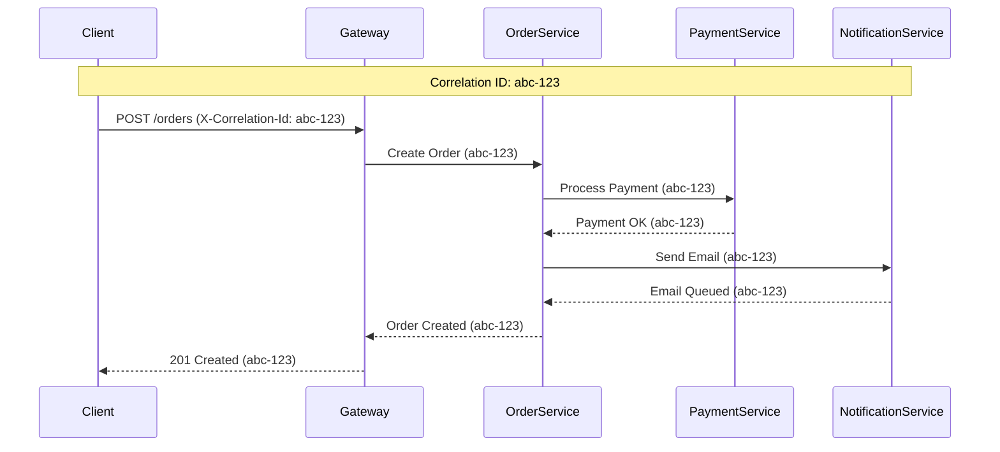

# How to Implement Correlation ID Tracing in ASP.NET Core

Author: [nawazdhandala](https://www.github.com/nawazdhandala)

Tags: ASP.NET Core, .NET, Correlation ID, Distributed Tracing, Logging, Observability, Microservices

Description: Learn how to implement correlation ID tracing in ASP.NET Core to track requests across microservices, with middleware, HttpClient integration, and structured logging patterns.

---

Correlation IDs are unique identifiers that follow a request through all the services it touches. When something goes wrong in a distributed system, correlation IDs let you trace the full journey of a request across multiple services, message queues, and background jobs.

## Why Correlation IDs Matter

In a microservices architecture, a single user action might trigger calls to dozens of services. Without correlation IDs, debugging becomes a nightmare of grepping through logs and hoping timestamps align.



## Basic Implementation

### Correlation ID Middleware

Create middleware that extracts or generates a correlation ID for each request:

```csharp
// CorrelationIdMiddleware.cs
public class CorrelationIdMiddleware
{
    private readonly RequestDelegate _next;
    private const string CorrelationIdHeader = "X-Correlation-Id";

    public CorrelationIdMiddleware(RequestDelegate next)
    {
        _next = next;
    }

    public async Task InvokeAsync(HttpContext context, ICorrelationIdAccessor accessor)
    {
        // Try to get correlation ID from incoming request
        var correlationId = GetOrCreateCorrelationId(context);

        // Store it for the duration of the request
        accessor.CorrelationId = correlationId;

        // Add to response headers so clients can see it
        context.Response.OnStarting(() =>
        {
            context.Response.Headers.TryAdd(CorrelationIdHeader, correlationId);
            return Task.CompletedTask;
        });

        // Add to the HttpContext.Items for easy access
        context.Items[CorrelationIdHeader] = correlationId;

        await _next(context);
    }

    private string GetOrCreateCorrelationId(HttpContext context)
    {
        // Check if the request already has a correlation ID
        if (context.Request.Headers.TryGetValue(CorrelationIdHeader, out var existingId)
            && !string.IsNullOrWhiteSpace(existingId))
        {
            return existingId.ToString();
        }

        // Generate a new one if not present
        return Guid.NewGuid().ToString("N");
    }
}
```

### Correlation ID Accessor

Use a scoped service to make the correlation ID available throughout the request:

```csharp
// ICorrelationIdAccessor.cs
public interface ICorrelationIdAccessor
{
    string CorrelationId { get; set; }
}

// CorrelationIdAccessor.cs
public class CorrelationIdAccessor : ICorrelationIdAccessor
{
    public string CorrelationId { get; set; } = string.Empty;
}
```

### Registration

```csharp
// Program.cs
var builder = WebApplication.CreateBuilder(args);

// Register the accessor as scoped (one per request)
builder.Services.AddScoped<ICorrelationIdAccessor, CorrelationIdAccessor>();

var app = builder.Build();

// Add middleware early in the pipeline
app.UseMiddleware<CorrelationIdMiddleware>();

app.UseRouting();
app.UseAuthentication();
app.UseAuthorization();

app.MapControllers();

app.Run();
```

## Propagating to Downstream Services

When your service calls other services, propagate the correlation ID in outgoing requests.

### HttpClient Integration

Create a delegating handler that adds the correlation ID to all outgoing HTTP requests:

```csharp
// CorrelationIdDelegatingHandler.cs
public class CorrelationIdDelegatingHandler : DelegatingHandler
{
    private readonly ICorrelationIdAccessor _accessor;
    private const string CorrelationIdHeader = "X-Correlation-Id";

    public CorrelationIdDelegatingHandler(ICorrelationIdAccessor accessor)
    {
        _accessor = accessor;
    }

    protected override async Task<HttpResponseMessage> SendAsync(
        HttpRequestMessage request,
        CancellationToken cancellationToken)
    {
        // Add correlation ID to outgoing request if we have one
        if (!string.IsNullOrEmpty(_accessor.CorrelationId))
        {
            request.Headers.TryAddWithoutValidation(CorrelationIdHeader, _accessor.CorrelationId);
        }

        return await base.SendAsync(request, cancellationToken);
    }
}
```

### Typed HttpClient Configuration

```csharp
// Program.cs
builder.Services.AddScoped<CorrelationIdDelegatingHandler>();

// Configure typed clients with the handler
builder.Services.AddHttpClient<IOrdersClient, OrdersClient>(client =>
{
    client.BaseAddress = new Uri("https://orders-service/");
})
.AddHttpMessageHandler<CorrelationIdDelegatingHandler>();

builder.Services.AddHttpClient<IPaymentClient, PaymentClient>(client =>
{
    client.BaseAddress = new Uri("https://payment-service/");
})
.AddHttpMessageHandler<CorrelationIdDelegatingHandler>();
```

## Structured Logging Integration

The real power of correlation IDs comes from including them in every log entry.

### Serilog Configuration

```csharp
// Program.cs
builder.Host.UseSerilog((context, services, configuration) =>
{
    configuration
        .ReadFrom.Configuration(context.Configuration)
        .Enrich.FromLogContext()
        .Enrich.WithProperty("Application", "OrdersApi")
        .WriteTo.Console(outputTemplate:
            "[{Timestamp:HH:mm:ss} {Level:u3}] {CorrelationId} {Message:lj}{NewLine}{Exception}");
});
```

### Enriching Logs with Correlation ID

Create a middleware that adds the correlation ID to the Serilog log context:

```csharp
// CorrelationIdLoggingMiddleware.cs
public class CorrelationIdLoggingMiddleware
{
    private readonly RequestDelegate _next;

    public CorrelationIdLoggingMiddleware(RequestDelegate next)
    {
        _next = next;
    }

    public async Task InvokeAsync(HttpContext context, ICorrelationIdAccessor accessor)
    {
        // Push correlation ID to Serilog's log context
        using (LogContext.PushProperty("CorrelationId", accessor.CorrelationId))
        {
            await _next(context);
        }
    }
}

// Add after CorrelationIdMiddleware
app.UseMiddleware<CorrelationIdMiddleware>();
app.UseMiddleware<CorrelationIdLoggingMiddleware>();
```

### Using in Controllers

```csharp
// OrdersController.cs
[ApiController]
[Route("api/[controller]")]
public class OrdersController : ControllerBase
{
    private readonly ILogger<OrdersController> _logger;
    private readonly IOrderService _orderService;
    private readonly ICorrelationIdAccessor _correlationId;

    public OrdersController(
        ILogger<OrdersController> logger,
        IOrderService orderService,
        ICorrelationIdAccessor correlationId)
    {
        _logger = logger;
        _orderService = orderService;
        _correlationId = correlationId;
    }

    [HttpPost]
    public async Task<IActionResult> CreateOrder([FromBody] CreateOrderRequest request)
    {
        _logger.LogInformation(
            "Creating order for customer {CustomerId}",
            request.CustomerId);

        try
        {
            var order = await _orderService.CreateOrderAsync(request);

            _logger.LogInformation(
                "Order {OrderId} created successfully",
                order.Id);

            return CreatedAtAction(nameof(GetOrder), new { id = order.Id }, order);
        }
        catch (Exception ex)
        {
            _logger.LogError(ex,
                "Failed to create order for customer {CustomerId}",
                request.CustomerId);
            throw;
        }
    }

    [HttpGet("{id}")]
    public async Task<IActionResult> GetOrder(string id)
    {
        // Correlation ID is automatically included in all logs
        _logger.LogInformation("Fetching order {OrderId}", id);

        var order = await _orderService.GetOrderAsync(id);

        if (order == null)
        {
            _logger.LogWarning("Order {OrderId} not found", id);
            return NotFound();
        }

        return Ok(order);
    }
}
```

## Message Queue Integration

Correlation IDs should flow through message queues too.

### RabbitMQ Example

```csharp
// MessagePublisher.cs
public class MessagePublisher : IMessagePublisher
{
    private readonly IConnection _connection;
    private readonly ICorrelationIdAccessor _correlationId;

    public MessagePublisher(IConnection connection, ICorrelationIdAccessor correlationId)
    {
        _connection = connection;
        _correlationId = correlationId;
    }

    public void Publish<T>(string exchange, string routingKey, T message)
    {
        using var channel = _connection.CreateModel();

        var properties = channel.CreateBasicProperties();
        properties.ContentType = "application/json";
        properties.DeliveryMode = 2; // Persistent

        // Include correlation ID in message headers
        properties.Headers = new Dictionary<string, object>
        {
            ["X-Correlation-Id"] = _correlationId.CorrelationId
        };

        var body = JsonSerializer.SerializeToUtf8Bytes(message);

        channel.BasicPublish(
            exchange: exchange,
            routingKey: routingKey,
            basicProperties: properties,
            body: body);
    }
}
```

### Message Consumer

```csharp
// MessageConsumer.cs
public class OrderCreatedConsumer : IHostedService
{
    private readonly IConnection _connection;
    private readonly IServiceProvider _services;
    private readonly ILogger<OrderCreatedConsumer> _logger;
    private IModel _channel;

    public async Task StartAsync(CancellationToken cancellationToken)
    {
        _channel = _connection.CreateModel();
        _channel.QueueDeclare("order-created", durable: true, exclusive: false);

        var consumer = new EventingBasicConsumer(_channel);
        consumer.Received += async (sender, args) =>
        {
            // Extract correlation ID from message headers
            var correlationId = args.BasicProperties.Headers?.ContainsKey("X-Correlation-Id") == true
                ? Encoding.UTF8.GetString((byte[])args.BasicProperties.Headers["X-Correlation-Id"])
                : Guid.NewGuid().ToString("N");

            // Create a scope for this message processing
            using var scope = _services.CreateScope();

            // Set correlation ID for this scope
            var accessor = scope.ServiceProvider.GetRequiredService<ICorrelationIdAccessor>();
            accessor.CorrelationId = correlationId;

            using (LogContext.PushProperty("CorrelationId", correlationId))
            {
                _logger.LogInformation("Processing order created message");

                try
                {
                    var handler = scope.ServiceProvider.GetRequiredService<IOrderCreatedHandler>();
                    await handler.HandleAsync(args.Body.ToArray());

                    _channel.BasicAck(args.DeliveryTag, false);
                }
                catch (Exception ex)
                {
                    _logger.LogError(ex, "Failed to process order created message");
                    _channel.BasicNack(args.DeliveryTag, false, requeue: true);
                }
            }
        };

        _channel.BasicConsume("order-created", autoAck: false, consumer);
    }

    public Task StopAsync(CancellationToken cancellationToken)
    {
        _channel?.Close();
        return Task.CompletedTask;
    }
}
```

## Background Jobs

For background jobs triggered by a request, capture and restore the correlation ID.

### Using AsyncLocal for Background Tasks

```csharp
// CorrelationContext.cs
public static class CorrelationContext
{
    private static readonly AsyncLocal<string> _correlationId = new();

    public static string CorrelationId
    {
        get => _correlationId.Value ?? string.Empty;
        set => _correlationId.Value = value;
    }
}

// BackgroundJobService.cs
public class BackgroundJobService : IBackgroundJobService
{
    private readonly ILogger<BackgroundJobService> _logger;
    private readonly IServiceProvider _services;

    public BackgroundJobService(ILogger<BackgroundJobService> logger, IServiceProvider services)
    {
        _logger = logger;
        _services = services;
    }

    public void EnqueueJob(Func<IServiceProvider, Task> work, string correlationId)
    {
        // Capture correlation ID
        var capturedCorrelationId = correlationId;

        Task.Run(async () =>
        {
            // Restore correlation ID in the background task
            CorrelationContext.CorrelationId = capturedCorrelationId;

            using (LogContext.PushProperty("CorrelationId", capturedCorrelationId))
            using (var scope = _services.CreateScope())
            {
                var accessor = scope.ServiceProvider.GetRequiredService<ICorrelationIdAccessor>();
                accessor.CorrelationId = capturedCorrelationId;

                try
                {
                    await work(scope.ServiceProvider);
                }
                catch (Exception ex)
                {
                    _logger.LogError(ex, "Background job failed");
                }
            }
        });
    }
}
```

## OpenTelemetry Integration

Correlation IDs work alongside OpenTelemetry trace IDs. You can use both for different purposes.

```csharp
// Program.cs
builder.Services.AddOpenTelemetry()
    .WithTracing(tracing =>
    {
        tracing
            .AddAspNetCoreInstrumentation()
            .AddHttpClientInstrumentation()
            .AddSource("OrdersApi")
            .AddOtlpExporter();
    });

// Custom activity enricher to include correlation ID
builder.Services.Configure<AspNetCoreTraceInstrumentationOptions>(options =>
{
    options.EnrichWithHttpRequest = (activity, httpRequest) =>
    {
        if (httpRequest.Headers.TryGetValue("X-Correlation-Id", out var correlationId))
        {
            activity.SetTag("correlation.id", correlationId.ToString());
        }
    };
});
```

## Testing

Test that correlation IDs propagate correctly:

```csharp
// CorrelationIdMiddlewareTests.cs
public class CorrelationIdMiddlewareTests
{
    [Fact]
    public async Task ShouldGenerateCorrelationId_WhenNotProvided()
    {
        // Arrange
        var accessor = new CorrelationIdAccessor();
        var middleware = new CorrelationIdMiddleware(context => Task.CompletedTask);
        var context = new DefaultHttpContext();

        // Act
        await middleware.InvokeAsync(context, accessor);

        // Assert
        Assert.False(string.IsNullOrEmpty(accessor.CorrelationId));
        Assert.True(context.Response.Headers.ContainsKey("X-Correlation-Id"));
    }

    [Fact]
    public async Task ShouldUseExistingCorrelationId_WhenProvided()
    {
        // Arrange
        var accessor = new CorrelationIdAccessor();
        var middleware = new CorrelationIdMiddleware(context => Task.CompletedTask);
        var context = new DefaultHttpContext();
        var expectedId = "test-correlation-id";
        context.Request.Headers["X-Correlation-Id"] = expectedId;

        // Act
        await middleware.InvokeAsync(context, accessor);

        // Assert
        Assert.Equal(expectedId, accessor.CorrelationId);
    }
}

// Integration test with HttpClient
public class HttpClientCorrelationTests : IClassFixture<WebApplicationFactory<Program>>
{
    private readonly WebApplicationFactory<Program> _factory;

    [Fact]
    public async Task DownstreamCalls_ShouldIncludeCorrelationId()
    {
        // Arrange
        var correlationId = "integration-test-id";
        var client = _factory.CreateClient();
        client.DefaultRequestHeaders.Add("X-Correlation-Id", correlationId);

        // Act
        var response = await client.GetAsync("/api/orders/123");

        // Assert
        Assert.Equal(correlationId, response.Headers.GetValues("X-Correlation-Id").First());
    }
}
```

## Summary

| Component | Implementation |
|-----------|----------------|
| **Middleware** | Extract or generate correlation ID on each request |
| **Accessor** | Scoped service for DI access to current correlation ID |
| **HttpClient** | DelegatingHandler to propagate to downstream services |
| **Logging** | Serilog LogContext enrichment |
| **Messages** | Include in message headers for async flows |
| **Background Jobs** | Capture and restore using AsyncLocal |

Correlation IDs are a foundational pattern for distributed systems observability. Combined with structured logging, they make debugging production issues significantly easier by letting you follow a single request across all services it touched. The implementation is straightforward but requires discipline to ensure the ID flows through every communication channel in your system.
