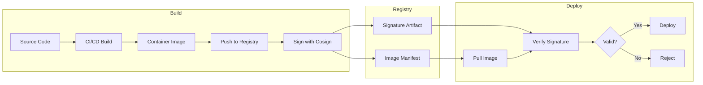

# How to Sign Container Images with Cosign

Author: [nawazdhandala](https://www.github.com/nawazdhandala)

Tags: Security, Cosign, Container Signing, Sigstore, Supply Chain Security, DevSecOps, Kubernetes

Description: Learn how to sign and verify container images with Cosign to establish trust in your software supply chain and prevent unauthorized image deployment.

---

Container images flow through build systems, registries, and clusters, but how do you know an image has not been tampered with? Cosign, part of the Sigstore project, signs container images cryptographically, enabling verification at deployment time. This guide covers key generation, signing workflows, keyless signing, and Kubernetes admission control integration.

## Why Sign Container Images

Image signing solves critical supply chain problems:

- **Provenance**: Prove an image came from your CI/CD system
- **Integrity**: Detect if an image was modified after signing
- **Policy enforcement**: Block unsigned images from deployment
- **Compliance**: Meet regulatory requirements for software supply chain security
- **Non-repudiation**: Audit trail of who signed what and when

Without signatures, anyone with registry write access can push malicious images.

## How Cosign Works



## Installing Cosign

```bash
# macOS with Homebrew
brew install cosign

# Linux (download from GitHub)
wget https://github.com/sigstore/cosign/releases/download/v2.2.2/cosign-linux-amd64
chmod +x cosign-linux-amd64
sudo mv cosign-linux-amd64 /usr/local/bin/cosign

# Verify installation
cosign version
```

## Key-Based Signing

### Generate a Key Pair

```bash
# Generate a new key pair (prompts for password)
cosign generate-key-pair

# Creates:
# - cosign.key (private key, encrypted)
# - cosign.pub (public key, distribute freely)
```

### Sign an Image

```bash
# Build and push your image
docker build -t myregistry.io/myapp:v1.0 .
docker push myregistry.io/myapp:v1.0

# Sign the image (prompts for private key password)
cosign sign --key cosign.key myregistry.io/myapp:v1.0

# The signature is stored as a separate artifact in the registry
# at myregistry.io/myapp:sha256-<digest>.sig
```

### Verify a Signature

```bash
# Verify using the public key
cosign verify --key cosign.pub myregistry.io/myapp:v1.0

# Output on success:
# Verification for myregistry.io/myapp:v1.0 --
# The following checks were performed on each of these signatures:
#   - The cosign claims were validated
#   - The signatures were verified against the specified public key

# Verification fails if image is unsigned or signature doesn't match
cosign verify --key cosign.pub myregistry.io/malicious:v1.0
# Error: no matching signatures
```

## Keyless Signing (Recommended)

Keyless signing uses short-lived certificates from Sigstore's Fulcio CA, tied to your identity (via OIDC). No private keys to manage.

```bash
# Sign using OIDC identity (opens browser for authentication)
cosign sign myregistry.io/myapp:v1.0

# In CI/CD, use workload identity
# GitHub Actions provides OIDC tokens automatically
cosign sign myregistry.io/myapp:v1.0
```

Verify keyless signatures:

```bash
# Verify and check the signer identity
cosign verify \
  --certificate-identity=user@example.com \
  --certificate-oidc-issuer=https://accounts.google.com \
  myregistry.io/myapp:v1.0

# For GitHub Actions workflows
cosign verify \
  --certificate-identity="https://github.com/myorg/myrepo/.github/workflows/build.yml@refs/heads/main" \
  --certificate-oidc-issuer="https://token.actions.githubusercontent.com" \
  myregistry.io/myapp:v1.0
```

## CI/CD Integration

### GitHub Actions

```yaml
# .github/workflows/build-sign.yml
name: Build and Sign

on:
  push:
    branches: [main]
    tags: ['v*']

permissions:
  contents: read
  packages: write
  id-token: write  # Required for keyless signing

jobs:
  build-and-sign:
    runs-on: ubuntu-latest
    steps:
      - name: Checkout code
        uses: actions/checkout@v4

      - name: Set up Docker Buildx
        uses: docker/setup-buildx-action@v3

      - name: Log in to GitHub Container Registry
        uses: docker/login-action@v3
        with:
          registry: ghcr.io
          username: ${{ github.actor }}
          password: ${{ secrets.GITHUB_TOKEN }}

      - name: Build and push image
        id: build
        uses: docker/build-push-action@v5
        with:
          push: true
          tags: ghcr.io/${{ github.repository }}:${{ github.sha }}

      - name: Install Cosign
        uses: sigstore/cosign-installer@v3

      - name: Sign the image (keyless)
        env:
          DIGEST: ${{ steps.build.outputs.digest }}
        run: |
          cosign sign --yes ghcr.io/${{ github.repository }}@${DIGEST}

      - name: Verify the signature
        run: |
          cosign verify \
            --certificate-identity="https://github.com/${{ github.repository }}/.github/workflows/build-sign.yml@refs/heads/main" \
            --certificate-oidc-issuer="https://token.actions.githubusercontent.com" \
            ghcr.io/${{ github.repository }}:${{ github.sha }}
```

### GitLab CI

```yaml
# .gitlab-ci.yml
stages:
  - build
  - sign

variables:
  IMAGE: $CI_REGISTRY_IMAGE:$CI_COMMIT_SHA

build:
  stage: build
  image: docker:24
  services:
    - docker:24-dind
  script:
    - docker login -u $CI_REGISTRY_USER -p $CI_REGISTRY_PASSWORD $CI_REGISTRY
    - docker build -t $IMAGE .
    - docker push $IMAGE

sign:
  stage: sign
  image: alpine:latest
  id_tokens:
    SIGSTORE_ID_TOKEN:
      aud: sigstore
  before_script:
    - apk add --no-cache cosign
  script:
    - cosign sign --yes $IMAGE
```

## Adding Attestations

Attestations provide metadata about the image, such as SBOMs or build provenance:

```bash
# Attach an SBOM attestation
syft myregistry.io/myapp:v1.0 -o spdx-json > sbom.spdx.json
cosign attest --predicate sbom.spdx.json \
  --type spdxjson \
  myregistry.io/myapp:v1.0

# Attach SLSA provenance attestation
cosign attest --predicate provenance.json \
  --type slsaprovenance \
  myregistry.io/myapp:v1.0

# Verify attestations
cosign verify-attestation \
  --type spdxjson \
  --certificate-identity=user@example.com \
  --certificate-oidc-issuer=https://accounts.google.com \
  myregistry.io/myapp:v1.0
```

## Kubernetes Policy Enforcement

### Using Kyverno

```yaml
# verify-image-signature.yaml
apiVersion: kyverno.io/v1
kind: ClusterPolicy
metadata:
  name: verify-image-signature
spec:
  validationFailureAction: Enforce
  background: false
  rules:
    - name: verify-signature
      match:
        any:
          - resources:
              kinds:
                - Pod
      verifyImages:
        - imageReferences:
            - "ghcr.io/myorg/*"
          attestors:
            - entries:
                - keyless:
                    subject: "https://github.com/myorg/*"
                    issuer: "https://token.actions.githubusercontent.com"
                    rekor:
                      url: https://rekor.sigstore.dev
```

### Using Sigstore Policy Controller

```bash
# Install the policy controller
helm repo add sigstore https://sigstore.github.io/helm-charts
helm install policy-controller sigstore/policy-controller \
  --namespace cosign-system \
  --create-namespace
```

Create a ClusterImagePolicy:

```yaml
# cluster-image-policy.yaml
apiVersion: policy.sigstore.dev/v1beta1
kind: ClusterImagePolicy
metadata:
  name: require-signatures
spec:
  images:
    - glob: "ghcr.io/myorg/**"
  authorities:
    - keyless:
        identities:
          - issuer: "https://token.actions.githubusercontent.com"
            subjectRegExp: "https://github.com/myorg/.*"
        url: https://fulcio.sigstore.dev
      ctlog:
        url: https://rekor.sigstore.dev
```

Label namespaces to enforce:

```bash
kubectl label namespace production policy.sigstore.dev/include=true
```

## Storing Signatures in Transparency Log

Cosign automatically records signatures in Rekor, Sigstore's transparency log:

```bash
# Search for signatures in Rekor
rekor-cli search --email user@example.com

# Get signature entry details
rekor-cli get --uuid <entry-uuid>
```

The transparency log provides:
- Public audit trail of all signatures
- Tamper-evident record
- Ability to detect key compromise

## Signing with Hardware Keys

For high-security environments, sign with hardware security modules:

```bash
# Sign using a Yubikey
cosign sign --sk myregistry.io/myapp:v1.0

# Sign using AWS KMS
cosign sign --key awskms:///alias/my-signing-key myregistry.io/myapp:v1.0

# Sign using GCP KMS
cosign sign --key gcpkms://projects/my-project/locations/global/keyRings/my-ring/cryptoKeys/my-key \
  myregistry.io/myapp:v1.0

# Sign using HashiCorp Vault
cosign sign --key hashivault://my-key myregistry.io/myapp:v1.0
```

## Local Verification Before Deployment

Add verification to your deployment scripts:

```bash
#!/bin/bash
# deploy.sh

IMAGE=$1
EXPECTED_SIGNER="https://github.com/myorg/myrepo/.github/workflows/build.yml@refs/heads/main"
EXPECTED_ISSUER="https://token.actions.githubusercontent.com"

# Verify signature before deploying
if ! cosign verify \
  --certificate-identity="$EXPECTED_SIGNER" \
  --certificate-oidc-issuer="$EXPECTED_ISSUER" \
  "$IMAGE" 2>/dev/null; then
    echo "ERROR: Image signature verification failed for $IMAGE"
    exit 1
fi

echo "Signature verified for $IMAGE"
kubectl set image deployment/myapp myapp="$IMAGE"
```

---

Container image signing is the foundation of software supply chain security. Cosign makes signing straightforward, and keyless signing eliminates key management overhead. Start by signing images in CI/CD, then add Kubernetes admission control to enforce signatures at runtime. Your future self will thank you when you can prove exactly which images are authorized to run in production.
