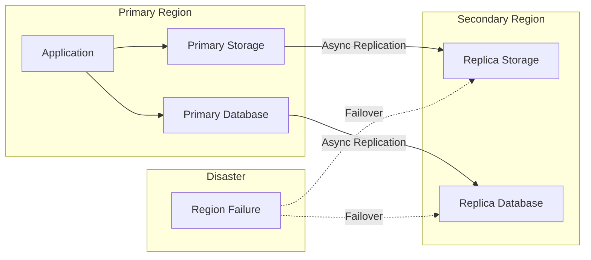

# How to Configure Cross-Region Replication

Author: [nawazdhandala](https://www.github.com/nawazdhandala)

Tags: Disaster Recovery, Replication, AWS, Azure, GCP, DevOps

Description: Learn how to implement cross-region replication for data and backups across multiple geographic regions, providing resilience against regional outages and disasters.

---

Cross-region replication (CRR) copies your data to a geographically separate location automatically. When a region goes offline due to natural disasters, infrastructure failures, or other incidents, your data remains accessible from the secondary region. This guide covers implementing CRR for storage services, databases, and Kubernetes workloads across major cloud providers.

## Why Cross-Region Replication?

Single-region deployments have a critical vulnerability: regional failures take down everything. CRR addresses this by:

1. **Disaster recovery:** Data survives regional outages
2. **Compliance:** Meet data residency and redundancy requirements
3. **Reduced latency:** Serve data from regions closer to users
4. **Business continuity:** Maintain operations during regional incidents

The tradeoffs include increased costs, potential data consistency challenges, and added complexity.

## Cross-Region Architecture



## AWS S3 Cross-Region Replication

S3 CRR automatically copies objects to a bucket in another region.

### Basic Setup

```bash
# Create destination bucket in secondary region
aws s3 mb s3://company-data-dr --region us-west-2

# Enable versioning on both buckets (required)
aws s3api put-bucket-versioning \
    --bucket company-data-primary \
    --versioning-configuration Status=Enabled

aws s3api put-bucket-versioning \
    --bucket company-data-dr \
    --versioning-configuration Status=Enabled
```

Create IAM role for replication:

```json
{
    "Version": "2012-10-17",
    "Statement": [
        {
            "Effect": "Allow",
            "Action": [
                "s3:GetReplicationConfiguration",
                "s3:ListBucket"
            ],
            "Resource": "arn:aws:s3:::company-data-primary"
        },
        {
            "Effect": "Allow",
            "Action": [
                "s3:GetObjectVersionForReplication",
                "s3:GetObjectVersionAcl",
                "s3:GetObjectVersionTagging"
            ],
            "Resource": "arn:aws:s3:::company-data-primary/*"
        },
        {
            "Effect": "Allow",
            "Action": [
                "s3:ReplicateObject",
                "s3:ReplicateDelete",
                "s3:ReplicateTags"
            ],
            "Resource": "arn:aws:s3:::company-data-dr/*"
        }
    ]
}
```

Configure replication:

```json
{
    "Role": "arn:aws:iam::123456789012:role/S3ReplicationRole",
    "Rules": [
        {
            "ID": "ReplicateAll",
            "Status": "Enabled",
            "Priority": 1,
            "Filter": {},
            "Destination": {
                "Bucket": "arn:aws:s3:::company-data-dr",
                "StorageClass": "STANDARD_IA",
                "ReplicationTime": {
                    "Status": "Enabled",
                    "Time": {
                        "Minutes": 15
                    }
                },
                "Metrics": {
                    "Status": "Enabled",
                    "EventThreshold": {
                        "Minutes": 15
                    }
                }
            },
            "DeleteMarkerReplication": {
                "Status": "Enabled"
            }
        }
    ]
}
```

Apply the configuration:

```bash
aws s3api put-bucket-replication \
    --bucket company-data-primary \
    --replication-configuration file://replication-config.json
```

### Monitor Replication

```bash
# Check replication metrics
aws s3api get-bucket-replication \
    --bucket company-data-primary

# View replication time control metrics
aws cloudwatch get-metric-statistics \
    --namespace AWS/S3 \
    --metric-name ReplicationLatency \
    --dimensions Name=SourceBucket,Value=company-data-primary \
                 Name=DestinationBucket,Value=company-data-dr \
                 Name=RuleId,Value=ReplicateAll \
    --start-time $(date -u -d '1 hour ago' +%Y-%m-%dT%H:%M:%SZ) \
    --end-time $(date -u +%Y-%m-%dT%H:%M:%SZ) \
    --period 300 \
    --statistics Average
```

## Azure Blob Storage Geo-Replication

Azure provides built-in geo-redundant storage (GRS) and geo-zone-redundant storage (GZRS).

### Configure GRS

```bash
# Create storage account with GRS
az storage account create \
    --name companydata \
    --resource-group myresources \
    --location eastus \
    --sku Standard_GRS \
    --kind StorageV2

# Check replication status
az storage account show \
    --name companydata \
    --resource-group myresources \
    --query "secondaryLocation"

# Enable read access to secondary (RA-GRS)
az storage account update \
    --name companydata \
    --resource-group myresources \
    --sku Standard_RAGRS
```

### Access Secondary Region

With RA-GRS, you can read from the secondary region:

```python
# Python example using azure-storage-blob
from azure.storage.blob import BlobServiceClient

# Primary endpoint
primary_client = BlobServiceClient(
    account_url="https://companydata.blob.core.windows.net",
    credential=credential
)

# Secondary endpoint (read-only)
secondary_client = BlobServiceClient(
    account_url="https://companydata-secondary.blob.core.windows.net",
    credential=credential
)

# Read from secondary during primary outage
try:
    blob = primary_client.get_blob_client("container", "file.txt")
    data = blob.download_blob().readall()
except Exception:
    # Failover to secondary
    blob = secondary_client.get_blob_client("container", "file.txt")
    data = blob.download_blob().readall()
```

### Object Replication (Custom CRR)

For more control, use Azure object replication:

```bash
# Create policy for specific containers
az storage account or-policy create \
    --account-name companydata-primary \
    --resource-group myresources \
    --source-account companydata-primary \
    --destination-account companydata-dr \
    --source-container backups \
    --destination-container backups-replica
```

## Google Cloud Storage Cross-Region

GCS provides multi-regional buckets and custom replication.

### Multi-Regional Bucket

```bash
# Create multi-regional bucket (automatic replication)
gsutil mb -l us -c standard gs://company-data-multi

# Data is automatically replicated across US regions
```

### Custom Replication with Transfer Service

```bash
# Create transfer job for cross-region replication
gcloud transfer jobs create \
    gs://company-data-primary \
    gs://company-data-dr \
    --name="daily-replication" \
    --schedule-start-date=2026-01-25 \
    --schedule-repeats-every=P1D
```

### Dual-Region Buckets

```bash
# Create dual-region bucket
gsutil mb -l nam4 -c standard gs://company-data-dual

# nam4 = Iowa and South Carolina
# Automatic synchronous replication between regions
```

## Database Cross-Region Replication

### AWS RDS Cross-Region Read Replicas

```bash
# Create cross-region read replica
aws rds create-db-instance-read-replica \
    --db-instance-identifier production-dr \
    --source-db-instance-identifier production-primary \
    --source-region us-east-1 \
    --region us-west-2 \
    --db-instance-class db.r5.large

# Promote replica during disaster
aws rds promote-read-replica \
    --db-instance-identifier production-dr \
    --region us-west-2
```

### Azure SQL Geo-Replication

```bash
# Create geo-secondary database
az sql db replica create \
    --name production-db \
    --resource-group primary-rg \
    --server primary-server \
    --partner-server secondary-server \
    --partner-resource-group secondary-rg

# Failover to secondary
az sql db replica set-primary \
    --name production-db \
    --resource-group secondary-rg \
    --server secondary-server
```

### Google Cloud SQL Cross-Region Replicas

```bash
# Create cross-region read replica
gcloud sql instances create production-replica \
    --master-instance-name=production-primary \
    --region=us-west1

# Promote to standalone during disaster
gcloud sql instances promote-replica production-replica
```

## Kubernetes Cross-Region Replication

### Velero Cross-Cluster Backup

Configure Velero to back up from one cluster and restore to another:

```bash
# Primary cluster: Create backup
velero backup create production-backup \
    --include-namespaces production \
    --storage-location default

# Secondary cluster: Configure same storage backend
velero backup-location create primary-backups \
    --provider aws \
    --bucket velero-backups \
    --config region=us-east-1

# Secondary cluster: Restore from primary's backup
velero restore create \
    --from-backup production-backup
```

### Database StatefulSet Replication

Use database-native replication for StatefulSets:

```yaml
# primary-postgres.yaml (us-east-1 cluster)
apiVersion: apps/v1
kind: StatefulSet
metadata:
  name: postgres-primary
spec:
  serviceName: postgres
  replicas: 1
  template:
    spec:
      containers:
        - name: postgres
          image: postgres:15
          env:
            - name: POSTGRES_PASSWORD
              valueFrom:
                secretKeyRef:
                  name: postgres-credentials
                  key: password
          ports:
            - containerPort: 5432
          volumeMounts:
            - name: data
              mountPath: /var/lib/postgresql/data
---
# replica-postgres.yaml (us-west-2 cluster)
apiVersion: apps/v1
kind: StatefulSet
metadata:
  name: postgres-replica
spec:
  serviceName: postgres
  replicas: 1
  template:
    spec:
      containers:
        - name: postgres
          image: postgres:15
          env:
            - name: POSTGRES_PASSWORD
              valueFrom:
                secretKeyRef:
                  name: postgres-credentials
                  key: password
          command:
            - bash
            - -c
            - |
              pg_basebackup -h primary.example.com -U replication -D /var/lib/postgresql/data -Fp -Xs -P -R
              exec postgres
```

## Monitoring Cross-Region Replication

Track replication health and lag:

```python
#!/usr/bin/env python3
# monitor_replication.py

import boto3
import time
from datetime import datetime, timedelta

def check_s3_replication_status(source_bucket, dest_bucket):
    """Check S3 replication lag using CloudWatch metrics."""

    cloudwatch = boto3.client('cloudwatch', region_name='us-east-1')

    response = cloudwatch.get_metric_statistics(
        Namespace='AWS/S3',
        MetricName='ReplicationLatency',
        Dimensions=[
            {'Name': 'SourceBucket', 'Value': source_bucket},
            {'Name': 'DestinationBucket', 'Value': dest_bucket},
        ],
        StartTime=datetime.utcnow() - timedelta(hours=1),
        EndTime=datetime.utcnow(),
        Period=300,
        Statistics=['Average', 'Maximum']
    )

    if response['Datapoints']:
        latest = max(response['Datapoints'], key=lambda x: x['Timestamp'])
        print(f"Replication Latency - Avg: {latest['Average']:.2f}s, Max: {latest['Maximum']:.2f}s")

        # Alert if latency exceeds threshold
        if latest['Maximum'] > 900:  # 15 minutes
            print("WARNING: Replication lag exceeds 15 minutes!")
            return False

    return True

def check_rds_replica_lag(replica_identifier, region):
    """Check RDS read replica lag."""

    rds = boto3.client('rds', region_name=region)

    response = rds.describe_db_instances(
        DBInstanceIdentifier=replica_identifier
    )

    if response['DBInstances']:
        instance = response['DBInstances'][0]

        if instance.get('ReadReplicaSourceDBInstanceIdentifier'):
            # Get replica lag metric
            cloudwatch = boto3.client('cloudwatch', region_name=region)

            response = cloudwatch.get_metric_statistics(
                Namespace='AWS/RDS',
                MetricName='ReplicaLag',
                Dimensions=[
                    {'Name': 'DBInstanceIdentifier', 'Value': replica_identifier}
                ],
                StartTime=datetime.utcnow() - timedelta(minutes=10),
                EndTime=datetime.utcnow(),
                Period=60,
                Statistics=['Average']
            )

            if response['Datapoints']:
                latest = max(response['Datapoints'], key=lambda x: x['Timestamp'])
                lag_seconds = latest['Average']
                print(f"RDS Replica Lag: {lag_seconds:.2f} seconds")

                if lag_seconds > 60:
                    print("WARNING: Replica lag exceeds 1 minute!")
                    return False

    return True

if __name__ == "__main__":
    check_s3_replication_status('company-data-primary', 'company-data-dr')
    check_rds_replica_lag('production-dr', 'us-west-2')
```

## Failover Procedures

Document and automate failover:

```bash
#!/bin/bash
# failover-to-secondary.sh

set -euo pipefail

echo "Starting failover to secondary region..."

# 1. Update DNS to point to secondary region
aws route53 change-resource-record-sets \
    --hosted-zone-id Z123456 \
    --change-batch '{
        "Changes": [{
            "Action": "UPSERT",
            "ResourceRecordSet": {
                "Name": "app.example.com",
                "Type": "A",
                "AliasTarget": {
                    "HostedZoneId": "Z789012",
                    "DNSName": "secondary-alb.us-west-2.elb.amazonaws.com",
                    "EvaluateTargetHealth": true
                }
            }
        }]
    }'

# 2. Promote database replica
aws rds promote-read-replica \
    --db-instance-identifier production-dr \
    --region us-west-2

# 3. Update application configuration
kubectl --context=secondary-cluster \
    set env deployment/webapp \
    DATABASE_HOST=production-dr.xxxx.us-west-2.rds.amazonaws.com

# 4. Scale up secondary region
kubectl --context=secondary-cluster \
    scale deployment webapp --replicas=10

echo "Failover complete. Verify application health."
```

## Best Practices

1. **Test failover regularly.** Quarterly DR drills ensure your procedures work and your team knows them.

2. **Monitor replication lag.** Alert when lag exceeds your RPO (Recovery Point Objective).

3. **Automate failover.** Manual procedures are slow and error-prone during incidents.

4. **Consider costs.** Cross-region data transfer is not free. Budget for replication traffic.

5. **Document recovery procedures.** Runbooks should include exact commands and decision criteria.

6. **Use infrastructure as code.** Terraform or CloudFormation ensures secondary regions match primary configurations.

## Wrapping Up

Cross-region replication transforms your infrastructure from single-point-of-failure to resilient. Start with storage replication for backups, add database replicas for stateful workloads, and build automated failover procedures. The goal is not just having data in another region but being able to run your application there within your recovery time objectives. Test that capability regularly.
