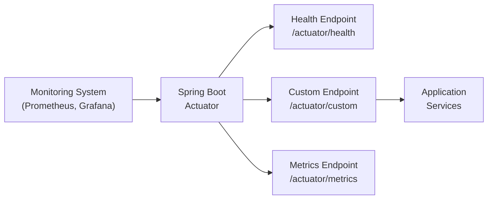

# How to Build Custom Actuator Endpoints in Spring Boot

Author: [nawazdhandala](https://www.github.com/nawazdhandala)

Tags: Java, Spring Boot, Actuator, Monitoring, Observability, Health Checks, Metrics, Production

Description: Learn how to build custom Spring Boot Actuator endpoints to expose application-specific health checks, metrics, and operational data. This guide covers endpoint creation, security configuration, and practical examples for production systems.

---

> Spring Boot Actuator provides built-in endpoints for health, metrics, and info. But production applications often need custom endpoints that expose domain-specific data. Building your own actuator endpoints lets you integrate seamlessly with existing monitoring infrastructure.

Custom endpoints turn your application into a first-class citizen in your observability stack.

---

## Overview



---

## Prerequisites

Add the Spring Boot Actuator dependency to your project:

```xml
<!-- pom.xml -->
<dependency>
    <groupId>org.springframework.boot</groupId>
    <artifactId>spring-boot-starter-actuator</artifactId>
</dependency>
<dependency>
    <groupId>org.springframework.boot</groupId>
    <artifactId>spring-boot-starter-web</artifactId>
</dependency>
```

Configure actuator in your application properties:

```yaml
# application.yml
management:
  endpoints:
    web:
      exposure:
        include: health,info,metrics,custom
  endpoint:
    health:
      show-details: when-authorized
```

---

## Creating a Basic Custom Endpoint

### Simple Read-Only Endpoint

The simplest custom endpoint returns data when accessed. Use the `@Endpoint` annotation to define it:

```java
package com.example.actuator;

import org.springframework.boot.actuate.endpoint.annotation.Endpoint;
import org.springframework.boot.actuate.endpoint.annotation.ReadOperation;
import org.springframework.stereotype.Component;

import java.time.Instant;
import java.util.HashMap;
import java.util.Map;

// Register this class as an actuator endpoint at /actuator/application
@Component
@Endpoint(id = "application")
public class ApplicationEndpoint {

    // ReadOperation maps to HTTP GET requests
    @ReadOperation
    public Map<String, Object> applicationInfo() {
        Map<String, Object> info = new HashMap<>();

        // Include useful runtime information
        info.put("name", "my-service");
        info.put("version", "2.1.0");
        info.put("startTime", Instant.now().toString());
        info.put("javaVersion", System.getProperty("java.version"));
        info.put("activeProfiles", System.getProperty("spring.profiles.active", "default"));

        return info;
    }
}
```

Access this endpoint at `http://localhost:8080/actuator/application`.

### Endpoint with Parameters

You can accept path variables using the `@Selector` annotation:

```java
package com.example.actuator;

import org.springframework.boot.actuate.endpoint.annotation.Endpoint;
import org.springframework.boot.actuate.endpoint.annotation.ReadOperation;
import org.springframework.boot.actuate.endpoint.annotation.Selector;
import org.springframework.stereotype.Component;

import java.util.Map;
import java.util.concurrent.ConcurrentHashMap;

@Component
@Endpoint(id = "cache")
public class CacheEndpoint {

    // Simulate a cache with some data
    private final Map<String, CacheStats> cacheStats = new ConcurrentHashMap<>();

    public CacheEndpoint() {
        // Initialize with sample data
        cacheStats.put("users", new CacheStats("users", 1500, 45, 0.97));
        cacheStats.put("products", new CacheStats("products", 3200, 120, 0.96));
        cacheStats.put("orders", new CacheStats("orders", 800, 30, 0.96));
    }

    // GET /actuator/cache - returns all cache stats
    @ReadOperation
    public Map<String, CacheStats> allCaches() {
        return cacheStats;
    }

    // GET /actuator/cache/{name} - returns stats for specific cache
    @ReadOperation
    public CacheStats cacheByName(@Selector String name) {
        CacheStats stats = cacheStats.get(name);
        if (stats == null) {
            // Return null to generate 404 response
            return null;
        }
        return stats;
    }

    // Inner class to hold cache statistics
    public static class CacheStats {
        private String name;
        private long size;
        private long evictions;
        private double hitRate;

        public CacheStats(String name, long size, long evictions, double hitRate) {
            this.name = name;
            this.size = size;
            this.evictions = evictions;
            this.hitRate = hitRate;
        }

        // Getters required for JSON serialization
        public String getName() { return name; }
        public long getSize() { return size; }
        public long getEvictions() { return evictions; }
        public double getHitRate() { return hitRate; }
    }
}
```

---

## Write and Delete Operations

### Endpoint with Write Operations

Use `@WriteOperation` for POST requests and `@DeleteOperation` for DELETE requests:

```java
package com.example.actuator;

import org.springframework.boot.actuate.endpoint.annotation.*;
import org.springframework.stereotype.Component;

import java.util.Map;
import java.util.Set;
import java.util.concurrent.ConcurrentHashMap;

@Component
@Endpoint(id = "features")
public class FeatureToggleEndpoint {

    // Store feature flags in memory (use a database in production)
    private final Map<String, Boolean> features = new ConcurrentHashMap<>();

    public FeatureToggleEndpoint() {
        // Initialize default feature states
        features.put("dark-mode", true);
        features.put("new-checkout", false);
        features.put("beta-api", false);
    }

    // GET /actuator/features - list all feature flags
    @ReadOperation
    public Map<String, Boolean> getAllFeatures() {
        return features;
    }

    // GET /actuator/features/{name} - get specific feature state
    @ReadOperation
    public FeatureState getFeature(@Selector String name) {
        Boolean enabled = features.get(name);
        if (enabled == null) {
            return null;
        }
        return new FeatureState(name, enabled);
    }

    // POST /actuator/features/{name} - enable or disable a feature
    // Request body: {"enabled": true}
    @WriteOperation
    public FeatureState toggleFeature(@Selector String name, boolean enabled) {
        features.put(name, enabled);
        return new FeatureState(name, enabled);
    }

    // DELETE /actuator/features/{name} - remove a feature flag
    @DeleteOperation
    public void deleteFeature(@Selector String name) {
        features.remove(name);
    }

    public static class FeatureState {
        private String name;
        private boolean enabled;

        public FeatureState(String name, boolean enabled) {
            this.name = name;
            this.enabled = enabled;
        }

        public String getName() { return name; }
        public boolean isEnabled() { return enabled; }
    }
}
```

Test the write operation with curl:

```bash
# Enable a feature
curl -X POST http://localhost:8080/actuator/features/new-checkout \
  -H "Content-Type: application/json" \
  -d '{"enabled": true}'

# Delete a feature
curl -X DELETE http://localhost:8080/actuator/features/beta-api
```

---

## Custom Health Indicators

### Creating Health Indicators

Health indicators contribute to the overall health status of your application:

```java
package com.example.health;

import org.springframework.boot.actuate.health.Health;
import org.springframework.boot.actuate.health.HealthIndicator;
import org.springframework.stereotype.Component;

import java.sql.Connection;
import javax.sql.DataSource;

@Component
public class DatabaseHealthIndicator implements HealthIndicator {

    private final DataSource dataSource;

    public DatabaseHealthIndicator(DataSource dataSource) {
        this.dataSource = dataSource;
    }

    @Override
    public Health health() {
        try (Connection connection = dataSource.getConnection()) {
            // Execute a simple query to verify database connectivity
            boolean valid = connection.isValid(5);

            if (valid) {
                return Health.up()
                    .withDetail("database", "PostgreSQL")
                    .withDetail("connection", "active")
                    .withDetail("validationQuery", "SELECT 1")
                    .build();
            } else {
                return Health.down()
                    .withDetail("error", "Connection validation failed")
                    .build();
            }
        } catch (Exception e) {
            // Return DOWN status with error details
            return Health.down()
                .withDetail("error", e.getMessage())
                .withException(e)
                .build();
        }
    }
}
```

### External Service Health Check

Check connectivity to external services your application depends on:

```java
package com.example.health;

import org.springframework.boot.actuate.health.Health;
import org.springframework.boot.actuate.health.HealthIndicator;
import org.springframework.stereotype.Component;
import org.springframework.web.client.RestTemplate;

import java.time.Duration;
import java.time.Instant;

@Component
public class PaymentServiceHealthIndicator implements HealthIndicator {

    private final RestTemplate restTemplate;
    private final String paymentServiceUrl;

    public PaymentServiceHealthIndicator(RestTemplate restTemplate) {
        this.restTemplate = restTemplate;
        this.paymentServiceUrl = "https://api.payment-provider.com/health";
    }

    @Override
    public Health health() {
        Instant start = Instant.now();

        try {
            // Call the external service health endpoint
            restTemplate.getForEntity(paymentServiceUrl, String.class);

            Duration responseTime = Duration.between(start, Instant.now());

            // Consider the service degraded if response takes too long
            if (responseTime.toMillis() > 2000) {
                return Health.status("DEGRADED")
                    .withDetail("service", "payment-provider")
                    .withDetail("responseTimeMs", responseTime.toMillis())
                    .withDetail("threshold", "2000ms")
                    .build();
            }

            return Health.up()
                .withDetail("service", "payment-provider")
                .withDetail("responseTimeMs", responseTime.toMillis())
                .build();

        } catch (Exception e) {
            return Health.down()
                .withDetail("service", "payment-provider")
                .withDetail("error", e.getMessage())
                .build();
        }
    }
}
```

---

## Composite Health Indicators

### Grouping Related Health Checks

Group related health checks into a composite indicator:

```java
package com.example.health;

import org.springframework.boot.actuate.health.CompositeHealthContributor;
import org.springframework.boot.actuate.health.HealthContributor;
import org.springframework.boot.actuate.health.NamedContributor;
import org.springframework.stereotype.Component;

import java.util.Iterator;
import java.util.LinkedHashMap;
import java.util.Map;

@Component("externalServices")
public class ExternalServicesHealthIndicator implements CompositeHealthContributor {

    private final Map<String, HealthContributor> contributors = new LinkedHashMap<>();

    public ExternalServicesHealthIndicator(
            PaymentServiceHealthIndicator paymentHealth,
            InventoryServiceHealthIndicator inventoryHealth,
            NotificationServiceHealthIndicator notificationHealth) {

        // Register each service health check under a descriptive name
        contributors.put("payment", paymentHealth);
        contributors.put("inventory", inventoryHealth);
        contributors.put("notifications", notificationHealth);
    }

    @Override
    public HealthContributor getContributor(String name) {
        return contributors.get(name);
    }

    @Override
    public Iterator<NamedContributor<HealthContributor>> iterator() {
        return contributors.entrySet().stream()
            .map(entry -> NamedContributor.of(entry.getKey(), entry.getValue()))
            .iterator();
    }
}
```

This creates a nested health structure at `/actuator/health/externalServices`.

---

## Web-Specific Endpoints

### Endpoint for Web Only

Use `@WebEndpoint` when the endpoint should only be accessible via HTTP:

```java
package com.example.actuator;

import org.springframework.boot.actuate.endpoint.web.annotation.WebEndpoint;
import org.springframework.boot.actuate.endpoint.web.annotation.RestControllerEndpoint;
import org.springframework.boot.actuate.endpoint.annotation.ReadOperation;
import org.springframework.stereotype.Component;
import org.springframework.http.ResponseEntity;
import org.springframework.web.bind.annotation.GetMapping;
import org.springframework.web.bind.annotation.PathVariable;

import java.util.Map;

// WebEndpoint provides more control over HTTP responses
@Component
@RestControllerEndpoint(id = "diagnostics")
public class DiagnosticsEndpoint {

    // Use standard Spring MVC annotations
    @GetMapping("/thread-dump")
    public ResponseEntity<Map<String, Object>> threadDump() {
        Map<Thread, StackTraceElement[]> threads = Thread.getAllStackTraces();

        Map<String, Object> response = Map.of(
            "threadCount", threads.size(),
            "threads", threads.keySet().stream()
                .map(t -> Map.of(
                    "name", t.getName(),
                    "state", t.getState().toString(),
                    "daemon", t.isDaemon()
                ))
                .toList()
        );

        return ResponseEntity.ok(response);
    }

    @GetMapping("/memory")
    public ResponseEntity<Map<String, Object>> memoryInfo() {
        Runtime runtime = Runtime.getRuntime();

        Map<String, Object> memory = Map.of(
            "heapUsed", runtime.totalMemory() - runtime.freeMemory(),
            "heapFree", runtime.freeMemory(),
            "heapMax", runtime.maxMemory(),
            "processors", runtime.availableProcessors()
        );

        return ResponseEntity.ok(memory);
    }
}
```

---

## Securing Custom Endpoints

### Configure Endpoint Security

Protect sensitive endpoints with Spring Security:

```java
package com.example.config;

import org.springframework.context.annotation.Bean;
import org.springframework.context.annotation.Configuration;
import org.springframework.security.config.annotation.web.builders.HttpSecurity;
import org.springframework.security.config.annotation.web.configuration.EnableWebSecurity;
import org.springframework.security.web.SecurityFilterChain;

@Configuration
@EnableWebSecurity
public class ActuatorSecurityConfig {

    @Bean
    public SecurityFilterChain securityFilterChain(HttpSecurity http) throws Exception {
        http
            .authorizeHttpRequests(auth -> auth
                // Allow health endpoint without authentication for load balancers
                .requestMatchers("/actuator/health").permitAll()
                .requestMatchers("/actuator/health/**").permitAll()
                .requestMatchers("/actuator/info").permitAll()

                // Require authentication for sensitive endpoints
                .requestMatchers("/actuator/features/**").hasRole("ADMIN")
                .requestMatchers("/actuator/diagnostics/**").hasRole("ADMIN")
                .requestMatchers("/actuator/**").hasRole("ACTUATOR")

                // All other requests require authentication
                .anyRequest().authenticated()
            )
            .httpBasic();

        return http.build();
    }
}
```

Configure users in application properties for development:

```yaml
# application.yml
spring:
  security:
    user:
      name: actuator
      password: ${ACTUATOR_PASSWORD:secret}
      roles: ACTUATOR,ADMIN
```

---

## Production Configuration

### Expose Endpoints Selectively

Configure which endpoints are exposed and accessible:

```yaml
# application.yml
management:
  server:
    # Run actuator on a different port for security
    port: 9090
  endpoints:
    web:
      exposure:
        # Only expose necessary endpoints
        include: health,info,metrics,prometheus,features
      base-path: /management
  endpoint:
    health:
      show-details: when-authorized
      show-components: when-authorized
      probes:
        enabled: true
    shutdown:
      enabled: false
```

### Kubernetes Probes

Configure health groups for Kubernetes liveness and readiness probes:

```yaml
# application.yml
management:
  endpoint:
    health:
      group:
        liveness:
          include: livenessState
        readiness:
          include: readinessState,db,redis
```

Use these endpoints in your Kubernetes deployment:

```yaml
# kubernetes deployment
spec:
  containers:
  - name: app
    livenessProbe:
      httpGet:
        path: /actuator/health/liveness
        port: 8080
      initialDelaySeconds: 30
      periodSeconds: 10
    readinessProbe:
      httpGet:
        path: /actuator/health/readiness
        port: 8080
      initialDelaySeconds: 10
      periodSeconds: 5
```

---

## Best Practices

1. **Secure sensitive endpoints** - use authentication and run on a separate port
2. **Return structured data** - use consistent JSON formats for monitoring tools
3. **Include relevant details** - add context that helps with debugging
4. **Handle errors gracefully** - return appropriate HTTP status codes
5. **Document your endpoints** - include descriptions in your API documentation
6. **Test health indicators** - verify they correctly detect failures

---

## Conclusion

Custom Spring Boot Actuator endpoints extend your application's observability capabilities. Key takeaways:

- Use `@Endpoint` with `@ReadOperation`, `@WriteOperation`, and `@DeleteOperation` for CRUD operations
- Implement `HealthIndicator` for custom health checks
- Secure endpoints with Spring Security
- Configure endpoints appropriately for production environments

Custom actuator endpoints bridge the gap between your application's domain logic and your operations team's monitoring tools.

---

*Building production-ready Spring Boot applications? [OneUptime](https://oneuptime.com) provides comprehensive monitoring and alerting for your custom actuator endpoints.*
