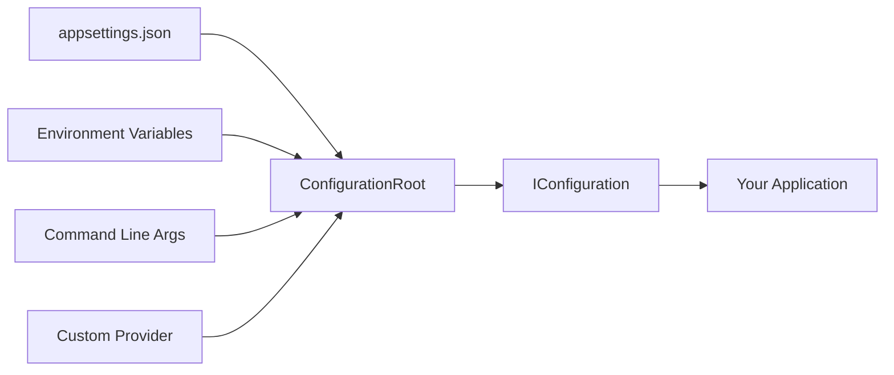

# How to Build Custom Configuration Providers in .NET

Author: [nawazdhandala](https://www.github.com/nawazdhandala)

Tags: .NET, C#, Configuration, Custom Providers, Dependency Injection

Description: Learn how to build custom configuration providers in .NET to load settings from databases, APIs, or custom file formats. This guide covers the IConfigurationSource and IConfigurationProvider interfaces with practical examples.

---

.NET's configuration system is extensible by design. While the built-in providers handle JSON files, environment variables, and command-line arguments, you often need to pull configuration from other sources: a database, a remote API, a custom file format, or a secrets manager. Building a custom configuration provider lets you integrate these sources seamlessly into your application.

## Understanding the Configuration Pipeline

The configuration system in .NET works through a chain of providers, each contributing key-value pairs to a unified configuration object.



Later providers override earlier ones, so the order matters. Your custom provider can sit anywhere in this chain.

## The Building Blocks

Creating a custom configuration provider requires two classes:

1. **ConfigurationSource**: Implements `IConfigurationSource`, creates the provider
2. **ConfigurationProvider**: Extends `ConfigurationProvider`, loads the actual data

## Example: Database Configuration Provider

Let's build a provider that loads configuration from a SQL Server database.

### The Database Table

First, create a table to store configuration:

```sql
CREATE TABLE AppConfiguration (
    Id INT IDENTITY(1,1) PRIMARY KEY,
    ConfigKey NVARCHAR(256) NOT NULL,
    ConfigValue NVARCHAR(MAX) NOT NULL,
    Environment NVARCHAR(50) NOT NULL DEFAULT 'Production',
    LastModified DATETIME2 DEFAULT GETDATE(),
    CONSTRAINT UQ_ConfigKey_Environment UNIQUE (ConfigKey, Environment)
);

-- Insert some sample configuration
INSERT INTO AppConfiguration (ConfigKey, ConfigValue, Environment) VALUES
('ConnectionStrings:Redis', 'localhost:6379', 'Development'),
('Logging:LogLevel:Default', 'Debug', 'Development'),
('Features:EnableNewDashboard', 'true', 'Development');
```

### The Configuration Provider

```csharp
using Microsoft.Data.SqlClient;
using Microsoft.Extensions.Configuration;
using System.Data;

public class DatabaseConfigurationProvider : ConfigurationProvider
{
    private readonly string _connectionString;
    private readonly string _environment;
    private readonly TimeSpan _reloadInterval;
    private Timer? _reloadTimer;

    public DatabaseConfigurationProvider(
        string connectionString,
        string environment,
        TimeSpan? reloadInterval = null)
    {
        _connectionString = connectionString;
        _environment = environment;
        _reloadInterval = reloadInterval ?? TimeSpan.Zero;
    }

    public override void Load()
    {
        // Load configuration from database
        var data = new Dictionary<string, string?>(StringComparer.OrdinalIgnoreCase);

        try
        {
            using var connection = new SqlConnection(_connectionString);
            connection.Open();

            using var command = connection.CreateCommand();
            command.CommandText = @"
                SELECT ConfigKey, ConfigValue
                FROM AppConfiguration
                WHERE Environment = @Environment";
            command.Parameters.AddWithValue("@Environment", _environment);

            using var reader = command.ExecuteReader();
            while (reader.Read())
            {
                var key = reader.GetString(0);
                var value = reader.GetString(1);
                data[key] = value;
            }
        }
        catch (SqlException ex)
        {
            // Log the error but don't crash - configuration might come from other sources
            Console.WriteLine($"Failed to load database configuration: {ex.Message}");
        }

        // Replace the Data dictionary atomically
        Data = data;

        // Set up periodic reload if interval is specified
        if (_reloadInterval > TimeSpan.Zero && _reloadTimer == null)
        {
            _reloadTimer = new Timer(
                _ => ReloadConfiguration(),
                null,
                _reloadInterval,
                _reloadInterval);
        }
    }

    private void ReloadConfiguration()
    {
        try
        {
            Load();
            // Notify that configuration has changed
            OnReload();
        }
        catch (Exception ex)
        {
            Console.WriteLine($"Failed to reload configuration: {ex.Message}");
        }
    }

    public void Dispose()
    {
        _reloadTimer?.Dispose();
    }
}
```

### The Configuration Source

```csharp
using Microsoft.Extensions.Configuration;

public class DatabaseConfigurationSource : IConfigurationSource
{
    public string ConnectionString { get; set; } = string.Empty;
    public string Environment { get; set; } = "Production";
    public TimeSpan ReloadInterval { get; set; } = TimeSpan.Zero;

    public IConfigurationProvider Build(IConfigurationBuilder builder)
    {
        return new DatabaseConfigurationProvider(
            ConnectionString,
            Environment,
            ReloadInterval);
    }
}
```

### Extension Method for Easy Registration

```csharp
public static class DatabaseConfigurationExtensions
{
    public static IConfigurationBuilder AddDatabaseConfiguration(
        this IConfigurationBuilder builder,
        string connectionString,
        string environment,
        TimeSpan? reloadInterval = null)
    {
        return builder.Add(new DatabaseConfigurationSource
        {
            ConnectionString = connectionString,
            Environment = environment,
            ReloadInterval = reloadInterval ?? TimeSpan.Zero
        });
    }
}
```

### Using the Database Provider

```csharp
var builder = WebApplication.CreateBuilder(args);

// Get the bootstrap connection string from appsettings.json
var bootstrapConfig = new ConfigurationBuilder()
    .AddJsonFile("appsettings.json")
    .Build();

var connectionString = bootstrapConfig.GetConnectionString("ConfigDb")
    ?? throw new InvalidOperationException("ConfigDb connection string is required");

// Add database configuration with auto-reload every 5 minutes
builder.Configuration.AddDatabaseConfiguration(
    connectionString,
    builder.Environment.EnvironmentName,
    reloadInterval: TimeSpan.FromMinutes(5));

var app = builder.Build();

// Configuration is now available
var redisConnection = app.Configuration.GetConnectionString("Redis");
```

## Example: REST API Configuration Provider

Load configuration from a remote configuration service:

```csharp
using Microsoft.Extensions.Configuration;
using System.Text.Json;

public class ApiConfigurationProvider : ConfigurationProvider
{
    private readonly string _baseUrl;
    private readonly string _apiKey;
    private readonly HttpClient _httpClient;

    public ApiConfigurationProvider(string baseUrl, string apiKey)
    {
        _baseUrl = baseUrl;
        _apiKey = apiKey;
        _httpClient = new HttpClient();
        _httpClient.DefaultRequestHeaders.Add("X-Api-Key", _apiKey);
    }

    public override void Load()
    {
        LoadAsync().GetAwaiter().GetResult();
    }

    private async Task LoadAsync()
    {
        var data = new Dictionary<string, string?>(StringComparer.OrdinalIgnoreCase);

        try
        {
            var response = await _httpClient.GetAsync($"{_baseUrl}/configuration");
            response.EnsureSuccessStatusCode();

            var json = await response.Content.ReadAsStringAsync();
            var configData = JsonSerializer.Deserialize<Dictionary<string, JsonElement>>(json);

            if (configData != null)
            {
                // Flatten the JSON structure into key-value pairs
                FlattenJson(configData, string.Empty, data);
            }
        }
        catch (HttpRequestException ex)
        {
            Console.WriteLine($"Failed to load configuration from API: {ex.Message}");
        }

        Data = data;
    }

    private void FlattenJson(
        Dictionary<string, JsonElement> source,
        string prefix,
        Dictionary<string, string?> target)
    {
        foreach (var kvp in source)
        {
            var key = string.IsNullOrEmpty(prefix)
                ? kvp.Key
                : $"{prefix}:{kvp.Key}";

            switch (kvp.Value.ValueKind)
            {
                case JsonValueKind.Object:
                    // Recursively flatten nested objects
                    var nested = JsonSerializer.Deserialize<Dictionary<string, JsonElement>>(
                        kvp.Value.GetRawText());
                    if (nested != null)
                    {
                        FlattenJson(nested, key, target);
                    }
                    break;

                case JsonValueKind.Array:
                    // Handle arrays with indexed keys
                    var index = 0;
                    foreach (var item in kvp.Value.EnumerateArray())
                    {
                        target[$"{key}:{index}"] = item.ToString();
                        index++;
                    }
                    break;

                default:
                    // Primitive values
                    target[key] = kvp.Value.ToString();
                    break;
            }
        }
    }
}

public class ApiConfigurationSource : IConfigurationSource
{
    public string BaseUrl { get; set; } = string.Empty;
    public string ApiKey { get; set; } = string.Empty;

    public IConfigurationProvider Build(IConfigurationBuilder builder)
    {
        return new ApiConfigurationProvider(BaseUrl, ApiKey);
    }
}

public static class ApiConfigurationExtensions
{
    public static IConfigurationBuilder AddApiConfiguration(
        this IConfigurationBuilder builder,
        string baseUrl,
        string apiKey)
    {
        return builder.Add(new ApiConfigurationSource
        {
            BaseUrl = baseUrl,
            ApiKey = apiKey
        });
    }
}
```

## Example: YAML Configuration Provider

Support YAML configuration files:

```csharp
using Microsoft.Extensions.Configuration;
using YamlDotNet.Serialization;
using YamlDotNet.Serialization.NamingConventions;

public class YamlConfigurationProvider : FileConfigurationProvider
{
    public YamlConfigurationProvider(YamlConfigurationSource source)
        : base(source) { }

    public override void Load(Stream stream)
    {
        var deserializer = new DeserializerBuilder()
            .WithNamingConvention(CamelCaseNamingConvention.Instance)
            .Build();

        using var reader = new StreamReader(stream);
        var yamlContent = reader.ReadToEnd();

        // Deserialize YAML to a dictionary structure
        var yamlData = deserializer.Deserialize<Dictionary<string, object>>(yamlContent);

        // Convert to configuration key-value pairs
        Data = new Dictionary<string, string?>(StringComparer.OrdinalIgnoreCase);
        if (yamlData != null)
        {
            ProcessYamlNode(yamlData, string.Empty);
        }
    }

    private void ProcessYamlNode(object node, string prefix)
    {
        if (node is Dictionary<object, object> dict)
        {
            foreach (var kvp in dict)
            {
                var key = string.IsNullOrEmpty(prefix)
                    ? kvp.Key.ToString()!
                    : $"{prefix}:{kvp.Key}";

                ProcessYamlNode(kvp.Value, key);
            }
        }
        else if (node is List<object> list)
        {
            for (var i = 0; i < list.Count; i++)
            {
                ProcessYamlNode(list[i], $"{prefix}:{i}");
            }
        }
        else
        {
            // Leaf node - store the value
            Data[prefix] = node?.ToString();
        }
    }
}

public class YamlConfigurationSource : FileConfigurationSource
{
    public override IConfigurationProvider Build(IConfigurationBuilder builder)
    {
        EnsureDefaults(builder);
        return new YamlConfigurationProvider(this);
    }
}

public static class YamlConfigurationExtensions
{
    public static IConfigurationBuilder AddYamlFile(
        this IConfigurationBuilder builder,
        string path,
        bool optional = false,
        bool reloadOnChange = false)
    {
        return builder.Add(new YamlConfigurationSource
        {
            Path = path,
            Optional = optional,
            ReloadOnChange = reloadOnChange
        });
    }
}
```

Usage:

```csharp
var builder = WebApplication.CreateBuilder(args);

// Add YAML configuration file
builder.Configuration.AddYamlFile("config.yaml", optional: false, reloadOnChange: true);
```

With a `config.yaml` file:

```yaml
connectionStrings:
  defaultConnection: "Server=localhost;Database=MyApp;Trusted_Connection=True;"
  redis: "localhost:6379"

logging:
  logLevel:
    default: Information
    microsoft: Warning
    system: Warning

features:
  enableCache: true
  maxRetries: 3
  allowedOrigins:
    - https://example.com
    - https://app.example.com
```

## Handling Secrets Securely

When loading sensitive configuration, implement proper handling:

```csharp
public class SecureConfigurationProvider : ConfigurationProvider
{
    private readonly ISecretStore _secretStore;

    public SecureConfigurationProvider(ISecretStore secretStore)
    {
        _secretStore = secretStore;
    }

    public override void Load()
    {
        var data = new Dictionary<string, string?>(StringComparer.OrdinalIgnoreCase);

        // Load secrets from secure storage
        var secrets = _secretStore.GetAllSecretsAsync().GetAwaiter().GetResult();

        foreach (var secret in secrets)
        {
            // Transform secret paths to configuration keys
            // e.g., "myapp/database/password" becomes "Database:Password"
            var key = secret.Path
                .Replace("myapp/", "")
                .Replace("/", ":");

            data[key] = secret.Value;
        }

        Data = data;
    }

    public override bool TryGet(string key, out string? value)
    {
        // Attempt to get from cache first
        if (base.TryGet(key, out value))
        {
            return true;
        }

        // Try loading on-demand for secrets not in initial load
        try
        {
            var secretPath = "myapp/" + key.Replace(":", "/").ToLower();
            value = _secretStore.GetSecretAsync(secretPath).GetAwaiter().GetResult();

            if (value != null)
            {
                // Cache for future lookups
                Data[key] = value;
                return true;
            }
        }
        catch
        {
            // Secret not found
        }

        value = null;
        return false;
    }
}
```

## Best Practices

1. **Handle failures gracefully**: Your provider should not crash the application if the source is unavailable
2. **Use caching**: Avoid hitting external services on every configuration access
3. **Support reload**: Implement `OnReload()` for dynamic configuration updates
4. **Respect ordering**: Add your provider at the right position in the chain
5. **Flatten hierarchies**: Convert nested structures to colon-separated keys (e.g., `Logging:LogLevel:Default`)

## Summary

| Provider Type | Use Case |
|--------------|----------|
| **Database** | Shared configuration across instances |
| **API** | Centralized configuration service |
| **YAML** | Human-readable configuration files |
| **Secrets** | Sensitive data from secure storage |

Custom configuration providers extend .NET's configuration system to work with any data source. By implementing `IConfigurationSource` and `ConfigurationProvider`, you integrate external systems while maintaining the familiar `IConfiguration` interface throughout your application. The key is handling errors gracefully, supporting dynamic reload when needed, and properly flattening hierarchical data into the key-value format that .NET configuration expects.
