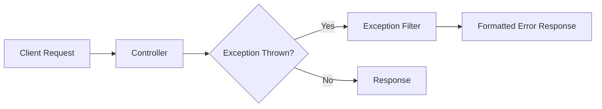

# How to Handle Exceptions with Custom Filters in NestJS

Author: [nawazdhandala](https://www.github.com/nawazdhandala)

Tags: NestJS, Node.js, TypeScript, Exception Handling, Error Handling, REST API

Description: A comprehensive guide to building custom exception filters in NestJS, covering global filters, HTTP exceptions, validation errors, and structured error responses for production APIs.

---

> Exception handling is a critical part of any API. NestJS provides a powerful exception filter mechanism that lets you transform errors into consistent, meaningful responses across your entire application.

Unhandled exceptions lead to poor user experiences and make debugging difficult. This guide shows you how to build custom exception filters in NestJS that provide consistent error responses, capture important debugging information, and integrate with monitoring systems.

---

## Understanding NestJS Exception Filters

Exception filters in NestJS intercept exceptions thrown during request processing. They let you control the response sent back to the client and perform additional actions like logging.



The default exception filter handles HttpException and provides basic error responses, but custom filters give you full control.

---

## Creating a Basic Exception Filter

Let's start with a basic exception filter that handles all exceptions.

```typescript
// filters/all-exceptions.filter.ts
import {
  ExceptionFilter,
  Catch,
  ArgumentsHost,
  HttpException,
  HttpStatus,
  Logger
} from '@nestjs/common';
import { Request, Response } from 'express';

// Interface for consistent error responses
interface ErrorResponse {
  statusCode: number;
  message: string;
  error: string;
  timestamp: string;
  path: string;
  requestId?: string;
}

// Catch all exceptions by not specifying an exception type
@Catch()
export class AllExceptionsFilter implements ExceptionFilter {
  private readonly logger = new Logger(AllExceptionsFilter.name);

  catch(exception: unknown, host: ArgumentsHost): void {
    const ctx = host.switchToHttp();
    const response = ctx.getResponse<Response>();
    const request = ctx.getRequest<Request>();

    // Determine status code based on exception type
    const status = this.getStatus(exception);
    const message = this.getMessage(exception);
    const error = this.getErrorName(exception, status);

    // Build error response
    const errorResponse: ErrorResponse = {
      statusCode: status,
      message: message,
      error: error,
      timestamp: new Date().toISOString(),
      path: request.url,
      requestId: request.headers['x-request-id'] as string
    };

    // Log the exception with context
    this.logException(exception, request, status);

    response.status(status).json(errorResponse);
  }

  private getStatus(exception: unknown): number {
    if (exception instanceof HttpException) {
      return exception.getStatus();
    }
    return HttpStatus.INTERNAL_SERVER_ERROR;
  }

  private getMessage(exception: unknown): string {
    if (exception instanceof HttpException) {
      const response = exception.getResponse();

      // Handle string responses
      if (typeof response === 'string') {
        return response;
      }

      // Handle object responses with message property
      if (typeof response === 'object' && response !== null) {
        const responseObj = response as Record<string, any>;
        if (Array.isArray(responseObj.message)) {
          return responseObj.message.join(', ');
        }
        return responseObj.message || 'An error occurred';
      }
    }

    if (exception instanceof Error) {
      return exception.message;
    }

    return 'Internal server error';
  }

  private getErrorName(exception: unknown, status: number): string {
    if (exception instanceof HttpException) {
      return exception.name;
    }

    // Map status codes to error names
    const statusNames: Record<number, string> = {
      400: 'Bad Request',
      401: 'Unauthorized',
      403: 'Forbidden',
      404: 'Not Found',
      409: 'Conflict',
      422: 'Unprocessable Entity',
      500: 'Internal Server Error'
    };

    return statusNames[status] || 'Error';
  }

  private logException(exception: unknown, request: Request, status: number): void {
    const logContext = {
      method: request.method,
      url: request.url,
      statusCode: status,
      userAgent: request.headers['user-agent'],
      ip: request.ip,
      requestId: request.headers['x-request-id']
    };

    if (status >= 500) {
      // Log full stack trace for server errors
      this.logger.error(
        `${request.method} ${request.url} - ${status}`,
        exception instanceof Error ? exception.stack : String(exception),
        JSON.stringify(logContext)
      );
    } else {
      // Log basic info for client errors
      this.logger.warn(
        `${request.method} ${request.url} - ${status}`,
        JSON.stringify(logContext)
      );
    }
  }
}
```

---

## Handling Validation Errors

Validation errors from class-validator need special handling to provide useful feedback.

```typescript
// filters/validation-exception.filter.ts
import {
  ExceptionFilter,
  Catch,
  ArgumentsHost,
  BadRequestException,
  Logger
} from '@nestjs/common';
import { Response } from 'express';

// Interface for validation error details
interface ValidationError {
  field: string;
  message: string;
  value?: any;
}

interface ValidationErrorResponse {
  statusCode: number;
  error: string;
  message: string;
  errors: ValidationError[];
  timestamp: string;
}

@Catch(BadRequestException)
export class ValidationExceptionFilter implements ExceptionFilter {
  private readonly logger = new Logger(ValidationExceptionFilter.name);

  catch(exception: BadRequestException, host: ArgumentsHost): void {
    const ctx = host.switchToHttp();
    const response = ctx.getResponse<Response>();

    const exceptionResponse = exception.getResponse() as any;

    // Check if this is a validation error from class-validator
    if (this.isValidationError(exceptionResponse)) {
      const errors = this.formatValidationErrors(exceptionResponse.message);

      const errorResponse: ValidationErrorResponse = {
        statusCode: 400,
        error: 'Validation Error',
        message: 'One or more validation errors occurred',
        errors: errors,
        timestamp: new Date().toISOString()
      };

      this.logger.warn(`Validation failed: ${JSON.stringify(errors)}`);

      response.status(400).json(errorResponse);
      return;
    }

    // Not a validation error, let the default handler process it
    response.status(400).json({
      statusCode: 400,
      error: 'Bad Request',
      message: exceptionResponse.message || 'Bad request',
      timestamp: new Date().toISOString()
    });
  }

  private isValidationError(response: any): boolean {
    return (
      typeof response === 'object' &&
      Array.isArray(response.message) &&
      response.message.length > 0
    );
  }

  private formatValidationErrors(messages: string[]): ValidationError[] {
    return messages.map(message => {
      // Parse validation error messages
      // Format is usually: "propertyName constraint message"
      const parts = message.split(' ');
      const field = parts[0] || 'unknown';

      return {
        field: field,
        message: message
      };
    });
  }
}
```

---

## Creating Custom HTTP Exceptions

Define custom exceptions for common error scenarios in your application.

```typescript
// exceptions/custom-exceptions.ts
import { HttpException, HttpStatus } from '@nestjs/common';

// Base class for application-specific exceptions
export class AppException extends HttpException {
  constructor(
    message: string,
    status: HttpStatus,
    public readonly code: string,
    public readonly details?: Record<string, any>
  ) {
    super(
      {
        message,
        code,
        details
      },
      status
    );
  }
}

// Resource not found
export class ResourceNotFoundException extends AppException {
  constructor(resource: string, identifier: string | number) {
    super(
      `${resource} with identifier '${identifier}' not found`,
      HttpStatus.NOT_FOUND,
      'RESOURCE_NOT_FOUND',
      { resource, identifier }
    );
  }
}

// Duplicate resource
export class DuplicateResourceException extends AppException {
  constructor(resource: string, field: string, value: any) {
    super(
      `${resource} with ${field} '${value}' already exists`,
      HttpStatus.CONFLICT,
      'DUPLICATE_RESOURCE',
      { resource, field, value }
    );
  }
}

// Business rule violation
export class BusinessRuleException extends AppException {
  constructor(rule: string, message: string) {
    super(
      message,
      HttpStatus.UNPROCESSABLE_ENTITY,
      'BUSINESS_RULE_VIOLATION',
      { rule }
    );
  }
}

// External service failure
export class ExternalServiceException extends AppException {
  constructor(service: string, originalError?: Error) {
    super(
      `External service '${service}' is unavailable`,
      HttpStatus.SERVICE_UNAVAILABLE,
      'EXTERNAL_SERVICE_ERROR',
      {
        service,
        originalMessage: originalError?.message
      }
    );
  }
}

// Rate limit exceeded
export class RateLimitException extends AppException {
  constructor(retryAfter: number) {
    super(
      'Rate limit exceeded',
      HttpStatus.TOO_MANY_REQUESTS,
      'RATE_LIMIT_EXCEEDED',
      { retryAfter }
    );
  }
}
```

---

## Filter for Custom Exceptions

Create a specialized filter to handle your custom exceptions.

```typescript
// filters/app-exception.filter.ts
import {
  ExceptionFilter,
  Catch,
  ArgumentsHost,
  Logger
} from '@nestjs/common';
import { Response, Request } from 'express';
import { AppException } from '../exceptions/custom-exceptions';

interface AppErrorResponse {
  statusCode: number;
  code: string;
  message: string;
  details?: Record<string, any>;
  timestamp: string;
  path: string;
  traceId?: string;
}

@Catch(AppException)
export class AppExceptionFilter implements ExceptionFilter {
  private readonly logger = new Logger(AppExceptionFilter.name);

  catch(exception: AppException, host: ArgumentsHost): void {
    const ctx = host.switchToHttp();
    const response = ctx.getResponse<Response>();
    const request = ctx.getRequest<Request>();

    const status = exception.getStatus();
    const exceptionResponse = exception.getResponse() as any;

    const errorResponse: AppErrorResponse = {
      statusCode: status,
      code: exception.code,
      message: exceptionResponse.message,
      details: exception.details,
      timestamp: new Date().toISOString(),
      path: request.url,
      traceId: request.headers['x-trace-id'] as string
    };

    // Log with appropriate level based on status
    if (status >= 500) {
      this.logger.error(
        `[${exception.code}] ${exceptionResponse.message}`,
        exception.stack
      );
    } else {
      this.logger.warn(
        `[${exception.code}] ${exceptionResponse.message}`,
        JSON.stringify(exception.details)
      );
    }

    // Add retry-after header for rate limiting
    if (exception.code === 'RATE_LIMIT_EXCEEDED' && exception.details?.retryAfter) {
      response.setHeader('Retry-After', exception.details.retryAfter);
    }

    response.status(status).json(errorResponse);
  }
}
```

---

## Registering Filters Globally

Register your filters in the main application module.

```typescript
// main.ts
import { NestFactory } from '@nestjs/core';
import { ValidationPipe } from '@nestjs/common';
import { AppModule } from './app.module';
import { AllExceptionsFilter } from './filters/all-exceptions.filter';
import { ValidationExceptionFilter } from './filters/validation-exception.filter';
import { AppExceptionFilter } from './filters/app-exception.filter';

async function bootstrap() {
  const app = await NestFactory.create(AppModule);

  // Enable validation pipes for DTOs
  app.useGlobalPipes(
    new ValidationPipe({
      whitelist: true,
      forbidNonWhitelisted: true,
      transform: true,
      transformOptions: {
        enableImplicitConversion: true
      }
    })
  );

  // Register exception filters
  // Order matters: more specific filters first
  app.useGlobalFilters(
    new AllExceptionsFilter(),        // Catch-all fallback
    new ValidationExceptionFilter(),   // Validation errors
    new AppExceptionFilter()           // Custom app exceptions
  );

  await app.listen(3000);
}

bootstrap();
```

---

## Using Custom Exceptions in Services

Here is how to use the custom exceptions in your services.

```typescript
// users/users.service.ts
import { Injectable } from '@nestjs/common';
import {
  ResourceNotFoundException,
  DuplicateResourceException,
  BusinessRuleException
} from '../exceptions/custom-exceptions';

interface User {
  id: string;
  email: string;
  name: string;
  status: 'active' | 'suspended';
}

@Injectable()
export class UsersService {
  private users: Map<string, User> = new Map();

  async findById(id: string): Promise<User> {
    const user = this.users.get(id);

    if (!user) {
      throw new ResourceNotFoundException('User', id);
    }

    return user;
  }

  async create(data: { email: string; name: string }): Promise<User> {
    // Check for duplicate email
    const existing = Array.from(this.users.values()).find(
      u => u.email === data.email
    );

    if (existing) {
      throw new DuplicateResourceException('User', 'email', data.email);
    }

    const user: User = {
      id: this.generateId(),
      email: data.email,
      name: data.name,
      status: 'active'
    };

    this.users.set(user.id, user);
    return user;
  }

  async suspend(id: string): Promise<User> {
    const user = await this.findById(id);

    if (user.status === 'suspended') {
      throw new BusinessRuleException(
        'USER_ALREADY_SUSPENDED',
        'Cannot suspend a user that is already suspended'
      );
    }

    user.status = 'suspended';
    return user;
  }

  private generateId(): string {
    return Math.random().toString(36).substring(2, 15);
  }
}
```

---

## Adding Request Context

Add a middleware to inject request IDs for tracing.

```typescript
// middleware/request-context.middleware.ts
import { Injectable, NestMiddleware } from '@nestjs/common';
import { Request, Response, NextFunction } from 'express';
import { v4 as uuidv4 } from 'uuid';

@Injectable()
export class RequestContextMiddleware implements NestMiddleware {
  use(req: Request, res: Response, next: NextFunction): void {
    // Generate or use existing request ID
    const requestId = req.headers['x-request-id'] as string || uuidv4();

    // Set headers for downstream services and response
    req.headers['x-request-id'] = requestId;
    res.setHeader('X-Request-Id', requestId);

    // Add timestamp
    req.headers['x-request-timestamp'] = new Date().toISOString();

    next();
  }
}

// Register in app.module.ts
import { Module, MiddlewareConsumer, NestModule } from '@nestjs/common';
import { RequestContextMiddleware } from './middleware/request-context.middleware';

@Module({
  // ...
})
export class AppModule implements NestModule {
  configure(consumer: MiddlewareConsumer) {
    consumer.apply(RequestContextMiddleware).forRoutes('*');
  }
}
```

---

## Testing Exception Filters

Write tests to ensure your exception filters work correctly.

```typescript
// filters/all-exceptions.filter.spec.ts
import { Test, TestingModule } from '@nestjs/testing';
import { HttpException, HttpStatus } from '@nestjs/common';
import { AllExceptionsFilter } from './all-exceptions.filter';

describe('AllExceptionsFilter', () => {
  let filter: AllExceptionsFilter;

  beforeEach(async () => {
    filter = new AllExceptionsFilter();
  });

  it('should handle HttpException', () => {
    const exception = new HttpException('Not Found', HttpStatus.NOT_FOUND);

    const mockResponse = {
      status: jest.fn().mockReturnThis(),
      json: jest.fn()
    };

    const mockRequest = {
      url: '/test',
      method: 'GET',
      headers: {},
      ip: '127.0.0.1'
    };

    const mockHost = {
      switchToHttp: () => ({
        getResponse: () => mockResponse,
        getRequest: () => mockRequest
      })
    };

    filter.catch(exception, mockHost as any);

    expect(mockResponse.status).toHaveBeenCalledWith(404);
    expect(mockResponse.json).toHaveBeenCalledWith(
      expect.objectContaining({
        statusCode: 404,
        message: 'Not Found',
        path: '/test'
      })
    );
  });

  it('should handle unknown exceptions as 500', () => {
    const exception = new Error('Something went wrong');

    const mockResponse = {
      status: jest.fn().mockReturnThis(),
      json: jest.fn()
    };

    const mockRequest = {
      url: '/test',
      method: 'POST',
      headers: {},
      ip: '127.0.0.1'
    };

    const mockHost = {
      switchToHttp: () => ({
        getResponse: () => mockResponse,
        getRequest: () => mockRequest
      })
    };

    filter.catch(exception, mockHost as any);

    expect(mockResponse.status).toHaveBeenCalledWith(500);
    expect(mockResponse.json).toHaveBeenCalledWith(
      expect.objectContaining({
        statusCode: 500,
        message: 'Something went wrong'
      })
    );
  });
});
```

---

## Conclusion

Custom exception filters in NestJS give you complete control over error handling in your API. By creating a hierarchy of filters from specific to general, you can handle each type of error appropriately while maintaining consistent response formats.

Key takeaways:
- Use the @Catch decorator to target specific exception types
- Register filters in order from most specific to most general
- Include request context in error responses for debugging
- Create custom exceptions for domain-specific errors
- Always log exceptions with appropriate severity levels

With proper exception handling in place, your API becomes easier to debug, provides better feedback to clients, and integrates smoothly with monitoring systems.

---

*Want to track errors in your NestJS applications? [OneUptime](https://oneuptime.com) provides error tracking and alerting to help you catch and fix issues before they impact users.*
