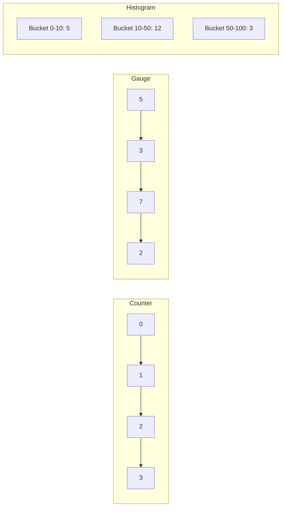

# How to Implement Custom Metrics in OpenTelemetry

Author: [nawazdhandala](https://www.github.com/nawazdhandala)

Tags: OpenTelemetry, Metrics, Custom Metrics, Observability, Monitoring, Instrumentation, Performance

Description: Learn how to implement custom metrics in OpenTelemetry using counters, gauges, and histograms. This guide covers practical examples for Node.js and Python with best practices for metric design.

---

While auto-instrumentation captures standard metrics like HTTP request counts and durations, business-specific metrics require custom instrumentation. How many orders were placed? What is the current queue depth? How long does payment processing take?

This guide covers implementing custom metrics in OpenTelemetry using the three primary metric types: counters, gauges, and histograms.

## Understanding Metric Types

OpenTelemetry provides three fundamental metric instruments:

| Instrument | Use Case | Example |
|------------|----------|---------|
| Counter | Monotonically increasing values | Request count, errors, bytes sent |
| Gauge | Values that go up and down | Queue depth, active connections, temperature |
| Histogram | Distribution of values | Request latency, response sizes |



## Node.js Custom Metrics

### Basic Setup

```javascript
// metrics.js
const { MeterProvider, PeriodicExportingMetricReader } = require('@opentelemetry/sdk-metrics');
const { OTLPMetricExporter } = require('@opentelemetry/exporter-metrics-otlp-http');
const { Resource } = require('@opentelemetry/resources');
const { SemanticResourceAttributes } = require('@opentelemetry/semantic-conventions');

// Create resource
const resource = new Resource({
  [SemanticResourceAttributes.SERVICE_NAME]: 'order-service',
  [SemanticResourceAttributes.SERVICE_VERSION]: '1.0.0'
});

// Configure exporter
const exporter = new OTLPMetricExporter({
  url: process.env.OTEL_EXPORTER_OTLP_ENDPOINT + '/v1/metrics'
});

// Create meter provider
const meterProvider = new MeterProvider({
  resource,
  readers: [
    new PeriodicExportingMetricReader({
      exporter,
      exportIntervalMillis: 60000  // Export every minute
    })
  ]
});

// Get a meter for creating instruments
const meter = meterProvider.getMeter('order-service-metrics', '1.0.0');

module.exports = { meter, meterProvider };
```

### Counter Example

Counters track values that only increase, like total orders or total errors.

```javascript
// order-metrics.js
const { meter } = require('./metrics');

// Create a counter for order counts
const orderCounter = meter.createCounter('orders_total', {
  description: 'Total number of orders placed',
  unit: '1'
});

// Create a counter for order value
const orderValueCounter = meter.createCounter('orders_value_total', {
  description: 'Total value of orders in cents',
  unit: 'cents'
});

// Function to record an order
function recordOrder(order) {
  // Increment with attributes for segmentation
  orderCounter.add(1, {
    'order.type': order.type,           // 'standard', 'express', 'subscription'
    'order.region': order.region,       // 'us-east', 'us-west', 'eu-west'
    'order.payment_method': order.paymentMethod  // 'card', 'paypal', 'crypto'
  });

  // Track order value
  orderValueCounter.add(order.totalCents, {
    'order.type': order.type,
    'order.region': order.region
  });
}

module.exports = { recordOrder };
```

### Gauge Example

Gauges track values that can increase or decrease, like queue depth or active sessions.

```javascript
// queue-metrics.js
const { meter } = require('./metrics');

// Create an observable gauge for queue depth
// Observable gauges are read periodically rather than pushed
const queueDepthGauge = meter.createObservableGauge('queue_depth', {
  description: 'Current number of items in the processing queue',
  unit: '1'
});

// Reference to the queue (injected from application)
let orderQueue = null;

function setQueueReference(queue) {
  orderQueue = queue;
}

// Register callback to read the current value
queueDepthGauge.addCallback((observableResult) => {
  if (orderQueue) {
    // Read current queue depth and report
    observableResult.observe(orderQueue.length, {
      'queue.name': 'order-processing',
      'queue.priority': 'normal'
    });
  }
});

// For synchronous gauges (when you control when values change)
const activeConnectionsGauge = meter.createUpDownCounter('active_connections', {
  description: 'Number of active database connections',
  unit: '1'
});

function connectionOpened(dbName) {
  activeConnectionsGauge.add(1, { 'db.name': dbName });
}

function connectionClosed(dbName) {
  activeConnectionsGauge.add(-1, { 'db.name': dbName });
}

module.exports = { setQueueReference, connectionOpened, connectionClosed };
```

### Histogram Example

Histograms track distributions of values, useful for latencies and sizes.

```javascript
// latency-metrics.js
const { meter } = require('./metrics');

// Create histogram for payment processing duration
const paymentDurationHistogram = meter.createHistogram('payment_processing_duration', {
  description: 'Time taken to process payments',
  unit: 'ms',
  // Define explicit bucket boundaries
  advice: {
    explicitBucketBoundaries: [10, 25, 50, 100, 250, 500, 1000, 2500, 5000]
  }
});

// Create histogram for response sizes
const responseSizeHistogram = meter.createHistogram('http_response_size', {
  description: 'Size of HTTP responses',
  unit: 'bytes',
  advice: {
    explicitBucketBoundaries: [100, 1000, 10000, 100000, 1000000]
  }
});

async function processPayment(payment) {
  const startTime = Date.now();

  try {
    const result = await paymentGateway.charge(payment);

    // Record successful payment duration
    paymentDurationHistogram.record(Date.now() - startTime, {
      'payment.method': payment.method,
      'payment.gateway': 'stripe',
      'payment.status': 'success'
    });

    return result;
  } catch (error) {
    // Record failed payment duration
    paymentDurationHistogram.record(Date.now() - startTime, {
      'payment.method': payment.method,
      'payment.gateway': 'stripe',
      'payment.status': 'failure',
      'payment.error_type': error.code
    });

    throw error;
  }
}

module.exports = { processPayment, responseSizeHistogram };
```

## Python Custom Metrics

### Basic Setup

```python
# metrics.py
import os
from opentelemetry import metrics
from opentelemetry.sdk.metrics import MeterProvider
from opentelemetry.sdk.metrics.export import PeriodicExportingMetricReader
from opentelemetry.exporter.otlp.proto.grpc.metric_exporter import OTLPMetricExporter
from opentelemetry.sdk.resources import Resource, SERVICE_NAME

# Create resource
resource = Resource.create({
    SERVICE_NAME: os.getenv("OTEL_SERVICE_NAME", "order-service")
})

# Configure exporter
exporter = OTLPMetricExporter(
    endpoint=os.getenv("OTEL_EXPORTER_OTLP_ENDPOINT", "localhost:4317")
)

# Create meter provider
reader = PeriodicExportingMetricReader(
    exporter,
    export_interval_millis=60000  # Export every minute
)
provider = MeterProvider(resource=resource, metric_readers=[reader])
metrics.set_meter_provider(provider)

# Get meter for creating instruments
meter = metrics.get_meter("order-service-metrics", "1.0.0")
```

### Counter Example

```python
# order_metrics.py
from metrics import meter

# Create counters
order_counter = meter.create_counter(
    name="orders_total",
    description="Total number of orders placed",
    unit="1"
)

order_value_counter = meter.create_counter(
    name="orders_value_total",
    description="Total value of orders in cents",
    unit="cents"
)

def record_order(order):
    """
    Record metrics for a completed order.
    Call this after an order is successfully placed.
    """
    # Base attributes for this order
    attributes = {
        "order.type": order.type,
        "order.region": order.region,
        "order.payment_method": order.payment_method
    }

    # Increment order count
    order_counter.add(1, attributes)

    # Track total order value
    order_value_counter.add(order.total_cents, attributes)


def record_order_error(order_type, region, error_type):
    """
    Record a failed order attempt.
    """
    order_error_counter = meter.create_counter(
        name="orders_errors_total",
        description="Total number of failed order attempts",
        unit="1"
    )

    order_error_counter.add(1, {
        "order.type": order_type,
        "order.region": region,
        "error.type": error_type
    })
```

### Gauge Example

```python
# queue_metrics.py
from metrics import meter
from typing import Callable

# Store reference to queue for observable callback
_queue_getter: Callable[[], int] = lambda: 0

def set_queue_getter(getter: Callable[[], int]):
    """
    Set the function that returns current queue depth.
    Call this during application initialization.
    """
    global _queue_getter
    _queue_getter = getter

def _observe_queue_depth(options):
    """
    Callback function called periodically to observe queue depth.
    """
    depth = _queue_getter()
    options.observe(depth, {
        "queue.name": "order-processing",
        "queue.priority": "normal"
    })

# Create observable gauge
queue_depth_gauge = meter.create_observable_gauge(
    name="queue_depth",
    callbacks=[_observe_queue_depth],
    description="Current number of items in the processing queue",
    unit="1"
)

# For values you control directly, use UpDownCounter
active_workers = meter.create_up_down_counter(
    name="active_workers",
    description="Number of currently active worker threads",
    unit="1"
)

def worker_started(worker_type: str):
    """Call when a worker thread starts processing."""
    active_workers.add(1, {"worker.type": worker_type})

def worker_finished(worker_type: str):
    """Call when a worker thread finishes processing."""
    active_workers.add(-1, {"worker.type": worker_type})
```

### Histogram Example

```python
# latency_metrics.py
import time
from contextlib import contextmanager
from metrics import meter

# Create histogram with explicit bucket boundaries
payment_duration = meter.create_histogram(
    name="payment_processing_duration",
    description="Time taken to process payments",
    unit="ms"
)

@contextmanager
def measure_payment_duration(payment_method: str, gateway: str):
    """
    Context manager for measuring payment processing duration.

    Usage:
        with measure_payment_duration('card', 'stripe') as record:
            result = process_payment(...)
            record(status='success')
    """
    start_time = time.time()
    status = 'unknown'
    error_type = None

    def set_result(new_status: str, new_error_type: str = None):
        nonlocal status, error_type
        status = new_status
        error_type = new_error_type

    try:
        yield set_result
    finally:
        duration_ms = (time.time() - start_time) * 1000

        attributes = {
            "payment.method": payment_method,
            "payment.gateway": gateway,
            "payment.status": status
        }

        if error_type:
            attributes["payment.error_type"] = error_type

        payment_duration.record(duration_ms, attributes)


# Usage example
async def process_payment(payment):
    with measure_payment_duration(payment.method, 'stripe') as record:
        try:
            result = await payment_gateway.charge(payment)
            record('success')
            return result
        except PaymentDeclinedError as e:
            record('declined', 'card_declined')
            raise
        except PaymentGatewayError as e:
            record('error', 'gateway_error')
            raise
```

## Best Practices for Custom Metrics

### 1. Use Meaningful Names

Follow the OpenTelemetry naming conventions:

```javascript
// Good names
'http_request_duration_seconds'
'orders_total'
'queue_depth'

// Bad names
'metric1'
'orderCount'
'the_queue'
```

### 2. Keep Cardinality Under Control

Limit the number of unique attribute combinations:

```javascript
// Bad: High cardinality (unbounded user IDs)
orderCounter.add(1, { 'user.id': order.userId });

// Good: Bounded cardinality (user tier)
orderCounter.add(1, { 'user.tier': order.userTier });
```

### 3. Use Appropriate Units

Always specify units and use standard conventions:

```javascript
// Use seconds for durations
meter.createHistogram('http_request_duration', { unit: 's' });

// Use bytes for sizes
meter.createHistogram('http_response_size', { unit: 'By' });

// Use 1 for counts
meter.createCounter('http_requests', { unit: '1' });
```

### 4. Choose the Right Instrument

| Need to track... | Use |
|------------------|-----|
| Total requests | Counter |
| Active sessions | UpDownCounter or ObservableGauge |
| Request latency | Histogram |
| Current temperature | ObservableGauge |
| Errors by type | Counter with attributes |

## Exporting Custom Metrics

Configure the OpenTelemetry Collector to receive and forward your metrics:

```yaml
# collector-config.yaml
receivers:
  otlp:
    protocols:
      grpc:
        endpoint: 0.0.0.0:4317

processors:
  batch:
    send_batch_size: 1000
    timeout: 10s

exporters:
  otlphttp:
    endpoint: "https://oneuptime.com/otlp"
    headers:
      "x-oneuptime-token": "${ONEUPTIME_TOKEN}"

service:
  pipelines:
    metrics:
      receivers: [otlp]
      processors: [batch]
      exporters: [otlphttp]
```

## Summary

Custom metrics give you visibility into business-specific operations that auto-instrumentation cannot capture. Use counters for monotonically increasing values like order counts. Use gauges for values that fluctuate like queue depths. Use histograms for distributions like latencies.

Keep cardinality bounded by using categorical attributes instead of high-cardinality identifiers. Follow naming conventions and always specify units. With well-designed custom metrics, you can answer business questions directly from your observability data.
