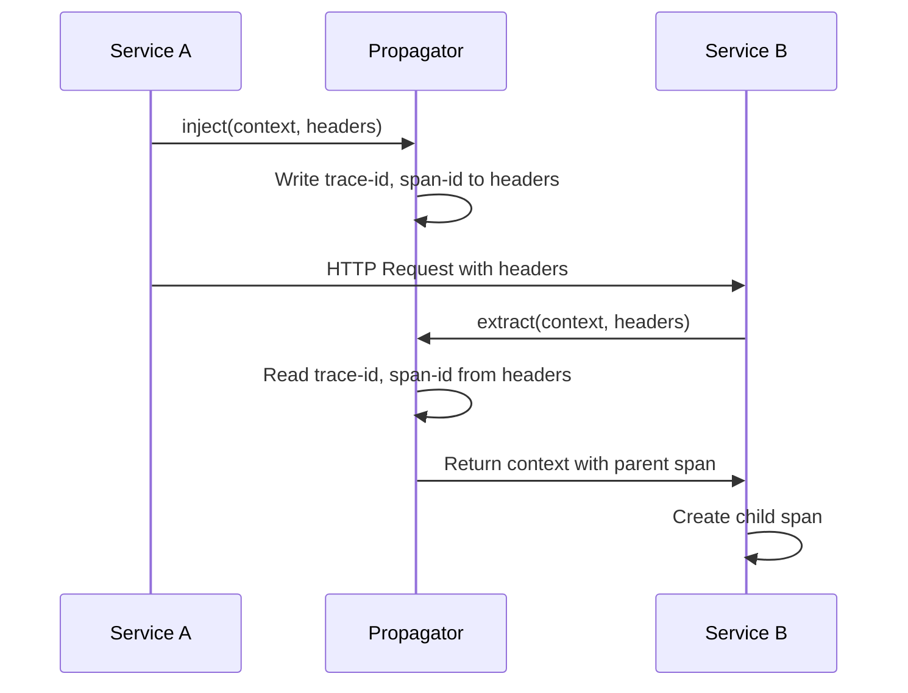

# How to Implement Custom Propagators in OpenTelemetry

Author: [nawazdhandala](https://www.github.com/nawazdhandala)

Tags: OpenTelemetry, Propagators, Context Propagation, Distributed Tracing, W3C Trace Context, Custom Headers

Description: Learn how to implement custom context propagators in OpenTelemetry to support legacy systems, custom protocols, and multi-vendor tracing environments.

---

Context propagation is how distributed traces connect spans across service boundaries. OpenTelemetry includes standard propagators for W3C Trace Context and B3, but sometimes you need custom propagation for legacy systems, proprietary formats, or additional context beyond trace IDs. This guide shows how to implement custom propagators.

## How Propagation Works

When a service makes an outgoing request, the propagator injects context into carrier headers. When a service receives a request, the propagator extracts context from those headers.



## Built-in Propagators

OpenTelemetry includes these standard propagators:

```javascript
const { W3CTraceContextPropagator } = require('@opentelemetry/core');
const { B3Propagator, B3InjectEncoding } = require('@opentelemetry/propagator-b3');
const { JaegerPropagator } = require('@opentelemetry/propagator-jaeger');

// W3C Trace Context (default, recommended)
// Headers: traceparent, tracestate
const w3c = new W3CTraceContextPropagator();

// B3 format (Zipkin compatibility)
// Headers: X-B3-TraceId, X-B3-SpanId, X-B3-Sampled
const b3Multi = new B3Propagator({ injectEncoding: B3InjectEncoding.MULTI_HEADER });

// B3 single header format
// Header: b3
const b3Single = new B3Propagator({ injectEncoding: B3InjectEncoding.SINGLE_HEADER });

// Jaeger format
// Header: uber-trace-id
const jaeger = new JaegerPropagator();
```

## Creating a Custom Propagator

Here is the structure of a custom propagator in different languages.

### Node.js Custom Propagator

```javascript
const {
  Context,
  TextMapPropagator,
  trace,
  isSpanContextValid,
  TraceFlags,
} = require('@opentelemetry/api');

// Custom propagator for a legacy system using X-Request-ID format
class LegacyRequestIdPropagator extends TextMapPropagator {
  // Header names used by the legacy system
  static TRACE_HEADER = 'X-Request-ID';
  static PARENT_HEADER = 'X-Parent-Request-ID';
  static SAMPLED_HEADER = 'X-Request-Sampled';

  // Inject context into outgoing request headers
  inject(context, carrier, setter) {
    const spanContext = trace.getSpanContext(context);

    if (!spanContext || !isSpanContextValid(spanContext)) {
      return;
    }

    // Format: {trace_id}-{span_id}
    const requestId = `${spanContext.traceId}-${spanContext.spanId}`;
    setter.set(carrier, LegacyRequestIdPropagator.TRACE_HEADER, requestId);

    // Set sampled flag
    const sampled = (spanContext.traceFlags & TraceFlags.SAMPLED) !== 0;
    setter.set(carrier, LegacyRequestIdPropagator.SAMPLED_HEADER, sampled ? '1' : '0');
  }

  // Extract context from incoming request headers
  extract(context, carrier, getter) {
    const requestId = getter.get(carrier, LegacyRequestIdPropagator.TRACE_HEADER);

    if (!requestId) {
      return context;
    }

    // Parse: {trace_id}-{span_id}
    const parts = requestId.split('-');
    if (parts.length < 2) {
      return context;
    }

    // Reconstruct trace ID (pad to 32 chars if needed)
    const traceId = parts[0].padStart(32, '0');
    const spanId = parts[1].padStart(16, '0');

    // Check sampled flag
    const sampledHeader = getter.get(carrier, LegacyRequestIdPropagator.SAMPLED_HEADER);
    const traceFlags = sampledHeader === '1' ? TraceFlags.SAMPLED : TraceFlags.NONE;

    const spanContext = {
      traceId,
      spanId,
      traceFlags,
      isRemote: true,
    };

    if (!isSpanContextValid(spanContext)) {
      return context;
    }

    return trace.setSpanContext(context, spanContext);
  }

  // Return header names this propagator uses
  fields() {
    return [
      LegacyRequestIdPropagator.TRACE_HEADER,
      LegacyRequestIdPropagator.PARENT_HEADER,
      LegacyRequestIdPropagator.SAMPLED_HEADER,
    ];
  }
}

module.exports = { LegacyRequestIdPropagator };
```

### Python Custom Propagator

```python
from opentelemetry import trace
from opentelemetry.propagators.textmap import TextMapPropagator, Getter, Setter
from opentelemetry.trace import SpanContext, TraceFlags, INVALID_SPAN_CONTEXT
from opentelemetry.context import Context
from typing import Optional, List, Iterable

class LegacyRequestIdPropagator(TextMapPropagator):
    TRACE_HEADER = 'X-Request-ID'
    PARENT_HEADER = 'X-Parent-Request-ID'
    SAMPLED_HEADER = 'X-Request-Sampled'

    def inject(
        self,
        carrier: dict,
        context: Optional[Context] = None,
        setter: Setter = None
    ) -> None:
        span = trace.get_current_span(context)
        span_context = span.get_span_context()

        if not span_context.is_valid:
            return

        # Format: {trace_id}-{span_id}
        request_id = f"{span_context.trace_id:032x}-{span_context.span_id:016x}"

        if setter is None:
            carrier[self.TRACE_HEADER] = request_id
            carrier[self.SAMPLED_HEADER] = '1' if span_context.trace_flags & TraceFlags.SAMPLED else '0'
        else:
            setter.set(carrier, self.TRACE_HEADER, request_id)
            sampled = '1' if span_context.trace_flags & TraceFlags.SAMPLED else '0'
            setter.set(carrier, self.SAMPLED_HEADER, sampled)

    def extract(
        self,
        carrier: dict,
        context: Optional[Context] = None,
        getter: Getter = None
    ) -> Context:
        if context is None:
            context = Context()

        if getter is None:
            request_id = carrier.get(self.TRACE_HEADER)
            sampled_header = carrier.get(self.SAMPLED_HEADER)
        else:
            request_id = getter.get(carrier, self.TRACE_HEADER)
            sampled_header = getter.get(carrier, self.SAMPLED_HEADER)

        if not request_id:
            return context

        # Parse: {trace_id}-{span_id}
        parts = request_id.split('-')
        if len(parts) < 2:
            return context

        try:
            trace_id = int(parts[0], 16)
            span_id = int(parts[1], 16)
        except ValueError:
            return context

        trace_flags = TraceFlags.SAMPLED if sampled_header == '1' else TraceFlags.NONE

        span_context = SpanContext(
            trace_id=trace_id,
            span_id=span_id,
            is_remote=True,
            trace_flags=trace_flags,
        )

        if not span_context.is_valid:
            return context

        return trace.set_span_in_context(
            trace.NonRecordingSpan(span_context),
            context
        )

    @property
    def fields(self) -> Iterable[str]:
        return [self.TRACE_HEADER, self.PARENT_HEADER, self.SAMPLED_HEADER]
```

### Go Custom Propagator

```go
package propagator

import (
    "context"
    "fmt"
    "strconv"
    "strings"

    "go.opentelemetry.io/otel/propagation"
    "go.opentelemetry.io/otel/trace"
)

const (
    TraceHeader   = "X-Request-ID"
    SampledHeader = "X-Request-Sampled"
)

type LegacyRequestIdPropagator struct{}

func (p LegacyRequestIdPropagator) Inject(ctx context.Context, carrier propagation.TextMapCarrier) {
    span := trace.SpanFromContext(ctx)
    sc := span.SpanContext()

    if !sc.IsValid() {
        return
    }

    // Format: {trace_id}-{span_id}
    requestId := fmt.Sprintf("%s-%s", sc.TraceID().String(), sc.SpanID().String())
    carrier.Set(TraceHeader, requestId)

    sampled := "0"
    if sc.IsSampled() {
        sampled = "1"
    }
    carrier.Set(SampledHeader, sampled)
}

func (p LegacyRequestIdPropagator) Extract(ctx context.Context, carrier propagation.TextMapCarrier) context.Context {
    requestId := carrier.Get(TraceHeader)
    if requestId == "" {
        return ctx
    }

    // Parse: {trace_id}-{span_id}
    parts := strings.Split(requestId, "-")
    if len(parts) < 2 {
        return ctx
    }

    traceID, err := trace.TraceIDFromHex(parts[0])
    if err != nil {
        return ctx
    }

    spanID, err := trace.SpanIDFromHex(parts[1])
    if err != nil {
        return ctx
    }

    sampledHeader := carrier.Get(SampledHeader)
    traceFlags := trace.FlagsDeferred
    if sampledHeader == "1" {
        traceFlags = trace.FlagsSampled
    }

    sc := trace.NewSpanContext(trace.SpanContextConfig{
        TraceID:    traceID,
        SpanID:     spanID,
        TraceFlags: traceFlags,
        Remote:     true,
    })

    if !sc.IsValid() {
        return ctx
    }

    return trace.ContextWithRemoteSpanContext(ctx, sc)
}

func (p LegacyRequestIdPropagator) Fields() []string {
    return []string{TraceHeader, SampledHeader}
}
```

## Registering Custom Propagators

Once implemented, register your propagator with the SDK.

### Node.js Registration

```javascript
const { propagation } = require('@opentelemetry/api');
const { CompositePropagator, W3CTraceContextPropagator } = require('@opentelemetry/core');
const { LegacyRequestIdPropagator } = require('./legacy-propagator');

// Use composite propagator to support multiple formats
const propagator = new CompositePropagator({
  propagators: [
    new W3CTraceContextPropagator(),   // Standard format
    new LegacyRequestIdPropagator(),    // Legacy format
  ],
});

propagation.setGlobalPropagator(propagator);
```

### Python Registration

```python
from opentelemetry import propagate
from opentelemetry.propagators.composite import CompositePropagator
from opentelemetry.trace.propagation.tracecontext import TraceContextTextMapPropagator
from legacy_propagator import LegacyRequestIdPropagator

propagator = CompositePropagator([
    TraceContextTextMapPropagator(),
    LegacyRequestIdPropagator(),
])

propagate.set_global_textmap(propagator)
```

### Go Registration

```go
package main

import (
    "go.opentelemetry.io/otel"
    "go.opentelemetry.io/otel/propagation"
    "myapp/propagator"
)

func main() {
    // Composite propagator for multiple formats
    otel.SetTextMapPropagator(
        propagation.NewCompositeTextMapPropagator(
            propagation.TraceContext{},
            propagator.LegacyRequestIdPropagator{},
        ),
    )
}
```

## Propagating Custom Context

Sometimes you need to propagate more than just trace context. Here is a propagator that includes custom business context.

```javascript
const { Context, createContextKey } = require('@opentelemetry/api');

// Define custom context keys
const TENANT_ID_KEY = createContextKey('tenant_id');
const USER_ID_KEY = createContextKey('user_id');

class BusinessContextPropagator extends TextMapPropagator {
  static TENANT_HEADER = 'X-Tenant-ID';
  static USER_HEADER = 'X-User-ID';

  inject(context, carrier, setter) {
    const tenantId = context.getValue(TENANT_ID_KEY);
    const userId = context.getValue(USER_ID_KEY);

    if (tenantId) {
      setter.set(carrier, BusinessContextPropagator.TENANT_HEADER, tenantId);
    }
    if (userId) {
      setter.set(carrier, BusinessContextPropagator.USER_HEADER, userId);
    }
  }

  extract(context, carrier, getter) {
    const tenantId = getter.get(carrier, BusinessContextPropagator.TENANT_HEADER);
    const userId = getter.get(carrier, BusinessContextPropagator.USER_HEADER);

    if (tenantId) {
      context = context.setValue(TENANT_ID_KEY, tenantId);
    }
    if (userId) {
      context = context.setValue(USER_ID_KEY, userId);
    }

    return context;
  }

  fields() {
    return [
      BusinessContextPropagator.TENANT_HEADER,
      BusinessContextPropagator.USER_HEADER,
    ];
  }
}

// Usage: Set context values
function withBusinessContext(tenantId, userId) {
  let ctx = context.active();
  ctx = ctx.setValue(TENANT_ID_KEY, tenantId);
  ctx = ctx.setValue(USER_ID_KEY, userId);
  return ctx;
}

// Access in handlers
function getTenantId() {
  return context.active().getValue(TENANT_ID_KEY);
}
```

## Composite Propagator with Fallback

Handle multiple trace formats with priority:

```javascript
class FallbackPropagator extends TextMapPropagator {
  constructor(primary, fallback) {
    super();
    this.primary = primary;
    this.fallback = fallback;
  }

  inject(context, carrier, setter) {
    // Inject both formats for compatibility
    this.primary.inject(context, carrier, setter);
    this.fallback.inject(context, carrier, setter);
  }

  extract(context, carrier, getter) {
    // Try primary first
    let extracted = this.primary.extract(context, carrier, getter);
    const spanContext = trace.getSpanContext(extracted);

    if (spanContext && isSpanContextValid(spanContext)) {
      return extracted;
    }

    // Fall back to secondary format
    return this.fallback.extract(context, carrier, getter);
  }

  fields() {
    return [...this.primary.fields(), ...this.fallback.fields()];
  }
}

// Usage
const propagator = new FallbackPropagator(
  new W3CTraceContextPropagator(),
  new LegacyRequestIdPropagator()
);
```

## Testing Custom Propagators

Verify your propagator works correctly:

```javascript
const { trace, context, ROOT_CONTEXT } = require('@opentelemetry/api');
const { LegacyRequestIdPropagator } = require('./legacy-propagator');

describe('LegacyRequestIdPropagator', () => {
  const propagator = new LegacyRequestIdPropagator();

  it('should inject trace context into carrier', () => {
    // Create a span context
    const spanContext = {
      traceId: '0af7651916cd43dd8448eb211c80319c',
      spanId: 'b7ad6b7169203331',
      traceFlags: 1,
      isRemote: false,
    };

    const ctx = trace.setSpanContext(ROOT_CONTEXT, spanContext);
    const carrier = {};

    propagator.inject(ctx, carrier, {
      set: (c, k, v) => { c[k] = v; }
    });

    expect(carrier['X-Request-ID']).toBe(
      '0af7651916cd43dd8448eb211c80319c-b7ad6b7169203331'
    );
    expect(carrier['X-Request-Sampled']).toBe('1');
  });

  it('should extract trace context from carrier', () => {
    const carrier = {
      'X-Request-ID': '0af7651916cd43dd8448eb211c80319c-b7ad6b7169203331',
      'X-Request-Sampled': '1',
    };

    const ctx = propagator.extract(ROOT_CONTEXT, carrier, {
      get: (c, k) => c[k],
      keys: (c) => Object.keys(c),
    });

    const spanContext = trace.getSpanContext(ctx);

    expect(spanContext.traceId).toBe('0af7651916cd43dd8448eb211c80319c');
    expect(spanContext.spanId).toBe('b7ad6b7169203331');
    expect(spanContext.traceFlags).toBe(1);
    expect(spanContext.isRemote).toBe(true);
  });

  it('should handle missing headers gracefully', () => {
    const carrier = {};
    const ctx = propagator.extract(ROOT_CONTEXT, carrier, {
      get: (c, k) => c[k],
      keys: (c) => Object.keys(c),
    });

    const spanContext = trace.getSpanContext(ctx);
    expect(spanContext).toBeUndefined();
  });
});
```

## Conclusion

Custom propagators enable OpenTelemetry integration with legacy systems, proprietary formats, and custom context propagation needs. The key is implementing the inject and extract methods correctly, handling edge cases gracefully, and thoroughly testing with various input formats. Use composite propagators to support multiple formats during migration periods, and consider propagating business context alongside trace context when it aids debugging and correlation.
