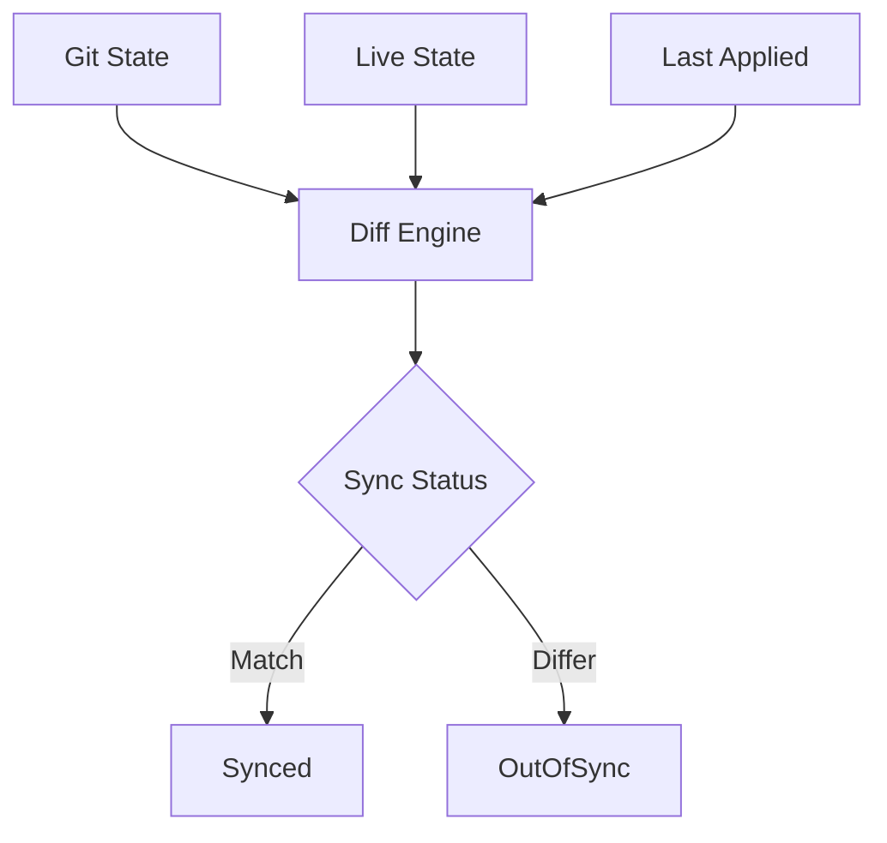

# How to Customize Diffs in ArgoCD

Author: [nawazdhandala](https://www.github.com/nawazdhandala)

Tags: ArgoCD, Diff, Kubernetes, GitOps, Configuration, Sync

Description: Learn how to customize ArgoCD diff behavior to handle dynamic fields, operator-managed resources, and legitimate differences between Git and cluster state.

---

ArgoCD shows your application as OutOfSync even though nothing has changed. The culprit is usually dynamic fields that Kubernetes modifies at runtime. Timestamps, generated values, operator-managed fields - they all create noise in your diffs. This guide shows you how to tell ArgoCD what to ignore.

## Understanding ArgoCD Diffs

ArgoCD compares three states to determine sync status:



If there are differences, the app shows as OutOfSync. But some differences are expected and should be ignored.

## Ignoring Differences

### Application-Level Configuration

Add ignoreDifferences to your Application:

```yaml
apiVersion: argoproj.io/v1alpha1
kind: Application
metadata:
  name: myapp
spec:
  ignoreDifferences:
    # Ignore replicas on all Deployments
    - group: apps
      kind: Deployment
      jsonPointers:
        - /spec/replicas
    # Ignore specific Deployment's annotation
    - group: apps
      kind: Deployment
      name: myapp
      jsonPointers:
        - /metadata/annotations/deployment.kubernetes.io~1revision
```

### JSON Pointers

Use JSON pointers to specify exact fields:

```yaml
ignoreDifferences:
  # Ignore a nested field
  - group: apps
    kind: Deployment
    jsonPointers:
      - /spec/template/metadata/annotations/checksum~1config
  # Ignore array element
  - group: ""
    kind: Service
    jsonPointers:
      - /spec/ports/0/nodePort
```

Note: Special characters in JSON pointers:
- `~0` represents `~`
- `~1` represents `/`

### JQ Path Expressions

For more complex matching, use JQ expressions:

```yaml
ignoreDifferences:
  # Ignore any container's resource limits
  - group: apps
    kind: Deployment
    jqPathExpressions:
      - '.spec.template.spec.containers[].resources.limits'
  # Ignore specific annotation pattern
  - group: apps
    kind: Deployment
    jqPathExpressions:
      - '.metadata.annotations | to_entries | map(select(.key | startswith("helm.sh/")))'
```

### Managed Fields Managers

Ignore fields managed by specific controllers:

```yaml
ignoreDifferences:
  # Ignore fields managed by HPA
  - group: apps
    kind: Deployment
    managedFieldsManagers:
      - kube-controller-manager
  # Ignore fields managed by cert-manager
  - group: admissionregistration.k8s.io
    kind: MutatingWebhookConfiguration
    managedFieldsManagers:
      - cert-manager-cainjector
```

## Common Scenarios

### HPA-Managed Replicas

When using HorizontalPodAutoscaler, replica count changes frequently:

```yaml
apiVersion: argoproj.io/v1alpha1
kind: Application
metadata:
  name: myapp
spec:
  ignoreDifferences:
    - group: apps
      kind: Deployment
      jsonPointers:
        - /spec/replicas
```

Or remove replicas from your Git manifest entirely.

### Service ClusterIP

Kubernetes auto-assigns ClusterIP:

```yaml
ignoreDifferences:
  - group: ""
    kind: Service
    jsonPointers:
      - /spec/clusterIP
      - /spec/clusterIPs
```

### Webhook CA Bundles

Cert-manager injects CA bundles into webhooks:

```yaml
ignoreDifferences:
  - group: admissionregistration.k8s.io
    kind: MutatingWebhookConfiguration
    jsonPointers:
      - /webhooks/0/clientConfig/caBundle
      - /webhooks/1/clientConfig/caBundle
  - group: admissionregistration.k8s.io
    kind: ValidatingWebhookConfiguration
    jsonPointers:
      - /webhooks/0/clientConfig/caBundle
```

### Helm Release Metadata

Helm adds metadata that changes on each sync:

```yaml
ignoreDifferences:
  - group: "*"
    kind: "*"
    jsonPointers:
      - /metadata/annotations/meta.helm.sh~1release-name
      - /metadata/annotations/meta.helm.sh~1release-namespace
    jqPathExpressions:
      - '.metadata.labels | select(. != null) | with_entries(select(.key | startswith("app.kubernetes.io/")))'
```

### Operator-Managed Status

Operators update status fields continuously:

```yaml
ignoreDifferences:
  - group: myoperator.io
    kind: MyResource
    jsonPointers:
      - /status
```

### Generated Names

Resources with generateName have unpredictable names:

```yaml
ignoreDifferences:
  - group: ""
    kind: Secret
    name: myapp-token-*
    jsonPointers:
      - /data
```

### Kustomize Annotations

Kustomize adds hashes for change detection:

```yaml
ignoreDifferences:
  - group: "*"
    kind: "*"
    jqPathExpressions:
      - '.metadata.annotations | to_entries | map(select(.key | contains("kustomize")))'
```

## System-Level Configuration

Configure ignore rules for all applications in the ArgoCD ConfigMap:

```yaml
apiVersion: v1
kind: ConfigMap
metadata:
  name: argocd-cm
  namespace: argocd
data:
  resource.customizations.ignoreDifferences.all: |
    managedFieldsManagers:
      - kube-controller-manager
      - kube-scheduler
    jsonPointers:
      - /status

  resource.customizations.ignoreDifferences.apps_Deployment: |
    jsonPointers:
      - /spec/replicas

  resource.customizations.ignoreDifferences.admissionregistration.k8s.io_MutatingWebhookConfiguration: |
    jqPathExpressions:
      - '.webhooks[]?.clientConfig.caBundle'
```

## Diffing Customizations

### Comparison Options

```yaml
apiVersion: v1
kind: ConfigMap
metadata:
  name: argocd-cm
  namespace: argocd
data:
  # Ignore aggregated ClusterRoles
  resource.compareoptions: |
    ignoreAggregatedRoles: true

  # Ignore resource status for all resources
  resource.customizations.ignoreResourceUpdates.all: |
    jsonPointers:
      - /status
```

### Respect Resource Policies

Control what happens during sync:

```yaml
apiVersion: argoproj.io/v1alpha1
kind: Application
metadata:
  name: myapp
spec:
  syncPolicy:
    syncOptions:
      # Respect ignore annotations on resources
      - RespectIgnoreDifferences=true
```

Add annotations to specific resources:

```yaml
apiVersion: v1
kind: ConfigMap
metadata:
  name: myconfig
  annotations:
    # Ignore this specific field during diff
    argocd.argoproj.io/compare-options: IgnoreExtraneous
```

## Debugging Diffs

### View Current Diff

```bash
# Using CLI
argocd app diff myapp

# Detailed diff
argocd app diff myapp --local ./k8s
```

### Understanding Diff Output

```bash
===== apps/Deployment myapp/myapp ======
--- live
+++ desired
@@ -15,7 +15,7 @@
 spec:
-  replicas: 5
+  replicas: 3
```

This shows:
- Resource type and name
- What is live vs desired
- Specific field differences

### Test ignoreDifferences

```bash
# Apply and check if diff disappears
kubectl apply -f application.yaml
argocd app diff myapp
```

## Best Practices

### Document Why Fields Are Ignored

```yaml
apiVersion: argoproj.io/v1alpha1
kind: Application
metadata:
  name: myapp
  annotations:
    # Document ignore reasons
    diff-ignore-docs: |
      /spec/replicas: Managed by HPA
      /metadata/annotations/checksum: Generated by Helm
spec:
  ignoreDifferences:
    - group: apps
      kind: Deployment
      jsonPointers:
        - /spec/replicas
```

### Use System-Level for Common Patterns

Put frequently ignored differences in argocd-cm:

```yaml
# argocd-cm
data:
  resource.customizations.ignoreDifferences.all: |
    jsonPointers:
      - /metadata/annotations/kubectl.kubernetes.io~1last-applied-configuration
```

### Be Specific

Avoid overly broad ignore rules:

```yaml
# Bad: Ignores all changes to all Deployments
ignoreDifferences:
  - group: apps
    kind: Deployment
    jsonPointers:
      - /spec

# Good: Only ignores specific field
ignoreDifferences:
  - group: apps
    kind: Deployment
    jsonPointers:
      - /spec/replicas
```

### Test Before Production

```bash
# Verify ignore rules work
argocd app diff myapp --ignore-normalizer-jq '.metadata.annotations'
```

## Troubleshooting

### OutOfSync Despite ignoreDifferences

```bash
# Check if the field path is correct
kubectl get deployment myapp -o jsonpath='{.spec.replicas}'

# Verify JSON pointer syntax
# Remember: ~1 for /, ~0 for ~
```

### Diff Shows Unexpected Fields

```bash
# See all differences including ignored
argocd app diff myapp --show-ignored-fields
```

### JQ Expression Not Working

Test JQ expressions locally:

```bash
kubectl get deployment myapp -o json | jq '.spec.template.spec.containers[].resources'
```

Diff customization is about reducing noise while maintaining visibility into real changes. Start by identifying what causes false OutOfSync status, add specific ignore rules, and document why each rule exists. The goal is meaningful diffs that highlight actual configuration changes.
