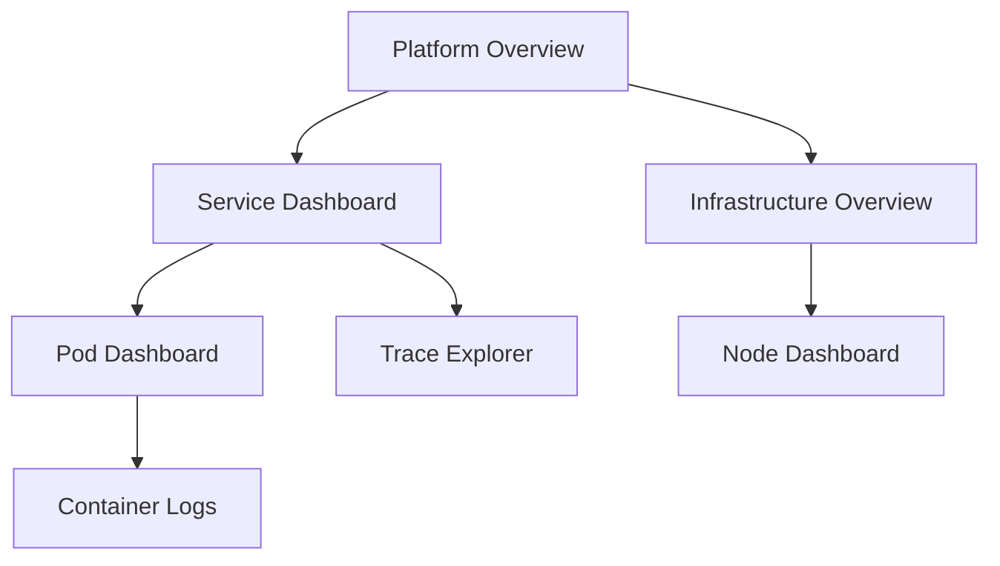

# How to Configure Dashboard Links in Grafana

Author: [nawazdhandala](https://www.github.com/nawazdhandala)

Tags: Grafana, Dashboard Links, Navigation, Monitoring, Observability, User Experience

Description: A practical guide to setting up dashboard links, panel links, and data links in Grafana to create intuitive navigation between related monitoring views.

---

## Why Dashboard Links Matter

Dashboards rarely exist in isolation. Your API overview dashboard connects to individual service dashboards, which link to infrastructure views. Without proper linking, users waste time hunting for related information during incidents when every second counts.

Grafana provides three types of links:

- **Dashboard links**: Navigation elements that appear at the top of a dashboard
- **Panel links**: Links attached to specific panels, visible in the panel header
- **Data links**: Context-aware links generated from data points in your visualizations

Each serves different navigation needs. Let's explore how to configure them effectively.

## Dashboard Links

Dashboard links appear in the top-right corner of your dashboard, providing quick navigation to related views.

### Adding a Dashboard Link

Open your dashboard settings (gear icon) and navigate to the "Links" section.

Click "Add dashboard link" and configure:

```yaml
Type: dashboards
Title: Related Services
Tags: [api, backend]
Include current time range: true
Include current template variable values: true
Open in new tab: false
```

This creates a dropdown containing all dashboards tagged with "api" or "backend." The time range and variable settings ensure context carries over when users navigate.

### Static URL Links

For links to external systems or specific dashboards, use URL links:

```yaml
Type: link
Title: Runbook
URL: https://wiki.example.com/runbooks/api-service
Icon: doc
Tooltip: Open runbook documentation
Open in new tab: true
```

You can include dashboard variables in the URL:

```yaml
URL: https://wiki.example.com/runbooks/${service}
```

If your dashboard has a `service` variable set to "payments," the link resolves to `https://wiki.example.com/runbooks/payments`.

### Dynamic Dashboard Links with Tags

Tag-based links scale better than hardcoded lists. When you create a new service dashboard and tag it appropriately, it automatically appears in related dashboard links.

```yaml
# Tag strategy for automatic linking
Dashboard: API Gateway Overview
Tags: [api, gateway, tier-1]

Dashboard: Payment Service
Tags: [api, payments, tier-1]

Dashboard: User Service
Tags: [api, users, tier-2]
```

A dashboard link filtering by tag "api" shows all three dashboards in its dropdown.

## Panel Links

Panel links attach to individual panels, making them context-specific.

### Adding Panel Links

Edit your panel, then navigate to the "Panel links" section under "Panel options."

```yaml
Title: View Detailed Metrics
URL: /d/abc123/service-details?var-service=${__field.labels.service}
```

The link appears as an icon in the panel header. Users click to navigate while keeping context from the current view.

### Using Field Variables in Panel Links

Panel links can reference data from your queries using field variables:

```yaml
# Available field variables
${__field.name}          # Field name
${__field.labels}        # All labels as JSON
${__field.labels.X}      # Specific label value
${__value.time}          # Timestamp of the data point
${__value.numeric}       # Numeric value
${__value.text}          # String value
```

Example linking to logs filtered by the selected service:

```yaml
Title: View Logs
URL: /explore?left={"queries":[{"expr":"{service=\"${__field.labels.service}\"}"}]}
```

## Data Links

Data links are the most powerful linking mechanism. They generate links from actual data points, enabling drill-down from visualizations to detailed views.

### Configuring Data Links

In the panel editor, find "Data links" under field overrides or the panel's field configuration.

```yaml
Title: Drill down to traces
URL: /explore?left={"queries":[{"query":"${__data.fields.traceID}","queryType":"traceql"}]}
```

When users click a data point, Grafana substitutes the actual value from that point into the URL.

### Data Link Variables

Data links support these variables:

```yaml
${__data.fields.fieldName}     # Value of a specific field
${__data.fields[0]}            # Value of first field
${__series.name}               # Series name
${__value.raw}                 # Raw value at click point
${__value.numeric}             # Numeric value
${__value.time}                # Unix timestamp
${__value.text}                # Formatted text value
```

### Practical Example: Metrics to Traces

Connect your metrics dashboard to trace exploration:

```yaml
# Panel showing request latency
Query: histogram_quantile(0.99, rate(http_duration_seconds_bucket{service="$service"}[5m]))

# Data link configuration
Title: Find slow traces
URL: /explore?orgId=1&left={"datasource":"tempo","queries":[{"query":"{service.name=\"${__field.labels.service}\"} | duration > 500ms"}],"range":{"from":"${__value.time:date:iso}","to":"now"}}
```

Clicking a spike in latency opens Tempo with a query for slow traces from that service around the time of the spike.

## Building Navigation Hierarchies

Well-designed dashboards create clear navigation paths.

### Overview to Detail Pattern



### Implementing the Hierarchy

**Platform Overview Dashboard:**

```yaml
Dashboard Links:
  - Title: Services
    Type: dashboards
    Tags: [service]

  - Title: Infrastructure
    Type: link
    URL: /d/infra-overview
```

**Service Dashboard:**

```yaml
Dashboard Links:
  - Title: Back to Overview
    Type: link
    URL: /d/platform-overview?var-service=${service}

Panel Links on Pod Table:
  - Title: Pod Details
    URL: /d/pod-dashboard?var-pod=${__data.fields.pod}&var-namespace=${__data.fields.namespace}
```

## Variable Passthrough

Maintaining context across linked dashboards requires careful variable handling.

### Time Range Preservation

Enable "Include current time range" on dashboard links, or manually construct URLs:

```yaml
URL: /d/target-dashboard?from=${__from}&to=${__to}
```

### Template Variable Passthrough

For template variables, enable "Include current template variable values" or specify explicitly:

```yaml
URL: /d/target-dashboard?var-environment=${environment}&var-service=${service}
```

### Handling Multi-Value Variables

When a variable can have multiple values, format them appropriately:

```yaml
# For variables with multiple selections
URL: /d/target-dashboard?var-service=${service:csv}

# Available formats:
${variable:csv}     # value1,value2,value3
${variable:pipe}    # value1|value2|value3
${variable:json}    # ["value1","value2","value3"]
```

## External System Integration

Dashboard links can connect Grafana to your broader tooling ecosystem.

### Linking to Incident Management

```yaml
Title: Create Incident
URL: https://oneuptime.com/incidents/new?service=${service}&severity=${__value.numeric > 0.99 ? "critical" : "warning"}
Icon: bell
```

### Linking to Code Repositories

```yaml
Title: View Source
URL: https://github.com/org/${service}/tree/main
Icon: github
```

### Linking to Runbooks

```yaml
Title: Runbook
URL: https://wiki.example.com/runbooks/${service}/${__field.labels.alert_name}
Icon: book
```

## Conditional Links with Transformations

Sometimes you need links that only appear under certain conditions.

### Using Overrides for Conditional Data Links

```yaml
Field Override:
  Matcher: Field name = status
  Properties:
    - Data links:
        - Title: View Error Details
          URL: /d/errors?error_code=${__value.text}
          # Only meaningful when status indicates an error
```

### Separate Panels for Different Link Needs

When conditional logic gets complex, consider separate panels:

```yaml
# Panel 1: Success metrics with links to performance analysis
# Panel 2: Error metrics with links to error investigation
```

## Link Validation and Testing

Before deploying dashboards, verify your links work correctly.

### Manual Testing Checklist

```markdown
- [ ] Click each dashboard link and verify destination loads
- [ ] Check time range carries over correctly
- [ ] Verify variable values pass through
- [ ] Test data links on multiple data points
- [ ] Confirm external links open in correct tab
- [ ] Test with different variable selections
```

### Common Link Issues

**Variables not resolving:**
- Check variable name matches exactly (case-sensitive)
- Ensure the variable exists on the source dashboard

**Time range not preserved:**
- Enable "Include current time range" in dashboard link settings
- Use `${__from}` and `${__to}` in URL links

**Links broken after dashboard changes:**
- Use dashboard UIDs instead of slugs for stability
- Update links when dashboards are renamed or moved

## Best Practices

### Consistency

Use the same link patterns across all dashboards. If service dashboards always link back to the overview with a specific icon, users learn to expect it.

### Discoverability

Place the most important links in dashboard links (always visible). Use panel links for context-specific navigation. Reserve data links for drill-down scenarios.

### Performance

Avoid dashboard links that query for tags if you have thousands of dashboards. Use explicit URL links for critical navigation paths.

### Documentation

Add tooltips to links explaining their purpose:

```yaml
Tooltip: Navigate to the trace explorer filtered by this service and time range
```

## Conclusion

Effective dashboard linking transforms a collection of dashboards into a coherent monitoring system. Start with the overview-to-detail pattern, use variables to maintain context, and leverage data links for powerful drill-down capabilities. Your users will spend less time navigating and more time understanding what your systems are telling them.
