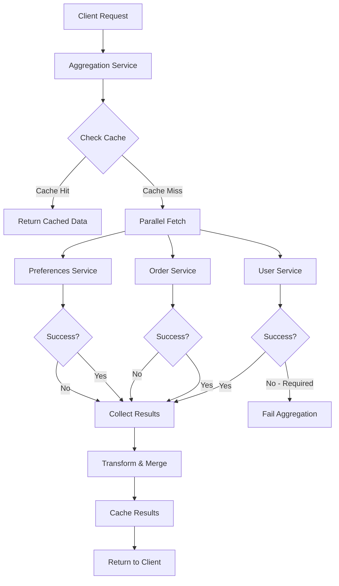

# How to Build a Data Aggregation Service in Node.js

Author: [nawazdhandala](https://www.github.com/nawazdhandala)

Tags: NodeJS, TypeScript, Data Processing, API, Microservices

Description: Learn how to build a data aggregation service in Node.js that collects data from multiple sources, transforms it, and presents unified results with caching, error handling, and parallel processing.

---

Modern applications often need to combine data from multiple sources: databases, REST APIs, message queues, and third-party services. A data aggregation service centralizes this complexity, providing a single interface for clients while handling the messy details of parallel fetching, error handling, and caching.

## Why Build an Aggregation Layer

Without aggregation, clients make multiple calls and handle merging themselves. This leads to:

| Problem | Impact |
|---------|--------|
| Multiple round trips | Higher latency |
| Duplicated logic | Inconsistent behavior |
| Tight coupling | Hard to change backends |
| Error handling complexity | Poor UX when one source fails |

An aggregation service solves these by providing a unified API that fetches from all sources in parallel and returns combined results.

## Core Aggregator Structure

The aggregator manages data sources and coordinates fetching. Each source is a plugin that knows how to fetch and transform its data.

```typescript
// DataAggregator.ts
// Core aggregator that coordinates multiple data sources

export interface DataSource<T> {
  name: string;
  fetch(params: Record<string, any>): Promise<T>;
  transform?(data: T): any;
  required?: boolean; // If true, aggregation fails if this source fails
}

export interface AggregationResult<T> {
  data: T;
  sources: {
    name: string;
    success: boolean;
    duration: number;
    error?: string;
  }[];
  totalDuration: number;
}

export class DataAggregator<T extends Record<string, any>> {
  private sources: Map<string, DataSource<any>> = new Map();
  private cache: Map<string, { data: any; expiry: number }> = new Map();
  private defaultCacheTtl: number = 60000;

  // Register a data source
  addSource<K extends keyof T>(name: K, source: DataSource<T[K]>): this {
    this.sources.set(name as string, source);
    return this;
  }

  // Remove a data source
  removeSource(name: keyof T): this {
    this.sources.delete(name as string);
    return this;
  }

  // Fetch from all sources in parallel
  async aggregate(
    params: Record<string, any> = {},
    options: { timeout?: number; useCache?: boolean } = {}
  ): Promise<AggregationResult<Partial<T>>> {
    const startTime = Date.now();
    const { timeout = 5000, useCache = true } = options;

    const results: Partial<T> = {};
    const sourceResults: AggregationResult<T>['sources'] = [];

    // Create fetch promises for all sources
    const fetchPromises = Array.from(this.sources.entries()).map(
      async ([name, source]) => {
        const sourceStartTime = Date.now();

        try {
          // Check cache first
          if (useCache) {
            const cached = this.getFromCache(name, params);
            if (cached !== undefined) {
              return {
                name,
                data: cached,
                success: true,
                duration: Date.now() - sourceStartTime,
                fromCache: true,
              };
            }
          }

          // Fetch with timeout
          const data = await this.fetchWithTimeout(source, params, timeout);

          // Transform if transformer is provided
          const transformed = source.transform ? source.transform(data) : data;

          // Cache the result
          if (useCache) {
            this.setCache(name, params, transformed);
          }

          return {
            name,
            data: transformed,
            success: true,
            duration: Date.now() - sourceStartTime,
            fromCache: false,
          };
        } catch (error) {
          const errorMessage = error instanceof Error ? error.message : 'Unknown error';

          // If source is required, throw immediately
          if (source.required) {
            throw new Error(`Required source '${name}' failed: ${errorMessage}`);
          }

          return {
            name,
            data: null,
            success: false,
            duration: Date.now() - sourceStartTime,
            error: errorMessage,
          };
        }
      }
    );

    // Wait for all sources to complete
    const fetchResults = await Promise.all(fetchPromises);

    // Combine results
    for (const result of fetchResults) {
      sourceResults.push({
        name: result.name,
        success: result.success,
        duration: result.duration,
        error: result.error,
      });

      if (result.success && result.data !== null) {
        (results as any)[result.name] = result.data;
      }
    }

    return {
      data: results,
      sources: sourceResults,
      totalDuration: Date.now() - startTime,
    };
  }

  // Fetch with timeout wrapper
  private async fetchWithTimeout<R>(
    source: DataSource<R>,
    params: Record<string, any>,
    timeout: number
  ): Promise<R> {
    return new Promise((resolve, reject) => {
      const timeoutId = setTimeout(() => {
        reject(new Error(`Timeout after ${timeout}ms`));
      }, timeout);

      source
        .fetch(params)
        .then((data) => {
          clearTimeout(timeoutId);
          resolve(data);
        })
        .catch((error) => {
          clearTimeout(timeoutId);
          reject(error);
        });
    });
  }

  // Cache helpers
  private getCacheKey(name: string, params: Record<string, any>): string {
    return `${name}:${JSON.stringify(params)}`;
  }

  private getFromCache(name: string, params: Record<string, any>): any | undefined {
    const key = this.getCacheKey(name, params);
    const entry = this.cache.get(key);

    if (entry && entry.expiry > Date.now()) {
      return entry.data;
    }

    return undefined;
  }

  private setCache(name: string, params: Record<string, any>, data: any): void {
    const key = this.getCacheKey(name, params);
    this.cache.set(key, {
      data,
      expiry: Date.now() + this.defaultCacheTtl,
    });
  }

  clearCache(): void {
    this.cache.clear();
  }
}
```

## Creating Data Sources

Each data source encapsulates fetching and transforming data from one backend.

```typescript
// sources/UserSource.ts
// Fetches user data from the user service

import { DataSource } from '../DataAggregator';

interface User {
  id: string;
  name: string;
  email: string;
  department: string;
}

export class UserSource implements DataSource<User> {
  name = 'user';
  required = true; // Aggregation fails without user data

  private baseUrl: string;

  constructor(baseUrl: string) {
    this.baseUrl = baseUrl;
  }

  async fetch(params: { userId: string }): Promise<User> {
    const response = await fetch(`${this.baseUrl}/users/${params.userId}`);

    if (!response.ok) {
      throw new Error(`User service returned ${response.status}`);
    }

    return response.json();
  }

  // Optionally transform the data
  transform(user: User): User {
    return {
      ...user,
      // Normalize email to lowercase
      email: user.email.toLowerCase(),
    };
  }
}
```

```typescript
// sources/OrdersSource.ts
// Fetches order history from the order service

import { DataSource } from '../DataAggregator';

interface Order {
  id: string;
  total: number;
  status: string;
  createdAt: string;
}

interface OrdersSummary {
  orders: Order[];
  totalSpent: number;
  orderCount: number;
}

export class OrdersSource implements DataSource<Order[]> {
  name = 'orders';
  required = false; // Aggregation continues without order data

  private baseUrl: string;

  constructor(baseUrl: string) {
    this.baseUrl = baseUrl;
  }

  async fetch(params: { userId: string }): Promise<Order[]> {
    const response = await fetch(
      `${this.baseUrl}/orders?userId=${params.userId}`
    );

    if (!response.ok) {
      throw new Error(`Order service returned ${response.status}`);
    }

    return response.json();
  }

  // Transform into a summary
  transform(orders: Order[]): OrdersSummary {
    return {
      orders: orders.slice(0, 10), // Latest 10 orders
      totalSpent: orders.reduce((sum, order) => sum + order.total, 0),
      orderCount: orders.length,
    };
  }
}
```

```typescript
// sources/PreferencesSource.ts
// Fetches user preferences from a different service

import { DataSource } from '../DataAggregator';

interface Preferences {
  theme: string;
  notifications: boolean;
  language: string;
}

export class PreferencesSource implements DataSource<Preferences> {
  name = 'preferences';
  required = false;

  private baseUrl: string;

  constructor(baseUrl: string) {
    this.baseUrl = baseUrl;
  }

  async fetch(params: { userId: string }): Promise<Preferences> {
    const response = await fetch(
      `${this.baseUrl}/preferences/${params.userId}`
    );

    if (!response.ok) {
      // Return defaults if preferences not found
      if (response.status === 404) {
        return { theme: 'light', notifications: true, language: 'en' };
      }
      throw new Error(`Preferences service returned ${response.status}`);
    }

    return response.json();
  }
}
```

## Aggregation Flow



## Building the User Profile Aggregator

Here is a complete example combining user data from multiple sources.

```typescript
// UserProfileAggregator.ts
// Combines user, orders, and preferences into a single profile

import { DataAggregator } from './DataAggregator';
import { UserSource } from './sources/UserSource';
import { OrdersSource } from './sources/OrdersSource';
import { PreferencesSource } from './sources/PreferencesSource';

// Define the aggregated profile shape
interface UserProfile {
  user: {
    id: string;
    name: string;
    email: string;
    department: string;
  };
  orders: {
    orders: any[];
    totalSpent: number;
    orderCount: number;
  };
  preferences: {
    theme: string;
    notifications: boolean;
    language: string;
  };
}

export class UserProfileAggregator {
  private aggregator: DataAggregator<UserProfile>;

  constructor(config: {
    userServiceUrl: string;
    orderServiceUrl: string;
    preferencesServiceUrl: string;
  }) {
    this.aggregator = new DataAggregator<UserProfile>();

    // Register all sources
    this.aggregator
      .addSource('user', new UserSource(config.userServiceUrl))
      .addSource('orders', new OrdersSource(config.orderServiceUrl))
      .addSource('preferences', new PreferencesSource(config.preferencesServiceUrl));
  }

  async getProfile(userId: string): Promise<UserProfile> {
    const result = await this.aggregator.aggregate(
      { userId },
      { timeout: 3000, useCache: true }
    );

    // Log source performance
    for (const source of result.sources) {
      console.log(
        `Source ${source.name}: ${source.success ? 'OK' : 'FAILED'} in ${source.duration}ms`
      );
    }

    // Fill in defaults for missing data
    return {
      user: result.data.user!,
      orders: result.data.orders || { orders: [], totalSpent: 0, orderCount: 0 },
      preferences: result.data.preferences || {
        theme: 'light',
        notifications: true,
        language: 'en',
      },
    };
  }

  clearCache(): void {
    this.aggregator.clearCache();
  }
}
```

## Adding Database Sources

Not all data comes from APIs. Here is a source that queries a database.

```typescript
// sources/ActivitySource.ts
// Fetches recent activity from the database

import { DataSource } from '../DataAggregator';
import { Pool } from 'pg';

interface Activity {
  id: string;
  type: string;
  description: string;
  createdAt: Date;
}

export class ActivitySource implements DataSource<Activity[]> {
  name = 'activity';
  required = false;

  private pool: Pool;

  constructor(pool: Pool) {
    this.pool = pool;
  }

  async fetch(params: { userId: string }): Promise<Activity[]> {
    const query = `
      SELECT id, type, description, created_at as "createdAt"
      FROM user_activity
      WHERE user_id = $1
      ORDER BY created_at DESC
      LIMIT 20
    `;

    const result = await this.pool.query(query, [params.userId]);
    return result.rows;
  }

  transform(activities: Activity[]): { recent: Activity[]; types: string[] } {
    const types = [...new Set(activities.map((a) => a.type))];
    return {
      recent: activities.slice(0, 5),
      types,
    };
  }
}
```

## Batch Aggregation

When you need to aggregate data for multiple entities, batch processing is more efficient.

```typescript
// BatchAggregator.ts
// Aggregates data for multiple entities efficiently

interface BatchResult<T> {
  results: Map<string, T>;
  errors: Map<string, Error>;
  duration: number;
}

export class BatchAggregator<T> {
  private aggregator: DataAggregator<T>;
  private concurrency: number;

  constructor(aggregator: DataAggregator<T>, concurrency: number = 5) {
    this.aggregator = aggregator;
    this.concurrency = concurrency;
  }

  async aggregateMany(
    ids: string[],
    paramBuilder: (id: string) => Record<string, any>
  ): Promise<BatchResult<Partial<T>>> {
    const startTime = Date.now();
    const results = new Map<string, Partial<T>>();
    const errors = new Map<string, Error>();

    // Process in batches to limit concurrency
    for (let i = 0; i < ids.length; i += this.concurrency) {
      const batch = ids.slice(i, i + this.concurrency);

      const batchResults = await Promise.allSettled(
        batch.map(async (id) => {
          const params = paramBuilder(id);
          const result = await this.aggregator.aggregate(params);
          return { id, data: result.data };
        })
      );

      for (const result of batchResults) {
        if (result.status === 'fulfilled') {
          results.set(result.value.id, result.value.data);
        } else {
          const id = batch[batchResults.indexOf(result)];
          errors.set(id, result.reason);
        }
      }
    }

    return {
      results,
      errors,
      duration: Date.now() - startTime,
    };
  }
}

// Usage
const batchAggregator = new BatchAggregator(profileAggregator.aggregator, 10);

const userIds = ['user1', 'user2', 'user3', 'user4', 'user5'];
const batchResult = await batchAggregator.aggregateMany(
  userIds,
  (id) => ({ userId: id })
);

console.log(`Processed ${batchResult.results.size} users in ${batchResult.duration}ms`);
```

## Express Integration

Here is how to expose the aggregator as a REST endpoint.

```typescript
// server.ts
import express from 'express';
import { Pool } from 'pg';
import { UserProfileAggregator } from './UserProfileAggregator';
import { DataAggregator } from './DataAggregator';
import { ActivitySource } from './sources/ActivitySource';

const app = express();

// Initialize database pool
const pool = new Pool({
  host: process.env.DB_HOST,
  database: process.env.DB_NAME,
  user: process.env.DB_USER,
  password: process.env.DB_PASSWORD,
});

// Initialize aggregator
const profileAggregator = new UserProfileAggregator({
  userServiceUrl: process.env.USER_SERVICE_URL || 'http://localhost:3001',
  orderServiceUrl: process.env.ORDER_SERVICE_URL || 'http://localhost:3002',
  preferencesServiceUrl: process.env.PREFS_SERVICE_URL || 'http://localhost:3003',
});

// Extended aggregator with database source
const extendedAggregator = new DataAggregator()
  .addSource('activity', new ActivitySource(pool));

// Endpoint: Get user profile
app.get('/api/users/:userId/profile', async (req, res) => {
  try {
    const profile = await profileAggregator.getProfile(req.params.userId);
    res.json(profile);
  } catch (error) {
    console.error('Profile aggregation failed:', error);
    res.status(500).json({ error: 'Failed to fetch user profile' });
  }
});

// Endpoint: Get user activity separately
app.get('/api/users/:userId/activity', async (req, res) => {
  try {
    const result = await extendedAggregator.aggregate(
      { userId: req.params.userId },
      { timeout: 2000 }
    );
    res.json(result.data.activity || []);
  } catch (error) {
    console.error('Activity aggregation failed:', error);
    res.status(500).json({ error: 'Failed to fetch activity' });
  }
});

// Endpoint: Clear cache (admin only)
app.post('/api/admin/cache/clear', (req, res) => {
  profileAggregator.clearCache();
  extendedAggregator.clearCache();
  res.json({ message: 'Cache cleared' });
});

// Health check that verifies sources
app.get('/health', async (req, res) => {
  try {
    // Quick aggregation with short timeout to test sources
    const result = await profileAggregator.getProfile('health-check-user');
    const failedSources = result.sources?.filter((s) => !s.success) || [];

    if (failedSources.length > 0) {
      res.status(503).json({
        status: 'degraded',
        failedSources: failedSources.map((s) => s.name),
      });
    } else {
      res.json({ status: 'healthy' });
    }
  } catch (error) {
    res.status(503).json({ status: 'unhealthy', error: 'Required source failed' });
  }
});

app.listen(3000, () => {
  console.log('Aggregation service running on port 3000');
});
```

## Streaming Large Results

For large datasets, streaming prevents memory issues.

```typescript
// StreamingAggregator.ts
// Streams results as they become available

import { Readable } from 'stream';
import { DataSource } from './DataAggregator';

export class StreamingAggregator {
  private sources: DataSource<any>[] = [];

  addSource(source: DataSource<any>): this {
    this.sources.push(source);
    return this;
  }

  // Returns a readable stream that emits results as they arrive
  stream(params: Record<string, any>): Readable {
    const sources = this.sources;
    let completed = 0;

    const readable = new Readable({
      objectMode: true,
      read() {},
    });

    // Start all fetches immediately
    for (const source of sources) {
      source
        .fetch(params)
        .then((data) => {
          const transformed = source.transform ? source.transform(data) : data;
          readable.push({
            source: source.name,
            data: transformed,
            success: true,
          });
        })
        .catch((error) => {
          readable.push({
            source: source.name,
            data: null,
            success: false,
            error: error.message,
          });
        })
        .finally(() => {
          completed++;
          if (completed === sources.length) {
            readable.push(null); // End the stream
          }
        });
    }

    return readable;
  }
}

// Usage with Express
app.get('/api/users/:userId/profile/stream', (req, res) => {
  const stream = streamingAggregator.stream({ userId: req.params.userId });

  res.setHeader('Content-Type', 'application/x-ndjson');

  stream.on('data', (chunk) => {
    res.write(JSON.stringify(chunk) + '\n');
  });

  stream.on('end', () => {
    res.end();
  });
});
```

## Summary

| Component | Purpose | Key Benefit |
|-----------|---------|-------------|
| DataAggregator | Coordinate sources | Single entry point |
| DataSource | Encapsulate backends | Pluggable architecture |
| Caching | Reduce load | Faster responses |
| Batch Processing | Multiple entities | Efficient bulk operations |
| Streaming | Large datasets | Memory efficient |

A data aggregation service simplifies client code and improves performance by fetching from multiple sources in parallel. With proper caching, error handling, and fallbacks, it provides a resilient layer between your clients and backend services.
