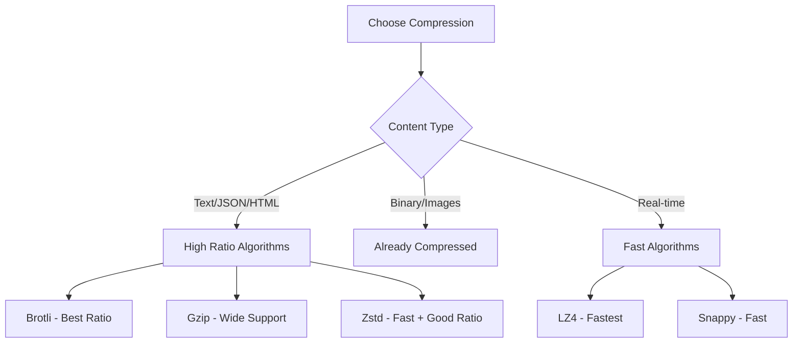

# How to Implement Data Compression Strategies

Author: [nawazdhandala](https://www.github.com/nawazdhandala)

Tags: Compression, Performance, Gzip, Brotli, Network Optimization, API, Backend

Description: Learn how to implement data compression strategies to reduce bandwidth and improve transfer speeds. This guide covers HTTP compression, application-level compression, and choosing the right algorithm for your use case.

---

> Data compression can reduce transfer sizes by 70-90%, resulting in faster page loads and lower bandwidth costs. A 1MB JSON response compressed with Brotli becomes ~100KB. This guide shows you how to implement compression effectively across different layers of your application.

Compression trades CPU cycles for bandwidth. With modern hardware and efficient algorithms, this trade-off is almost always worthwhile for text-based content.

---

## Compression Algorithms Comparison



| Algorithm | Compression Ratio | Speed | Best For |
|-----------|------------------|-------|----------|
| Brotli | Best (highest) | Slow | Static assets, CDN |
| Gzip | Good | Medium | HTTP responses, general |
| Zstd | Very Good | Fast | Logs, databases |
| LZ4 | Low | Fastest | Real-time data |
| Snappy | Low | Very Fast | Streaming, Kafka |

---

## HTTP Compression

### Python Flask with Compression

```python
# flask_compression.py
from flask import Flask, request, Response
from flask_compress import Compress
import gzip
import brotli
import json

app = Flask(__name__)

# Configure compression
app.config['COMPRESS_MIMETYPES'] = [
    'text/html', 'text/css', 'text/xml', 'text/javascript',
    'application/json', 'application/javascript', 'application/xml'
]
app.config['COMPRESS_LEVEL'] = 6  # 1-9, higher = better compression, slower
app.config['COMPRESS_MIN_SIZE'] = 500  # Don't compress tiny responses
app.config['COMPRESS_ALGORITHM'] = ['br', 'gzip']  # Prefer Brotli

Compress(app)

# Manual compression for specific endpoints
@app.route('/api/large-data')
def large_data():
    data = get_large_dataset()  # Returns dict
    json_data = json.dumps(data)

    # Check client's accepted encodings
    accept_encoding = request.headers.get('Accept-Encoding', '')

    if 'br' in accept_encoding:
        compressed = brotli.compress(json_data.encode('utf-8'))
        return Response(
            compressed,
            content_type='application/json',
            headers={'Content-Encoding': 'br'}
        )
    elif 'gzip' in accept_encoding:
        compressed = gzip.compress(json_data.encode('utf-8'))
        return Response(
            compressed,
            content_type='application/json',
            headers={'Content-Encoding': 'gzip'}
        )
    else:
        return Response(json_data, content_type='application/json')
```

### Express.js Compression Middleware

```javascript
// express-compression.js
const express = require('express');
const compression = require('compression');
const zlib = require('zlib');

const app = express();

// Configure compression middleware
app.use(compression({
  // Compression level (0-9)
  level: 6,

  // Minimum size to compress
  threshold: 1024,  // 1KB

  // Filter function
  filter: (req, res) => {
    // Don't compress if client doesn't accept it
    if (req.headers['x-no-compression']) {
      return false;
    }
    // Use default filter
    return compression.filter(req, res);
  },

  // Use Brotli when supported
  brotli: {
    enabled: true,
    zlib: {
      params: {
        [zlib.constants.BROTLI_PARAM_QUALITY]: 4,  // 0-11
      }
    }
  }
}));

// API endpoint with large response
app.get('/api/products', async (req, res) => {
  const products = await getProducts();  // Large array
  res.json(products);  // Automatically compressed
});

// Custom compression for specific route
app.get('/api/export', async (req, res) => {
  const data = await getExportData();
  const jsonString = JSON.stringify(data);

  // Manual Brotli compression for maximum ratio
  const compressed = zlib.brotliCompressSync(Buffer.from(jsonString), {
    params: {
      [zlib.constants.BROTLI_PARAM_QUALITY]: 11,  // Maximum compression
    }
  });

  res.set({
    'Content-Type': 'application/json',
    'Content-Encoding': 'br',
    'Content-Length': compressed.length,
  });
  res.send(compressed);
});

app.listen(3000);
```

### Go HTTP Compression

```go
// http_compression.go
package main

import (
    "compress/gzip"
    "io"
    "net/http"
    "strings"

    "github.com/andybalholm/brotli"
)

// CompressionMiddleware adds gzip/brotli compression
func CompressionMiddleware(next http.Handler) http.Handler {
    return http.HandlerFunc(func(w http.ResponseWriter, r *http.Request) {
        acceptEncoding := r.Header.Get("Accept-Encoding")

        // Check for Brotli support
        if strings.Contains(acceptEncoding, "br") {
            w.Header().Set("Content-Encoding", "br")
            bw := brotli.NewWriter(w)
            defer bw.Close()
            next.ServeHTTP(&compressedResponseWriter{w, bw}, r)
            return
        }

        // Fall back to gzip
        if strings.Contains(acceptEncoding, "gzip") {
            w.Header().Set("Content-Encoding", "gzip")
            gw := gzip.NewWriter(w)
            defer gw.Close()
            next.ServeHTTP(&compressedResponseWriter{w, gw}, r)
            return
        }

        // No compression
        next.ServeHTTP(w, r)
    })
}

type compressedResponseWriter struct {
    http.ResponseWriter
    Writer io.Writer
}

func (crw *compressedResponseWriter) Write(b []byte) (int, error) {
    return crw.Writer.Write(b)
}

func main() {
    handler := http.HandlerFunc(func(w http.ResponseWriter, r *http.Request) {
        w.Header().Set("Content-Type", "application/json")
        w.Write([]byte(`{"message": "Hello, compressed world!"}`))
    })

    http.Handle("/", CompressionMiddleware(handler))
    http.ListenAndServe(":8080", nil)
}
```

---

## Application-Level Compression

### Compressing Data for Storage

```python
# storage_compression.py
import zlib
import lz4.frame
import zstandard as zstd
import json
from typing import Any, Tuple
import time

class CompressionHelper:
    """Helper for compressing data for storage"""

    @staticmethod
    def compress_gzip(data: bytes, level: int = 6) -> bytes:
        """Gzip compression (good compatibility)"""
        return zlib.compress(data, level)

    @staticmethod
    def decompress_gzip(data: bytes) -> bytes:
        """Gzip decompression"""
        return zlib.decompress(data)

    @staticmethod
    def compress_lz4(data: bytes) -> bytes:
        """LZ4 compression (fastest)"""
        return lz4.frame.compress(data)

    @staticmethod
    def decompress_lz4(data: bytes) -> bytes:
        """LZ4 decompression"""
        return lz4.frame.decompress(data)

    @staticmethod
    def compress_zstd(data: bytes, level: int = 3) -> bytes:
        """Zstandard compression (good balance)"""
        cctx = zstd.ZstdCompressor(level=level)
        return cctx.compress(data)

    @staticmethod
    def decompress_zstd(data: bytes) -> bytes:
        """Zstandard decompression"""
        dctx = zstd.ZstdDecompressor()
        return dctx.decompress(data)


def benchmark_compression(data: bytes) -> dict:
    """Benchmark different compression algorithms"""
    results = {}

    algorithms = [
        ('gzip-1', lambda d: zlib.compress(d, 1)),
        ('gzip-6', lambda d: zlib.compress(d, 6)),
        ('gzip-9', lambda d: zlib.compress(d, 9)),
        ('lz4', lz4.frame.compress),
        ('zstd-1', lambda d: zstd.ZstdCompressor(level=1).compress(d)),
        ('zstd-3', lambda d: zstd.ZstdCompressor(level=3).compress(d)),
        ('zstd-9', lambda d: zstd.ZstdCompressor(level=9).compress(d)),
    ]

    original_size = len(data)

    for name, compress_fn in algorithms:
        start = time.perf_counter()
        compressed = compress_fn(data)
        duration = time.perf_counter() - start

        results[name] = {
            'compressed_size': len(compressed),
            'ratio': len(compressed) / original_size,
            'compression_time_ms': duration * 1000,
            'throughput_mbps': (original_size / (1024 * 1024)) / duration
        }

    return results


# Usage
data = json.dumps({"users": [{"id": i, "name": f"User {i}"} for i in range(10000)]}).encode()
results = benchmark_compression(data)

for name, stats in results.items():
    print(f"{name}: {stats['ratio']:.2%} ratio, {stats['throughput_mbps']:.1f} MB/s")
```

### Streaming Compression for Large Files

```python
# streaming_compression.py
import gzip
import zstandard as zstd
from typing import Iterator, BinaryIO
import io

class StreamingCompressor:
    """Compress large files/streams without loading into memory"""

    def __init__(self, algorithm: str = 'zstd', level: int = 3):
        self.algorithm = algorithm
        self.level = level

    def compress_file(self, input_path: str, output_path: str,
                      chunk_size: int = 64 * 1024):
        """Compress a file using streaming"""
        if self.algorithm == 'gzip':
            with open(input_path, 'rb') as fin:
                with gzip.open(output_path, 'wb', compresslevel=self.level) as fout:
                    while chunk := fin.read(chunk_size):
                        fout.write(chunk)

        elif self.algorithm == 'zstd':
            cctx = zstd.ZstdCompressor(level=self.level)
            with open(input_path, 'rb') as fin:
                with open(output_path, 'wb') as fout:
                    cctx.copy_stream(fin, fout)

    def compress_stream(self, input_stream: BinaryIO,
                        chunk_size: int = 64 * 1024) -> Iterator[bytes]:
        """Compress a stream, yielding compressed chunks"""
        if self.algorithm == 'zstd':
            cctx = zstd.ZstdCompressor(level=self.level)
            compressor = cctx.compressobj()

            while chunk := input_stream.read(chunk_size):
                compressed = compressor.compress(chunk)
                if compressed:
                    yield compressed

            # Flush remaining data
            remaining = compressor.flush()
            if remaining:
                yield remaining

    def decompress_stream(self, input_stream: BinaryIO,
                          chunk_size: int = 64 * 1024) -> Iterator[bytes]:
        """Decompress a stream, yielding decompressed chunks"""
        if self.algorithm == 'zstd':
            dctx = zstd.ZstdDecompressor()

            with dctx.stream_reader(input_stream) as reader:
                while chunk := reader.read(chunk_size):
                    yield chunk


# Usage for HTTP streaming response
from flask import Response

@app.route('/api/large-export')
def large_export():
    def generate():
        compressor = StreamingCompressor('zstd', level=3)
        data_stream = get_large_data_stream()  # Generator

        buffer = io.BytesIO()
        for item in data_stream:
            buffer.write(json.dumps(item).encode() + b'\n')

            # Compress in chunks
            if buffer.tell() > 64 * 1024:
                buffer.seek(0)
                for chunk in compressor.compress_stream(buffer):
                    yield chunk
                buffer = io.BytesIO()

        # Final chunk
        if buffer.tell() > 0:
            buffer.seek(0)
            for chunk in compressor.compress_stream(buffer):
                yield chunk

    return Response(
        generate(),
        headers={
            'Content-Encoding': 'zstd',
            'Content-Type': 'application/x-ndjson'
        }
    )
```

---

## Database Compression

### PostgreSQL Table Compression

```sql
-- PostgreSQL TOAST compression (automatic for large values)
-- Values > 2KB are automatically compressed

-- Check compression stats
SELECT
    relname,
    pg_size_pretty(pg_relation_size(oid)) as table_size,
    pg_size_pretty(pg_relation_size(reltoastrelid)) as toast_size
FROM pg_class
WHERE relname = 'my_table';

-- Create table with specific storage options
CREATE TABLE logs (
    id SERIAL PRIMARY KEY,
    timestamp TIMESTAMPTZ,
    message TEXT,
    metadata JSONB
);

-- Force external storage (always compress large values)
ALTER TABLE logs ALTER COLUMN message SET STORAGE EXTERNAL;
ALTER TABLE logs ALTER COLUMN metadata SET STORAGE EXTENDED;

-- Use TimescaleDB for automatic compression (time-series data)
-- SELECT add_compression_policy('logs', INTERVAL '7 days');
```

### Redis Compression

```python
# redis_compression.py
import redis
import zlib
import json
from typing import Any, Optional

class CompressedRedis:
    """Redis client with automatic compression"""

    def __init__(self, redis_url: str, compress_threshold: int = 1024):
        self.redis = redis.from_url(redis_url)
        self.threshold = compress_threshold
        self.prefix_compressed = b'\x00ZLIB\x00'

    def set(self, key: str, value: Any, ex: int = None) -> bool:
        """Set value with automatic compression for large values"""
        serialized = json.dumps(value).encode('utf-8')

        if len(serialized) > self.threshold:
            compressed = self.prefix_compressed + zlib.compress(serialized, 6)
            return self.redis.set(key, compressed, ex=ex)
        else:
            return self.redis.set(key, serialized, ex=ex)

    def get(self, key: str) -> Optional[Any]:
        """Get value with automatic decompression"""
        data = self.redis.get(key)

        if data is None:
            return None

        # Check if compressed
        if data.startswith(self.prefix_compressed):
            decompressed = zlib.decompress(data[len(self.prefix_compressed):])
            return json.loads(decompressed)
        else:
            return json.loads(data)

    def get_compression_stats(self, key: str) -> dict:
        """Get compression statistics for a key"""
        data = self.redis.get(key)
        if data is None:
            return {'exists': False}

        is_compressed = data.startswith(self.prefix_compressed)
        stored_size = len(data)

        if is_compressed:
            decompressed = zlib.decompress(data[len(self.prefix_compressed):])
            original_size = len(decompressed)
        else:
            original_size = stored_size

        return {
            'exists': True,
            'compressed': is_compressed,
            'stored_size': stored_size,
            'original_size': original_size,
            'ratio': stored_size / original_size if is_compressed else 1.0
        }


# Usage
cache = CompressedRedis("redis://localhost:6379", compress_threshold=500)

# Small value - stored as-is
cache.set("small", {"id": 1, "name": "test"})

# Large value - automatically compressed
large_data = {"items": [{"id": i, "data": "x" * 100} for i in range(1000)]}
cache.set("large", large_data, ex=3600)

# Check compression
print(cache.get_compression_stats("small"))
# {'exists': True, 'compressed': False, 'stored_size': 24, ...}

print(cache.get_compression_stats("large"))
# {'exists': True, 'compressed': True, 'stored_size': 5432, 'original_size': 125000, 'ratio': 0.043}
```

---

## Message Queue Compression

### Kafka Message Compression

```python
# kafka_compression.py
from confluent_kafka import Producer, Consumer
import json

# Producer with compression
producer_config = {
    'bootstrap.servers': 'localhost:9092',
    'compression.type': 'snappy',  # Options: none, gzip, snappy, lz4, zstd
    'compression.level': 3,  # For zstd
    'batch.size': 16384,  # Larger batches = better compression
    'linger.ms': 5,  # Wait for batch to fill
}

producer = Producer(producer_config)

def send_message(topic: str, message: dict):
    """Send compressed message to Kafka"""
    value = json.dumps(message).encode('utf-8')
    producer.produce(topic, value=value)
    producer.flush()

# Consumer (decompression is automatic)
consumer_config = {
    'bootstrap.servers': 'localhost:9092',
    'group.id': 'my-group',
    'auto.offset.reset': 'earliest',
}

consumer = Consumer(consumer_config)
consumer.subscribe(['my-topic'])

# Messages are automatically decompressed
msg = consumer.poll(1.0)
if msg:
    value = json.loads(msg.value().decode('utf-8'))
```

---

## Best Practices Summary

| Use Case | Recommended Algorithm | Level |
|----------|---------------------|-------|
| HTTP responses | Brotli or Gzip | 4-6 |
| Static assets (CDN) | Brotli | 11 |
| Real-time data | LZ4 or Snappy | - |
| Log storage | Zstd | 3-6 |
| Database backups | Zstd | 9-12 |
| Kafka messages | Snappy or LZ4 | - |

---

## Conclusion

Data compression is a straightforward way to improve performance:

1. **Enable HTTP compression**: Brotli for browsers, Gzip for APIs
2. **Choose the right algorithm**: Balance ratio vs speed for your use case
3. **Compress at the right layer**: HTTP middleware, application, or storage
4. **Set minimum thresholds**: Do not compress tiny payloads
5. **Monitor compression ratios**: Track savings and CPU impact

Most text-based content compresses to 10-30% of original size with minimal CPU overhead using modern algorithms.

---

*Need to monitor your API performance? [OneUptime](https://oneuptime.com) provides response size tracking, compression ratio monitoring, and bandwidth analytics.*
