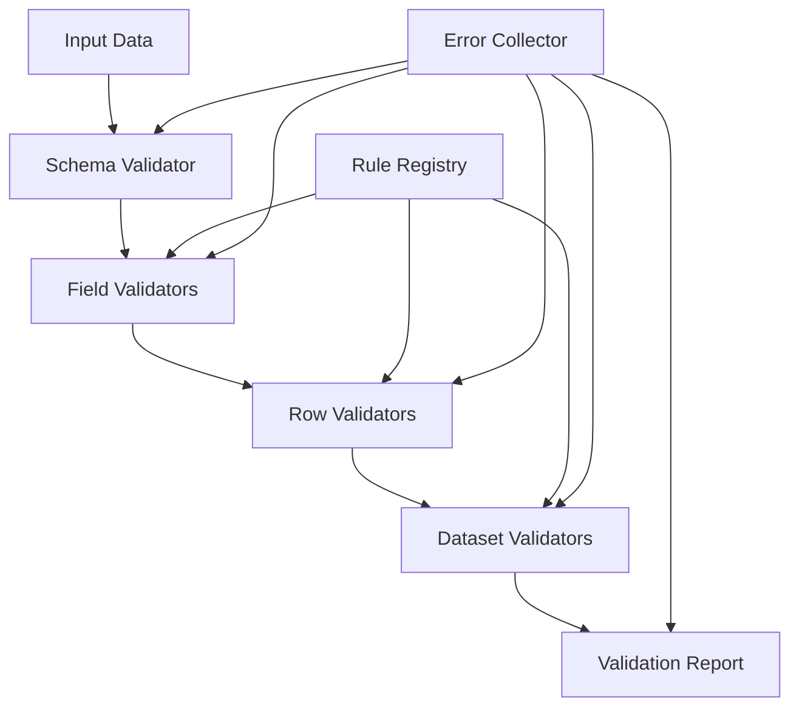

# How to Build a Data Validation Framework in Python

Author: [nawazdhandala](https://www.github.com/nawazdhandala)

Tags: Python, Data Validation, Framework Design, Pydantic, Pandas, ETL, Data Quality

Description: Learn how to build a flexible data validation framework in Python that handles schema validation, business rules, and data quality checks. This guide covers validation pipelines, custom rules, and reporting patterns.

---

> Data validation is one of those tasks that starts simple and grows complex quickly. You begin with checking that fields are not null, then add format validation, then business rules, then cross-field validation, and suddenly you have validation logic scattered across your codebase. A proper validation framework brings order to this chaos.

The goal of a validation framework is to make validation rules declarative, composable, and testable. Instead of writing ad-hoc validation code, you define rules that can be combined, reused, and applied consistently.

---

## Framework Architecture

A well-designed validation framework has several key components:



The framework validates data at multiple levels: individual fields, rows (cross-field), and the entire dataset (aggregate rules). All errors are collected and reported together.

---

## Core Framework Classes

Let's start with the foundational classes that define validation rules and results.

```python
# core.py
# Core validation framework classes
from abc import ABC, abstractmethod
from dataclasses import dataclass, field
from enum import Enum
from typing import (
    Any, Dict, List, Optional, Callable, TypeVar, Generic, Union
)
from datetime import datetime

class Severity(Enum):
    """Severity levels for validation errors"""
    ERROR = "error"      # Data is invalid, must be fixed
    WARNING = "warning"  # Data is suspicious, should be reviewed
    INFO = "info"        # Informational, no action needed

@dataclass
class ValidationError:
    """Represents a single validation failure"""
    rule_name: str           # Name of the rule that failed
    field: Optional[str]     # Field that failed (if field-level)
    message: str             # Human-readable error message
    severity: Severity       # How serious is this error
    row_index: Optional[int] = None  # Row number (if applicable)
    value: Optional[Any] = None      # The invalid value
    context: Dict[str, Any] = field(default_factory=dict)  # Additional context

@dataclass
class ValidationResult:
    """Result of validating data"""
    is_valid: bool
    errors: List[ValidationError]
    warnings: List[ValidationError]
    info: List[ValidationError]
    validated_at: datetime = field(default_factory=datetime.utcnow)
    metadata: Dict[str, Any] = field(default_factory=dict)

    @classmethod
    def success(cls) -> 'ValidationResult':
        """Create a successful validation result"""
        return cls(is_valid=True, errors=[], warnings=[], info=[])

    @classmethod
    def failure(cls, errors: List[ValidationError]) -> 'ValidationResult':
        """Create a failed validation result"""
        return cls(
            is_valid=False,
            errors=[e for e in errors if e.severity == Severity.ERROR],
            warnings=[e for e in errors if e.severity == Severity.WARNING],
            info=[e for e in errors if e.severity == Severity.INFO]
        )

    def merge(self, other: 'ValidationResult') -> 'ValidationResult':
        """Combine two validation results"""
        return ValidationResult(
            is_valid=self.is_valid and other.is_valid,
            errors=self.errors + other.errors,
            warnings=self.warnings + other.warnings,
            info=self.info + other.info,
            metadata={**self.metadata, **other.metadata}
        )

    def to_dict(self) -> Dict[str, Any]:
        """Convert to dictionary for serialization"""
        return {
            'is_valid': self.is_valid,
            'error_count': len(self.errors),
            'warning_count': len(self.warnings),
            'errors': [
                {
                    'rule': e.rule_name,
                    'field': e.field,
                    'message': e.message,
                    'row': e.row_index,
                    'value': str(e.value) if e.value else None
                }
                for e in self.errors
            ],
            'warnings': [
                {
                    'rule': e.rule_name,
                    'field': e.field,
                    'message': e.message
                }
                for e in self.warnings
            ],
            'validated_at': self.validated_at.isoformat()
        }


class ValidationRule(ABC):
    """Base class for all validation rules"""

    def __init__(
        self,
        name: str,
        severity: Severity = Severity.ERROR,
        message: Optional[str] = None
    ):
        self.name = name
        self.severity = severity
        self._message = message

    @abstractmethod
    def validate(self, value: Any, context: Dict[str, Any] = None) -> Optional[ValidationError]:
        """
        Validate a value and return an error if invalid.
        Returns None if validation passes.
        """
        pass

    def create_error(
        self,
        message: str,
        field: str = None,
        value: Any = None,
        row_index: int = None,
        context: Dict[str, Any] = None
    ) -> ValidationError:
        """Helper to create a validation error"""
        return ValidationError(
            rule_name=self.name,
            field=field,
            message=self._message or message,
            severity=self.severity,
            row_index=row_index,
            value=value,
            context=context or {}
        )
```

---

## Built-in Field Validators

Common field validators that handle typical validation needs.

```python
# validators/field_validators.py
# Built-in field-level validation rules
import re
from typing import Any, Dict, Optional, List, Pattern, Union
from datetime import datetime, date
from core import ValidationRule, ValidationError, Severity

class Required(ValidationRule):
    """Ensure field has a value"""

    def __init__(self, severity: Severity = Severity.ERROR):
        super().__init__("required", severity)

    def validate(self, value: Any, context: Dict[str, Any] = None) -> Optional[ValidationError]:
        if value is None or (isinstance(value, str) and not value.strip()):
            return self.create_error("Field is required", value=value)
        return None

class TypeCheck(ValidationRule):
    """Validate that value is of expected type"""

    def __init__(self, expected_type: type, severity: Severity = Severity.ERROR):
        super().__init__(f"type_check_{expected_type.__name__}", severity)
        self.expected_type = expected_type

    def validate(self, value: Any, context: Dict[str, Any] = None) -> Optional[ValidationError]:
        if value is None:
            return None  # Let Required handle None values

        if not isinstance(value, self.expected_type):
            return self.create_error(
                f"Expected {self.expected_type.__name__}, got {type(value).__name__}",
                value=value
            )
        return None

class Range(ValidationRule):
    """Validate that numeric value is within range"""

    def __init__(
        self,
        min_value: Optional[float] = None,
        max_value: Optional[float] = None,
        severity: Severity = Severity.ERROR
    ):
        super().__init__("range", severity)
        self.min_value = min_value
        self.max_value = max_value

    def validate(self, value: Any, context: Dict[str, Any] = None) -> Optional[ValidationError]:
        if value is None:
            return None

        try:
            num_value = float(value)
        except (TypeError, ValueError):
            return self.create_error(f"Cannot convert to number: {value}", value=value)

        if self.min_value is not None and num_value < self.min_value:
            return self.create_error(
                f"Value {num_value} is below minimum {self.min_value}",
                value=value
            )

        if self.max_value is not None and num_value > self.max_value:
            return self.create_error(
                f"Value {num_value} exceeds maximum {self.max_value}",
                value=value
            )

        return None

class Pattern(ValidationRule):
    """Validate that string matches a regex pattern"""

    def __init__(
        self,
        pattern: Union[str, Pattern],
        severity: Severity = Severity.ERROR,
        message: str = None
    ):
        super().__init__("pattern", severity, message)
        self.pattern = re.compile(pattern) if isinstance(pattern, str) else pattern

    def validate(self, value: Any, context: Dict[str, Any] = None) -> Optional[ValidationError]:
        if value is None:
            return None

        if not isinstance(value, str):
            value = str(value)

        if not self.pattern.match(value):
            return self.create_error(
                f"Value does not match expected pattern",
                value=value
            )
        return None

class OneOf(ValidationRule):
    """Validate that value is one of allowed values"""

    def __init__(
        self,
        allowed_values: List[Any],
        severity: Severity = Severity.ERROR,
        case_sensitive: bool = True
    ):
        super().__init__("one_of", severity)
        self.case_sensitive = case_sensitive

        if case_sensitive:
            self.allowed_values = set(allowed_values)
        else:
            self.allowed_values = {str(v).lower() for v in allowed_values}

    def validate(self, value: Any, context: Dict[str, Any] = None) -> Optional[ValidationError]:
        if value is None:
            return None

        check_value = value if self.case_sensitive else str(value).lower()

        if check_value not in self.allowed_values:
            return self.create_error(
                f"Value must be one of: {list(self.allowed_values)[:5]}...",
                value=value
            )
        return None

class Email(ValidationRule):
    """Validate email format"""

    EMAIL_PATTERN = re.compile(
        r'^[a-zA-Z0-9._%+-]+@[a-zA-Z0-9.-]+\.[a-zA-Z]{2,}$'
    )

    def __init__(self, severity: Severity = Severity.ERROR):
        super().__init__("email", severity)

    def validate(self, value: Any, context: Dict[str, Any] = None) -> Optional[ValidationError]:
        if value is None:
            return None

        if not self.EMAIL_PATTERN.match(str(value)):
            return self.create_error("Invalid email format", value=value)
        return None

class DateFormat(ValidationRule):
    """Validate date string format"""

    def __init__(
        self,
        format: str = "%Y-%m-%d",
        severity: Severity = Severity.ERROR
    ):
        super().__init__("date_format", severity)
        self.format = format

    def validate(self, value: Any, context: Dict[str, Any] = None) -> Optional[ValidationError]:
        if value is None:
            return None

        if isinstance(value, (date, datetime)):
            return None  # Already a date object

        try:
            datetime.strptime(str(value), self.format)
            return None
        except ValueError:
            return self.create_error(
                f"Invalid date format, expected {self.format}",
                value=value
            )

class StringLength(ValidationRule):
    """Validate string length"""

    def __init__(
        self,
        min_length: Optional[int] = None,
        max_length: Optional[int] = None,
        severity: Severity = Severity.ERROR
    ):
        super().__init__("string_length", severity)
        self.min_length = min_length
        self.max_length = max_length

    def validate(self, value: Any, context: Dict[str, Any] = None) -> Optional[ValidationError]:
        if value is None:
            return None

        length = len(str(value))

        if self.min_length is not None and length < self.min_length:
            return self.create_error(
                f"String too short (min {self.min_length} chars)",
                value=value
            )

        if self.max_length is not None and length > self.max_length:
            return self.create_error(
                f"String too long (max {self.max_length} chars)",
                value=value
            )

        return None
```

---

## Row and Dataset Validators

Validators that work on entire rows or datasets for cross-field and aggregate validation.

```python
# validators/row_validators.py
# Row-level and dataset-level validation rules
from typing import Any, Dict, Optional, List, Callable
from core import ValidationRule, ValidationError, Severity
from datetime import datetime

class RowValidator(ValidationRule):
    """Base class for row-level validation"""

    def validate_row(
        self,
        row: Dict[str, Any],
        row_index: int
    ) -> Optional[ValidationError]:
        """Validate an entire row"""
        raise NotImplementedError

class CrossFieldComparison(RowValidator):
    """Compare two fields in the same row"""

    def __init__(
        self,
        field1: str,
        field2: str,
        comparator: str,  # 'lt', 'le', 'gt', 'ge', 'eq', 'ne'
        severity: Severity = Severity.ERROR
    ):
        super().__init__(f"cross_field_{field1}_{comparator}_{field2}", severity)
        self.field1 = field1
        self.field2 = field2
        self.comparator = comparator

        self.comparators = {
            'lt': lambda a, b: a < b,
            'le': lambda a, b: a <= b,
            'gt': lambda a, b: a > b,
            'ge': lambda a, b: a >= b,
            'eq': lambda a, b: a == b,
            'ne': lambda a, b: a != b
        }

    def validate(self, value: Any, context: Dict[str, Any] = None) -> Optional[ValidationError]:
        # Not used for row validators
        return None

    def validate_row(
        self,
        row: Dict[str, Any],
        row_index: int
    ) -> Optional[ValidationError]:
        value1 = row.get(self.field1)
        value2 = row.get(self.field2)

        if value1 is None or value2 is None:
            return None  # Let field validators handle missing values

        compare_fn = self.comparators[self.comparator]

        if not compare_fn(value1, value2):
            return self.create_error(
                f"{self.field1} must be {self.comparator} {self.field2}",
                row_index=row_index,
                context={'field1': self.field1, 'field2': self.field2}
            )

        return None

class ConditionalRequired(RowValidator):
    """Field is required based on another field's value"""

    def __init__(
        self,
        field: str,
        condition_field: str,
        condition_value: Any,
        severity: Severity = Severity.ERROR
    ):
        super().__init__(f"conditional_required_{field}", severity)
        self.field = field
        self.condition_field = condition_field
        self.condition_value = condition_value

    def validate(self, value: Any, context: Dict[str, Any] = None) -> Optional[ValidationError]:
        return None

    def validate_row(
        self,
        row: Dict[str, Any],
        row_index: int
    ) -> Optional[ValidationError]:
        condition_met = row.get(self.condition_field) == self.condition_value

        if condition_met:
            value = row.get(self.field)
            if value is None or (isinstance(value, str) and not value.strip()):
                return self.create_error(
                    f"{self.field} is required when {self.condition_field} is {self.condition_value}",
                    field=self.field,
                    row_index=row_index
                )

        return None

class CustomRowValidator(RowValidator):
    """Custom row validation with a function"""

    def __init__(
        self,
        name: str,
        validate_fn: Callable[[Dict[str, Any]], bool],
        message: str,
        severity: Severity = Severity.ERROR
    ):
        super().__init__(name, severity, message)
        self.validate_fn = validate_fn

    def validate(self, value: Any, context: Dict[str, Any] = None) -> Optional[ValidationError]:
        return None

    def validate_row(
        self,
        row: Dict[str, Any],
        row_index: int
    ) -> Optional[ValidationError]:
        if not self.validate_fn(row):
            return self.create_error(self._message, row_index=row_index)
        return None


class DatasetValidator(ValidationRule):
    """Base class for dataset-level validation"""

    def validate_dataset(
        self,
        data: List[Dict[str, Any]]
    ) -> List[ValidationError]:
        """Validate the entire dataset"""
        raise NotImplementedError

class UniqueConstraint(DatasetValidator):
    """Ensure a field (or combination) is unique across dataset"""

    def __init__(
        self,
        fields: List[str],
        severity: Severity = Severity.ERROR
    ):
        field_names = "_".join(fields)
        super().__init__(f"unique_{field_names}", severity)
        self.fields = fields

    def validate(self, value: Any, context: Dict[str, Any] = None) -> Optional[ValidationError]:
        return None

    def validate_dataset(
        self,
        data: List[Dict[str, Any]]
    ) -> List[ValidationError]:
        errors = []
        seen = {}  # Track where we first saw each value

        for i, row in enumerate(data):
            # Create key from field values
            key_parts = [str(row.get(f, '')) for f in self.fields]
            key = tuple(key_parts)

            if key in seen:
                errors.append(self.create_error(
                    f"Duplicate value for {self.fields}: {key}",
                    row_index=i,
                    context={'first_occurrence': seen[key], 'fields': self.fields}
                ))
            else:
                seen[key] = i

        return errors

class AggregateCheck(DatasetValidator):
    """Validate aggregate properties of dataset"""

    def __init__(
        self,
        name: str,
        check_fn: Callable[[List[Dict[str, Any]]], bool],
        message: str,
        severity: Severity = Severity.ERROR
    ):
        super().__init__(name, severity, message)
        self.check_fn = check_fn

    def validate(self, value: Any, context: Dict[str, Any] = None) -> Optional[ValidationError]:
        return None

    def validate_dataset(
        self,
        data: List[Dict[str, Any]]
    ) -> List[ValidationError]:
        if not self.check_fn(data):
            return [self.create_error(self._message)]
        return []
```

---

## Schema Definition

Define validation schemas declaratively.

```python
# schema.py
# Schema definition and validation orchestration
from typing import Dict, List, Any, Optional, Type
from dataclasses import dataclass, field
from core import (
    ValidationRule, ValidationResult, ValidationError, Severity
)
from validators.field_validators import Required
from validators.row_validators import RowValidator, DatasetValidator

@dataclass
class FieldSchema:
    """Schema definition for a single field"""
    name: str
    validators: List[ValidationRule] = field(default_factory=list)
    required: bool = False

    def __post_init__(self):
        if self.required:
            # Add Required validator at the beginning
            self.validators.insert(0, Required())

@dataclass
class DataSchema:
    """Complete schema for validating data"""
    name: str
    fields: Dict[str, FieldSchema] = field(default_factory=dict)
    row_validators: List[RowValidator] = field(default_factory=list)
    dataset_validators: List[DatasetValidator] = field(default_factory=list)
    allow_extra_fields: bool = True

    def add_field(
        self,
        name: str,
        *validators: ValidationRule,
        required: bool = False
    ) -> 'DataSchema':
        """Add a field with validators"""
        self.fields[name] = FieldSchema(
            name=name,
            validators=list(validators),
            required=required
        )
        return self

    def add_row_validator(self, validator: RowValidator) -> 'DataSchema':
        """Add a row-level validator"""
        self.row_validators.append(validator)
        return self

    def add_dataset_validator(self, validator: DatasetValidator) -> 'DataSchema':
        """Add a dataset-level validator"""
        self.dataset_validators.append(validator)
        return self


class Validator:
    """Main validator class that applies schema to data"""

    def __init__(self, schema: DataSchema):
        self.schema = schema

    def validate(self, data: List[Dict[str, Any]]) -> ValidationResult:
        """
        Validate a list of records against the schema.
        Returns a ValidationResult with all errors.
        """
        all_errors: List[ValidationError] = []

        # Validate each row
        for row_index, row in enumerate(data):
            # Check for extra fields
            if not self.schema.allow_extra_fields:
                extra = set(row.keys()) - set(self.schema.fields.keys())
                if extra:
                    all_errors.append(ValidationError(
                        rule_name="no_extra_fields",
                        field=None,
                        message=f"Unexpected fields: {extra}",
                        severity=Severity.ERROR,
                        row_index=row_index
                    ))

            # Field-level validation
            for field_name, field_schema in self.schema.fields.items():
                value = row.get(field_name)

                for validator in field_schema.validators:
                    error = validator.validate(value)
                    if error:
                        error.field = field_name
                        error.row_index = row_index
                        error.value = value
                        all_errors.append(error)

            # Row-level validation
            for validator in self.schema.row_validators:
                error = validator.validate_row(row, row_index)
                if error:
                    all_errors.append(error)

        # Dataset-level validation
        for validator in self.schema.dataset_validators:
            errors = validator.validate_dataset(data)
            all_errors.extend(errors)

        # Create result
        if any(e.severity == Severity.ERROR for e in all_errors):
            return ValidationResult.failure(all_errors)
        else:
            result = ValidationResult.success()
            result.warnings = [e for e in all_errors if e.severity == Severity.WARNING]
            result.info = [e for e in all_errors if e.severity == Severity.INFO]
            return result

    def validate_single(self, record: Dict[str, Any]) -> ValidationResult:
        """Validate a single record"""
        return self.validate([record])
```

---

## Putting It Together

Here is a complete example showing how to define a schema and validate data.

```python
# example_usage.py
# Complete example of using the validation framework
from schema import DataSchema, Validator
from validators.field_validators import (
    Required, TypeCheck, Range, Pattern, OneOf, Email, DateFormat, StringLength
)
from validators.row_validators import (
    CrossFieldComparison, ConditionalRequired, CustomRowValidator,
    UniqueConstraint, AggregateCheck
)
from core import Severity

# Define a schema for order data
order_schema = DataSchema(name="orders")

# Add field validators
order_schema.add_field(
    "order_id",
    Pattern(r'^ORD-\d{8}$'),  # Format: ORD-12345678
    required=True
)

order_schema.add_field(
    "customer_email",
    Email(),
    required=True
)

order_schema.add_field(
    "order_date",
    DateFormat("%Y-%m-%d"),
    required=True
)

order_schema.add_field(
    "ship_date",
    DateFormat("%Y-%m-%d")
    # Not required - can be None for pending orders
)

order_schema.add_field(
    "status",
    OneOf(["pending", "shipped", "delivered", "cancelled"], case_sensitive=False),
    required=True
)

order_schema.add_field(
    "total_amount",
    TypeCheck(float),
    Range(min_value=0.01, max_value=100000),
    required=True
)

order_schema.add_field(
    "tracking_number",
    StringLength(min_length=10, max_length=30)
)

# Add row-level validators
order_schema.add_row_validator(
    CrossFieldComparison("order_date", "ship_date", "le")  # order_date <= ship_date
)

order_schema.add_row_validator(
    ConditionalRequired(
        field="tracking_number",
        condition_field="status",
        condition_value="shipped"
    )
)

order_schema.add_row_validator(
    ConditionalRequired(
        field="ship_date",
        condition_field="status",
        condition_value="shipped"
    )
)

# Custom business rule: cancelled orders should not have tracking
order_schema.add_row_validator(
    CustomRowValidator(
        name="cancelled_no_tracking",
        validate_fn=lambda row: not (
            row.get("status") == "cancelled" and row.get("tracking_number")
        ),
        message="Cancelled orders should not have tracking numbers",
        severity=Severity.WARNING
    )
)

# Add dataset-level validators
order_schema.add_dataset_validator(
    UniqueConstraint(["order_id"])
)

# Aggregate check: total revenue should be positive
order_schema.add_dataset_validator(
    AggregateCheck(
        name="positive_total_revenue",
        check_fn=lambda data: sum(r.get("total_amount", 0) for r in data) > 0,
        message="Total revenue across all orders should be positive"
    )
)

# Create validator
validator = Validator(order_schema)

# Sample data
orders = [
    {
        "order_id": "ORD-00000001",
        "customer_email": "alice@example.com",
        "order_date": "2026-01-15",
        "ship_date": "2026-01-17",
        "status": "shipped",
        "total_amount": 99.99,
        "tracking_number": "1Z999AA10123456784"
    },
    {
        "order_id": "ORD-00000002",
        "customer_email": "bob@example.com",
        "order_date": "2026-01-20",
        "ship_date": None,
        "status": "pending",
        "total_amount": 149.50,
        "tracking_number": None
    },
    {
        "order_id": "ORD-00000003",
        "customer_email": "invalid-email",  # Invalid email
        "order_date": "2026-01-18",
        "ship_date": "2026-01-16",  # Ship date before order date
        "status": "shipped",
        "total_amount": 75.00,
        "tracking_number": None  # Missing for shipped order
    }
]

# Validate
result = validator.validate(orders)

# Print results
print(f"Valid: {result.is_valid}")
print(f"Errors: {len(result.errors)}")
print(f"Warnings: {len(result.warnings)}")

for error in result.errors:
    print(f"  Row {error.row_index}: [{error.field}] {error.message}")
```

---

## Integration with Pandas

For data engineering workflows, integrate with Pandas DataFrames.

```python
# pandas_integration.py
# Pandas DataFrame validation support
import pandas as pd
from typing import List, Dict, Any
from schema import DataSchema, Validator
from core import ValidationResult, ValidationError

class DataFrameValidator:
    """Validator that works with Pandas DataFrames"""

    def __init__(self, schema: DataSchema):
        self.validator = Validator(schema)

    def validate(self, df: pd.DataFrame) -> ValidationResult:
        """Validate a DataFrame"""
        # Convert to list of dicts
        records = df.to_dict('records')
        return self.validator.validate(records)

    def validate_and_filter(
        self,
        df: pd.DataFrame,
        drop_invalid: bool = True
    ) -> tuple[pd.DataFrame, ValidationResult]:
        """
        Validate DataFrame and optionally remove invalid rows.
        Returns (filtered_df, validation_result)
        """
        result = self.validate(df)

        if not drop_invalid or result.is_valid:
            return df, result

        # Get indices of invalid rows
        invalid_rows = set()
        for error in result.errors:
            if error.row_index is not None:
                invalid_rows.add(error.row_index)

        # Filter out invalid rows
        valid_indices = [i for i in range(len(df)) if i not in invalid_rows]
        filtered_df = df.iloc[valid_indices].reset_index(drop=True)

        return filtered_df, result

    def add_validation_columns(self, df: pd.DataFrame) -> pd.DataFrame:
        """
        Add columns indicating validation status for each row.
        Useful for debugging and reporting.
        """
        result = self.validate(df)

        # Create validation status column
        df = df.copy()
        df['_is_valid'] = True
        df['_validation_errors'] = ''

        # Mark invalid rows
        for error in result.errors:
            if error.row_index is not None:
                df.loc[error.row_index, '_is_valid'] = False
                current = df.loc[error.row_index, '_validation_errors']
                df.loc[error.row_index, '_validation_errors'] = (
                    f"{current}; {error.message}" if current else error.message
                )

        return df


# Usage example
df = pd.DataFrame({
    'order_id': ['ORD-00000001', 'ORD-00000002', 'invalid'],
    'customer_email': ['alice@test.com', 'bob@test.com', 'not-an-email'],
    'order_date': ['2026-01-15', '2026-01-16', '2026-01-17'],
    'status': ['pending', 'shipped', 'pending'],
    'total_amount': [100.0, 200.0, -50.0]  # Negative amount is invalid
})

df_validator = DataFrameValidator(order_schema)

# Get validation result
result = df_validator.validate(df)

# Or filter and validate
clean_df, result = df_validator.validate_and_filter(df, drop_invalid=True)

# Or add validation columns for debugging
annotated_df = df_validator.add_validation_columns(df)
```

---

## Best Practices

1. **Fail fast with clear messages** - Validation errors should explain what is wrong and how to fix it
2. **Use appropriate severity levels** - Not everything is an error; warnings and info help prioritize
3. **Make rules composable** - Small, focused rules that combine well are better than monolithic validators
4. **Validate early** - Catch issues at data ingestion, not in downstream processing
5. **Keep schema definitions readable** - The schema should document your data expectations
6. **Test your validators** - Validation rules are code; they need tests too

---

## Conclusion

A data validation framework brings consistency and reliability to data processing. By separating validation logic from business logic, you make both easier to understand, test, and maintain. The framework shown here provides a foundation that you can extend based on your specific needs.

The key is treating validation as a first-class concern in your data pipelines, not an afterthought.

---

*Want to monitor data quality in your pipelines? [OneUptime](https://oneuptime.com) provides comprehensive monitoring with custom metrics for data validation success rates.*

**Related Reading:**
- [How to Create Custom Validators in Pydantic v2](https://oneuptime.com/blog/post/2026-01-25-custom-validators-pydantic-v2/view)
- [How to Build Structured Logging with Python and OpenTelemetry](https://oneuptime.com/blog/post/2025-01-06-python-structured-logging-opentelemetry/view)
