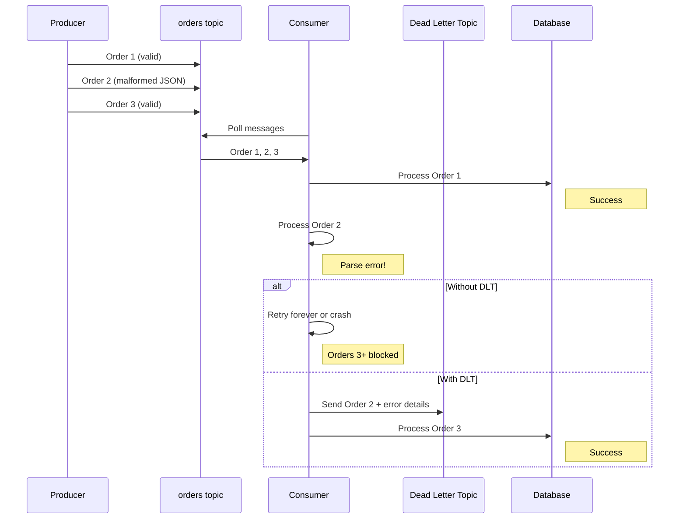

# How to Handle Failed Messages with Dead Letter Topics in Kafka

Author: [nawazdhandala](https://www.github.com/nawazdhandala)

Tags: Kafka, Dead Letter Queue, Error Handling, Reliability, Message Processing

Description: Learn how to implement dead letter topics (DLT) in Kafka to handle failed messages gracefully, including retry strategies, error tracking, and message recovery patterns for building resilient consumers.

---

When a Kafka consumer cannot process a message, you have limited options: skip it and lose data, retry forever and block the pipeline, or crash the application. Dead letter topics provide a fourth option: move the problem message aside and continue processing. This guide covers implementing robust error handling with dead letter topics.

## The Problem with Message Failures

Consider what happens when a consumer encounters a bad message:



Without a dead letter topic, one bad message can block an entire partition. With DLT, failed messages are isolated for later analysis while processing continues.

## Basic Dead Letter Topic Implementation

Here is a consumer that routes failed messages to a dead letter topic after exhausting retries.

```java
import org.apache.kafka.clients.consumer.*;
import org.apache.kafka.clients.producer.*;
import org.apache.kafka.common.header.internals.RecordHeader;
import java.nio.charset.StandardCharsets;
import java.time.Duration;
import java.util.*;

public class DeadLetterConsumer {

    private static final int MAX_RETRIES = 3;
    private static final String DLT_TOPIC = "orders.DLT";

    private final KafkaConsumer<String, String> consumer;
    private final KafkaProducer<String, String> dlqProducer;

    public DeadLetterConsumer(Properties consumerProps, Properties producerProps) {
        this.consumer = new KafkaConsumer<>(consumerProps);
        this.dlqProducer = new KafkaProducer<>(producerProps);
    }

    public void processMessages() {
        consumer.subscribe(Collections.singletonList("orders"));

        while (true) {
            ConsumerRecords<String, String> records = consumer.poll(Duration.ofMillis(100));

            for (ConsumerRecord<String, String> record : records) {
                int retryCount = 0;
                boolean processed = false;

                while (retryCount < MAX_RETRIES && !processed) {
                    try {
                        processOrder(record);
                        processed = true;
                    } catch (RetryableException e) {
                        retryCount++;
                        System.out.printf("Retry %d/%d for offset %d: %s%n",
                            retryCount, MAX_RETRIES, record.offset(), e.getMessage());

                        if (retryCount < MAX_RETRIES) {
                            sleep(calculateBackoff(retryCount));
                        }
                    } catch (NonRetryableException e) {
                        // Don't retry, send directly to DLT
                        System.err.printf("Non-retryable error at offset %d: %s%n",
                            record.offset(), e.getMessage());
                        break;
                    }
                }

                if (!processed) {
                    sendToDeadLetterTopic(record, retryCount);
                }
            }

            consumer.commitSync();
        }
    }

    private void processOrder(ConsumerRecord<String, String> record)
            throws RetryableException, NonRetryableException {

        String value = record.value();

        // Validation that might fail
        if (value == null || value.isEmpty()) {
            throw new NonRetryableException("Empty message body");
        }

        // Parse JSON (might throw on malformed input)
        Order order = parseOrder(value);

        // Database operation (might fail temporarily)
        saveToDatabase(order);
    }

    private void sendToDeadLetterTopic(ConsumerRecord<String, String> original, int retryCount) {
        // Create headers with error context
        List<Header> headers = new ArrayList<>();
        headers.add(new RecordHeader("original-topic",
            original.topic().getBytes(StandardCharsets.UTF_8)));
        headers.add(new RecordHeader("original-partition",
            String.valueOf(original.partition()).getBytes(StandardCharsets.UTF_8)));
        headers.add(new RecordHeader("original-offset",
            String.valueOf(original.offset()).getBytes(StandardCharsets.UTF_8)));
        headers.add(new RecordHeader("original-timestamp",
            String.valueOf(original.timestamp()).getBytes(StandardCharsets.UTF_8)));
        headers.add(new RecordHeader("retry-count",
            String.valueOf(retryCount).getBytes(StandardCharsets.UTF_8)));
        headers.add(new RecordHeader("failure-timestamp",
            String.valueOf(System.currentTimeMillis()).getBytes(StandardCharsets.UTF_8)));

        // Copy original headers
        original.headers().forEach(h ->
            headers.add(new RecordHeader("original-" + h.key(), h.value()))
        );

        ProducerRecord<String, String> dlqRecord = new ProducerRecord<>(
            DLT_TOPIC,
            null,                    // Partition (null = use default partitioner)
            original.key(),          // Preserve original key
            original.value(),        // Preserve original value
            headers                  // Add error context
        );

        dlqProducer.send(dlqRecord, (metadata, exception) -> {
            if (exception != null) {
                System.err.printf("Failed to send to DLT: %s%n", exception.getMessage());
                // Consider additional fallback here (local file, alert, etc.)
            } else {
                System.out.printf("Sent to DLT: partition=%d, offset=%d%n",
                    metadata.partition(), metadata.offset());
            }
        });
    }

    private long calculateBackoff(int retryCount) {
        // Exponential backoff: 100ms, 200ms, 400ms...
        return (long) (100 * Math.pow(2, retryCount - 1));
    }

    private void sleep(long ms) {
        try {
            Thread.sleep(ms);
        } catch (InterruptedException e) {
            Thread.currentThread().interrupt();
        }
    }
}
```

## Creating the Dead Letter Topic

Create the DLT with appropriate retention settings:

```bash
# Create DLT with longer retention for investigation
kafka-topics.sh --bootstrap-server kafka:9092 \
    --create \
    --topic orders.DLT \
    --partitions 3 \
    --replication-factor 3 \
    --config retention.ms=604800000 \
    --config cleanup.policy=delete

# Alternative: Use compaction to keep only latest failure per key
kafka-topics.sh --bootstrap-server kafka:9092 \
    --create \
    --topic orders.DLT.compacted \
    --partitions 3 \
    --replication-factor 3 \
    --config cleanup.policy=compact \
    --config min.compaction.lag.ms=3600000
```

## Spring Kafka Dead Letter Topic Support

Spring Kafka provides built-in support for dead letter topics:

```java
import org.springframework.kafka.annotation.KafkaListener;
import org.springframework.kafka.annotation.RetryableTopic;
import org.springframework.kafka.retrytopic.TopicSuffixingStrategy;
import org.springframework.retry.annotation.Backoff;
import org.springframework.stereotype.Component;

@Component
public class OrderListener {

    @RetryableTopic(
        attempts = "4",                          // 1 initial + 3 retries
        backoff = @Backoff(
            delay = 1000,                        // Initial delay: 1 second
            multiplier = 2,                      // Double each retry
            maxDelay = 10000                     // Cap at 10 seconds
        ),
        topicSuffixingStrategy = TopicSuffixingStrategy.SUFFIX_WITH_INDEX_VALUE,
        dltStrategy = DltStrategy.FAIL_ON_ERROR,
        include = {RetryableException.class},   // Only retry these exceptions
        exclude = {NonRetryableException.class} // Send directly to DLT
    )
    @KafkaListener(topics = "orders", groupId = "order-processor")
    public void processOrder(String order) {
        // Process the order
        // Throws RetryableException for temporary failures
        // Throws NonRetryableException for permanent failures
        orderService.process(order);
    }

    @DltHandler
    public void handleDlt(String order, @Header(KafkaHeaders.RECEIVED_TOPIC) String topic) {
        // Handle messages that exhausted all retries
        System.err.printf("DLT received from %s: %s%n", topic, order);
        alertingService.sendAlert("Order processing failed", order);
        metricsService.incrementDltCounter(topic);
    }
}
```

This creates topics automatically:
- `orders` - Original topic
- `orders-retry-0` - First retry (1s delay)
- `orders-retry-1` - Second retry (2s delay)
- `orders-retry-2` - Third retry (4s delay)
- `orders-dlt` - Dead letter topic

## Monitoring Dead Letter Topics

Track DLT metrics to catch issues early:

```java
import io.micrometer.core.instrument.Counter;
import io.micrometer.core.instrument.MeterRegistry;

public class DltMetrics {

    private final Counter dltMessagesTotal;
    private final Counter dltMessagesByTopic;

    public DltMetrics(MeterRegistry registry) {
        this.dltMessagesTotal = Counter.builder("kafka.dlt.messages.total")
            .description("Total messages sent to dead letter topics")
            .register(registry);

        this.dltMessagesByTopic = Counter.builder("kafka.dlt.messages")
            .description("Messages sent to dead letter topics by source topic")
            .tag("source_topic", "unknown")
            .register(registry);
    }

    public void recordDltMessage(String sourceTopic, String errorType) {
        dltMessagesTotal.increment();

        Counter.builder("kafka.dlt.messages")
            .tag("source_topic", sourceTopic)
            .tag("error_type", errorType)
            .register(registry)
            .increment();
    }
}
```

Alert when DLT volume exceeds thresholds:

```yaml
# Prometheus alerting rule
groups:
  - name: kafka-dlt-alerts
    rules:
      - alert: HighDLTVolume
        expr: rate(kafka_dlt_messages_total[5m]) > 10
        for: 5m
        labels:
          severity: warning
        annotations:
          summary: "High dead letter topic volume"
          description: "More than 10 messages per minute are being sent to DLT"

      - alert: DLTBacklogGrowing
        expr: kafka_consumergroup_lag{topic=~".*-dlt"} > 1000
        for: 15m
        labels:
          severity: critical
        annotations:
          summary: "DLT backlog growing"
          description: "Dead letter topic has over 1000 unprocessed messages"
```

## Reprocessing Dead Letter Messages

Build a tool to replay messages from the DLT back to the original topic:

```java
import org.apache.kafka.clients.consumer.*;
import org.apache.kafka.clients.producer.*;
import java.nio.charset.StandardCharsets;
import java.time.Duration;
import java.util.*;

public class DltReprocessor {

    public void reprocessMessages(String dltTopic, String targetTopic, int maxMessages) {
        Properties consumerProps = new Properties();
        consumerProps.put(ConsumerConfig.BOOTSTRAP_SERVERS_CONFIG, "kafka:9092");
        consumerProps.put(ConsumerConfig.GROUP_ID_CONFIG, "dlt-reprocessor-" + UUID.randomUUID());
        consumerProps.put(ConsumerConfig.AUTO_OFFSET_RESET_CONFIG, "earliest");
        consumerProps.put(ConsumerConfig.ENABLE_AUTO_COMMIT_CONFIG, "false");
        consumerProps.put(ConsumerConfig.KEY_DESERIALIZER_CLASS_CONFIG,
            "org.apache.kafka.common.serialization.StringDeserializer");
        consumerProps.put(ConsumerConfig.VALUE_DESERIALIZER_CLASS_CONFIG,
            "org.apache.kafka.common.serialization.StringDeserializer");

        Properties producerProps = new Properties();
        producerProps.put(ProducerConfig.BOOTSTRAP_SERVERS_CONFIG, "kafka:9092");
        producerProps.put(ProducerConfig.KEY_SERIALIZER_CLASS_CONFIG,
            "org.apache.kafka.common.serialization.StringSerializer");
        producerProps.put(ProducerConfig.VALUE_SERIALIZER_CLASS_CONFIG,
            "org.apache.kafka.common.serialization.StringSerializer");

        try (KafkaConsumer<String, String> consumer = new KafkaConsumer<>(consumerProps);
             KafkaProducer<String, String> producer = new KafkaProducer<>(producerProps)) {

            consumer.subscribe(Collections.singletonList(dltTopic));

            int processed = 0;
            while (processed < maxMessages) {
                ConsumerRecords<String, String> records = consumer.poll(Duration.ofSeconds(5));

                if (records.isEmpty()) {
                    System.out.println("No more messages in DLT");
                    break;
                }

                for (ConsumerRecord<String, String> record : records) {
                    if (processed >= maxMessages) break;

                    // Add reprocessing marker header
                    List<Header> headers = new ArrayList<>();
                    headers.add(new RecordHeader("reprocessed-from-dlt", "true".getBytes()));
                    headers.add(new RecordHeader("reprocessed-timestamp",
                        String.valueOf(System.currentTimeMillis()).getBytes()));

                    ProducerRecord<String, String> replayRecord = new ProducerRecord<>(
                        targetTopic,
                        null,
                        record.key(),
                        record.value(),
                        headers
                    );

                    producer.send(replayRecord).get();
                    processed++;

                    System.out.printf("Reprocessed message %d: key=%s%n", processed, record.key());
                }

                consumer.commitSync();
            }

            System.out.printf("Reprocessed %d messages from %s to %s%n",
                processed, dltTopic, targetTopic);
        } catch (Exception e) {
            throw new RuntimeException("Reprocessing failed", e);
        }
    }

    public static void main(String[] args) {
        DltReprocessor reprocessor = new DltReprocessor();
        reprocessor.reprocessMessages("orders.DLT", "orders", 100);
    }
}
```

## Best Practices

1. **Include rich error context**: Add headers with original topic, partition, offset, timestamp, retry count, and error details
2. **Separate retryable from non-retryable errors**: Do not waste retries on malformed messages
3. **Use exponential backoff**: Avoid hammering failing dependencies
4. **Monitor DLT volume**: Alert on spikes that indicate systemic issues
5. **Set appropriate retention**: Keep DLT messages long enough for investigation but not forever
6. **Build reprocessing tools**: Make it easy to replay fixed messages
7. **Track reprocessed messages**: Add headers to identify messages that were replayed

---

Dead letter topics transform error handling from a crisis into a routine operation. Failed messages are preserved for debugging while the pipeline continues processing. Combine DLTs with proper monitoring and reprocessing tools to build consumers that handle failures gracefully without losing data or blocking production traffic.
