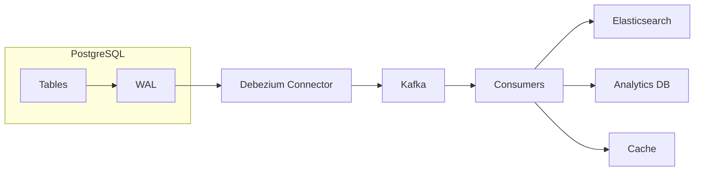

# How to Stream Changes with Debezium CDC in PostgreSQL

Author: [nawazdhandala](https://www.github.com/nawazdhandala)

Tags: PostgreSQL, Debezium, CDC, Kafka, Event Streaming

Description: Learn how to capture and stream database changes from PostgreSQL using Debezium CDC, including setup, configuration, and building real-time data pipelines with practical examples.

---

Change Data Capture (CDC) turns your database into an event stream. Every INSERT, UPDATE, and DELETE becomes a message that downstream systems can consume. Debezium is the most popular open-source CDC platform, and PostgreSQL is one of its best-supported databases. This guide walks through setting up Debezium with PostgreSQL for real-time data streaming.

## Why CDC?

Traditional approaches to syncing data between systems have problems:

- **Polling**: Inefficient, misses deletes, creates load on the database
- **Dual writes**: Risk of inconsistency, complex error handling
- **Batch ETL**: Stale data, resource-intensive

CDC captures changes directly from the database's transaction log, providing:

- Real-time updates (sub-second latency)
- Complete change history (including deletes)
- Minimal database load
- Guaranteed ordering

## Architecture Overview



Debezium reads PostgreSQL's Write-Ahead Log (WAL), converts changes to events, and publishes them to Kafka topics.

## Step 1: Configure PostgreSQL for CDC

PostgreSQL must be configured to support logical replication.

### Enable Logical Replication

Edit `postgresql.conf`:

```sql
-- Set WAL level to logical (requires restart)
ALTER SYSTEM SET wal_level = 'logical';

-- Increase max replication slots
ALTER SYSTEM SET max_replication_slots = 10;

-- Increase max WAL senders
ALTER SYSTEM SET max_wal_senders = 10;
```

Restart PostgreSQL:

```bash
sudo systemctl restart postgresql
```

### Create a Replication User

```sql
-- Create user with replication permissions
CREATE USER debezium WITH REPLICATION LOGIN PASSWORD 'secure_password';

-- Grant necessary permissions
GRANT USAGE ON SCHEMA public TO debezium;
GRANT SELECT ON ALL TABLES IN SCHEMA public TO debezium;
ALTER DEFAULT PRIVILEGES IN SCHEMA public GRANT SELECT ON TABLES TO debezium;
```

### Configure pg_hba.conf

Allow replication connections from Debezium:

```
# Allow Debezium to connect for replication
host    replication     debezium    10.0.0.0/8    scram-sha-256
host    all             debezium    10.0.0.0/8    scram-sha-256
```

Reload configuration:

```bash
sudo systemctl reload postgresql
```

## Step 2: Set Up Kafka and Kafka Connect

Debezium runs as a Kafka Connect connector. You need Kafka and Kafka Connect running.

### Docker Compose Setup

```yaml
# docker-compose.yml
version: '3'
services:
  zookeeper:
    image: confluentinc/cp-zookeeper:7.5.0
    environment:
      ZOOKEEPER_CLIENT_PORT: 2181
    ports:
      - "2181:2181"

  kafka:
    image: confluentinc/cp-kafka:7.5.0
    depends_on:
      - zookeeper
    ports:
      - "9092:9092"
    environment:
      KAFKA_BROKER_ID: 1
      KAFKA_ZOOKEEPER_CONNECT: zookeeper:2181
      KAFKA_ADVERTISED_LISTENERS: PLAINTEXT://kafka:29092,PLAINTEXT_HOST://localhost:9092
      KAFKA_LISTENER_SECURITY_PROTOCOL_MAP: PLAINTEXT:PLAINTEXT,PLAINTEXT_HOST:PLAINTEXT
      KAFKA_INTER_BROKER_LISTENER_NAME: PLAINTEXT
      KAFKA_OFFSETS_TOPIC_REPLICATION_FACTOR: 1

  connect:
    image: debezium/connect:2.4
    depends_on:
      - kafka
    ports:
      - "8083:8083"
    environment:
      BOOTSTRAP_SERVERS: kafka:29092
      GROUP_ID: debezium-connect
      CONFIG_STORAGE_TOPIC: connect_configs
      OFFSET_STORAGE_TOPIC: connect_offsets
      STATUS_STORAGE_TOPIC: connect_statuses
```

Start the stack:

```bash
docker-compose up -d
```

## Step 3: Create the Debezium Connector

Register the PostgreSQL connector with Kafka Connect:

```bash
curl -X POST http://localhost:8083/connectors \
  -H "Content-Type: application/json" \
  -d '{
    "name": "postgres-connector",
    "config": {
      "connector.class": "io.debezium.connector.postgresql.PostgresConnector",
      "database.hostname": "host.docker.internal",
      "database.port": "5432",
      "database.user": "debezium",
      "database.password": "secure_password",
      "database.dbname": "myapp",
      "topic.prefix": "myapp",
      "table.include.list": "public.orders,public.customers",
      "plugin.name": "pgoutput",
      "slot.name": "debezium_slot",
      "publication.name": "debezium_pub"
    }
  }'
```

### Configuration Options Explained

| Option | Description |
|--------|-------------|
| `topic.prefix` | Prefix for Kafka topics (topic name: `{prefix}.{schema}.{table}`) |
| `table.include.list` | Tables to capture (comma-separated) |
| `plugin.name` | Decoding plugin: `pgoutput` (built-in) or `decoderbufs` |
| `slot.name` | Name of the replication slot |
| `publication.name` | PostgreSQL publication name |

### Verify Connector Status

```bash
# Check connector status
curl http://localhost:8083/connectors/postgres-connector/status | jq

# List all connectors
curl http://localhost:8083/connectors | jq
```

## Step 4: Consume Change Events

Changes are published to Kafka topics named `{prefix}.{schema}.{table}`.

### View Events with Kafka Console Consumer

```bash
# Consume from orders topic
docker exec -it kafka kafka-console-consumer \
  --bootstrap-server localhost:9092 \
  --topic myapp.public.orders \
  --from-beginning
```

### Event Structure

A typical change event looks like this:

```json
{
  "schema": { ... },
  "payload": {
    "before": null,
    "after": {
      "id": 1001,
      "customer_id": 42,
      "amount": "99.99",
      "status": "pending",
      "created_at": 1706198400000000
    },
    "source": {
      "version": "2.4.0",
      "connector": "postgresql",
      "name": "myapp",
      "ts_ms": 1706198400123,
      "db": "myapp",
      "schema": "public",
      "table": "orders",
      "txId": 12345,
      "lsn": 123456789
    },
    "op": "c",
    "ts_ms": 1706198400456
  }
}
```

Operation types (`op`):
- `c`: Create (INSERT)
- `u`: Update
- `d`: Delete
- `r`: Read (snapshot)

## Step 5: Build a Consumer Application

Here is a Python consumer that processes order events:

```python
from kafka import KafkaConsumer
import json

# Create consumer
consumer = KafkaConsumer(
    'myapp.public.orders',
    bootstrap_servers=['localhost:9092'],
    auto_offset_reset='earliest',
    enable_auto_commit=True,
    group_id='order-processor',
    value_deserializer=lambda x: json.loads(x.decode('utf-8'))
)

def process_order_event(event):
    """Process an order change event."""
    payload = event['payload']
    op = payload['op']

    if op == 'c':  # Insert
        order = payload['after']
        print(f"New order: {order['id']} for ${order['amount']}")
        # Send notification, update search index, etc.

    elif op == 'u':  # Update
        before = payload['before']
        after = payload['after']
        if before['status'] != after['status']:
            print(f"Order {after['id']} status changed: {before['status']} -> {after['status']}")

    elif op == 'd':  # Delete
        order = payload['before']
        print(f"Order deleted: {order['id']}")

# Process events
print("Listening for order changes...")
for message in consumer:
    process_order_event(message.value)
```

## Advanced Configuration

### Filtering Events

Only capture specific columns or filter by values:

```json
{
  "name": "postgres-connector",
  "config": {
    "connector.class": "io.debezium.connector.postgresql.PostgresConnector",
    ...
    "column.include.list": "public.orders.id,public.orders.status,public.orders.amount",
    "transforms": "filter",
    "transforms.filter.type": "io.debezium.transforms.Filter",
    "transforms.filter.language": "jsr223.groovy",
    "transforms.filter.condition": "value.after.amount > 100"
  }
}
```

### Snapshot Options

Control how initial data is captured:

```json
{
  "config": {
    ...
    "snapshot.mode": "initial",
    "snapshot.select.statement.overrides": "public.orders",
    "snapshot.select.statement.overrides.public.orders": "SELECT * FROM orders WHERE created_at > '2025-01-01'"
  }
}
```

Snapshot modes:
- `initial`: Snapshot existing data, then stream changes (default)
- `never`: Only stream new changes
- `always`: Re-snapshot on every connector restart
- `exported`: Consistent snapshot using transaction export

### Heartbeat Events

Keep the connector active during low-traffic periods:

```json
{
  "config": {
    ...
    "heartbeat.interval.ms": 60000,
    "heartbeat.action.query": "INSERT INTO debezium_heartbeat (ts) VALUES (now())"
  }
}
```

## Monitoring and Operations

### Monitor Replication Lag

```sql
-- Check replication slot status
SELECT
    slot_name,
    active,
    pg_size_pretty(pg_wal_lsn_diff(pg_current_wal_lsn(), restart_lsn)) AS lag
FROM pg_replication_slots
WHERE slot_name = 'debezium_slot';
```

### Handle Connector Failures

If the connector falls too far behind, WAL files accumulate:

```bash
# Check WAL disk usage
du -sh /var/lib/postgresql/16/main/pg_wal/

# If needed, recreate the connector with a fresh snapshot
curl -X DELETE http://localhost:8083/connectors/postgres-connector
# Then recreate with snapshot.mode=initial
```

### Graceful Shutdown

Before stopping Debezium for maintenance:

```sql
-- Check current LSN
SELECT pg_current_wal_lsn();

-- After restart, verify the slot caught up
SELECT
    slot_name,
    restart_lsn,
    confirmed_flush_lsn
FROM pg_replication_slots;
```

## Production Considerations

### High Availability

For production, run multiple Kafka Connect workers:

```yaml
connect-1:
  image: debezium/connect:2.4
  environment:
    GROUP_ID: debezium-connect  # Same group ID

connect-2:
  image: debezium/connect:2.4
  environment:
    GROUP_ID: debezium-connect  # Same group ID
```

Connectors will be distributed across workers automatically.

### Schema Evolution

Debezium captures schema changes. Ensure downstream consumers can handle:

```python
def process_event(event):
    # Use .get() for optional fields
    order = event['payload']['after']
    shipping = order.get('shipping_method', 'standard')
```

### Exactly-Once Semantics

For exactly-once processing, use Kafka transactions and idempotent consumers:

```python
consumer = KafkaConsumer(
    'myapp.public.orders',
    enable_auto_commit=False,
    isolation_level='read_committed'
)

for message in consumer:
    # Process with idempotency key
    process_with_dedup(message.value, message.offset)
    consumer.commit()
```

## Summary

Debezium CDC with PostgreSQL provides a powerful foundation for event-driven architectures:

1. **Configure PostgreSQL** with `wal_level = logical`
2. **Deploy Kafka Connect** with the Debezium connector
3. **Register your connector** specifying tables to capture
4. **Build consumers** to process change events
5. **Monitor replication lag** to prevent WAL accumulation

Once set up, you get a real-time event stream of all database changes with minimal overhead on your PostgreSQL server. This enables use cases from search indexing to cache invalidation to building materialized views in other systems.
