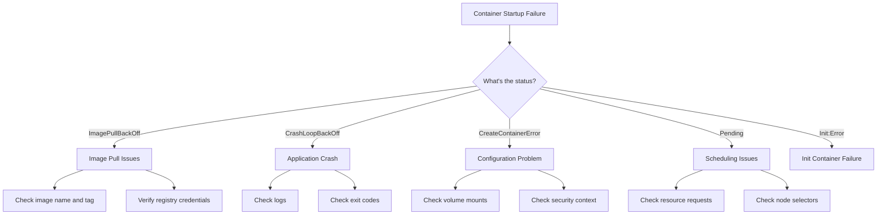

# How to Debug Container Startup Failures

Author: [nawazdhandala](https://www.github.com/nawazdhandala)

Tags: Kubernetes, Debugging, Containers, DevOps, Troubleshooting

Description: Learn systematic approaches to debug container startup failures in Kubernetes, including analyzing exit codes, inspecting logs, checking image pull issues, and resolving common configuration problems.

---

Container startup failures are among the most frustrating issues in Kubernetes. Your deployment looks correct, but Pods keep crashing or never become ready. This guide provides a systematic approach to diagnose and fix container startup problems.

## Understanding Startup Failure Patterns

Containers can fail to start for many reasons. The symptoms typically fall into these categories:



## Step 1: Check Pod Status and Events

Start by getting an overview of what Kubernetes thinks is happening:

```bash
# Get pod status with wide output
kubectl get pods -n production -o wide

# Look at the pod's events for clues
# Events show the sequence of actions and any errors
kubectl describe pod my-app-xyz -n production

# Filter to just see the Events section
kubectl describe pod my-app-xyz -n production | grep -A 20 "Events:"
```

The events section often reveals the root cause. Look for messages like:
- "Failed to pull image" - Image or registry problems
- "Back-off restarting failed container" - Application crashing
- "Failed to create pod sandbox" - Network or runtime issues
- "Insufficient memory" or "Insufficient cpu" - Resource constraints

## Step 2: Analyze Exit Codes

The container exit code tells you how the process terminated:

```bash
# Get detailed container status including exit code
kubectl get pod my-app-xyz -n production -o jsonpath='{.status.containerStatuses[0].lastState.terminated}'

# Or use describe for a readable format
kubectl describe pod my-app-xyz -n production | grep -A 5 "Last State:"
```

Common exit codes and their meanings:

| Exit Code | Meaning | Common Causes |
|-----------|---------|---------------|
| 0 | Success | Container completed normally (unexpected for long-running apps) |
| 1 | Application error | Unhandled exception, failed assertion |
| 126 | Command not executable | Wrong permissions on entrypoint |
| 127 | Command not found | Typo in command, missing binary |
| 137 | SIGKILL (OOMKilled) | Out of memory, killed by OOM killer |
| 139 | SIGSEGV | Segmentation fault, memory corruption |
| 143 | SIGTERM | Graceful shutdown requested |

## Step 3: Check Container Logs

Logs often contain the error message that caused the crash:

```bash
# Get current logs
kubectl logs my-app-xyz -n production

# Get logs from previous container instance (after crash)
# This is essential for CrashLoopBackOff debugging
kubectl logs my-app-xyz -n production --previous

# For multi-container pods, specify the container
kubectl logs my-app-xyz -n production -c app --previous

# Stream logs in real-time during startup
kubectl logs my-app-xyz -n production -f
```

If the container crashes too quickly to produce logs, the logs might be empty. In that case, check for configuration errors.

## Step 4: Debug Image Pull Issues

ImagePullBackOff usually means one of these problems:

```bash
# Check the exact image being pulled
kubectl describe pod my-app-xyz -n production | grep Image:

# Verify the image exists in your registry
docker pull myregistry.io/myapp:1.2.3

# Check for registry credential issues
kubectl get secrets -n production | grep registry
kubectl describe secret regcred -n production
```

Fix common image pull problems:

```yaml
# Ensure imagePullSecrets are configured
apiVersion: v1
kind: Pod
metadata:
  name: my-app
spec:
  # Reference the secret containing registry credentials
  imagePullSecrets:
    - name: regcred
  containers:
    - name: app
      image: myregistry.io/myapp:1.2.3
      # Use specific tags, not 'latest' for production
      imagePullPolicy: IfNotPresent
```

Create registry credentials if missing:

```bash
# Create a secret for private registry authentication
kubectl create secret docker-registry regcred \
  --docker-server=myregistry.io \
  --docker-username=user \
  --docker-password=password \
  --docker-email=user@example.com \
  -n production
```

## Step 5: Debug Configuration Issues

Many startup failures come from misconfigured environment variables, volume mounts, or secrets:

```bash
# Verify environment variables are set correctly
kubectl exec my-app-xyz -n production -- env | sort

# Check if ConfigMaps and Secrets exist
kubectl get configmap app-config -n production
kubectl get secret app-secrets -n production

# Verify volume mounts are correct
kubectl describe pod my-app-xyz -n production | grep -A 10 "Volumes:"

# Check if PersistentVolumeClaims are bound
kubectl get pvc -n production
```

Common configuration problems:

```yaml
# Problem: Missing required environment variable
# Solution: Verify all required vars are set
spec:
  containers:
    - name: app
      env:
        # Required database configuration
        - name: DATABASE_URL
          valueFrom:
            secretKeyRef:
              name: db-secrets
              key: url  # Make sure this key exists in the secret

# Problem: Volume mount path conflicts with container filesystem
# Solution: Use a subdirectory or different path
      volumeMounts:
        - name: config
          # WRONG: Mounting to /app might overwrite your application
          # mountPath: /app
          # RIGHT: Mount to a subdirectory
          mountPath: /app/config
```

## Step 6: Run a Debug Container

When you need to inspect the container environment without the application crashing:

```bash
# Override the entrypoint to get a shell
kubectl run debug-pod --image=myregistry.io/myapp:1.2.3 \
  --restart=Never \
  --command -- sleep 3600

# Exec into the debug pod
kubectl exec -it debug-pod -- /bin/sh

# Inside the container, try running the application manually
# /app/start.sh
# Or check what files are present
# ls -la /app/
```

For Kubernetes 1.25+, use ephemeral debug containers:

```bash
# Attach a debug container to a running or crashing pod
kubectl debug -it my-app-xyz -n production \
  --image=busybox \
  --target=app

# This shares the process namespace, so you can inspect the failing container
# Use ps aux to see running processes
# Check file permissions with ls -la
```

## Step 7: Check Resource Constraints

OOMKilled (exit code 137) indicates the container exceeded its memory limit:

```bash
# Check if the pod was OOMKilled
kubectl describe pod my-app-xyz -n production | grep -i oom

# View resource usage (requires metrics-server)
kubectl top pod my-app-xyz -n production

# Check the resource limits configured
kubectl get pod my-app-xyz -n production -o jsonpath='{.spec.containers[0].resources}'
```

Fix memory issues:

```yaml
# Increase memory limits if the application genuinely needs more
spec:
  containers:
    - name: app
      resources:
        requests:
          memory: "256Mi"  # Minimum guaranteed memory
          cpu: "100m"
        limits:
          memory: "512Mi"  # Maximum allowed memory
          cpu: "500m"
```

## Step 8: Debug Init Container Failures

If your pod shows `Init:Error` or `Init:CrashLoopBackOff`, the init containers are failing:

```bash
# List init containers and their status
kubectl describe pod my-app-xyz -n production | grep -A 30 "Init Containers:"

# Get logs from a specific init container
kubectl logs my-app-xyz -n production -c init-db-check

# Get logs from failed init container
kubectl logs my-app-xyz -n production -c init-db-check --previous
```

Common init container issues:

```yaml
# Init container waiting for a service that does not exist
spec:
  initContainers:
    - name: wait-for-db
      image: busybox:1.36
      command:
        - /bin/sh
        - -c
        # Add timeout to prevent infinite waiting
        - |
          TIMEOUT=300
          ELAPSED=0
          until nc -z postgres-svc 5432 || [ $ELAPSED -ge $TIMEOUT ]; do
            echo "Waiting for database..."
            sleep 5
            ELAPSED=$((ELAPSED + 5))
          done
          if [ $ELAPSED -ge $TIMEOUT ]; then
            echo "Timeout waiting for database"
            exit 1
          fi
```

## Quick Diagnostic Checklist

When a container fails to start, run through this checklist:

```bash
# 1. What's the pod status?
kubectl get pod my-app-xyz -n production

# 2. What do the events say?
kubectl describe pod my-app-xyz -n production | tail -20

# 3. What do the logs say?
kubectl logs my-app-xyz -n production --previous

# 4. Is it an OOM issue?
kubectl describe pod my-app-xyz -n production | grep -i oom

# 5. Are all secrets and configmaps present?
kubectl get configmap,secret -n production

# 6. Are PVCs bound?
kubectl get pvc -n production

# 7. Is the image accessible?
kubectl describe pod my-app-xyz -n production | grep -i "image"
```

---

Debugging container startup failures requires patience and systematic investigation. Start with `kubectl describe` to understand what Kubernetes sees, then drill down into logs and container state. Most issues fall into a few categories: image problems, configuration errors, resource constraints, or application bugs. By following this systematic approach, you can quickly identify the root cause and get your containers running.
