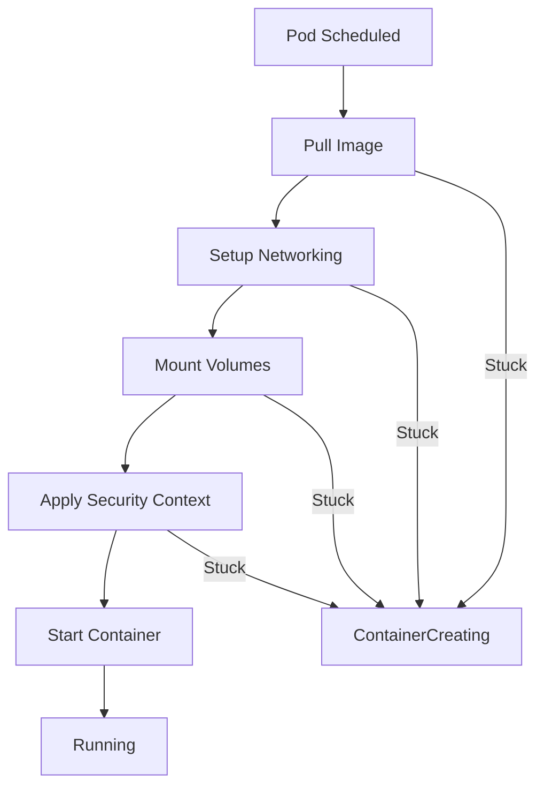

# How to Debug 'ContainerCreating' Status Issues

Author: [nawazdhandala](https://www.github.com/nawazdhandala)

Tags: Kubernetes, Debugging, Troubleshooting, Containers, DevOps, Storage

Description: Learn how to diagnose and fix pods stuck in ContainerCreating status. This guide covers common causes including image pull issues, volume mount problems, and resource constraints with step-by-step debugging techniques.

---

A pod stuck in `ContainerCreating` status is one of the most common Kubernetes problems. The pod has been scheduled to a node, but something is preventing the container from starting. This guide walks through systematic debugging to find and fix the root cause.

## Understanding ContainerCreating

When a pod shows `ContainerCreating`, Kubernetes is trying to:

1. Pull the container image
2. Set up networking
3. Mount volumes
4. Apply security contexts
5. Start the container runtime



## Step 1: Get Pod Details

Start with `kubectl describe` to see events:

```bash
# Describe the stuck pod
kubectl describe pod <pod-name> -n <namespace>

# Look at the Events section at the bottom
# It shows what Kubernetes is trying to do
```

Example output with issues:

```
Events:
  Type     Reason       Age   From               Message
  ----     ------       ----  ----               -------
  Normal   Scheduled    2m    default-scheduler  Successfully assigned default/myapp to node-1
  Warning  FailedMount  1m    kubelet            MountVolume.SetUp failed for volume "data"
```

## Common Cause 1: Image Pull Failures

### Symptoms

```
Events:
  Warning  Failed     1m   kubelet  Failed to pull image "myregistry.io/myapp:latest": rpc error: code = Unknown desc = Error response from daemon: pull access denied
```

### Diagnosis

```bash
# Check image name and tag
kubectl get pod <pod-name> -n <namespace> -o jsonpath='{.spec.containers[*].image}'

# Try pulling the image manually on the node
docker pull myregistry.io/myapp:latest
# or
crictl pull myregistry.io/myapp:latest
```

### Solutions

**Wrong image name or tag**:

```yaml
spec:
  containers:
    - name: myapp
      image: myregistry.io/myapp:v1.0.0  # Verify this exists
```

**Private registry without credentials**:

```bash
# Create image pull secret
kubectl create secret docker-registry regcred \
  --docker-server=myregistry.io \
  --docker-username=user \
  --docker-password=password \
  --docker-email=user@example.com \
  -n <namespace>
```

```yaml
spec:
  imagePullSecrets:
    - name: regcred
  containers:
    - name: myapp
      image: myregistry.io/myapp:v1.0.0
```

**Image does not exist**:

```bash
# Verify image exists in registry
curl -u user:password https://myregistry.io/v2/myapp/tags/list
```

## Common Cause 2: Volume Mount Issues

### Symptoms

```
Events:
  Warning  FailedMount  1m  kubelet  Unable to attach or mount volumes: timed out waiting for the condition
  Warning  FailedMount  1m  kubelet  MountVolume.SetUp failed for volume "data": hostPath type check failed
```

### Diagnosis

```bash
# Check PVC status
kubectl get pvc -n <namespace>

# Describe the PVC for more details
kubectl describe pvc <pvc-name> -n <namespace>

# Check if PV is available
kubectl get pv

# Check storage class
kubectl get storageclass
```

### Solutions

**PVC stuck in Pending**:

```bash
# Check PVC events
kubectl describe pvc <pvc-name> -n <namespace>

# Common issues:
# - StorageClass does not exist
# - No available PV matches the claim
# - Storage provisioner not working
```

```yaml
# Verify StorageClass exists
apiVersion: v1
kind: PersistentVolumeClaim
metadata:
  name: data-pvc
spec:
  accessModes:
    - ReadWriteOnce
  storageClassName: standard  # Must exist
  resources:
    requests:
      storage: 10Gi
```

**Volume already mounted elsewhere**:

```bash
# Check if volume is used by another pod
kubectl get pods --all-namespaces -o json | jq '.items[] | select(.spec.volumes[]?.persistentVolumeClaim.claimName=="<pvc-name>") | .metadata.name'
```

**ConfigMap or Secret does not exist**:

```bash
# Check if ConfigMap exists
kubectl get configmap <name> -n <namespace>

# Check if Secret exists
kubectl get secret <name> -n <namespace>
```

## Common Cause 3: Network Plugin Issues

### Symptoms

```
Events:
  Warning  FailedCreatePodSandBox  1m  kubelet  Failed to create pod sandbox: rpc error: code = Unknown desc = failed to set up sandbox container network
```

### Diagnosis

```bash
# Check CNI plugin pods
kubectl get pods -n kube-system | grep -E 'calico|weave|flannel|cilium'

# Check CNI plugin logs
kubectl logs -n kube-system -l app=calico-node

# Check node network configuration
kubectl get nodes -o wide
```

### Solutions

**CNI plugin not running**:

```bash
# Restart CNI pods
kubectl rollout restart daemonset calico-node -n kube-system

# Check for CNI configuration on node
ls /etc/cni/net.d/
```

**Network CIDR exhausted**:

```bash
# Check IP allocations
kubectl get pods -A -o wide | awk '{print $7}' | sort | uniq -c
```

## Common Cause 4: Resource Constraints

### Symptoms

The pod shows `ContainerCreating` but no obvious errors in events.

### Diagnosis

```bash
# Check node resources
kubectl describe node <node-name>

# Look at Allocated resources section
# and Conditions section

# Check if node is under pressure
kubectl get nodes -o custom-columns=NAME:.metadata.name,MEMORY_PRESSURE:.status.conditions[?(@.type==\"MemoryPressure\")].status,DISK_PRESSURE:.status.conditions[?(@.type==\"DiskPressure\")].status
```

### Solutions

**Node disk pressure**:

```bash
# Check disk usage on node
ssh node-1 'df -h'

# Clean up unused images
ssh node-1 'docker system prune -a'
# or
ssh node-1 'crictl rmi --prune'
```

**Insufficient resources for container runtime**:

```bash
# Check kubelet logs
journalctl -u kubelet -f

# Check container runtime logs
journalctl -u containerd -f
# or
journalctl -u docker -f
```

## Common Cause 5: Security Context Issues

### Symptoms

```
Events:
  Warning  Failed  1m  kubelet  Error: container has runAsNonRoot and image will run as root
```

### Diagnosis

```bash
# Check pod security context
kubectl get pod <pod-name> -n <namespace> -o yaml | grep -A 20 securityContext
```

### Solutions

**Image runs as root but policy forbids it**:

```yaml
spec:
  securityContext:
    runAsNonRoot: true
    runAsUser: 1000
    fsGroup: 1000
  containers:
    - name: myapp
      image: myapp:v1.0.0
      securityContext:
        allowPrivilegeEscalation: false
```

**Missing capabilities**:

```yaml
spec:
  containers:
    - name: myapp
      securityContext:
        capabilities:
          add:
            - NET_BIND_SERVICE
```

## Common Cause 6: Init Containers

### Symptoms

Pod stuck in `Init:0/1` or `Init:ContainerCreating`.

### Diagnosis

```bash
# Check init container status
kubectl get pod <pod-name> -n <namespace> -o jsonpath='{.status.initContainerStatuses}'

# View init container logs
kubectl logs <pod-name> -c <init-container-name> -n <namespace>
```

### Solutions

**Init container stuck pulling image**:

Apply the same image pull troubleshooting as main containers.

**Init container waiting for a service**:

```yaml
spec:
  initContainers:
    - name: wait-for-db
      image: busybox
      command: ['sh', '-c', 'until nc -z postgres 5432; do echo waiting for postgres; sleep 2; done']
```

Check if the target service is running:

```bash
kubectl get svc postgres -n <namespace>
kubectl get endpoints postgres -n <namespace>
```

## Debugging Script

Here is a comprehensive debugging script:

```bash
#!/bin/bash
# debug-containercreating.sh

POD=$1
NAMESPACE=${2:-default}

if [ -z "$POD" ]; then
    echo "Usage: $0 <pod-name> [namespace]"
    exit 1
fi

echo "=== Pod Status ==="
kubectl get pod $POD -n $NAMESPACE -o wide

echo -e "\n=== Pod Events ==="
kubectl get events -n $NAMESPACE --field-selector involvedObject.name=$POD --sort-by='.lastTimestamp'

echo -e "\n=== Pod Description ==="
kubectl describe pod $POD -n $NAMESPACE | tail -30

echo -e "\n=== Container Images ==="
kubectl get pod $POD -n $NAMESPACE -o jsonpath='{range .spec.containers[*]}{.name}: {.image}{"\n"}{end}'

echo -e "\n=== Init Container Images ==="
kubectl get pod $POD -n $NAMESPACE -o jsonpath='{range .spec.initContainers[*]}{.name}: {.image}{"\n"}{end}' 2>/dev/null

echo -e "\n=== Volume Claims ==="
kubectl get pod $POD -n $NAMESPACE -o jsonpath='{range .spec.volumes[*]}{.name}: {.persistentVolumeClaim.claimName}{"\n"}{end}' 2>/dev/null

echo -e "\n=== PVC Status ==="
for pvc in $(kubectl get pod $POD -n $NAMESPACE -o jsonpath='{.spec.volumes[*].persistentVolumeClaim.claimName}'); do
    kubectl get pvc $pvc -n $NAMESPACE 2>/dev/null
done

echo -e "\n=== Node Info ==="
NODE=$(kubectl get pod $POD -n $NAMESPACE -o jsonpath='{.spec.nodeName}')
if [ -n "$NODE" ]; then
    echo "Scheduled on: $NODE"
    kubectl get node $NODE -o custom-columns=NAME:.metadata.name,STATUS:.status.conditions[-1].type,MEMORY_PRESSURE:.status.conditions[?(@.type==\"MemoryPressure\")].status,DISK_PRESSURE:.status.conditions[?(@.type==\"DiskPressure\")].status
fi

echo -e "\n=== Image Pull Secrets ==="
kubectl get pod $POD -n $NAMESPACE -o jsonpath='{.spec.imagePullSecrets[*].name}'
echo ""
```

Usage:

```bash
chmod +x debug-containercreating.sh
./debug-containercreating.sh myapp-pod production
```

## Quick Fixes Checklist

- [ ] Image name and tag are correct
- [ ] Image pull secrets configured for private registries
- [ ] PVCs are bound (not Pending)
- [ ] ConfigMaps and Secrets exist
- [ ] Node has sufficient resources
- [ ] CNI plugin is healthy
- [ ] Security context matches image requirements
- [ ] Init containers can complete

---

Most `ContainerCreating` issues fall into a few categories: image problems, volume problems, or network problems. Work through them systematically using `kubectl describe` and events. The error messages usually point directly to the fix once you know where to look.
