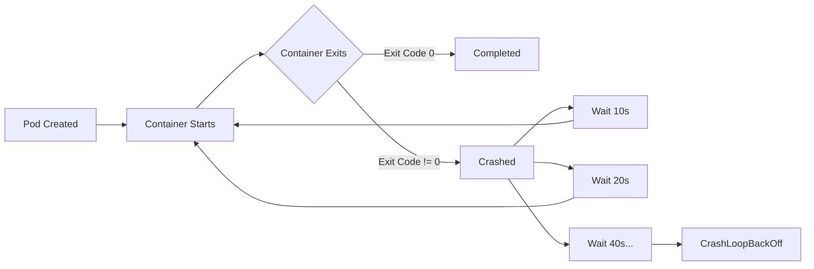

# How to Debug CrashLoopBackOff Errors in Kubernetes Pods

Author: [nawazdhandala](https://www.github.com/nawazdhandala)

Tags: Kubernetes, Troubleshooting, Debugging, DevOps, Containers

Description: Learn how to diagnose and fix CrashLoopBackOff errors in Kubernetes pods. This guide covers common causes, debugging techniques, and practical solutions to get your pods running again.

---

Few Kubernetes errors cause more frustration than `CrashLoopBackOff`. Your pod starts, crashes, restarts, crashes again, and Kubernetes backs off the restart attempts with increasing delays. Understanding why this happens and how to fix it is essential for anyone running workloads on Kubernetes.

## What is CrashLoopBackOff?

CrashLoopBackOff is not an error itself but a state. It indicates that a container in your pod is repeatedly crashing and Kubernetes is backing off before attempting another restart. The backoff period starts at 10 seconds and doubles with each failure, capping at 5 minutes.



## Step 1: Check Pod Status and Events

Start by examining the pod's current state and recent events. Events often reveal the immediate cause of the crash.

```bash
# Get pod status with restart count
kubectl get pods -n your-namespace

# Example output showing CrashLoopBackOff
# NAME                     READY   STATUS             RESTARTS   AGE
# myapp-7d4b8c9f6-x2j9k   0/1     CrashLoopBackOff   5          10m
```

Look at the RESTARTS column. A high number confirms the crash loop. Now dig deeper with describe:

```bash
# Get detailed pod information including events
kubectl describe pod myapp-7d4b8c9f6-x2j9k -n your-namespace
```

The Events section at the bottom shows what happened recently. Look for messages about:
- Failed to pull image
- Liveness probe failed
- OOMKilled (out of memory)
- Error or warning messages

## Step 2: Examine Container Logs

Logs from the crashing container usually contain the actual error. Since the container keeps restarting, you need to check logs from both current and previous instances.

```bash
# Get logs from the current container instance
kubectl logs myapp-7d4b8c9f6-x2j9k -n your-namespace

# Get logs from the previous crashed container
# This is often more useful since the current one may not have logged yet
kubectl logs myapp-7d4b8c9f6-x2j9k -n your-namespace --previous

# For pods with multiple containers, specify which one
kubectl logs myapp-7d4b8c9f6-x2j9k -n your-namespace -c container-name --previous
```

Common errors you might find:
- Connection refused (database not ready)
- File not found (missing config or volume)
- Permission denied (security context issues)
- Segmentation fault (application bug)

## Step 3: Check Exit Codes

Exit codes tell you how the container terminated. Get them from the pod's status:

```bash
# Get the last termination state
kubectl get pod myapp-7d4b8c9f6-x2j9k -n your-namespace -o jsonpath='{.status.containerStatuses[0].lastState.terminated}'
```

Common exit codes and their meanings:

| Exit Code | Meaning |
|-----------|---------|
| 0 | Success (but pod still restarting suggests restartPolicy issue) |
| 1 | Application error |
| 137 | Container killed (SIGKILL) - often OOMKilled |
| 139 | Segmentation fault |
| 143 | Container terminated (SIGTERM) |

## Step 4: Investigate Common Causes

### Cause 1: Application Crashes on Startup

The most common cause. Your application throws an exception or exits before it can serve requests.

```yaml
# Debugging approach: run the container with a sleep command
# to keep it alive while you investigate
apiVersion: v1
kind: Pod
metadata:
  name: debug-pod
spec:
  containers:
  - name: debug
    image: your-image:tag
    # Override the default command to keep container running
    command: ["sleep", "3600"]
```

Then exec into the pod and run your application manually:

```bash
# Start a shell in the debug pod
kubectl exec -it debug-pod -- /bin/sh

# Inside the container, run your app manually to see errors
./your-application
```

### Cause 2: Missing Configuration or Secrets

Applications often crash when expected environment variables or files are missing.

```bash
# Check if ConfigMaps and Secrets exist
kubectl get configmap -n your-namespace
kubectl get secret -n your-namespace

# Verify the pod's environment variables
kubectl exec myapp-7d4b8c9f6-x2j9k -n your-namespace -- env
```

### Cause 3: Failing Liveness Probes

Aggressive liveness probes kill containers that are still starting up.

```yaml
# Example: increase initial delay and failure threshold
apiVersion: v1
kind: Pod
metadata:
  name: myapp
spec:
  containers:
  - name: myapp
    image: myapp:1.0
    livenessProbe:
      httpGet:
        path: /health
        port: 8080
      # Wait 30 seconds before first check
      initialDelaySeconds: 30
      # Check every 10 seconds
      periodSeconds: 10
      # Allow 3 failures before killing
      failureThreshold: 3
```

### Cause 4: Out of Memory (OOMKilled)

When a container exceeds its memory limit, the kernel kills it.

```bash
# Check if container was OOMKilled
kubectl get pod myapp-7d4b8c9f6-x2j9k -o jsonpath='{.status.containerStatuses[0].lastState.terminated.reason}'
# Output: OOMKilled
```

Fix by increasing memory limits or optimizing your application:

```yaml
# Increase memory allocation
resources:
  requests:
    memory: "256Mi"
  limits:
    memory: "512Mi"
```

### Cause 5: Dependency Not Ready

Your application might crash because a database or service it depends on is not yet available.

```yaml
# Use init containers to wait for dependencies
apiVersion: v1
kind: Pod
metadata:
  name: myapp
spec:
  initContainers:
  - name: wait-for-db
    image: busybox:1.35
    # Wait until database is reachable on port 5432
    command: ['sh', '-c', 'until nc -z postgres-service 5432; do echo waiting for db; sleep 2; done']
  containers:
  - name: myapp
    image: myapp:1.0
```

## Step 5: Use kubectl debug for Live Troubleshooting

Kubernetes 1.25+ includes an ephemeral debug container feature:

```bash
# Attach a debug container to a running (or crashing) pod
kubectl debug myapp-7d4b8c9f6-x2j9k -it --image=busybox:1.35 --target=myapp

# This creates a new container in the same pod that shares
# the process namespace, so you can see what the main container is doing
```

## Quick Diagnostic Script

Save this script to quickly diagnose CrashLoopBackOff issues:

```bash
#!/bin/bash
# crashloop-debug.sh - Quick diagnosis for crashing pods

POD=$1
NAMESPACE=${2:-default}

echo "=== Pod Status ==="
kubectl get pod $POD -n $NAMESPACE

echo -e "\n=== Last Termination State ==="
kubectl get pod $POD -n $NAMESPACE -o jsonpath='{.status.containerStatuses[0].lastState.terminated}' | jq .

echo -e "\n=== Previous Logs ==="
kubectl logs $POD -n $NAMESPACE --previous --tail=50

echo -e "\n=== Recent Events ==="
kubectl get events -n $NAMESPACE --field-selector involvedObject.name=$POD --sort-by='.lastTimestamp'
```

Run it with:

```bash
chmod +x crashloop-debug.sh
./crashloop-debug.sh myapp-7d4b8c9f6-x2j9k your-namespace
```

## Prevention Strategies

1. **Add health checks during development** - do not wait until production to add probes
2. **Set appropriate resource limits** - profile your application to know its actual requirements
3. **Use init containers for dependencies** - do not assume services are available
4. **Log startup failures clearly** - make sure your app logs why it is exiting
5. **Test with the same image locally** - run `docker run your-image` to catch issues early

## Summary

CrashLoopBackOff troubleshooting follows a systematic approach: check events, examine logs (especially from previous containers), verify exit codes, and investigate the specific cause. Most issues fall into a few categories: application bugs, missing configuration, failed probes, memory limits, or unavailable dependencies. With the techniques in this guide, you can identify and fix these issues quickly.
