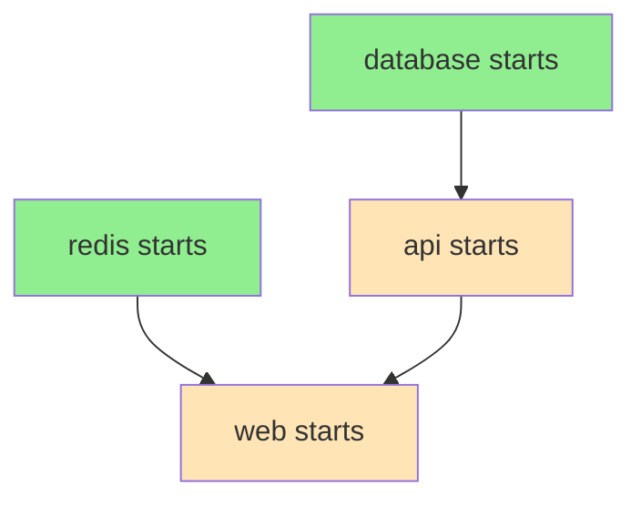

# How to Debug Docker Compose Service Dependencies

Author: [nawazdhandala](https://www.github.com/nawazdhandala)

Tags: Docker, Docker Compose, Troubleshooting, DevOps, Microservices

Description: Learn to diagnose and fix Docker Compose dependency issues including startup order problems, health check failures, and service connection errors that cause cascading failures in multi-container applications.

---

Docker Compose dependencies control the order in which services start and stop. When dependencies are misconfigured, applications crash on startup, connections fail randomly, or services hang waiting for each other.

## How depends_on Works

The basic `depends_on` keyword controls startup order but not readiness.

```yaml
# docker-compose.yml
version: '3.8'

services:
  web:
    image: myapp:latest
    depends_on:
      - api
      - redis

  api:
    image: myapp/api:latest
    depends_on:
      - database

  database:
    image: postgres:15

  redis:
    image: redis:7-alpine
```



Docker Compose starts containers in dependency order, but "started" does not mean "ready to accept connections."

## The Real Problem: Started vs Ready

A database container can start in seconds, but the database process inside needs additional time to initialize, run recovery, and accept connections.

```bash
# This happens frequently:
# 1. database container starts
# 2. api container starts immediately after
# 3. api tries to connect to database
# 4. database not ready yet - connection refused
# 5. api crashes
```

## Solution 1: Health Check Dependencies

Docker Compose (v2.1+) supports health check conditions on dependencies.

```yaml
version: '3.8'

services:
  api:
    image: myapp/api:latest
    depends_on:
      database:
        condition: service_healthy
      redis:
        condition: service_healthy

  database:
    image: postgres:15
    environment:
      POSTGRES_PASSWORD: secret
    healthcheck:
      # pg_isready checks if Postgres accepts connections
      test: ["CMD-SHELL", "pg_isready -U postgres"]
      interval: 5s
      timeout: 5s
      retries: 5
      start_period: 10s

  redis:
    image: redis:7-alpine
    healthcheck:
      # redis-cli ping returns PONG when ready
      test: ["CMD", "redis-cli", "ping"]
      interval: 5s
      timeout: 3s
      retries: 3
```

Now `api` waits until both `database` and `redis` pass their health checks.

### Health Check Examples for Common Services

```yaml
# PostgreSQL
healthcheck:
  test: ["CMD-SHELL", "pg_isready -U postgres"]
  interval: 5s
  timeout: 5s
  retries: 5

# MySQL
healthcheck:
  test: ["CMD", "mysqladmin", "ping", "-h", "localhost"]
  interval: 5s
  timeout: 5s
  retries: 5

# MongoDB
healthcheck:
  test: ["CMD", "mongosh", "--eval", "db.adminCommand('ping')"]
  interval: 10s
  timeout: 5s
  retries: 5

# Elasticsearch
healthcheck:
  test: ["CMD-SHELL", "curl -f http://localhost:9200/_cluster/health || exit 1"]
  interval: 10s
  timeout: 5s
  retries: 10

# RabbitMQ
healthcheck:
  test: ["CMD", "rabbitmq-diagnostics", "-q", "ping"]
  interval: 10s
  timeout: 5s
  retries: 5

# Kafka (using kafkacat/kcat)
healthcheck:
  test: ["CMD-SHELL", "kafka-broker-api-versions --bootstrap-server localhost:9092 || exit 1"]
  interval: 10s
  timeout: 10s
  retries: 10
```

## Solution 2: Application-Level Retry Logic

Even with health checks, network issues can cause transient failures. Your application should retry connections.

```javascript
// Node.js database connection with retry
const { Pool } = require('pg');

async function connectWithRetry(maxRetries = 10, delayMs = 3000) {
  const pool = new Pool({
    connectionString: process.env.DATABASE_URL
  });

  for (let attempt = 1; attempt <= maxRetries; attempt++) {
    try {
      const client = await pool.connect();
      console.log('Database connected');
      client.release();
      return pool;
    } catch (err) {
      console.log(`Connection attempt ${attempt} failed: ${err.message}`);
      if (attempt === maxRetries) {
        throw new Error(`Failed to connect after ${maxRetries} attempts`);
      }
      await new Promise(resolve => setTimeout(resolve, delayMs));
    }
  }
}
```

```python
# Python database connection with retry
import time
import psycopg2
from psycopg2 import OperationalError

def connect_with_retry(max_retries=10, delay_seconds=3):
    """Attempt database connection with exponential backoff."""
    for attempt in range(1, max_retries + 1):
        try:
            conn = psycopg2.connect(os.environ['DATABASE_URL'])
            print("Database connected")
            return conn
        except OperationalError as e:
            print(f"Connection attempt {attempt} failed: {e}")
            if attempt == max_retries:
                raise Exception(f"Failed to connect after {max_retries} attempts")
            time.sleep(delay_seconds)
```

## Solution 3: Wait Scripts in Entrypoint

For services that do not support health checks or when you need custom logic, use a wait script.

```bash
#!/bin/bash
# wait-for-it.sh - Wait for a service to become available

set -e

host="$1"
port="$2"
shift 2
cmd="$@"

echo "Waiting for $host:$port..."

for i in $(seq 1 30); do
  if nc -z "$host" "$port" > /dev/null 2>&1; then
    echo "$host:$port is available"
    exec $cmd
  fi
  echo "Attempt $i: $host:$port not ready, sleeping..."
  sleep 2
done

echo "Timeout waiting for $host:$port"
exit 1
```

```yaml
# docker-compose.yml
services:
  api:
    image: myapp/api:latest
    entrypoint: ["/scripts/wait-for-it.sh", "database", "5432", "--"]
    command: ["node", "server.js"]
    volumes:
      - ./scripts:/scripts:ro
    depends_on:
      - database
```

## Debugging Dependency Issues

### Check Container Status and Health

```bash
# View all container statuses including health
docker compose ps

# Output shows health status
# NAME       SERVICE    STATUS                   PORTS
# api        api        Up 5 seconds (healthy)   3000/tcp
# database   database   Up 10 seconds (healthy)  5432/tcp

# Detailed health check info
docker inspect database --format '{{json .State.Health}}' | jq
```

### View Startup Logs

```bash
# Follow logs from all services during startup
docker compose up 2>&1 | tee startup.log

# View logs from specific service
docker compose logs api --follow

# Check for connection errors
docker compose logs api | grep -i "connection\|refused\|timeout"
```

### Test Network Connectivity

```bash
# Check if services can reach each other
docker compose exec api ping database

# Test specific port connectivity
docker compose exec api nc -zv database 5432

# Check DNS resolution within the network
docker compose exec api nslookup database
```

### Inspect the Compose Network

```bash
# List networks
docker network ls

# Inspect the compose network
docker network inspect myproject_default

# Verify all services are attached
docker network inspect myproject_default --format '{{range .Containers}}{{.Name}} {{end}}'
```

## Common Dependency Patterns

### Pattern 1: Database Migration Before API

Run migrations before the API starts accepting traffic.

```yaml
services:
  database:
    image: postgres:15
    healthcheck:
      test: ["CMD-SHELL", "pg_isready -U postgres"]
      interval: 5s
      retries: 5

  migrate:
    image: myapp/api:latest
    command: npm run migrate
    depends_on:
      database:
        condition: service_healthy
    # Exit after migration completes
    restart: "no"

  api:
    image: myapp/api:latest
    depends_on:
      migrate:
        condition: service_completed_successfully
      database:
        condition: service_healthy
```

### Pattern 2: External Service Dependency

Wait for an external service that is not part of compose.

```yaml
services:
  api:
    image: myapp/api:latest
    healthcheck:
      # Check both internal and external dependencies
      test: |
        curl -f http://localhost:3000/health && \
        nc -z external-api.example.com 443
      interval: 10s
      retries: 5
```

### Pattern 3: Graceful Shutdown Order

`depends_on` also affects shutdown order. Services stop in reverse dependency order.

```yaml
services:
  # Stops last (other services depend on it)
  database:
    image: postgres:15
    stop_grace_period: 30s

  # Stops after web, before database
  api:
    image: myapp/api:latest
    depends_on:
      - database
    stop_grace_period: 10s

  # Stops first
  web:
    image: nginx:alpine
    depends_on:
      - api
    stop_grace_period: 5s
```

## Troubleshooting Checklist

1. **Container exits immediately**: Check logs with `docker compose logs <service>`
2. **Health check failing**: Run the health check command manually inside the container
3. **Connection refused**: Verify the service is listening on the expected port and interface
4. **Timeout errors**: Increase health check intervals and retries
5. **Circular dependency**: Review depends_on chain for cycles
6. **Network issues**: Ensure services are on the same network

```bash
# Quick diagnostic commands
docker compose ps                        # Check container status
docker compose logs --tail 50            # Recent logs from all services
docker compose exec api env              # Verify environment variables
docker compose exec api cat /etc/hosts   # Check DNS entries
docker compose config                    # Validate compose file syntax
```

---

Proper dependency management requires both Docker Compose configuration and application resilience. Use health check conditions to delay startup until dependencies are ready, implement retry logic in your application for transient failures, and add appropriate timeouts and grace periods. When debugging, start by checking if containers are healthy, then verify network connectivity, and finally review application logs for specific error messages.
