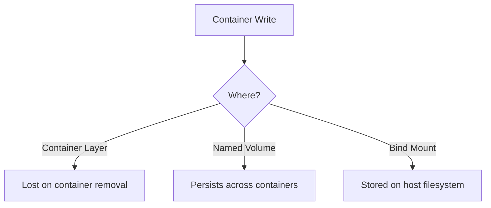

# How to Debug Docker Container File System Issues

Author: [nawazdhandala](https://www.github.com/nawazdhandala)

Tags: Docker, Troubleshooting, File System, Storage, DevOps

Description: Diagnose container file system problems including disk space errors, read-only issues, overlay filesystem corruption, and permission mismatches that cause applications to fail.

---

File system issues in Docker containers manifest as permission denied errors, disk space exhaustion, corrupted files, or applications unable to write data. This guide covers systematic debugging approaches for the most common problems.

## Symptom: No Space Left on Device

Containers share the host's Docker storage. When that fills up, all containers suffer.

```bash
# Error message in container
Error: ENOSPC: no space left on device, write

# Check Docker's disk usage
docker system df

# Output shows usage breakdown
# TYPE           TOTAL     ACTIVE    SIZE      RECLAIMABLE
# Images         45        12        8.5GB     5.2GB (61%)
# Containers     15        8         2.1GB     1.8GB (85%)
# Local Volumes  23        5         12.3GB    8.7GB (70%)
# Build Cache    -         -         3.2GB     3.2GB
```

### Identify Space Consumers

```bash
# Detailed breakdown by image
docker system df -v

# Find largest containers by size
docker ps -s --format "table {{.Names}}\t{{.Size}}"

# Find largest volumes
docker volume ls -q | xargs -I {} docker volume inspect {} --format '{{.Name}}: {{.Mountpoint}}' | \
  while read line; do
    name=$(echo $line | cut -d: -f1)
    path=$(echo $line | cut -d: -f2)
    size=$(sudo du -sh "$path" 2>/dev/null | cut -f1)
    echo "$size $name"
  done | sort -hr | head -20
```

### Clean Up Disk Space

```bash
# Remove stopped containers
docker container prune

# Remove unused images
docker image prune

# Remove unused volumes (careful - data loss possible)
docker volume prune

# Remove build cache
docker builder prune

# Nuclear option: remove all unused data
docker system prune -a --volumes

# Remove specific large images
docker images --format '{{.Repository}}:{{.Tag}} {{.Size}}' | sort -k2 -hr | head -10
docker rmi image-name:tag
```

### Check Container-Specific Space

```bash
# Check filesystem usage inside container
docker exec mycontainer df -h

# Find large files inside container
docker exec mycontainer find / -type f -size +100M 2>/dev/null

# Check if container has its own storage limit
docker inspect mycontainer --format '{{.HostConfig.StorageOpt}}'
```

## Symptom: Read-Only File System

Applications fail to write because the file system is mounted read-only.

```bash
# Error message
Read-only file system

# Check if container root filesystem is read-only
docker inspect mycontainer --format '{{.HostConfig.ReadonlyRootfs}}'
# true = read-only mode enabled
```

### Diagnose Read-Only Issues

```bash
# Check mount options inside container
docker exec mycontainer mount | grep -E "^/dev|overlay"

# Check if specific volume is read-only
docker inspect mycontainer --format '{{range .Mounts}}{{.Source}} -> {{.Destination}} ({{.Mode}}){{"\n"}}{{end}}'
# Mode "ro" indicates read-only
```

### Fix Read-Only Mounts

```yaml
# docker-compose.yml - ensure volumes are read-write
services:
  app:
    image: myapp:latest
    volumes:
      # Explicitly specify read-write mode
      - ./data:/app/data:rw

      # For read-only containers, create writable areas
      - type: tmpfs
        target: /tmp
      - type: tmpfs
        target: /var/log
```

```bash
# Run container with writable tmpfs for specific directories
docker run -d \
  --read-only \
  --tmpfs /tmp \
  --tmpfs /var/log \
  -v ./data:/app/data:rw \
  myapp:latest
```

## Symptom: Permission Denied

The container user cannot access files or directories.

```bash
# Common error
Permission denied

# Check what user the container runs as
docker exec mycontainer id
# uid=1000(appuser) gid=1000(appuser)

# Check file permissions
docker exec mycontainer ls -la /app/data
# drwxr-xr-x 2 root root 4096 Jan 25 10:00 .
```

### Debug Permission Mismatches

```bash
# Check effective capabilities
docker exec mycontainer cat /proc/1/status | grep Cap

# Check if SELinux or AppArmor is blocking
# On host system
dmesg | grep -i denied
ausearch -m AVC -ts recent  # SELinux audit log

# Check Docker's security options
docker inspect mycontainer --format '{{.HostConfig.SecurityOpt}}'
```

### Fix Permission Issues

```bash
# Option 1: Run as root (not recommended for production)
docker run --user root myapp:latest

# Option 2: Match container user to host user
docker run --user $(id -u):$(id -g) myapp:latest

# Option 3: Fix permissions on host
sudo chown -R 1000:1000 ./data

# Option 4: Use init container to fix permissions
docker run --rm -v ./data:/data alpine chown -R 1000:1000 /data
```

```dockerfile
# Dockerfile - Set up correct ownership
FROM node:20-slim

# Create app user and group
RUN groupadd -r appuser && useradd -r -g appuser appuser

WORKDIR /app
COPY --chown=appuser:appuser . .

USER appuser
CMD ["node", "server.js"]
```

## Symptom: Overlay Filesystem Errors

The overlay2 storage driver can encounter corruption or inconsistencies.

```bash
# Error messages
overlay: failed to get D on lowerdir
invalid argument
layer not known
```

### Diagnose Overlay Issues

```bash
# Check Docker storage driver
docker info | grep "Storage Driver"

# Inspect overlay layers
docker inspect mycontainer --format '{{.GraphDriver.Data}}'

# Check overlay mount status on host
mount | grep overlay

# Verify layer directories exist
ls -la /var/lib/docker/overlay2/
```

### Recover from Overlay Corruption

```bash
# Remove the problematic container
docker rm -f mycontainer

# Remove the problematic image and re-pull
docker rmi myimage:tag
docker pull myimage:tag

# If widespread corruption, restart Docker daemon
sudo systemctl restart docker

# Last resort: clear all Docker data (destructive!)
sudo systemctl stop docker
sudo rm -rf /var/lib/docker
sudo systemctl start docker
```

## Symptom: File Changes Not Persisting

Data written inside containers disappears after restart.

```bash
# Understand container filesystem layers
# - Image layers (read-only)
# - Container layer (read-write, but ephemeral)
# - Volumes (persistent)
```



### Verify Volume Configuration

```bash
# Check if volumes are properly configured
docker inspect mycontainer --format '{{json .Mounts}}' | jq

# Verify data is in the volume, not container layer
docker exec mycontainer ls -la /app/data

# Check volume contents directly on host
docker volume inspect myvolume --format '{{.Mountpoint}}'
sudo ls -la /var/lib/docker/volumes/myvolume/_data
```

### Ensure Data Goes to Volumes

```yaml
# docker-compose.yml
services:
  db:
    image: postgres:15
    volumes:
      # Named volume for database files
      - pgdata:/var/lib/postgresql/data

volumes:
  pgdata:
    # Volume persists even when containers are removed
```

## Debugging Commands Reference

```bash
# File system status inside container
docker exec mycontainer df -h
docker exec mycontainer mount

# Find file ownership issues
docker exec mycontainer find /app -not -user appuser 2>/dev/null

# Check for open file handles (useful for "device busy" errors)
docker exec mycontainer lsof

# Trace file system calls
docker exec mycontainer strace -e file -p 1

# Copy files out for inspection
docker cp mycontainer:/app/config.json ./debug/

# Export entire container filesystem
docker export mycontainer > container-fs.tar
tar -tvf container-fs.tar | head -50
```

## Prevention Strategies

```yaml
# docker-compose.yml with proper file system configuration
services:
  app:
    image: myapp:latest
    user: "1000:1000"
    volumes:
      - app_data:/app/data:rw
      - ./config:/app/config:ro  # Config read-only
    tmpfs:
      - /tmp:size=100M
    deploy:
      resources:
        limits:
          memory: 512M
    logging:
      driver: json-file
      options:
        max-size: "10m"  # Prevent log files from filling disk
        max-file: "3"

volumes:
  app_data:
```

---

File system issues often trace back to three root causes: disk space exhaustion, permission mismatches, or misconfigured volumes. Start by checking available space with `docker system df`, verify permissions inside the container with `ls -la`, and confirm volumes are mounted correctly with `docker inspect`. For persistent data, always use named volumes or bind mounts rather than relying on the ephemeral container layer.
