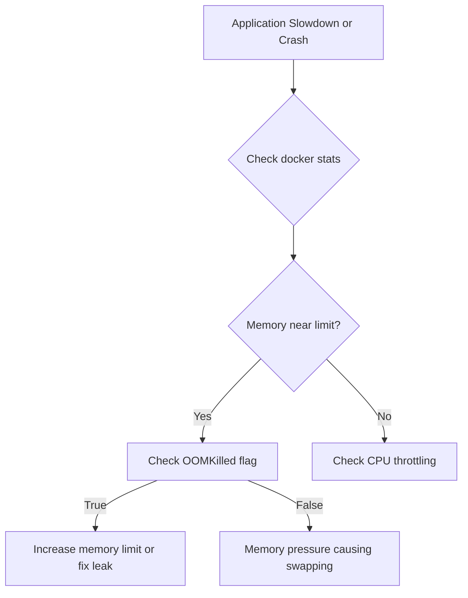

# How to Debug Docker Container Resource Limits

Author: [nawazdhandala](https://www.github.com/nawazdhandala)

Tags: Docker, Troubleshooting, Performance, Resource Management, DevOps

Description: Learn to diagnose CPU throttling, memory pressure, and OOM kills in Docker containers. Understand cgroup limits, monitor resource usage, and configure appropriate constraints for production workloads.

---

Resource limits protect your host system but can cause unexpected behavior when containers hit their boundaries. Applications slow down from CPU throttling, crash from OOM kills, or behave erratically when starved of resources.

## Understanding Container Resource Limits

Docker uses Linux cgroups to limit CPU, memory, and I/O for containers. When limits are set, the kernel enforces them regardless of what the application expects.

```bash
# View current resource limits for a container
docker inspect mycontainer --format '
CPU Shares: {{.HostConfig.CpuShares}}
CPU Period: {{.HostConfig.CpuPeriod}}
CPU Quota: {{.HostConfig.CpuQuota}}
Memory: {{.HostConfig.Memory}}
Memory Swap: {{.HostConfig.MemorySwap}}
'

# View live resource usage
docker stats mycontainer

# Output shows current usage vs limits
# CONTAINER   CPU %   MEM USAGE / LIMIT     MEM %   NET I/O   BLOCK I/O
# mycontainer 45.2%   256MiB / 512MiB       50.0%   1.2MB     10MB
```

## Diagnosing Memory Issues

### Detecting OOM Kills

When a container exceeds its memory limit, the kernel kills it.

```bash
# Check if container was OOM killed
docker inspect mycontainer --format '{{.State.OOMKilled}}'
# true = container was killed due to out of memory

# View container exit code (137 often indicates OOM kill)
docker inspect mycontainer --format '{{.State.ExitCode}}'
# 137 = SIGKILL (128 + 9)

# Check dmesg for OOM killer messages
dmesg | grep -i "oom\|killed process"

# View container logs before crash
docker logs mycontainer --tail 100
```

### Memory Usage Inside Container

```bash
# Check memory usage from within the container
docker exec mycontainer cat /sys/fs/cgroup/memory/memory.usage_in_bytes
docker exec mycontainer cat /sys/fs/cgroup/memory/memory.limit_in_bytes

# For cgroup v2 systems
docker exec mycontainer cat /sys/fs/cgroup/memory.current
docker exec mycontainer cat /sys/fs/cgroup/memory.max

# View detailed memory stats
docker exec mycontainer cat /proc/meminfo

# Check memory pressure events
docker exec mycontainer cat /sys/fs/cgroup/memory/memory.failcnt
```

### Common Memory Issues



### Fix Memory Issues

```yaml
# docker-compose.yml - Adjust memory limits
services:
  api:
    image: myapp/api:latest
    deploy:
      resources:
        limits:
          memory: 1G        # Hard limit
        reservations:
          memory: 512M      # Guaranteed minimum
    # Disable swap for more predictable behavior
    mem_swappiness: 0
```

```bash
# Update memory limit on running container
docker update --memory 1G --memory-swap 1G mycontainer

# Run with specific memory settings
docker run -d \
  --memory=1g \
  --memory-swap=1g \
  --memory-reservation=512m \
  myapp:latest
```

## Diagnosing CPU Issues

### Detecting CPU Throttling

CPU throttling slows down your application without killing it. Symptoms include increased latency and timeouts.

```bash
# Check CPU throttling stats
docker exec mycontainer cat /sys/fs/cgroup/cpu/cpu.stat

# Output shows throttling info
# nr_periods 1000       # Number of scheduling periods
# nr_throttled 50       # Periods where throttling occurred
# throttled_time 5000   # Total time throttled (nanoseconds)

# For cgroup v2
docker exec mycontainer cat /sys/fs/cgroup/cpu.stat

# Calculate throttling percentage
# throttle_percent = nr_throttled / nr_periods * 100
```

### Monitor CPU Usage

```bash
# Watch CPU usage in real-time
docker stats --no-stream mycontainer

# View process-level CPU usage inside container
docker exec mycontainer top -bn1

# Check CPU shares and quota
docker inspect mycontainer --format '
CPU Shares: {{.HostConfig.CpuShares}}
CPU Period: {{.HostConfig.CpuPeriod}}
CPU Quota: {{.HostConfig.CpuQuota}}
NanoCPUs: {{.HostConfig.NanoCpus}}
'

# Calculate CPU limit
# If CpuPeriod=100000 and CpuQuota=50000, container gets 0.5 CPU
# NanoCpus=500000000 also means 0.5 CPU (in nanoseconds per second)
```

### Fix CPU Throttling

```yaml
# docker-compose.yml - Adjust CPU limits
services:
  api:
    image: myapp/api:latest
    deploy:
      resources:
        limits:
          cpus: '2.0'        # Allow up to 2 CPU cores
        reservations:
          cpus: '0.5'        # Guarantee at least 0.5 CPU
```

```bash
# Update CPU limit on running container
docker update --cpus 2.0 mycontainer

# Run with specific CPU settings
docker run -d \
  --cpus=2.0 \
  --cpu-shares=1024 \
  myapp:latest
```

## Understanding CPU Shares vs Limits

```bash
# CPU Shares (relative weight, no hard limit)
# Default is 1024. Higher value = more CPU when competing
docker run --cpu-shares=2048 myapp:latest

# CPU Limit (hard cap on CPU usage)
# --cpus=1.5 means container can use 1.5 CPU cores max
docker run --cpus=1.5 myapp:latest

# CPU Period + Quota (fine-grained control)
# period=100000 (100ms), quota=50000 (50ms) = 0.5 CPU
docker run --cpu-period=100000 --cpu-quota=50000 myapp:latest
```

| Setting | Type | Use Case |
|---------|------|----------|
| `--cpu-shares` | Relative | Fair sharing under contention |
| `--cpus` | Hard limit | Prevent runaway processes |
| `--cpuset-cpus` | CPU pinning | Isolate workloads to specific cores |

## Debugging Resource Issues in Production

### Create a Diagnostic Script

```bash
#!/bin/bash
# container-diagnostics.sh

CONTAINER=$1

echo "=== Container Resource Diagnostics ==="
echo "Container: $CONTAINER"
echo ""

echo "=== Current Resource Usage ==="
docker stats --no-stream $CONTAINER

echo ""
echo "=== Memory Limits ==="
docker inspect $CONTAINER --format '
Memory Limit: {{.HostConfig.Memory}}
Memory Swap: {{.HostConfig.MemorySwap}}
Memory Reservation: {{.HostConfig.MemoryReservation}}
OOM Killed: {{.State.OOMKilled}}
'

echo ""
echo "=== CPU Limits ==="
docker inspect $CONTAINER --format '
CPU Shares: {{.HostConfig.CpuShares}}
CPUs: {{.HostConfig.NanoCpus}}
CPU Set: {{.HostConfig.CpusetCpus}}
'

echo ""
echo "=== Cgroup Stats ==="
docker exec $CONTAINER cat /sys/fs/cgroup/cpu.stat 2>/dev/null || \
docker exec $CONTAINER cat /sys/fs/cgroup/cpu/cpu.stat 2>/dev/null

echo ""
echo "=== Top Processes ==="
docker exec $CONTAINER ps aux --sort=-%mem | head -10
```

### Monitor Over Time

```bash
# Log resource usage every 5 seconds
while true; do
  echo "$(date '+%Y-%m-%d %H:%M:%S')" >> /var/log/container-stats.log
  docker stats --no-stream mycontainer >> /var/log/container-stats.log
  sleep 5
done

# Or use docker events to catch OOM kills
docker events --filter container=mycontainer --filter event=oom
```

## Configuring Alerts Based on Resource Usage

```yaml
# docker-compose.yml with resource monitoring
services:
  api:
    image: myapp/api:latest
    deploy:
      resources:
        limits:
          cpus: '2.0'
          memory: 1G
    healthcheck:
      test: ["CMD", "curl", "-f", "http://localhost:3000/health"]
      interval: 30s
      timeout: 10s
      retries: 3
    labels:
      # Prometheus alerting labels
      prometheus.io/scrape: "true"
      prometheus.io/alert.memory_high: "container_memory_usage_bytes > 800000000"
      prometheus.io/alert.cpu_high: "rate(container_cpu_usage_seconds_total[5m]) > 1.8"
```

## Resource Limit Best Practices

```yaml
# Recommended configuration for production
services:
  web:
    image: myapp/web:latest
    deploy:
      resources:
        limits:
          cpus: '1.0'
          memory: 512M
        reservations:
          cpus: '0.25'
          memory: 256M
      restart_policy:
        condition: on-failure
        delay: 5s
        max_attempts: 3

  worker:
    image: myapp/worker:latest
    deploy:
      resources:
        limits:
          cpus: '2.0'    # Workers often need more CPU
          memory: 2G
        reservations:
          cpus: '0.5'
          memory: 512M
```

### Sizing Guidelines

| Workload Type | CPU | Memory |
|---------------|-----|--------|
| API Server | 0.5-2 cores | 512MB-2GB |
| Background Worker | 1-4 cores | 1GB-4GB |
| Database | 2-8 cores | 4GB-32GB |
| Cache (Redis) | 0.5-1 core | 1GB-8GB |
| Static Web Server | 0.25-0.5 core | 128MB-512MB |

---

Resource limit debugging requires understanding what limits are set, monitoring actual usage, and correlating symptoms with resource boundaries. Use `docker stats` for quick checks, inspect cgroup stats for throttling details, and check the OOMKilled flag for memory crashes. When containers misbehave, look at the gap between configured limits and actual needs, then adjust limits or optimize the application accordingly.
