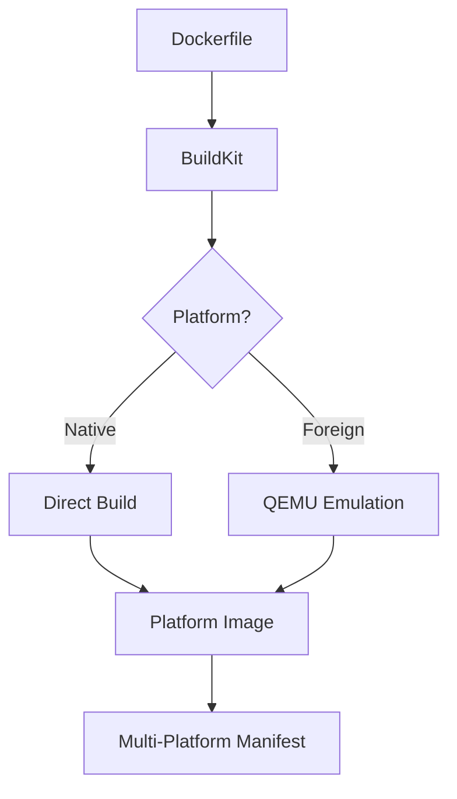

# How to Debug Docker Multi-Platform Build Issues

Author: [nawazdhandala](https://www.github.com/nawazdhandala)

Tags: Docker, BuildKit, Multi-Platform, ARM, DevOps, CI/CD

Description: Troubleshoot Docker multi-platform builds for AMD64 and ARM64, including QEMU emulation issues, base image compatibility, and build failures across architectures.

---

Multi-platform Docker builds let you create images that run on both Intel/AMD (amd64) and ARM (arm64) processors from a single Dockerfile. When builds fail or produce broken images, debugging requires understanding how emulation and cross-compilation work under the hood.

## Understanding Multi-Platform Builds

Docker uses BuildKit and QEMU for multi-platform builds:



```bash
# Check available platforms
docker buildx ls

# Create a builder with multi-platform support
docker buildx create --name multiplatform --driver docker-container --bootstrap
docker buildx use multiplatform

# Verify QEMU support
docker run --rm --privileged multiarch/qemu-user-static --reset -p yes
```

## Common Build Failures

### Issue 1: QEMU Not Installed or Registered

Symptoms:
```
exec /bin/sh: exec format error
standard_init_linux.go: exec user process caused "exec format error"
```

Solution:

```bash
# Install QEMU handlers
docker run --rm --privileged multiarch/qemu-user-static --reset -p yes

# Verify registration
ls /proc/sys/fs/binfmt_misc/
# Should show qemu-aarch64, qemu-arm, etc.

# Test emulation
docker run --rm --platform linux/arm64 alpine uname -m
# Should output: aarch64
```

For CI/CD systems:

```yaml
# GitHub Actions
jobs:
  build:
    runs-on: ubuntu-latest
    steps:
      - name: Set up QEMU
        uses: docker/setup-qemu-action@v3

      - name: Set up Docker Buildx
        uses: docker/setup-buildx-action@v3
```

### Issue 2: Base Image Missing Platform Support

Error:
```
ERROR: failed to solve: node:18: no match for platform in manifest
```

Solution: Check if your base image supports the target platform:

```bash
# Inspect image manifest
docker manifest inspect node:18

# Look for platform entries
docker manifest inspect node:18 | jq '.manifests[].platform'

# Use specific platform-compatible tag
# Bad: node:18-alpine (might not have all platforms)
# Good: node:18-alpine for standard platforms
```

Choose base images carefully:

```dockerfile
# Alpine supports both amd64 and arm64
FROM alpine:3.19

# Debian/Ubuntu have excellent multi-platform support
FROM debian:bookworm-slim

# Official language images usually support both
FROM python:3.11-slim
FROM node:20-slim
FROM golang:1.21-alpine
```

### Issue 3: Architecture-Specific Dependencies

Code that works on amd64 may fail on arm64:

```dockerfile
# BROKEN: Architecture-specific binary
FROM node:18-alpine
RUN wget https://example.com/tool-linux-amd64 -O /usr/local/bin/tool

# FIXED: Use architecture variable
FROM node:18-alpine
ARG TARGETARCH
RUN wget https://example.com/tool-linux-${TARGETARCH} -O /usr/local/bin/tool && \
    chmod +x /usr/local/bin/tool
```

Available BuildKit variables:
- `TARGETPLATFORM`: `linux/amd64`, `linux/arm64`
- `TARGETOS`: `linux`
- `TARGETARCH`: `amd64`, `arm64`
- `TARGETVARIANT`: `v7` (for arm/v7)

### Issue 4: Compilation Failures in Native Packages

Native dependencies may fail to compile under QEMU:

```bash
# Error during npm install on arm64 emulation
npm ERR! gyp ERR! build error
npm ERR! node-pre-gyp WARN Using request for node-pre-gyp https download
```

Solutions:

```dockerfile
# Option 1: Use pre-built binaries when available
FROM node:18-alpine
RUN npm ci --prefer-offline

# Option 2: Cross-compile from native architecture
FROM --platform=$BUILDPLATFORM node:18-alpine AS builder
ARG TARGETPLATFORM
ARG BUILDPLATFORM

# Install cross-compilation tools
RUN apk add --no-cache python3 make g++

WORKDIR /app
COPY package*.json ./

# For Node.js with native modules, use npm_config_arch
RUN npm_config_arch=${TARGETPLATFORM##*/} npm ci

FROM node:18-alpine
COPY --from=builder /app/node_modules /app/node_modules
```

### Issue 5: QEMU Emulation Timeouts

Emulated builds are slow and may timeout:

```bash
# Error: context deadline exceeded
# Or builds hanging indefinitely
```

Solutions:

```bash
# Increase timeout in Docker daemon
# /etc/docker/daemon.json
{
  "max-concurrent-downloads": 3,
  "max-concurrent-uploads": 3
}

# Use cross-compilation instead of emulation where possible
docker buildx build \
  --platform linux/amd64,linux/arm64 \
  --build-arg BUILDKIT_STEP_LOG_MAX_SIZE=10485760 \
  --progress=plain \
  -t myapp:latest .
```

For compiled languages, use cross-compilation:

```dockerfile
# Go cross-compilation (no QEMU needed)
FROM --platform=$BUILDPLATFORM golang:1.21-alpine AS builder
ARG TARGETOS
ARG TARGETARCH

WORKDIR /app
COPY . .
RUN CGO_ENABLED=0 GOOS=$TARGETOS GOARCH=$TARGETARCH go build -o /app/server

FROM alpine:3.19
COPY --from=builder /app/server /usr/local/bin/
CMD ["server"]
```

### Issue 6: Manifest List Errors

Problems pushing multi-platform manifests:

```bash
# Error: failed to push manifest list
# Error: manifest unknown: manifest unknown
```

Solution:

```bash
# Build and push in one command (recommended)
docker buildx build \
  --platform linux/amd64,linux/arm64 \
  --push \
  -t registry.example.com/myapp:latest .

# Or build locally and push separately
docker buildx build \
  --platform linux/amd64,linux/arm64 \
  --output type=image,push=true \
  -t registry.example.com/myapp:latest .
```

Verify the manifest:

```bash
docker manifest inspect registry.example.com/myapp:latest
```

## Debugging Build Process

### Enable Verbose Output

```bash
# Maximum verbosity
BUILDKIT_PROGRESS=plain docker buildx build \
  --platform linux/amd64,linux/arm64 \
  --no-cache \
  -t myapp:debug .

# Export build logs
docker buildx build \
  --platform linux/amd64,linux/arm64 \
  --progress=plain \
  -t myapp:debug . 2>&1 | tee build.log
```

### Build Single Platform for Testing

```bash
# Test amd64 build
docker buildx build --platform linux/amd64 -t myapp:amd64-test --load .
docker run --rm myapp:amd64-test

# Test arm64 build
docker buildx build --platform linux/arm64 -t myapp:arm64-test --load .
docker run --rm --platform linux/arm64 myapp:arm64-test
```

### Inspect Intermediate Layers

```dockerfile
# Add debug stage to Dockerfile
FROM node:18-alpine AS base
WORKDIR /app

FROM base AS debug-deps
COPY package*.json ./
RUN npm ci
# Debug: list installed packages and their architectures
RUN npm ls --depth=0
RUN find node_modules -name "*.node" -exec file {} \;

FROM base AS production
COPY --from=debug-deps /app/node_modules ./node_modules
COPY . .
CMD ["node", "server.js"]
```

```bash
# Build debug stage for specific platform
docker buildx build --platform linux/arm64 --target debug-deps -t myapp:debug .
```

### Test on Real Hardware

Emulation may hide issues that appear on real ARM hardware:

```bash
# On an ARM machine (M1 Mac, Raspberry Pi, AWS Graviton)
docker pull --platform linux/arm64 myapp:latest
docker run --rm myapp:latest

# Compare behavior
# On amd64 machine
docker run --rm --platform linux/amd64 myapp:latest
```

## Platform-Aware Dockerfiles

Write Dockerfiles that handle platform differences:

```dockerfile
FROM node:18-alpine

# Set architecture-aware environment variables
ARG TARGETARCH
ENV NODE_ARCH=${TARGETARCH}

# Install different packages based on architecture
RUN if [ "$TARGETARCH" = "arm64" ]; then \
      apk add --no-cache libc6-compat; \
    fi

WORKDIR /app
COPY package*.json ./

# Use platform-appropriate npm settings
RUN npm ci --target_arch=$TARGETARCH

COPY . .
CMD ["node", "server.js"]
```

For complex builds:

```dockerfile
# syntax=docker/dockerfile:1.4

FROM --platform=$BUILDPLATFORM node:18-alpine AS builder
ARG TARGETPLATFORM
ARG BUILDPLATFORM

RUN echo "Building on $BUILDPLATFORM for $TARGETPLATFORM"

# Use build cache for dependencies
WORKDIR /app
COPY package*.json ./

# Mount cache for npm
RUN --mount=type=cache,target=/root/.npm \
    npm ci

COPY . .
RUN npm run build

FROM node:18-alpine AS production
WORKDIR /app
COPY --from=builder /app/dist ./dist
COPY --from=builder /app/node_modules ./node_modules
CMD ["node", "dist/server.js"]
```

## CI/CD Pipeline Example

Complete GitHub Actions workflow for multi-platform builds:

```yaml
name: Build Multi-Platform

on:
  push:
    branches: [main]

jobs:
  build:
    runs-on: ubuntu-latest
    steps:
      - uses: actions/checkout@v4

      - name: Set up QEMU
        uses: docker/setup-qemu-action@v3

      - name: Set up Docker Buildx
        uses: docker/setup-buildx-action@v3

      - name: Login to Registry
        uses: docker/login-action@v3
        with:
          registry: ghcr.io
          username: ${{ github.actor }}
          password: ${{ secrets.GITHUB_TOKEN }}

      - name: Build and test amd64
        uses: docker/build-push-action@v5
        with:
          context: .
          platforms: linux/amd64
          load: true
          tags: test:amd64

      - name: Build and test arm64
        uses: docker/build-push-action@v5
        with:
          context: .
          platforms: linux/arm64
          load: true
          tags: test:arm64

      - name: Build and push multi-platform
        uses: docker/build-push-action@v5
        with:
          context: .
          platforms: linux/amd64,linux/arm64
          push: true
          tags: ghcr.io/${{ github.repository }}:latest
          cache-from: type=gha
          cache-to: type=gha,mode=max
```

---

Multi-platform builds require understanding the difference between emulation and cross-compilation. Use `$TARGETARCH` variables for architecture-specific downloads, cross-compile when possible to avoid QEMU slowness, and always test on real hardware before production deployment. When builds fail, isolate the failing platform and layer to find the root cause.
