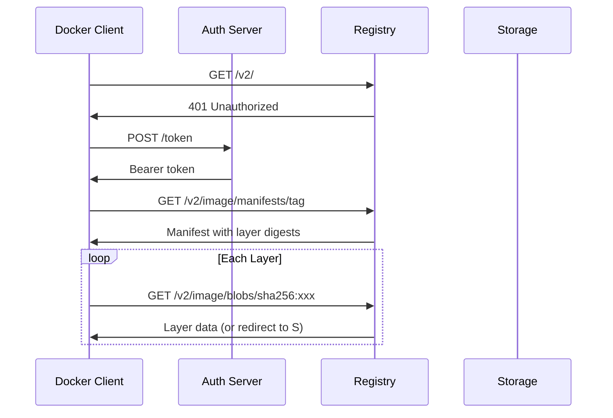

# How to Debug Docker Registry Pull Issues

Author: [nawazdhandala](https://www.github.com/nawazdhandala)

Tags: Docker, Registry, Troubleshooting, DevOps, Containers

Description: Diagnose and fix Docker image pull failures from registries including authentication errors, network issues, manifest problems, and rate limiting.

---

Pulling images from registries should be straightforward, but network issues, authentication problems, and registry-specific behaviors can cause failures. This guide covers systematic debugging of pull issues across Docker Hub, private registries, and cloud provider registries.

## Understanding the Pull Process

When you run `docker pull`, several steps happen:



## Common Error Messages

| Error | Likely Cause |
|-------|--------------|
| `unauthorized: authentication required` | Missing or invalid credentials |
| `manifest unknown` | Image or tag does not exist |
| `denied: requested access denied` | No permission to pull |
| `timeout` | Network or DNS issues |
| `certificate error` | TLS/SSL problems |
| `rate limit exceeded` | Too many pulls |

## Authentication Issues

### Docker Hub Authentication

```bash
# Check if logged in
docker login

# View stored credentials
cat ~/.docker/config.json | jq '.auths'

# Test authentication
TOKEN=$(curl -s -u username:password "https://auth.docker.io/token?service=registry.docker.io&scope=repository:library/alpine:pull" | jq -r .token)
echo $TOKEN | cut -c1-50
```

### Private Registry Authentication

```bash
# Login to private registry
docker login registry.example.com

# Login with credentials
docker login -u username -p password registry.example.com

# For CI/CD, use stdin
echo $REGISTRY_PASSWORD | docker login -u $REGISTRY_USER --password-stdin registry.example.com
```

### Cloud Provider Registries

```bash
# AWS ECR
aws ecr get-login-password --region us-east-1 | \
  docker login --username AWS --password-stdin 123456789.dkr.ecr.us-east-1.amazonaws.com

# Google Container Registry / Artifact Registry
gcloud auth configure-docker gcr.io
gcloud auth configure-docker us-docker.pkg.dev

# Azure Container Registry
az acr login --name myregistry
```

### Debugging Authentication

```bash
# Test registry authentication manually
curl -v https://registry.example.com/v2/

# Get authentication challenge
curl -sI https://registry.example.com/v2/ | grep -i www-authenticate

# Test with token
TOKEN="your-token"
curl -H "Authorization: Bearer $TOKEN" https://registry.example.com/v2/_catalog
```

## Manifest and Tag Issues

### Image or Tag Not Found

```bash
# Error: manifest unknown: manifest unknown

# Check if image exists
docker manifest inspect nginx:nonexistent
# manifest unknown

# List available tags
curl -s https://registry.hub.docker.com/v2/repositories/library/nginx/tags?page_size=100 | jq '.results[].name'

# For private registries
curl -s -H "Authorization: Bearer $TOKEN" https://registry.example.com/v2/myapp/tags/list
```

### Multi-Platform Manifest Issues

```bash
# Error: no matching manifest for linux/arm64

# Check available platforms
docker manifest inspect nginx:alpine | jq '.manifests[].platform'

# Pull specific platform
docker pull --platform linux/amd64 nginx:alpine
```

## Network and Connectivity Issues

### DNS Resolution

```bash
# Test DNS resolution
nslookup registry-1.docker.io
dig registry-1.docker.io

# Use different DNS
nslookup registry-1.docker.io 8.8.8.8

# Test inside Docker
docker run --rm alpine nslookup registry-1.docker.io
```

### Connectivity Tests

```bash
# Test basic connectivity
curl -I https://registry-1.docker.io/v2/

# Test with verbose output
curl -v https://registry-1.docker.io/v2/

# Check if port is open
nc -zv registry-1.docker.io 443

# Trace route
traceroute registry-1.docker.io
```

### Proxy Issues

```bash
# Check proxy settings
echo $HTTP_PROXY $HTTPS_PROXY $NO_PROXY

# Test through proxy
curl -x $HTTP_PROXY https://registry-1.docker.io/v2/

# Configure Docker daemon proxy
sudo mkdir -p /etc/systemd/system/docker.service.d
sudo tee /etc/systemd/system/docker.service.d/proxy.conf << EOF
[Service]
Environment="HTTP_PROXY=http://proxy:8080"
Environment="HTTPS_PROXY=http://proxy:8080"
Environment="NO_PROXY=localhost,127.0.0.1"
EOF
sudo systemctl daemon-reload
sudo systemctl restart docker
```

## TLS and Certificate Issues

### Certificate Errors

```bash
# Error: x509: certificate signed by unknown authority

# Test TLS connection
openssl s_client -connect registry.example.com:443 -servername registry.example.com

# View certificate
openssl s_client -connect registry.example.com:443 2>/dev/null | openssl x509 -text | head -30

# Check certificate chain
curl -vI https://registry.example.com/v2/ 2>&1 | grep -A 10 "Server certificate"
```

### Self-Signed Certificates

```bash
# Add certificate to Docker
sudo mkdir -p /etc/docker/certs.d/registry.example.com:5000
sudo cp ca.crt /etc/docker/certs.d/registry.example.com:5000/

# Or configure insecure registry (not recommended for production)
# /etc/docker/daemon.json
{
  "insecure-registries": ["registry.example.com:5000"]
}
```

### Update CA Certificates

```bash
# Debian/Ubuntu
sudo apt update && sudo apt install -y ca-certificates
sudo update-ca-certificates

# RHEL/CentOS
sudo yum install -y ca-certificates
sudo update-ca-trust
```

## Rate Limiting

### Docker Hub Rate Limits

```bash
# Check current rate limit status
TOKEN=$(curl -s "https://auth.docker.io/token?service=registry.docker.io&scope=repository:library/alpine:pull" | jq -r .token)
curl -sI -H "Authorization: Bearer $TOKEN" https://registry-1.docker.io/v2/library/alpine/manifests/latest | grep -i ratelimit

# Rate limit headers
# ratelimit-limit: 100;w=21600
# ratelimit-remaining: 95;w=21600
```

### Solutions for Rate Limiting

```bash
# Login to increase limits
docker login

# Use registry mirror
# /etc/docker/daemon.json
{
  "registry-mirrors": ["https://mirror.gcr.io"]
}

# Cache images locally
docker pull nginx:alpine
docker tag nginx:alpine registry.local:5000/nginx:alpine
docker push registry.local:5000/nginx:alpine
```

## Debugging Pull Progress

### Verbose Pull Output

```bash
# Pull with progress details
docker pull nginx:alpine

# Check what is happening
docker events --filter 'type=image' &
docker pull nginx:alpine
```

### Layer Download Issues

```bash
# Pull stuck on specific layer
# The layer digest is shown in output

# Verify layer exists
curl -sI -H "Authorization: Bearer $TOKEN" \
  https://registry-1.docker.io/v2/library/nginx/blobs/sha256:xxx

# Check layer size
curl -sI -H "Authorization: Bearer $TOKEN" \
  https://registry-1.docker.io/v2/library/nginx/blobs/sha256:xxx | grep content-length
```

## Registry-Specific Debugging

### Docker Hub

```bash
# Check Docker Hub status
curl -s https://status.docker.com/api/v2/status.json | jq

# API endpoint
curl -s https://registry.hub.docker.com/v2/repositories/library/nginx/ | jq
```

### AWS ECR

```bash
# Check ECR repository
aws ecr describe-repositories --repository-names myapp

# Check image details
aws ecr describe-images --repository-name myapp --image-ids imageTag=latest

# Get authorization token
aws ecr get-authorization-token | jq '.authorizationData[0].authorizationToken' | tr -d '"' | base64 -d
```

### Google Artifact Registry

```bash
# List images
gcloud artifacts docker images list us-docker.pkg.dev/PROJECT/REPO

# Check permissions
gcloud artifacts repositories describe REPO --location=us --format="get(iamPolicy)"
```

## Complete Debugging Script

```bash
#!/bin/bash
# debug-pull.sh - Diagnose Docker pull issues

IMAGE=${1:-nginx:alpine}
REGISTRY=$(echo $IMAGE | cut -d'/' -f1)

if [[ "$REGISTRY" == *"."* ]]; then
  REGISTRY_URL="https://$REGISTRY"
else
  REGISTRY_URL="https://registry-1.docker.io"
  REGISTRY="registry-1.docker.io"
fi

echo "=== Debugging pull for: $IMAGE ==="
echo "=== Registry: $REGISTRY ==="

echo -e "\n=== DNS Resolution ==="
nslookup $REGISTRY || echo "DNS failed"

echo -e "\n=== Connectivity Test ==="
curl -sI --connect-timeout 10 "$REGISTRY_URL/v2/" | head -5

echo -e "\n=== TLS Certificate ==="
echo | openssl s_client -connect $REGISTRY:443 -servername $REGISTRY 2>/dev/null | openssl x509 -noout -dates

echo -e "\n=== Authentication Status ==="
if [ -f ~/.docker/config.json ]; then
  cat ~/.docker/config.json | jq ".auths[\"$REGISTRY\"] // \"Not logged in\""
else
  echo "No Docker config found"
fi

echo -e "\n=== Docker Daemon Status ==="
docker info 2>&1 | grep -E "Registry|Server Version|Storage Driver" | head -5

echo -e "\n=== Attempting Pull ==="
docker pull $IMAGE 2>&1 | tail -20

echo -e "\n=== Recent Docker Events ==="
docker events --since 1m --until 0s --filter 'type=image' 2>/dev/null | tail -10
```

## Kubernetes Image Pull Issues

When Kubernetes fails to pull images:

```bash
# Check pod events
kubectl describe pod mypod | grep -A 10 Events

# Check image pull secrets
kubectl get secrets -o name | grep pull

# View secret content
kubectl get secret regcred -o jsonpath='{.data.\.dockerconfigjson}' | base64 -d | jq

# Create image pull secret
kubectl create secret docker-registry regcred \
  --docker-server=registry.example.com \
  --docker-username=user \
  --docker-password=password
```

---

Image pull failures usually come down to authentication, network connectivity, or the image simply not existing. Start with basic connectivity tests, verify authentication, and check that the exact image and tag you are requesting actually exist in the registry. For rate limiting issues, authenticate with Docker Hub or set up a registry mirror.
