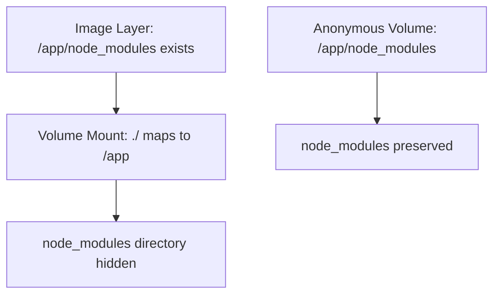

# How to Debug Docker Volume Mount Issues

Author: [nawazdhandala](https://www.github.com/nawazdhandala)

Tags: Docker, Volumes, Troubleshooting, DevOps, Storage

Description: A practical guide to diagnosing and fixing Docker volume mount problems including permission errors, missing files, incorrect paths, and performance issues on different operating systems.

---

Volume mounts are one of the most common sources of Docker frustration. Files disappear, permissions fail, and paths that work on one machine break on another. This guide walks through systematic debugging approaches for the most frequent volume problems.

## Symptom: Files Not Appearing in Container

When files from your host are not visible inside the container, start by verifying the mount actually exists.

```bash
# Check if the volume mount is present in the running container
docker inspect mycontainer --format '{{json .Mounts}}' | jq

# Sample output showing a bind mount
# [
#   {
#     "Type": "bind",
#     "Source": "/home/user/app",
#     "Destination": "/app",
#     "Mode": "rw",
#     "RW": true
#   }
# ]
```

If the `Mounts` array is empty or missing your expected path, the volume was not configured correctly when the container started.

### Verify the Source Path Exists

```bash
# Check if the host path exists and has content
ls -la /home/user/app

# Common mistake: using relative paths that resolve incorrectly
# Wrong: volumes: ["./app:/app"] when running from wrong directory
# The path resolves relative to where docker compose runs, not the compose file

# Check your current directory matches expectations
pwd

# Verify the docker-compose.yml location
docker compose config | grep -A5 volumes
```

### Path Resolution on Different Systems

Docker Desktop on macOS and Windows has specific shared folder requirements.

```bash
# macOS: Paths must be under configured file sharing paths
# Default shared paths: /Users, /Volumes, /private, /tmp, /var/folders

# Check Docker Desktop file sharing settings
# Docker Desktop > Settings > Resources > File sharing

# Windows: Use forward slashes or escaped backslashes
# Correct: /c/Users/myuser/project
# Correct: C:\\Users\\myuser\\project
# Wrong: C:\Users\myuser\project (unescaped backslash)
```

## Symptom: Permission Denied Errors

Permission issues arise when the container user cannot read or write to mounted files.

```bash
# Check what user the container process runs as
docker exec mycontainer id
# uid=1000(node) gid=1000(node) groups=1000(node)

# Check permissions on the mounted directory inside container
docker exec mycontainer ls -la /app
# drwxr-xr-x 2 root root 4096 Jan 25 10:00 .
# -rw-r--r-- 1 root root  123 Jan 25 10:00 config.json

# Problem: container runs as uid 1000, but files owned by root
```

### Fix 1: Match Container User to Host User

```yaml
# docker-compose.yml - Run container as your host user
version: '3.8'

services:
  app:
    image: node:20
    # Use host user's UID and GID
    user: "${UID:-1000}:${GID:-1000}"
    volumes:
      - ./src:/app/src
```

```bash
# Export your user IDs before running
export UID=$(id -u)
export GID=$(id -g)
docker compose up
```

### Fix 2: Adjust Host File Permissions

```bash
# Change ownership on host to match container user
sudo chown -R 1000:1000 ./src

# Or make files world-readable/writable (less secure)
chmod -R 777 ./src
```

### Fix 3: Use Named Volumes with Correct Ownership

```yaml
# Named volumes preserve permissions better than bind mounts
version: '3.8'

services:
  app:
    image: node:20
    volumes:
      - app_data:/app/data
    # Initialize volume with correct ownership
    entrypoint: |
      sh -c 'chown -R node:node /app/data && exec node server.js'
    user: node

volumes:
  app_data:
```

## Symptom: Volume Shows Empty When It Should Have Data

Named volumes can appear empty when mounted over directories that contain image files.

```dockerfile
# Dockerfile
FROM node:20
WORKDIR /app
COPY package*.json ./
RUN npm install
COPY . .
# /app/node_modules now exists in the image
```

```yaml
# docker-compose.yml
services:
  app:
    build: .
    volumes:
      # This hides the node_modules from the image!
      - ./:/app
      # Fix: use anonymous volume to preserve node_modules
      - /app/node_modules
```



### Debugging Volume Content

```bash
# Create a temporary container to inspect volume contents
docker run --rm -v myvolume:/data alpine ls -la /data

# Compare with expected content from image
docker run --rm myimage ls -la /app

# Check if volume has data or is empty
docker volume inspect myvolume --format '{{.Mountpoint}}'
# Then inspect on host (Linux only, requires sudo)
sudo ls -la /var/lib/docker/volumes/myvolume/_data
```

## Symptom: Changes Not Reflected in Container

File changes on the host should appear immediately in the container, but sometimes they do not.

### Cached Filesystem Writes (macOS/Windows)

Docker Desktop uses filesystem caching that can delay synchronization.

```yaml
# docker-compose.yml - Adjust consistency settings
services:
  app:
    volumes:
      # cached: container sees changes eventually (best for reads)
      - ./src:/app/src:cached

      # delegated: host sees changes eventually (best for writes)
      - ./logs:/app/logs:delegated

      # consistent: immediate sync both ways (slowest)
      - ./config:/app/config:consistent
```

### File Watching Issues

Some applications use file watchers that do not detect changes through Docker's virtualized filesystem.

```bash
# Node.js: Enable polling for file watching
# In your application or start script
export CHOKIDAR_USEPOLLING=true
export WATCHPACK_POLLING=true

# Webpack dev server: Enable polling
# webpack.config.js: watchOptions: { poll: 1000 }
```

```yaml
# docker-compose.yml - Set polling environment variables
services:
  frontend:
    environment:
      - CHOKIDAR_USEPOLLING=true
      - WATCHPACK_POLLING=true
```

## Symptom: Slow Volume Performance

Volume I/O can be significantly slower than native filesystem access, especially on macOS and Windows.

### Measure Actual Performance

```bash
# Benchmark write speed inside container
docker exec mycontainer sh -c 'time dd if=/dev/zero of=/app/testfile bs=1M count=100'

# Compare with native performance on host
time dd if=/dev/zero of=./testfile bs=1M count=100
```

### Optimization Strategies

```yaml
# Use delegated consistency for write-heavy workloads
services:
  app:
    volumes:
      - ./data:/app/data:delegated

# Exclude large directories from sync
services:
  app:
    volumes:
      - ./src:/app/src
      - /app/node_modules     # Anonymous volume, not synced
      - /app/.cache           # Exclude cache directories
```

For significant performance issues on macOS, consider using Docker's synchronized file shares feature or third-party tools like Mutagen.

## Diagnostic Commands Reference

```bash
# List all volumes
docker volume ls

# Inspect specific volume
docker volume inspect myvolume

# Check container mount configuration
docker inspect mycontainer --format '{{range .Mounts}}{{.Source}} -> {{.Destination}}{{"\n"}}{{end}}'

# Verify file exists in container
docker exec mycontainer test -f /app/config.json && echo "exists" || echo "missing"

# Check effective permissions
docker exec mycontainer stat /app

# Watch for filesystem events inside container (requires inotify-tools)
docker exec mycontainer inotifywait -m /app
```

## Cleanup Orphaned Volumes

Unused volumes consume disk space and can cause confusion when troubleshooting.

```bash
# List volumes not attached to any container
docker volume ls -f dangling=true

# Remove all unused volumes (careful in production!)
docker volume prune

# Remove specific volume
docker volume rm myvolume
```

---

Most volume mount issues stem from three root causes: incorrect paths, permission mismatches, or filesystem synchronization delays. Start debugging by verifying the mount exists with `docker inspect`, check permissions with `ls -la` inside the container, and test file changes with simple touch operations. Once you identify which category your problem falls into, the fixes become straightforward.
