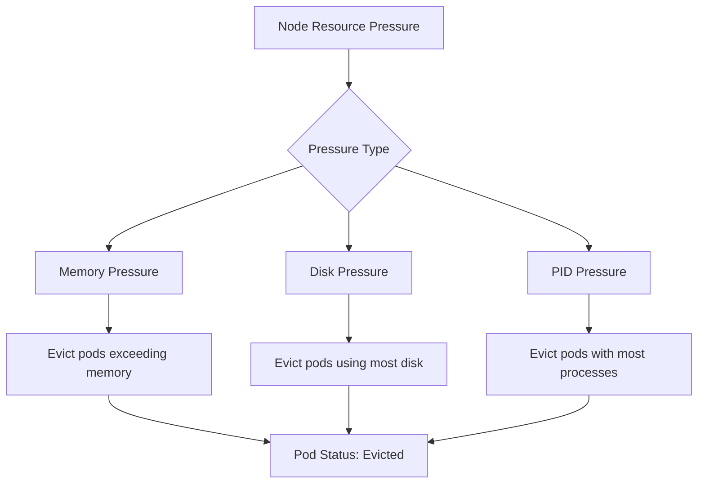

# How to Debug "Evicted" Pod Status Issues

Author: [nawazdhandala](https://www.github.com/nawazdhandala)

Tags: Kubernetes, Debugging, Eviction, Node Pressure, Resource Management, DevOps

Description: Learn how to diagnose and fix pods in Evicted status. This guide covers understanding eviction triggers, node pressure conditions, and implementing strategies to prevent pod evictions in Kubernetes.

---

Pods showing "Evicted" status were forcibly removed from their node. Unlike crashes or failures, evictions are deliberate actions by Kubernetes to protect node stability. Understanding why evictions happen helps you prevent them and keep your applications running.

## Why Pods Get Evicted

Kubernetes evicts pods when nodes face resource pressure:



## Finding Evicted Pods

### List Evicted Pods

```bash
# Find all evicted pods
kubectl get pods -A --field-selector=status.phase=Failed | grep Evicted

# Count evicted pods per namespace
kubectl get pods -A --field-selector=status.phase=Failed -o json | \
  jq -r '.items[] | select(.status.reason=="Evicted") | .metadata.namespace' | \
  sort | uniq -c | sort -rn
```

### Get Eviction Details

```bash
# Describe evicted pod
kubectl describe pod <evicted-pod-name> -n <namespace>

# Look for:
# Status: Failed
# Reason: Evicted
# Message: The node was low on resource: memory
```

### Quick Eviction Report

```bash
#!/bin/bash
# eviction-report.sh

echo "=== Evicted Pods by Namespace ==="
kubectl get pods -A --field-selector=status.phase=Failed -o json | \
  jq -r '.items[] | select(.status.reason=="Evicted") | "\(.metadata.namespace)/\(.metadata.name): \(.status.message)"'

echo -e "\n=== Evictions by Reason ==="
kubectl get pods -A --field-selector=status.phase=Failed -o json | \
  jq -r '.items[] | select(.status.reason=="Evicted") | .status.message' | \
  sort | uniq -c | sort -rn
```

## Cause 1: Memory Pressure

The most common cause. Node runs low on memory and kubelet evicts pods.

### Diagnosis

```bash
# Check node memory conditions
kubectl describe node <node-name> | grep -A 5 "Conditions:"

# Look for:
# MemoryPressure   True

# Check node memory usage
kubectl top node <node-name>

# Check which pods use most memory
kubectl top pods -A --sort-by=memory | head -20
```

### Solutions

**Set Memory Requests and Limits**:

```yaml
resources:
  requests:
    memory: "256Mi"
  limits:
    memory: "512Mi"
```

**Use Pod Priority**:

```yaml
spec:
  priorityClassName: high-priority
```

Higher priority pods are evicted last.

**Add More Nodes**:

```bash
# Scale up cluster (cloud providers)
# GKE
gcloud container clusters resize CLUSTER --num-nodes=5

# EKS
eksctl scale nodegroup --cluster=CLUSTER --name=NODEGROUP --nodes=5
```

## Cause 2: Disk Pressure

Node ephemeral storage or image storage runs low.

### Diagnosis

```bash
# Check node disk conditions
kubectl describe node <node-name> | grep -A 5 "Conditions:"

# Look for:
# DiskPressure   True

# Check disk usage on node
kubectl debug node/<node-name> -it --image=busybox -- df -h
```

### Solutions

**Set Ephemeral Storage Limits**:

```yaml
resources:
  requests:
    ephemeral-storage: "1Gi"
  limits:
    ephemeral-storage: "2Gi"
```

**Clean Up Node**:

```bash
# Remove unused images
crictl rmi --prune

# Remove stopped containers
crictl rm $(crictl ps -a -q --state exited)

# Clean up old log files
find /var/log -type f -name "*.log" -mtime +7 -delete
```

**Use Persistent Volumes Instead**:

```yaml
# Instead of emptyDir with large files
volumes:
  - name: data
    persistentVolumeClaim:
      claimName: myapp-data
```

## Cause 3: PID Pressure

Node runs out of process IDs.

### Diagnosis

```bash
# Check node PID conditions
kubectl describe node <node-name> | grep -A 5 "Conditions:"

# Look for:
# PIDPressure   True

# Check PID usage
kubectl debug node/<node-name> -it --image=busybox -- sh -c 'cat /proc/sys/kernel/pid_max; ls /proc | grep -E "^[0-9]+$" | wc -l'
```

### Solutions

**Limit Container PIDs**:

```yaml
# In container runtime config
pids_limit: 100
```

**Fix Runaway Processes**:

Identify and fix applications that spawn too many processes.

## Preventing Evictions

### Configure Eviction Thresholds

Kubelet eviction thresholds can be tuned (requires node configuration):

```yaml
# kubelet config
evictionHard:
  memory.available: "100Mi"
  nodefs.available: "10%"
  nodefs.inodesFree: "5%"
  imagefs.available: "15%
evictionSoft:
  memory.available: "200Mi"
  nodefs.available: "15%"
evictionSoftGracePeriod:
  memory.available: "1m"
  nodefs.available: "1m"
```

### Use Pod Disruption Budgets

PDBs do not prevent evictions but limit voluntary disruptions:

```yaml
apiVersion: policy/v1
kind: PodDisruptionBudget
metadata:
  name: myapp-pdb
spec:
  minAvailable: 2
  selector:
    matchLabels:
      app: myapp
```

### Set Appropriate Resource Requests

Pods without requests are evicted first:

```yaml
# Burstable QoS - can be evicted
resources:
  requests:
    memory: "256Mi"
  limits:
    memory: "512Mi"

# Guaranteed QoS - evicted last
resources:
  requests:
    memory: "512Mi"
    cpu: "500m"
  limits:
    memory: "512Mi"
    cpu: "500m"
```

### Use Priority Classes

```yaml
apiVersion: scheduling.k8s.io/v1
kind: PriorityClass
metadata:
  name: critical-apps
value: 1000000
preemptionPolicy: PreemptLowerPriority
description: "Critical applications that should not be evicted"
---
apiVersion: apps/v1
kind: Deployment
spec:
  template:
    spec:
      priorityClassName: critical-apps
```

## Monitoring for Evictions

### Prometheus Alerts

```yaml
groups:
  - name: evictions
    rules:
      - alert: PodEvicted
        expr: |
          kube_pod_status_reason{reason="Evicted"} > 0
        for: 1m
        labels:
          severity: warning
        annotations:
          summary: "Pod evicted"
          description: "Pod {{ $labels.namespace }}/{{ $labels.pod }} was evicted"

      - alert: NodeMemoryPressure
        expr: |
          kube_node_status_condition{condition="MemoryPressure",status="true"} == 1
        for: 5m
        labels:
          severity: critical
        annotations:
          summary: "Node memory pressure"
          description: "Node {{ $labels.node }} is under memory pressure"

      - alert: NodeDiskPressure
        expr: |
          kube_node_status_condition{condition="DiskPressure",status="true"} == 1
        for: 5m
        labels:
          severity: critical
        annotations:
          summary: "Node disk pressure"
          description: "Node {{ $labels.node }} is under disk pressure"
```

### Watch Node Conditions

```bash
# Continuous monitoring
watch 'kubectl get nodes -o custom-columns=NAME:.metadata.name,MEMORY_PRESSURE:.status.conditions[?(@.type=="MemoryPressure")].status,DISK_PRESSURE:.status.conditions[?(@.type=="DiskPressure")].status'
```

## Cleaning Up Evicted Pods

Evicted pods remain in Failed state. Clean them up:

```bash
# Delete evicted pods in a namespace
kubectl delete pods -n production --field-selector=status.phase=Failed

# Delete all evicted pods cluster-wide
kubectl get pods -A --field-selector=status.phase=Failed -o json | \
  jq -r '.items[] | select(.status.reason=="Evicted") | "\(.metadata.namespace) \(.metadata.name)"' | \
  while read ns name; do kubectl delete pod $name -n $ns; done
```

### Automated Cleanup

```yaml
apiVersion: batch/v1
kind: CronJob
metadata:
  name: cleanup-evicted-pods
  namespace: kube-system
spec:
  schedule: "0 */6 * * *"  # Every 6 hours
  jobTemplate:
    spec:
      template:
        spec:
          serviceAccountName: evicted-pod-cleaner
          containers:
            - name: cleaner
              image: bitnami/kubectl:latest
              command:
                - /bin/sh
                - -c
                - |
                  kubectl get pods -A --field-selector=status.phase=Failed -o json | \
                  jq -r '.items[] | select(.status.reason=="Evicted") | "\(.metadata.namespace) \(.metadata.name)"' | \
                  while read ns name; do kubectl delete pod $name -n $ns; done
          restartPolicy: OnFailure
```

## Debugging Script

```bash
#!/bin/bash
# eviction-debug.sh

echo "=== Node Conditions ==="
kubectl get nodes -o custom-columns=\
NAME:.metadata.name,\
MEMORY_PRESSURE:.status.conditions[?(@.type==\"MemoryPressure\")].status,\
DISK_PRESSURE:.status.conditions[?(@.type==\"DiskPressure\")].status,\
PID_PRESSURE:.status.conditions[?(@.type==\"PIDPressure\")].status

echo -e "\n=== Node Resource Usage ==="
kubectl top nodes

echo -e "\n=== Recently Evicted Pods ==="
kubectl get pods -A --field-selector=status.phase=Failed -o json | \
  jq -r '.items[] | select(.status.reason=="Evicted") | "\(.metadata.namespace)/\(.metadata.name) - \(.status.message)"' | head -20

echo -e "\n=== Top Memory Consumers ==="
kubectl top pods -A --sort-by=memory | head -15

echo -e "\n=== Pods Without Memory Limits ==="
kubectl get pods -A -o json | \
  jq -r '.items[] | select(.spec.containers[].resources.limits.memory == null) | "\(.metadata.namespace)/\(.metadata.name)"' | head -10
```

---

Pod evictions are Kubernetes protecting your nodes from resource exhaustion. They are symptoms, not the root cause. Set proper resource requests and limits, use priority classes for critical workloads, and monitor node conditions. Prevent the pressure, prevent the eviction.
