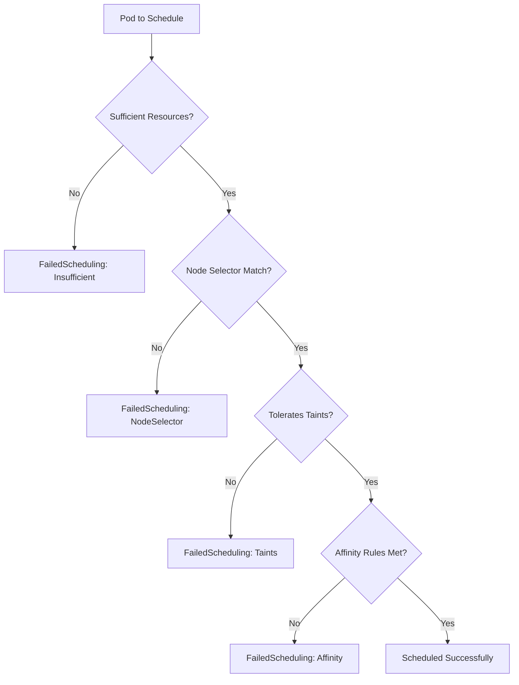

# How to Debug 'FailedScheduling' Errors

Author: [nawazdhandala](https://www.github.com/nawazdhandala)

Tags: Kubernetes, Scheduling, Troubleshooting, DevOps, Nodes

Description: Learn how to diagnose and resolve Kubernetes FailedScheduling errors, including insufficient resources, node selector mismatches, taint issues, and affinity rule conflicts.

---

FailedScheduling errors occur when the Kubernetes scheduler cannot find a suitable node for your pod. The pod stays in Pending status indefinitely until the issue is resolved. This guide walks through the systematic process of identifying and fixing scheduling failures.

## Understanding the Scheduler

The Kubernetes scheduler evaluates each node against multiple criteria:



## Step 1: Identify the Scheduling Error

Start by examining the pod events:

```bash
# Check pod status
kubectl get pods -n production

# Look for scheduling errors in events
kubectl describe pod my-app-xyz -n production | grep -A 10 Events

# Or filter for scheduling events
kubectl get events -n production --field-selector reason=FailedScheduling
```

Common FailedScheduling messages:

```
0/5 nodes are available: 2 Insufficient cpu, 3 node(s) had taints that the pod didn't tolerate
0/5 nodes are available: 5 node(s) didn't match Pod's node affinity/selector
0/5 nodes are available: 3 node(s) had volume node affinity conflict
0/5 nodes are available: 2 node(s) didn't have free ports for the requested pod ports
```

## Step 2: Insufficient Resources

When nodes lack CPU or memory for your pod:

```bash
# Check node capacity and usage
kubectl describe nodes | grep -A 10 "Allocated resources"

# Or get detailed resource info
kubectl top nodes

# Check what the pod is requesting
kubectl get pod my-app-xyz -n production -o jsonpath='{.spec.containers[*].resources}'
```

The issue occurs when:
- Pod requests more resources than any node has available
- Cluster is at capacity

Solutions:

```yaml
# Option 1: Reduce resource requests
apiVersion: apps/v1
kind: Deployment
metadata:
  name: my-app
spec:
  template:
    spec:
      containers:
        - name: app
          resources:
            requests:
              # Reduce requests to fit available capacity
              cpu: "100m"      # Was 500m
              memory: "128Mi"  # Was 512Mi
            limits:
              cpu: "500m"
              memory: "512Mi"
```

```bash
# Option 2: Add more nodes to the cluster
# (Cloud provider specific)

# Option 3: Scale down other workloads
kubectl scale deployment low-priority-app --replicas=0 -n production

# Option 4: Check for resource fragmentation
# Sometimes total capacity exists but is spread across nodes
kubectl describe nodes | grep -E "Capacity|Allocatable|Allocated"
```

## Step 3: Node Selector Mismatch

When pods require specific node labels that do not exist:

```bash
# Check pod's node selector
kubectl get pod my-app-xyz -n production -o jsonpath='{.spec.nodeSelector}'

# List node labels
kubectl get nodes --show-labels

# Check if any nodes have the required label
kubectl get nodes -l gpu=true
```

Solutions:

```bash
# Option 1: Add the label to nodes
kubectl label nodes worker-1 gpu=true

# Option 2: Remove or change the node selector in the deployment
kubectl edit deployment my-app -n production
```

```yaml
# Corrected deployment without strict node selector
apiVersion: apps/v1
kind: Deployment
metadata:
  name: my-app
spec:
  template:
    spec:
      # Remove or update nodeSelector
      # nodeSelector:
      #   gpu: "true"

      # Or use nodeAffinity for more flexibility
      affinity:
        nodeAffinity:
          preferredDuringSchedulingIgnoredDuringExecution:
            - weight: 100
              preference:
                matchExpressions:
                  - key: gpu
                    operator: In
                    values:
                      - "true"
```

## Step 4: Taint and Toleration Issues

When nodes have taints that pods do not tolerate:

```bash
# Check taints on all nodes
kubectl describe nodes | grep -A 3 Taints

# Or list taints in a readable format
kubectl get nodes -o custom-columns='NAME:.metadata.name,TAINTS:.spec.taints'

# Check pod tolerations
kubectl get pod my-app-xyz -n production -o jsonpath='{.spec.tolerations}' | jq .
```

Solutions:

```yaml
# Add tolerations to your deployment
apiVersion: apps/v1
kind: Deployment
metadata:
  name: my-app
spec:
  template:
    spec:
      tolerations:
        # Tolerate the specific taint
        - key: "dedicated"
          operator: "Equal"
          value: "database"
          effect: "NoSchedule"

        # Or tolerate all taints with a key
        - key: "node-role.kubernetes.io/control-plane"
          operator: "Exists"
          effect: "NoSchedule"
```

```bash
# Or remove the taint from nodes
kubectl taint nodes worker-1 dedicated=database:NoSchedule-
```

## Step 5: Affinity Rule Conflicts

Pod affinity and anti-affinity rules can prevent scheduling:

```bash
# Check pod affinity configuration
kubectl get pod my-app-xyz -n production -o yaml | grep -A 30 "affinity:"
```

Common issues:

```yaml
# Problem: Required affinity cannot be satisfied
affinity:
  podAffinity:
    requiredDuringSchedulingIgnoredDuringExecution:
      - labelSelector:
          matchLabels:
            app: database  # No pods with this label exist
        topologyKey: kubernetes.io/hostname

# Solution: Use preferred instead of required
affinity:
  podAffinity:
    preferredDuringSchedulingIgnoredDuringExecution:
      - weight: 100
        podAffinityTerm:
          labelSelector:
            matchLabels:
              app: database
          topologyKey: kubernetes.io/hostname
```

## Step 6: Volume Affinity Conflicts

PersistentVolumes may have node affinity requirements:

```bash
# Check if PVC is bound
kubectl get pvc -n production

# Check PV node affinity
kubectl get pv <pv-name> -o yaml | grep -A 10 "nodeAffinity"

# Check which nodes can satisfy the volume requirement
kubectl describe pv <pv-name> | grep -A 5 "Node Affinity"
```

The pod must be scheduled on a node that can access the volume:

```yaml
# Example: Local volume with node affinity
apiVersion: v1
kind: PersistentVolume
metadata:
  name: local-pv
spec:
  capacity:
    storage: 100Gi
  accessModes:
    - ReadWriteOnce
  local:
    path: /mnt/data
  nodeAffinity:
    required:
      nodeSelectorTerms:
        - matchExpressions:
            - key: kubernetes.io/hostname
              operator: In
              values:
                - worker-1  # Pod must schedule here
```

## Step 7: Port Conflicts

When pods request host ports that are already in use:

```bash
# Check what ports are requested
kubectl get pod my-app-xyz -n production -o jsonpath='{.spec.containers[*].ports[*].hostPort}'

# Find pods using host ports on each node
kubectl get pods -A -o jsonpath='{range .items[*]}{.spec.nodeName}{"\t"}{.spec.containers[*].ports[*].hostPort}{"\n"}{end}' | grep -v "^$"
```

Solutions:
- Use a different host port
- Remove hostPort requirement and use NodePort service instead
- Schedule on a node without the port conflict

## Step 8: PodDisruptionBudget Blocking

PDBs can prevent scheduling during rolling updates:

```bash
# Check PDBs in the namespace
kubectl get pdb -n production

# Describe the PDB
kubectl describe pdb my-app-pdb -n production
```

If too many pods are down, the scheduler may not evict pods to make room.

## Quick Debugging Script

Use this script to diagnose scheduling issues:

```bash
#!/bin/bash
# debug-scheduling.sh

POD=$1
NS=${2:-default}

echo "=== Pod Status ==="
kubectl get pod $POD -n $NS

echo ""
echo "=== Scheduling Events ==="
kubectl describe pod $POD -n $NS | grep -A 20 "Events:"

echo ""
echo "=== Pod Resource Requests ==="
kubectl get pod $POD -n $NS -o jsonpath='{.spec.containers[*].resources}' | jq .

echo ""
echo "=== Pod Node Selector ==="
kubectl get pod $POD -n $NS -o jsonpath='{.spec.nodeSelector}'

echo ""
echo "=== Pod Tolerations ==="
kubectl get pod $POD -n $NS -o jsonpath='{.spec.tolerations}' | jq .

echo ""
echo "=== Node Capacity ==="
kubectl describe nodes | grep -A 5 "Allocated resources"

echo ""
echo "=== Node Taints ==="
kubectl describe nodes | grep -A 3 "Taints:"
```

Usage:

```bash
chmod +x debug-scheduling.sh
./debug-scheduling.sh my-app-xyz production
```

## Prevention Strategies

1. **Set realistic resource requests**: Base requests on actual usage metrics.

2. **Use resource quotas**: Prevent over-commitment at the namespace level.

3. **Monitor cluster capacity**: Alert when available resources drop below threshold.

4. **Test scheduling in staging**: Verify new deployments schedule correctly before production.

5. **Document node labels and taints**: Maintain a reference of your cluster's scheduling constraints.

```yaml
# Example: Deployment with flexible scheduling
apiVersion: apps/v1
kind: Deployment
metadata:
  name: flexible-app
spec:
  replicas: 3
  template:
    spec:
      # Reasonable resource requests
      containers:
        - name: app
          resources:
            requests:
              cpu: "100m"
              memory: "128Mi"

      # Prefer but don't require specific nodes
      affinity:
        nodeAffinity:
          preferredDuringSchedulingIgnoredDuringExecution:
            - weight: 50
              preference:
                matchExpressions:
                  - key: node-type
                    operator: In
                    values:
                      - compute

      # Spread across availability zones
      topologySpreadConstraints:
        - maxSkew: 1
          topologyKey: topology.kubernetes.io/zone
          whenUnsatisfiable: ScheduleAnyway
          labelSelector:
            matchLabels:
              app: flexible-app
```

---

FailedScheduling errors always have a specific cause that you can identify from the pod events. The most common issues are insufficient resources, missing node labels, and untolerated taints. Use `kubectl describe` to read the scheduling failure message, then systematically check each constraint. With the debugging techniques in this guide, you can quickly identify and resolve any scheduling problem.
