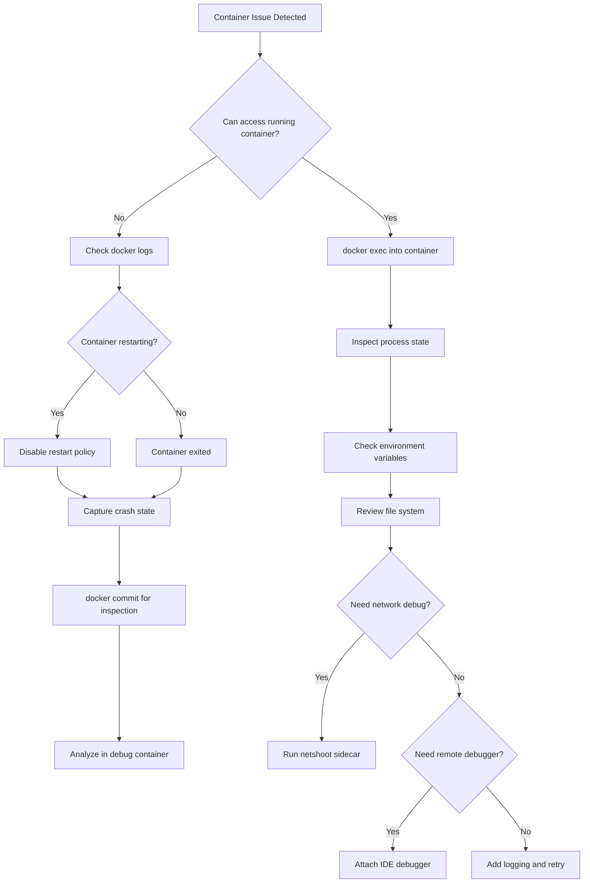

# How to Configure Debugging Tools for Containers

Author: [nawazdhandala](https://www.github.com/nawazdhandala)

Tags: Docker, Debugging, Containers, Developer Experience, DevOps

Description: Learn how to effectively debug applications running in containers using Docker exec, remote debugging, logging strategies, and specialized debugging containers.

---

Debugging containerized applications presents unique challenges. You cannot just attach a debugger or add print statements like you would locally. The container might lack debugging tools, the process might restart on failure, or logs might disappear when containers stop. This guide covers practical techniques for debugging containers in development and production.

## Understanding Container Debugging Challenges

Containers introduce several debugging obstacles:

- **Minimal images**: Production images often lack shells, editors, and debugging tools
- **Ephemeral processes**: Containers restart on failure, losing state
- **Network isolation**: Services communicate through Docker networks, not localhost
- **Log management**: Container logs disappear when containers are removed
- **Process isolation**: Cannot easily attach debuggers to containerized processes

## Basic Docker Debugging Commands

Start with built-in Docker commands:

```bash
# View container logs
docker logs <container_id>

# Follow logs in real-time (like tail -f)
docker logs -f <container_id>

# Show last 100 lines with timestamps
docker logs --tail 100 --timestamps <container_id>

# Inspect container configuration and state
docker inspect <container_id>

# Get specific fields from inspect output
docker inspect --format='{{.State.Status}}' <container_id>
docker inspect --format='{{range .NetworkSettings.Networks}}{{.IPAddress}}{{end}}' <container_id>

# View container resource usage
docker stats <container_id>

# List all processes in container
docker top <container_id>

# View container events
docker events --filter container=<container_id>
```

## Interactive Debugging with Exec

Access a running container's shell:

```bash
# Start an interactive shell (if bash is available)
docker exec -it <container_id> /bin/bash

# For Alpine-based images, use sh
docker exec -it <container_id> /bin/sh

# Run a specific command
docker exec <container_id> env
docker exec <container_id> cat /etc/hosts

# Run as a different user
docker exec -u root <container_id> /bin/bash

# Set environment variables for the exec session
docker exec -e DEBUG=1 <container_id> /bin/bash
```

For containers without shells, use a debug container:

```bash
# Run a debug container that shares the target's namespaces
docker run -it --rm \
  --pid=container:<target_container_id> \
  --net=container:<target_container_id> \
  nicolaka/netshoot \
  /bin/bash

# Now you have access to debugging tools while sharing
# the network and process namespace of the target container
```

## Debug Container with All Tools

Create a debugging sidecar image:

```dockerfile
# Dockerfile.debug
FROM ubuntu:22.04

# Install common debugging tools
RUN apt-get update && apt-get install -y \
    # Network tools
    curl \
    wget \
    netcat \
    dnsutils \
    iputils-ping \
    tcpdump \
    nmap \
    # Process tools
    htop \
    strace \
    lsof \
    procps \
    # File tools
    vim \
    less \
    tree \
    jq \
    # Database clients
    postgresql-client \
    redis-tools \
    mysql-client \
    # Development tools
    git \
    && rm -rf /var/lib/apt/lists/*

# Keep container running
CMD ["sleep", "infinity"]
```

Use it alongside your application:

```yaml
# docker-compose.debug.yml
version: '3.8'

services:
  app:
    build: .
    ports:
      - "3000:3000"
    networks:
      - app-network

  debug:
    build:
      dockerfile: Dockerfile.debug
    networks:
      - app-network
    # Share namespaces for deeper debugging
    pid: "service:app"
    volumes:
      - ./:/app:ro
    stdin_open: true
    tty: true

networks:
  app-network:
```

## Remote Debugging for Node.js

Enable Node.js debugging in containers:

```dockerfile
# Dockerfile for development with debugging
FROM node:20-alpine

WORKDIR /app

COPY package*.json ./
RUN npm ci

COPY . .

# Expose both app port and debug port
EXPOSE 3000 9229

# Start with inspector enabled
CMD ["node", "--inspect=0.0.0.0:9229", "src/index.js"]
```

Docker Compose configuration:

```yaml
# docker-compose.yml
version: '3.8'

services:
  api:
    build:
      context: .
      dockerfile: Dockerfile.dev
    ports:
      - "3000:3000"
      - "9229:9229"  # Debug port
    volumes:
      - ./src:/app/src
    environment:
      - NODE_ENV=development
```

VS Code launch configuration:

```json
// .vscode/launch.json
{
  "version": "0.2.0",
  "configurations": [
    {
      "name": "Docker: Attach to Node",
      "type": "node",
      "request": "attach",
      "port": 9229,
      "address": "localhost",
      "localRoot": "${workspaceFolder}",
      "remoteRoot": "/app",
      "restart": true,
      "sourceMaps": true
    }
  ]
}
```

## Remote Debugging for Python

Enable Python debugging with debugpy:

```dockerfile
# Dockerfile.dev for Python debugging
FROM python:3.11-slim

WORKDIR /app

RUN pip install debugpy

COPY requirements.txt .
RUN pip install -r requirements.txt

COPY . .

EXPOSE 5000 5678

# Start with debugpy listening
CMD ["python", "-m", "debugpy", "--listen", "0.0.0.0:5678", "--wait-for-client", "-m", "flask", "run", "--host=0.0.0.0"]
```

VS Code configuration:

```json
// .vscode/launch.json
{
  "version": "0.2.0",
  "configurations": [
    {
      "name": "Python: Remote Attach",
      "type": "debugpy",
      "request": "attach",
      "connect": {
        "host": "localhost",
        "port": 5678
      },
      "pathMappings": [
        {
          "localRoot": "${workspaceFolder}",
          "remoteRoot": "/app"
        }
      ]
    }
  ]
}
```

## Logging Strategies

Configure structured logging for easier debugging:

```javascript
// src/logger.js
const pino = require('pino');

const logger = pino({
  level: process.env.LOG_LEVEL || 'info',
  formatters: {
    level: (label) => ({ level: label }),
  },
  // Add context to all logs
  base: {
    service: 'api',
    version: process.env.APP_VERSION,
    environment: process.env.NODE_ENV,
  },
  // Pretty print in development
  transport: process.env.NODE_ENV === 'development'
    ? { target: 'pino-pretty' }
    : undefined,
});

// Add request context
const requestLogger = (req, res, next) => {
  req.log = logger.child({
    requestId: req.headers['x-request-id'] || crypto.randomUUID(),
    method: req.method,
    path: req.path,
  });
  next();
};

module.exports = { logger, requestLogger };
```

Docker Compose with log aggregation:

```yaml
# docker-compose.yml
version: '3.8'

services:
  api:
    build: .
    logging:
      driver: "json-file"
      options:
        max-size: "10m"
        max-file: "3"
        labels: "service,environment"
    labels:
      service: "api"
      environment: "development"

  # Optional: Log aggregation with Loki
  loki:
    image: grafana/loki:2.9.0
    ports:
      - "3100:3100"
    volumes:
      - loki_data:/loki

  grafana:
    image: grafana/grafana:latest
    ports:
      - "3001:3000"
    volumes:
      - grafana_data:/var/lib/grafana
    environment:
      - GF_SECURITY_ADMIN_PASSWORD=admin

volumes:
  loki_data:
  grafana_data:
```

## Debugging Crashed Containers

When containers crash, capture information before they restart:

```yaml
# docker-compose.yml
services:
  api:
    build: .
    # Keep container running after main process exits
    # Allows inspection of filesystem and logs
    entrypoint: ["/bin/sh", "-c"]
    command: ["node src/index.js || sleep infinity"]

    # Alternative: Disable automatic restart
    restart: "no"
```

Inspect a stopped container:

```bash
# Copy files from stopped container
docker cp <stopped_container_id>:/app/logs ./crash-logs

# Create an image from the stopped container for inspection
docker commit <stopped_container_id> debug-image

# Run the debug image interactively
docker run -it --rm debug-image /bin/sh
```

## Network Debugging

Debug network connectivity issues:

```bash
# Run netshoot in the same network
docker run -it --rm --network <network_name> nicolaka/netshoot

# Inside netshoot container:

# Test DNS resolution
nslookup api
dig api

# Test connectivity
ping api
curl -v http://api:3000/health

# Trace route
traceroute api

# Check open ports
nmap -p 1-65535 api

# Capture network traffic
tcpdump -i eth0 -w /tmp/capture.pcap host api
```

## Memory and CPU Debugging

Profile resource usage:

```bash
# Real-time resource stats
docker stats

# Detailed memory breakdown
docker exec <container_id> cat /proc/meminfo

# Check for memory limits
docker inspect --format='{{.HostConfig.Memory}}' <container_id>

# Profile Node.js memory
docker exec <container_id> node --expose-gc -e "
  console.log('Memory:', process.memoryUsage());
  global.gc();
  console.log('After GC:', process.memoryUsage());
"

# Generate heap dump (Node.js)
docker exec <container_id> kill -USR2 1
```

## Debugging Workflow Diagram

Here is a typical debugging workflow:



## Best Practices

1. **Build debug images separately**: Keep production images minimal. Use multi-stage builds with debug targets.

2. **Include health checks**: Health checks help identify when containers are unhealthy before they fail completely.

3. **Use structured logging**: JSON logs are easier to search and analyze than plain text.

4. **Preserve crash artifacts**: Configure containers to keep logs and core dumps when they crash.

5. **Document debugging procedures**: Write runbooks for common debugging scenarios so anyone on the team can troubleshoot.

Container debugging requires different techniques than traditional application debugging. By setting up proper tooling, logging, and debug images, you can quickly identify and fix issues in containerized applications without the frustration of working blind.
