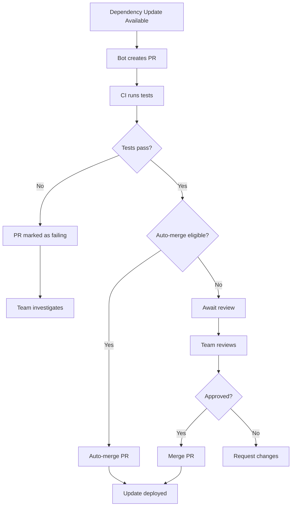

# How to Configure Dependency Update Automation

Author: [nawazdhandala](https://www.github.com/nawazdhandala)

Tags: Dependencies, Automation, Security, Dependabot, Renovate

Description: Learn how to automate dependency updates using Dependabot and Renovate to keep your projects secure and up-to-date without manual intervention.

---

Outdated dependencies are a security risk and a maintenance burden. Every week you delay updating is another week of accumulating version drift. Eventually, the gap becomes so large that updating requires a major effort. Automated dependency updates solve this by creating small, incremental update PRs that keep your project current.

## Why Automate Updates?

Manual dependency management fails for several reasons:

- **Security vulnerabilities**: Patches release frequently; manual tracking misses them
- **Version drift**: Small updates accumulate into large, risky upgrades
- **Time cost**: Checking for updates across many projects is tedious
- **Inconsistency**: Some projects get attention while others are neglected

Automation provides:

- **Immediate security patches**: Critical updates land within hours
- **Incremental updates**: Small changes are easier to test and review
- **Consistent coverage**: All projects receive equal attention
- **Audit trail**: PRs document what changed and why

## Setting Up Dependabot

Dependabot is GitHub's built-in dependency update tool:

```yaml
# .github/dependabot.yml
version: 2
updates:
  # JavaScript/npm dependencies
  - package-ecosystem: "npm"
    directory: "/"
    schedule:
      interval: "weekly"
      day: "monday"
      time: "09:00"
      timezone: "America/New_York"
    # Limit number of PRs to avoid overwhelming
    open-pull-requests-limit: 10
    # Group related updates
    groups:
      development:
        dependency-type: "development"
        update-types:
          - "minor"
          - "patch"
      production:
        dependency-type: "production"
        update-types:
          - "patch"
    # Customize commit messages
    commit-message:
      prefix: "deps"
      include: "scope"
    # Add labels to PRs
    labels:
      - "dependencies"
      - "automated"
    # Assign reviewers
    reviewers:
      - "platform-team"
    # Ignore specific packages
    ignore:
      - dependency-name: "aws-sdk"
        update-types: ["version-update:semver-major"]

  # Python dependencies
  - package-ecosystem: "pip"
    directory: "/"
    schedule:
      interval: "weekly"
    groups:
      python-minor:
        update-types:
          - "minor"
          - "patch"

  # Docker base images
  - package-ecosystem: "docker"
    directory: "/"
    schedule:
      interval: "weekly"
    labels:
      - "docker"
      - "dependencies"

  # GitHub Actions
  - package-ecosystem: "github-actions"
    directory: "/"
    schedule:
      interval: "weekly"
    labels:
      - "ci"
      - "dependencies"

  # Terraform providers
  - package-ecosystem: "terraform"
    directory: "/terraform"
    schedule:
      interval: "weekly"
```

## Configuring Renovate

Renovate offers more advanced features than Dependabot:

```json
// renovate.json
{
  "$schema": "https://docs.renovatebot.com/renovate-schema.json",
  "extends": [
    "config:base",
    ":semanticCommits",
    ":preserveSemverRanges",
    "group:recommended",
    "schedule:earlyMondays"
  ],

  "labels": ["dependencies"],
  "prConcurrentLimit": 10,
  "prHourlyLimit": 5,

  "packageRules": [
    {
      "description": "Auto-merge patch updates for dev dependencies",
      "matchDepTypes": ["devDependencies"],
      "matchUpdateTypes": ["patch"],
      "automerge": true
    },
    {
      "description": "Group ESLint ecosystem updates",
      "matchPackagePatterns": ["^eslint", "^@typescript-eslint"],
      "groupName": "eslint",
      "groupSlug": "eslint"
    },
    {
      "description": "Group testing library updates",
      "matchPackagePatterns": ["^@testing-library", "^jest", "^vitest"],
      "groupName": "testing",
      "groupSlug": "testing"
    },
    {
      "description": "Group TypeScript updates",
      "matchPackagePatterns": ["^typescript", "^@types/"],
      "groupName": "typescript",
      "groupSlug": "typescript"
    },
    {
      "description": "Require approval for major updates",
      "matchUpdateTypes": ["major"],
      "dependencyDashboardApproval": true
    },
    {
      "description": "Delay major updates by 7 days",
      "matchUpdateTypes": ["major"],
      "minimumReleaseAge": "7 days"
    },
    {
      "description": "Pin Docker digests for security",
      "matchDatasources": ["docker"],
      "pinDigests": true
    }
  ],

  "vulnerabilityAlerts": {
    "enabled": true,
    "labels": ["security"]
  },

  "customManagers": [
    {
      "customType": "regex",
      "fileMatch": ["^Dockerfile$"],
      "matchStrings": [
        "ENV NODE_VERSION=(?<currentValue>.*?)\\n"
      ],
      "depNameTemplate": "node",
      "datasourceTemplate": "docker"
    }
  ]
}
```

## Auto-merge Configuration

Automatically merge low-risk updates:

```json
// renovate.json auto-merge settings
{
  "extends": ["config:base"],

  "packageRules": [
    {
      "description": "Auto-merge patch updates if tests pass",
      "matchUpdateTypes": ["patch"],
      "automerge": true,
      "automergeType": "pr",
      "automergeStrategy": "squash"
    },
    {
      "description": "Auto-merge minor updates for dev dependencies",
      "matchDepTypes": ["devDependencies"],
      "matchUpdateTypes": ["minor", "patch"],
      "automerge": true
    },
    {
      "description": "Auto-merge GitHub Actions patch updates",
      "matchManagers": ["github-actions"],
      "matchUpdateTypes": ["patch"],
      "automerge": true
    },
    {
      "description": "Never auto-merge production major updates",
      "matchDepTypes": ["dependencies"],
      "matchUpdateTypes": ["major"],
      "automerge": false,
      "dependencyDashboardApproval": true
    }
  ]
}
```

Configure GitHub to allow auto-merge:

```yaml
# .github/workflows/auto-merge.yml
name: Auto Merge Dependencies

on:
  pull_request:
    types: [opened, synchronize, reopened, ready_for_review]

jobs:
  auto-merge:
    runs-on: ubuntu-latest
    if: github.actor == 'dependabot[bot]' || github.actor == 'renovate[bot]'
    steps:
      - name: Dependabot metadata
        id: metadata
        uses: dependabot/fetch-metadata@v2
        with:
          github-token: ${{ secrets.GITHUB_TOKEN }}

      - name: Enable auto-merge for patch updates
        if: steps.metadata.outputs.update-type == 'version-update:semver-patch'
        run: gh pr merge --auto --squash "$PR_URL"
        env:
          PR_URL: ${{ github.event.pull_request.html_url }}
          GH_TOKEN: ${{ secrets.GITHUB_TOKEN }}
```

## Security Update Handling

Prioritize security updates:

```yaml
# .github/dependabot.yml security configuration
version: 2
updates:
  - package-ecosystem: "npm"
    directory: "/"
    schedule:
      interval: "daily"
    # Only for security updates
    open-pull-requests-limit: 20

# Security alerts are separate from regular updates
# Enable in Repository Settings > Security > Dependabot
```

Renovate security configuration:

```json
{
  "vulnerabilityAlerts": {
    "enabled": true,
    "labels": ["security", "priority:high"],
    "assignees": ["security-team"],
    "schedule": ["at any time"]
  },

  "packageRules": [
    {
      "description": "Immediate security updates",
      "matchUpdateTypes": ["patch"],
      "isVulnerabilityAlert": true,
      "automerge": true,
      "schedule": ["at any time"]
    }
  ]
}
```

## CI Integration

Run tests on dependency update PRs:

```yaml
# .github/workflows/test.yml
name: Test

on:
  push:
    branches: [main]
  pull_request:
    branches: [main]

jobs:
  test:
    runs-on: ubuntu-latest
    steps:
      - uses: actions/checkout@v4

      - name: Setup Node.js
        uses: actions/setup-node@v4
        with:
          node-version: 20
          cache: 'npm'

      - name: Install dependencies
        run: npm ci

      - name: Run tests
        run: npm test

      - name: Build
        run: npm run build

      - name: Check for security issues
        run: npm audit --audit-level=moderate
```

## Update Workflow Diagram

Here is how automated updates flow through your project:



## Grouping Strategies

Reduce PR noise by grouping related updates:

```json
// renovate.json grouping
{
  "packageRules": [
    {
      "groupName": "AWS SDK",
      "matchPackagePatterns": ["^@aws-sdk/", "^aws-"],
      "schedule": ["before 6am on monday"]
    },
    {
      "groupName": "React ecosystem",
      "matchPackageNames": ["react", "react-dom"],
      "matchPackagePatterns": ["^@types/react"]
    },
    {
      "groupName": "All non-major dev dependencies",
      "matchDepTypes": ["devDependencies"],
      "matchUpdateTypes": ["minor", "patch"],
      "groupSlug": "dev-deps"
    },
    {
      "groupName": "All patch updates",
      "matchUpdateTypes": ["patch"],
      "automerge": true,
      "groupSlug": "patches"
    }
  ]
}
```

## Handling Breaking Changes

Major version updates need special attention:

```json
// renovate.json for major updates
{
  "packageRules": [
    {
      "description": "Major updates require dashboard approval",
      "matchUpdateTypes": ["major"],
      "dependencyDashboardApproval": true,
      "labels": ["breaking-change"],
      "reviewers": ["team:platform"]
    },
    {
      "description": "Delay major updates to allow community testing",
      "matchUpdateTypes": ["major"],
      "minimumReleaseAge": "14 days",
      "stabilityDays": 14
    }
  ],

  "prBodyNotes": [
    "### Breaking Change Checklist",
    "- [ ] Reviewed changelog for breaking changes",
    "- [ ] Updated code for API changes",
    "- [ ] Updated tests",
    "- [ ] Tested in staging environment"
  ]
}
```

## Monorepo Configuration

Handle dependencies across multiple packages:

```json
// renovate.json for monorepo
{
  "extends": ["config:base"],

  "ignorePaths": ["**/node_modules/**"],

  "packageRules": [
    {
      "description": "Update root dependencies",
      "matchPaths": ["package.json"],
      "groupName": "root dependencies"
    },
    {
      "description": "Update shared library dependencies together",
      "matchPaths": ["packages/shared/**"],
      "groupName": "shared library"
    },
    {
      "description": "Update all workspace dependencies together",
      "matchManagers": ["npm"],
      "matchPackagePatterns": ["^@myorg/"],
      "groupName": "workspace packages"
    }
  ]
}
```

## Reporting and Dashboards

Track dependency health with Renovate's dashboard:

```json
// renovate.json dashboard configuration
{
  "dependencyDashboard": true,
  "dependencyDashboardTitle": "Dependency Dashboard",
  "dependencyDashboardLabels": ["dependencies"],
  "dependencyDashboardHeader": "This issue tracks pending dependency updates.",

  "packageRules": [
    {
      "description": "Show pending major updates on dashboard",
      "matchUpdateTypes": ["major"],
      "dependencyDashboardApproval": true
    }
  ]
}
```

## Best Practices

1. **Start conservative**: Begin with weekly updates and auto-merge only patches. Expand as confidence grows.

2. **Group related packages**: Update ecosystems together to avoid compatibility issues.

3. **Test thoroughly**: Dependency updates are only safe if your test suite is comprehensive.

4. **Review major updates carefully**: Read changelogs and migration guides before merging.

5. **Monitor for regressions**: Watch metrics after deployments to catch issues early.

Automated dependency updates transform security and maintenance from periodic crises into continuous, manageable work. Each small update is easy to review and low-risk to deploy. Over time, this keeps your codebase current without the massive effort of periodic update marathons.
