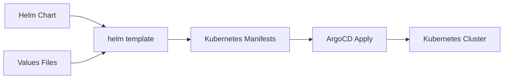

# How to Deploy Helm Charts with ArgoCD

Author: [nawazdhandala](https://www.github.com/nawazdhandala)

Tags: ArgoCD, Helm, Kubernetes, GitOps, Charts, Deployment

Description: A complete guide to deploying Helm charts using ArgoCD, covering chart sources, value files, parameter overrides, and advanced patterns for production deployments.

---

Helm is the package manager for Kubernetes, and ArgoCD has first-class support for Helm charts. You can deploy charts from Helm repositories, Git repositories, or OCI registries. This guide covers all the ways to integrate Helm with your GitOps workflow.

## Helm Support in ArgoCD

ArgoCD does not use `helm install` under the hood. Instead, it runs `helm template` to generate manifests and applies them with `kubectl apply`. This means:

- No Helm releases stored in the cluster
- Consistent GitOps behavior
- Full visibility into what gets deployed
- Same sync and diff behavior as plain manifests



## Deploying from a Helm Repository

The most common pattern is deploying charts from public or private Helm repositories.

### Adding a Helm Repository

First, register the repository with ArgoCD:

```bash
# Using the CLI
argocd repo add https://charts.bitnami.com/bitnami --type helm --name bitnami

# For private repos with credentials
argocd repo add https://charts.example.com --type helm --name private \
  --username admin --password secret
```

Or declaratively with a Secret:

```yaml
# helm-repo-secret.yaml
apiVersion: v1
kind: Secret
metadata:
  name: bitnami-repo
  namespace: argocd
  labels:
    argocd.argoproj.io/secret-type: repository
stringData:
  type: helm
  name: bitnami
  url: https://charts.bitnami.com/bitnami
```

### Creating an Application from a Helm Repo

```yaml
# nginx-app.yaml
apiVersion: argoproj.io/v1alpha1
kind: Application
metadata:
  name: nginx
  namespace: argocd
spec:
  project: default
  source:
    # Helm repository URL
    repoURL: https://charts.bitnami.com/bitnami
    # Chart name
    chart: nginx
    # Chart version
    targetRevision: 15.4.0
    helm:
      # Inline values
      values: |
        replicaCount: 3
        service:
          type: ClusterIP
        resources:
          requests:
            memory: 128Mi
            cpu: 100m
          limits:
            memory: 256Mi
            cpu: 200m
  destination:
    server: https://kubernetes.default.svc
    namespace: nginx
  syncPolicy:
    automated:
      prune: true
    syncOptions:
      - CreateNamespace=true
```

## Deploying from a Git Repository

Store your Helm charts in Git for full GitOps traceability.

### Repository Structure

```
my-app/
├── Chart.yaml
├── values.yaml
├── values-prod.yaml
├── values-staging.yaml
└── templates/
    ├── deployment.yaml
    ├── service.yaml
    └── configmap.yaml
```

### Application Definition

```yaml
# myapp-from-git.yaml
apiVersion: argoproj.io/v1alpha1
kind: Application
metadata:
  name: myapp
  namespace: argocd
spec:
  project: default
  source:
    repoURL: https://github.com/myorg/myapp.git
    targetRevision: HEAD
    path: charts/myapp
    helm:
      # Use environment-specific values file
      valueFiles:
        - values.yaml
        - values-prod.yaml
  destination:
    server: https://kubernetes.default.svc
    namespace: myapp
```

## Deploying from OCI Registry

Modern Helm supports OCI registries for chart storage:

```yaml
apiVersion: argoproj.io/v1alpha1
kind: Application
metadata:
  name: myapp-oci
  namespace: argocd
spec:
  project: default
  source:
    # OCI registry URL
    repoURL: oci://ghcr.io/myorg/charts
    chart: myapp
    targetRevision: 1.0.0
    helm:
      values: |
        replicas: 2
  destination:
    server: https://kubernetes.default.svc
    namespace: myapp
```

Register OCI credentials:

```yaml
apiVersion: v1
kind: Secret
metadata:
  name: ghcr-oci
  namespace: argocd
  labels:
    argocd.argoproj.io/secret-type: repository
stringData:
  type: helm
  name: ghcr-charts
  url: ghcr.io/myorg/charts
  enableOCI: "true"
  username: myuser
  password: ghp_xxxxxxxxxxxx
```

## Helm Parameters and Values

ArgoCD provides multiple ways to customize Helm values.

### Inline Values

Embed values directly in the Application:

```yaml
spec:
  source:
    helm:
      values: |
        image:
          repository: myapp
          tag: v1.2.3
        ingress:
          enabled: true
          hosts:
            - myapp.example.com
```

### Value Files from Git

Reference values files stored in the repository:

```yaml
spec:
  source:
    helm:
      valueFiles:
        - values.yaml
        - environments/production/values.yaml
```

### Individual Parameters

Override specific parameters:

```yaml
spec:
  source:
    helm:
      parameters:
        - name: image.tag
          value: v1.2.3
        - name: replicas
          value: "5"
        # Force string type
        - name: service.port
          value: "8080"
          forceString: true
```

### External Values Files

Reference values from a different repository:

```yaml
spec:
  sources:
    - repoURL: https://charts.bitnami.com/bitnami
      chart: nginx
      targetRevision: 15.4.0
      helm:
        valueFiles:
          # Reference file from another source
          - $values/nginx/production-values.yaml
    - repoURL: https://github.com/myorg/helm-values.git
      targetRevision: HEAD
      ref: values
```

## Helm Hooks

ArgoCD handles Helm hooks specially. By default, hooks are converted to ArgoCD resource hooks.

```yaml
# In your Helm template
apiVersion: batch/v1
kind: Job
metadata:
  name: db-migrate
  annotations:
    # Helm hook becomes ArgoCD hook
    "helm.sh/hook": pre-install,pre-upgrade
    "helm.sh/hook-weight": "-5"
    "helm.sh/hook-delete-policy": hook-succeeded
spec:
  template:
    spec:
      containers:
        - name: migrate
          image: myapp:latest
          command: ["./migrate.sh"]
      restartPolicy: Never
```

To disable hook conversion:

```yaml
spec:
  source:
    helm:
      skipCrds: false
      # Treat hooks as regular resources
      passCredentials: false
```

## Managing Dependencies

### Charts with Dependencies

If your chart has dependencies defined in Chart.yaml:

```yaml
# Chart.yaml
dependencies:
  - name: postgresql
    version: 12.1.0
    repository: https://charts.bitnami.com/bitnami
  - name: redis
    version: 17.3.0
    repository: https://charts.bitnami.com/bitnami
```

ArgoCD automatically runs `helm dependency build` before templating.

### Separate Applications for Dependencies

For better control, deploy dependencies as separate Applications:

```yaml
# database.yaml
apiVersion: argoproj.io/v1alpha1
kind: Application
metadata:
  name: myapp-database
  namespace: argocd
  annotations:
    argocd.argoproj.io/sync-wave: "-1"
spec:
  project: default
  source:
    repoURL: https://charts.bitnami.com/bitnami
    chart: postgresql
    targetRevision: 12.1.0
    helm:
      values: |
        auth:
          postgresPassword: secret
          database: myapp
  destination:
    server: https://kubernetes.default.svc
    namespace: myapp

---
# app.yaml
apiVersion: argoproj.io/v1alpha1
kind: Application
metadata:
  name: myapp
  namespace: argocd
  annotations:
    argocd.argoproj.io/sync-wave: "0"
spec:
  project: default
  source:
    repoURL: https://github.com/myorg/myapp.git
    path: charts/myapp
    helm:
      values: |
        database:
          host: myapp-database-postgresql
  destination:
    server: https://kubernetes.default.svc
    namespace: myapp
```

## Multi-Environment Deployments

Use ApplicationSets to deploy the same chart across environments:

```yaml
apiVersion: argoproj.io/v1alpha1
kind: ApplicationSet
metadata:
  name: myapp-environments
  namespace: argocd
spec:
  generators:
    - list:
        elements:
          - env: dev
            values: values-dev.yaml
            revision: develop
          - env: staging
            values: values-staging.yaml
            revision: main
          - env: prod
            values: values-prod.yaml
            revision: v1.2.3
  template:
    metadata:
      name: 'myapp-{{env}}'
    spec:
      project: default
      source:
        repoURL: https://github.com/myorg/myapp.git
        targetRevision: '{{revision}}'
        path: charts/myapp
        helm:
          valueFiles:
            - values.yaml
            - '{{values}}'
      destination:
        server: https://kubernetes.default.svc
        namespace: 'myapp-{{env}}'
```

## Version Pinning Strategies

### Pin to Specific Version

```yaml
spec:
  source:
    chart: nginx
    targetRevision: 15.4.0  # Exact version
```

### Allow Patch Updates

```yaml
spec:
  source:
    chart: nginx
    targetRevision: 15.4.*  # Any 15.4.x version
```

### Latest Version (Not Recommended for Production)

```yaml
spec:
  source:
    chart: nginx
    targetRevision: "*"  # Latest version
```

## Troubleshooting Helm Deployments

### Preview Rendered Manifests

```bash
# Using CLI
argocd app manifests myapp

# Or with diff
argocd app diff myapp
```

### Debug Template Errors

```bash
# Check repo server logs
kubectl logs -n argocd deployment/argocd-repo-server

# Test locally
helm template myapp ./charts/myapp -f values.yaml
```

### Common Issues

Values not applied:

```yaml
# Wrong: values is a string, not object
helm:
  values: "replicas: 3"

# Correct: values is a YAML block
helm:
  values: |
    replicas: 3
```

Chart not found:

```bash
# Verify the repository is registered
argocd repo list

# Check the chart exists
helm search repo bitnami/nginx
```

---

Helm and ArgoCD work well together once you understand the rendering pipeline. Store your charts in Git for auditability, use value files for environment separation, and let ApplicationSets handle multi-environment deployments. The declarative approach means you can review Helm changes in pull requests just like any other code.
