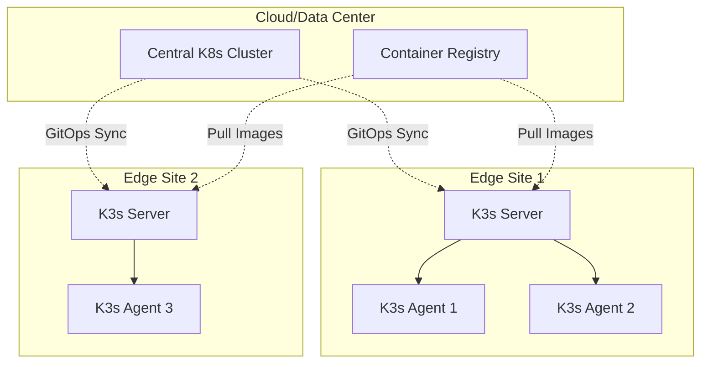

# How to Deploy K3s on Edge Devices

Author: [nawazdhandala](https://www.github.com/nawazdhandala)

Tags: K3s, Edge Computing, Kubernetes, IoT, ARM, Raspberry Pi

Description: A practical guide to deploying K3s, the lightweight Kubernetes distribution, on edge devices. Learn installation, configuration, and management techniques for resource-constrained environments like Raspberry Pi and ARM-based devices.

---

> K3s is a lightweight Kubernetes distribution designed for edge computing, IoT, and resource-constrained environments. It strips away unnecessary components while maintaining full Kubernetes API compatibility, making it ideal for edge deployments.

Edge computing brings compute power closer to data sources, reducing latency and bandwidth costs. K3s, created by Rancher Labs (now SUSE), packages Kubernetes into a single binary under 100MB, perfect for devices with limited memory and storage.

---

## Why K3s for Edge?

Traditional Kubernetes requires significant resources. A standard control plane node needs at least 2 CPUs and 2GB RAM. K3s dramatically reduces these requirements:

- Single binary under 100MB
- Runs on devices with 512MB RAM
- Supports ARM64 and ARMv7 architectures
- Uses SQLite instead of etcd by default
- Includes containerd as the default runtime
- Built-in service load balancer and Helm controller

---

## Prerequisites

Before deploying K3s, ensure your edge device meets these requirements:

- Linux-based OS (Ubuntu, Debian, Raspberry Pi OS)
- At least 512MB RAM (1GB recommended)
- At least 200MB disk space
- SSH access for remote management
- Network connectivity between nodes

For this guide, we will use a Raspberry Pi 4 running Raspberry Pi OS Lite.

---

## Installing K3s Server (Control Plane)

The K3s server acts as the control plane and can also run workloads. Start with a single-node deployment.

### Basic Installation

```bash
# Download and install K3s with a single command
# The INSTALL_K3S_EXEC flag customizes the installation
curl -sfL https://get.k3s.io | sh -

# Check the installation status
sudo systemctl status k3s

# Verify the node is ready
sudo k3s kubectl get nodes
```

### Installation with Custom Options

For edge deployments, you often need specific configurations:

```bash
# Install K3s with custom options for edge environments
# --write-kubeconfig-mode sets permissions for non-root access
# --disable traefik removes the default ingress if you prefer another
# --node-name sets a custom name for easier identification
curl -sfL https://get.k3s.io | INSTALL_K3S_EXEC="server \
  --write-kubeconfig-mode 644 \
  --disable traefik \
  --node-name edge-controller-01 \
  --tls-san 192.168.1.100" sh -
```

### Configuring K3s with a Config File

For production edge deployments, use a configuration file:

```yaml
# /etc/rancher/k3s/config.yaml
# K3s server configuration for edge deployment

# Disable components not needed at the edge
disable:
  - traefik
  - servicelb

# Set resource limits for control plane components
kube-controller-manager-arg:
  - "node-monitor-period=60s"
  - "node-monitor-grace-period=180s"

# Configure container runtime settings
kubelet-arg:
  - "max-pods=50"
  - "eviction-hard=memory.available<100Mi"

# Set custom node labels for edge identification
node-label:
  - "node.kubernetes.io/edge=true"
  - "topology.kubernetes.io/zone=edge-zone-1"

# Enable cluster-init for embedded etcd (optional, for HA)
# cluster-init: true

# Write kubeconfig with proper permissions
write-kubeconfig-mode: "0644"

# Custom data directory (useful for devices with limited storage)
data-dir: /var/lib/rancher/k3s
```

Apply the configuration and restart:

```bash
# Create the config directory if it does not exist
sudo mkdir -p /etc/rancher/k3s

# Copy your configuration
sudo cp config.yaml /etc/rancher/k3s/config.yaml

# Restart K3s to apply changes
sudo systemctl restart k3s
```

---

## Adding Agent Nodes

K3s agents are worker nodes that join the cluster. On edge deployments, you might have multiple devices forming a local cluster.

### Get the Node Token

```bash
# On the server node, get the token for joining agents
sudo cat /var/lib/rancher/k3s/server/node-token
```

### Install K3s Agent

```bash
# On the agent device, install K3s in agent mode
# Replace K3S_URL with your server's address
# Replace K3S_TOKEN with the token from the server
curl -sfL https://get.k3s.io | K3S_URL=https://192.168.1.100:6443 \
  K3S_TOKEN=K10xxxxxxxxxxxxxxxxxxxx sh -

# Verify the agent joined the cluster (run on server)
sudo k3s kubectl get nodes
```

### Agent Configuration for Edge

```yaml
# /etc/rancher/k3s/config.yaml on agent nodes
# Configuration for K3s agent on edge devices

# Server to connect to
server: https://192.168.1.100:6443

# Authentication token
token: K10xxxxxxxxxxxxxxxxxxxx

# Custom node name for identification
node-name: edge-worker-01

# Labels for workload scheduling
node-label:
  - "node.kubernetes.io/edge=true"
  - "edge.device/type=raspberry-pi"

# Kubelet arguments for resource-constrained devices
kubelet-arg:
  - "max-pods=30"
  - "eviction-hard=memory.available<50Mi"
  - "system-reserved=cpu=100m,memory=100Mi"
```

---

## Network Architecture for Edge

Edge deployments often have unique networking requirements. Here is a typical architecture:



---

## Configuring Offline Installation

Edge devices may have intermittent connectivity. Prepare for offline operation:

```bash
# Download K3s binary and images on a connected machine
# Visit https://github.com/k3s-io/k3s/releases for the latest version

# Download the K3s binary
wget https://github.com/k3s-io/k3s/releases/download/v1.28.4+k3s1/k3s

# Download the airgap images tarball
wget https://github.com/k3s-io/k3s/releases/download/v1.28.4+k3s1/k3s-airgap-images-arm64.tar.gz

# Transfer files to the edge device
scp k3s k3s-airgap-images-arm64.tar.gz pi@edge-device:/tmp/
```

On the edge device:

```bash
# Install K3s binary
sudo mv /tmp/k3s /usr/local/bin/
sudo chmod +x /usr/local/bin/k3s

# Create the images directory
sudo mkdir -p /var/lib/rancher/k3s/agent/images/

# Extract airgap images
sudo tar -xzf /tmp/k3s-airgap-images-arm64.tar.gz \
  -C /var/lib/rancher/k3s/agent/images/

# Install K3s (it will use local images)
curl -sfL https://get.k3s.io | INSTALL_K3S_SKIP_DOWNLOAD=true sh -
```

---

## Deploying Workloads to Edge

Create deployments optimized for edge devices:

```yaml
# edge-app-deployment.yaml
# Deployment configured for edge constraints

apiVersion: apps/v1
kind: Deployment
metadata:
  name: edge-sensor-app
  labels:
    app: edge-sensor
spec:
  replicas: 2
  selector:
    matchLabels:
      app: edge-sensor
  template:
    metadata:
      labels:
        app: edge-sensor
    spec:
      # Schedule only on edge nodes
      nodeSelector:
        node.kubernetes.io/edge: "true"

      # Tolerate edge-specific taints
      tolerations:
        - key: "edge.device/resource-limited"
          operator: "Exists"
          effect: "NoSchedule"

      containers:
        - name: sensor-collector
          # Use ARM-compatible images
          image: myregistry/sensor-collector:v1.0-arm64

          # Set strict resource limits for edge
          resources:
            requests:
              memory: "64Mi"
              cpu: "50m"
            limits:
              memory: "128Mi"
              cpu: "200m"

          # Environment variables for edge config
          env:
            - name: COLLECTION_INTERVAL
              value: "30s"
            - name: BATCH_SIZE
              value: "100"
            - name: NODE_NAME
              valueFrom:
                fieldRef:
                  fieldPath: spec.nodeName

          # Mount local storage for buffering
          volumeMounts:
            - name: data-buffer
              mountPath: /data

      volumes:
        - name: data-buffer
          hostPath:
            path: /var/edge-data
            type: DirectoryOrCreate
```

---

## Monitoring K3s on Edge

Set up lightweight monitoring for edge clusters:

```yaml
# node-exporter-daemonset.yaml
# Prometheus node exporter for edge monitoring

apiVersion: apps/v1
kind: DaemonSet
metadata:
  name: node-exporter
  namespace: monitoring
spec:
  selector:
    matchLabels:
      app: node-exporter
  template:
    metadata:
      labels:
        app: node-exporter
    spec:
      # Run on all nodes including control plane
      tolerations:
        - operator: Exists

      containers:
        - name: node-exporter
          image: prom/node-exporter:v1.6.1
          args:
            # Disable collectors not needed on edge
            - "--no-collector.arp"
            - "--no-collector.bcache"
            - "--no-collector.bonding"
            - "--collector.filesystem.mount-points-exclude=^/(dev|proc|sys)($|/)"
          ports:
            - containerPort: 9100
              name: metrics
          resources:
            limits:
              memory: "64Mi"
              cpu: "100m"
            requests:
              memory: "32Mi"
              cpu: "50m"
```

---

## Upgrading K3s on Edge

Upgrade K3s with minimal downtime:

```bash
# Check current version
k3s --version

# Download new version for offline upgrade
wget https://github.com/k3s-io/k3s/releases/download/v1.29.0+k3s1/k3s

# Replace binary and restart
sudo systemctl stop k3s
sudo mv k3s /usr/local/bin/k3s
sudo chmod +x /usr/local/bin/k3s
sudo systemctl start k3s

# Verify upgrade
k3s --version
sudo k3s kubectl get nodes
```

For managed upgrades across multiple edge devices, consider using the system-upgrade-controller:

```yaml
# upgrade-plan.yaml
apiVersion: upgrade.cattle.io/v1
kind: Plan
metadata:
  name: k3s-edge-upgrade
  namespace: system-upgrade
spec:
  concurrency: 1
  channel: https://update.k3s.io/v1-release/channels/stable
  nodeSelector:
    matchExpressions:
      - key: node.kubernetes.io/edge
        operator: Exists
  tolerations:
    - operator: Exists
  drain:
    force: true
    skipWaitForDeleteTimeout: 60
```

---

## Troubleshooting Edge Deployments

Common issues and solutions:

```bash
# Check K3s service status
sudo systemctl status k3s
sudo journalctl -u k3s -f

# View K3s logs with detailed output
sudo k3s server --debug &

# Check node conditions
sudo k3s kubectl describe node edge-controller-01

# Verify container runtime
sudo k3s crictl ps
sudo k3s crictl images

# Check network connectivity
sudo k3s kubectl get pods -n kube-system

# Inspect pod issues
sudo k3s kubectl describe pod <pod-name>
sudo k3s kubectl logs <pod-name>
```

---

## Conclusion

K3s makes Kubernetes viable for edge computing scenarios where resources are limited. By using a single binary, SQLite storage, and optimized components, it brings container orchestration to devices like Raspberry Pi without sacrificing Kubernetes compatibility.

Key takeaways:
- K3s runs on devices with as little as 512MB RAM
- Configuration files simplify management across edge fleets
- Offline installation enables air-gapped deployments
- Resource limits are critical for stable edge operation
- Proper node labels enable targeted workload scheduling

Start with a single-node deployment, then expand to multi-node clusters as your edge computing needs grow.

---

*Building edge computing infrastructure? [OneUptime](https://oneuptime.com) provides monitoring and observability for distributed systems, including edge deployments. Track your K3s clusters alongside your cloud infrastructure with unified dashboards and alerting.*
