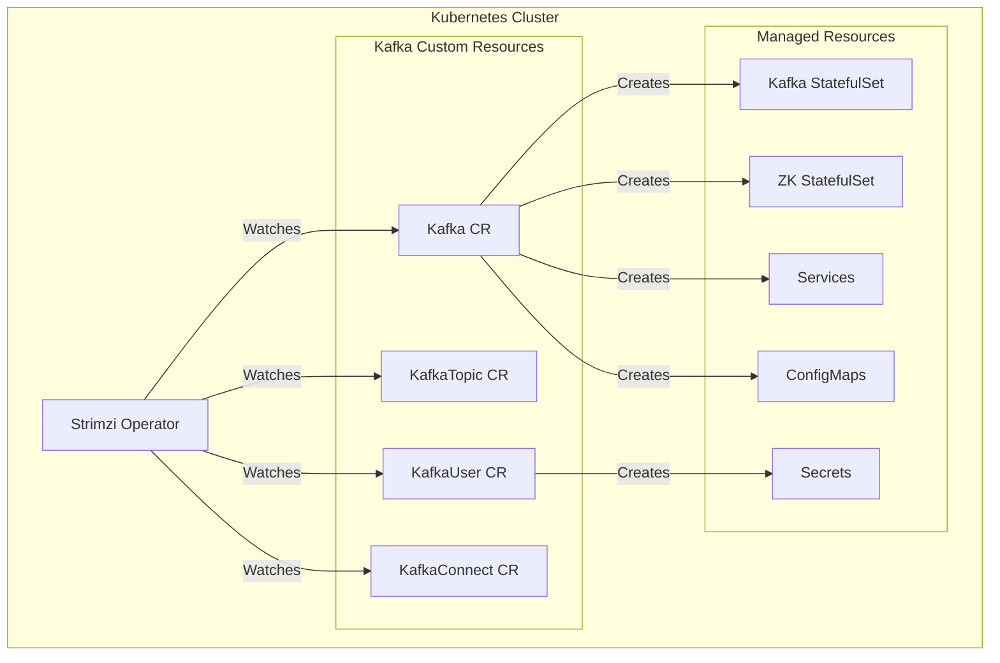

# How to Deploy Kafka on Kubernetes with Strimzi

Author: [nawazdhandala](https://www.github.com/nawazdhandala)

Tags: Kafka, Kubernetes, Strimzi, Cloud Native, Operators

Description: A step-by-step guide to deploying Apache Kafka on Kubernetes using the Strimzi operator, including cluster configuration, topic management, user authentication, and production best practices.

---

Running Kafka on Kubernetes combines Kafka's streaming capabilities with Kubernetes orchestration. Strimzi is the leading Kafka operator that handles the complexity of deploying and managing Kafka clusters as native Kubernetes resources. This guide walks through deploying a production-ready Kafka cluster with Strimzi.

## Why Strimzi?

Strimzi extends Kubernetes with Custom Resource Definitions (CRDs) for Kafka components:



Benefits of Strimzi:
- Declarative Kafka management via YAML
- Automated rolling updates and scaling
- Built-in monitoring with Prometheus
- TLS and SASL authentication out of the box
- Seamless integration with Kubernetes tooling

## Step 1: Install the Strimzi Operator

Deploy the Strimzi operator to manage Kafka resources:

```bash
# Create namespace for Kafka
kubectl create namespace kafka

# Install Strimzi operator (latest stable version)
kubectl create -f 'https://strimzi.io/install/latest?namespace=kafka' -n kafka

# Verify operator is running
kubectl get pods -n kafka -l name=strimzi-cluster-operator

# Check CRDs are installed
kubectl get crds | grep strimzi
```

For production, install via Helm for better control:

```bash
# Add Strimzi Helm repository
helm repo add strimzi https://strimzi.io/charts/
helm repo update

# Install with custom values
helm install strimzi-operator strimzi/strimzi-kafka-operator \
    --namespace kafka \
    --set watchNamespaces="{kafka}" \
    --set resources.requests.memory=256Mi \
    --set resources.requests.cpu=100m
```

## Step 2: Deploy a Kafka Cluster

Create a Kafka cluster using the Kafka custom resource:

```yaml
# kafka-cluster.yaml
apiVersion: kafka.strimzi.io/v1beta2
kind: Kafka
metadata:
  name: production-cluster
  namespace: kafka
spec:
  kafka:
    version: 3.6.0
    replicas: 3

    listeners:
      - name: plain
        port: 9092
        type: internal
        tls: false
      - name: tls
        port: 9093
        type: internal
        tls: true
      - name: external
        port: 9094
        type: loadbalancer
        tls: true
        authentication:
          type: scram-sha-512

    config:
      # Replication settings
      offsets.topic.replication.factor: 3
      transaction.state.log.replication.factor: 3
      transaction.state.log.min.isr: 2
      default.replication.factor: 3
      min.insync.replicas: 2

      # Performance tuning
      num.network.threads: 5
      num.io.threads: 8
      socket.send.buffer.bytes: 102400
      socket.receive.buffer.bytes: 102400
      socket.request.max.bytes: 104857600

      # Log settings
      log.retention.hours: 168
      log.segment.bytes: 1073741824
      log.retention.check.interval.ms: 300000

    storage:
      type: jbod
      volumes:
        - id: 0
          type: persistent-claim
          size: 100Gi
          class: fast-ssd
          deleteClaim: false

    resources:
      requests:
        memory: 4Gi
        cpu: "1"
      limits:
        memory: 8Gi
        cpu: "2"

    jvmOptions:
      -Xms: 2048m
      -Xmx: 4096m

    metricsConfig:
      type: jmxPrometheusExporter
      valueFrom:
        configMapKeyRef:
          name: kafka-metrics
          key: kafka-metrics-config.yml

  zookeeper:
    replicas: 3
    storage:
      type: persistent-claim
      size: 20Gi
      class: fast-ssd
      deleteClaim: false
    resources:
      requests:
        memory: 1Gi
        cpu: "0.5"
      limits:
        memory: 2Gi
        cpu: "1"

  entityOperator:
    topicOperator:
      resources:
        requests:
          memory: 256Mi
          cpu: "0.1"
    userOperator:
      resources:
        requests:
          memory: 256Mi
          cpu: "0.1"
```

Apply the configuration:

```bash
kubectl apply -f kafka-cluster.yaml

# Watch the deployment progress
kubectl get kafka -n kafka -w

# Check pods
kubectl get pods -n kafka -l strimzi.io/cluster=production-cluster

# View cluster status
kubectl get kafka production-cluster -n kafka -o yaml
```

## Step 3: Configure Kafka Topics

Manage topics declaratively:

```yaml
# topics.yaml
apiVersion: kafka.strimzi.io/v1beta2
kind: KafkaTopic
metadata:
  name: orders
  namespace: kafka
  labels:
    strimzi.io/cluster: production-cluster
spec:
  partitions: 12
  replicas: 3
  config:
    retention.ms: 604800000        # 7 days
    segment.bytes: 1073741824      # 1GB segments
    min.insync.replicas: 2
    cleanup.policy: delete
---
apiVersion: kafka.strimzi.io/v1beta2
kind: KafkaTopic
metadata:
  name: user-events
  namespace: kafka
  labels:
    strimzi.io/cluster: production-cluster
spec:
  partitions: 6
  replicas: 3
  config:
    retention.ms: 2592000000       # 30 days
    cleanup.policy: compact,delete
    min.compaction.lag.ms: 3600000
```

Apply and verify:

```bash
kubectl apply -f topics.yaml

# List topics
kubectl get kafkatopics -n kafka

# Describe a topic
kubectl describe kafkatopic orders -n kafka
```

## Step 4: Create Kafka Users

Set up authenticated access with SCRAM-SHA-512:

```yaml
# users.yaml
apiVersion: kafka.strimzi.io/v1beta2
kind: KafkaUser
metadata:
  name: order-service
  namespace: kafka
  labels:
    strimzi.io/cluster: production-cluster
spec:
  authentication:
    type: scram-sha-512
  authorization:
    type: simple
    acls:
      # Producer permissions for orders topic
      - resource:
          type: topic
          name: orders
          patternType: literal
        operations:
          - Write
          - Describe
          - Create
        host: "*"
      # Consumer permissions
      - resource:
          type: topic
          name: orders
          patternType: literal
        operations:
          - Read
          - Describe
        host: "*"
      # Consumer group permissions
      - resource:
          type: group
          name: order-service-group
          patternType: literal
        operations:
          - Read
        host: "*"
---
apiVersion: kafka.strimzi.io/v1beta2
kind: KafkaUser
metadata:
  name: analytics-reader
  namespace: kafka
  labels:
    strimzi.io/cluster: production-cluster
spec:
  authentication:
    type: scram-sha-512
  authorization:
    type: simple
    acls:
      # Read access to all topics starting with 'analytics-'
      - resource:
          type: topic
          name: analytics-
          patternType: prefix
        operations:
          - Read
          - Describe
        host: "*"
```

Apply and retrieve credentials:

```bash
kubectl apply -f users.yaml

# Get generated password
kubectl get secret order-service -n kafka -o jsonpath='{.data.password}' | base64 -d
```

## Step 5: Connect Applications

Deploy applications that connect to Kafka:

```yaml
# order-processor.yaml
apiVersion: apps/v1
kind: Deployment
metadata:
  name: order-processor
  namespace: kafka
spec:
  replicas: 3
  selector:
    matchLabels:
      app: order-processor
  template:
    metadata:
      labels:
        app: order-processor
    spec:
      containers:
        - name: processor
          image: myregistry/order-processor:latest
          env:
            - name: KAFKA_BOOTSTRAP_SERVERS
              value: "production-cluster-kafka-bootstrap:9093"
            - name: KAFKA_SECURITY_PROTOCOL
              value: "SASL_SSL"
            - name: KAFKA_SASL_MECHANISM
              value: "SCRAM-SHA-512"
            - name: KAFKA_SASL_USERNAME
              value: "order-service"
            - name: KAFKA_SASL_PASSWORD
              valueFrom:
                secretKeyRef:
                  name: order-service
                  key: password
            - name: KAFKA_SSL_TRUSTSTORE_LOCATION
              value: "/etc/kafka/certs/ca.crt"
          volumeMounts:
            - name: kafka-certs
              mountPath: /etc/kafka/certs
              readOnly: true
      volumes:
        - name: kafka-certs
          secret:
            secretName: production-cluster-cluster-ca-cert
```

## Step 6: Set Up Monitoring

Create metrics configuration:

```yaml
# kafka-metrics-config.yaml
apiVersion: v1
kind: ConfigMap
metadata:
  name: kafka-metrics
  namespace: kafka
data:
  kafka-metrics-config.yml: |
    lowercaseOutputName: true
    rules:
      - pattern: kafka.server<type=(.+), name=(.+), clientId=(.+), topic=(.+), partition=(.*)><>Value
        name: kafka_server_$1_$2
        type: GAUGE
        labels:
          clientId: "$3"
          topic: "$4"
          partition: "$5"
      - pattern: kafka.server<type=(.+), name=(.+), clientId=(.+), brokerHost=(.+), brokerPort=(.+)><>Value
        name: kafka_server_$1_$2
        type: GAUGE
        labels:
          clientId: "$3"
          broker: "$4:$5"
      - pattern: kafka.server<type=(.+), name=(.+)><>Value
        name: kafka_server_$1_$2
        type: GAUGE
```

Deploy ServiceMonitor for Prometheus:

```yaml
# service-monitor.yaml
apiVersion: monitoring.coreos.com/v1
kind: ServiceMonitor
metadata:
  name: kafka-metrics
  namespace: kafka
  labels:
    app: strimzi
spec:
  selector:
    matchLabels:
      strimzi.io/cluster: production-cluster
      strimzi.io/kind: Kafka
  endpoints:
    - port: tcp-prometheus
      path: /metrics
      interval: 15s
```

## Step 7: Configure Backup and Recovery

Use MirrorMaker 2 for replication:

```yaml
# mirror-maker.yaml
apiVersion: kafka.strimzi.io/v1beta2
kind: KafkaMirrorMaker2
metadata:
  name: cluster-mirror
  namespace: kafka
spec:
  version: 3.6.0
  replicas: 2
  connectCluster: "backup-cluster"
  clusters:
    - alias: "production-cluster"
      bootstrapServers: production-cluster-kafka-bootstrap:9093
      tls:
        trustedCertificates:
          - secretName: production-cluster-cluster-ca-cert
            certificate: ca.crt
    - alias: "backup-cluster"
      bootstrapServers: backup-cluster-kafka-bootstrap:9093
      tls:
        trustedCertificates:
          - secretName: backup-cluster-cluster-ca-cert
            certificate: ca.crt
  mirrors:
    - sourceCluster: "production-cluster"
      targetCluster: "backup-cluster"
      sourceConnector:
        config:
          replication.factor: 3
          offset-syncs.topic.replication.factor: 3
          sync.topic.acls.enabled: "false"
      heartbeatConnector:
        config:
          heartbeats.topic.replication.factor: 3
      checkpointConnector:
        config:
          checkpoints.topic.replication.factor: 3
      topicsPattern: ".*"
      groupsPattern: ".*"
```

## Production Checklist

Before going live:

- [ ] **Storage**: Use dedicated StorageClass with SSD/NVMe
- [ ] **Resources**: Set appropriate CPU/memory requests and limits
- [ ] **Replication**: Configure `min.insync.replicas` >= 2
- [ ] **Authentication**: Enable TLS and SASL for all connections
- [ ] **Monitoring**: Deploy Prometheus and Grafana dashboards
- [ ] **Backup**: Configure MirrorMaker 2 or take regular snapshots
- [ ] **Network Policies**: Restrict pod-to-pod communication
- [ ] **Pod Disruption Budgets**: Prevent all brokers going down simultaneously

```yaml
# pdb.yaml
apiVersion: policy/v1
kind: PodDisruptionBudget
metadata:
  name: kafka-pdb
  namespace: kafka
spec:
  minAvailable: 2
  selector:
    matchLabels:
      strimzi.io/cluster: production-cluster
      strimzi.io/kind: Kafka
```

## Upgrading Kafka

Strimzi handles rolling upgrades:

```yaml
# Update the version in the Kafka CR
spec:
  kafka:
    version: 3.7.0  # New version
```

Apply and watch:

```bash
kubectl apply -f kafka-cluster.yaml

# Watch rolling update
kubectl get pods -n kafka -w -l strimzi.io/cluster=production-cluster
```

---

Strimzi transforms Kafka deployment on Kubernetes from a complex manual process into a declarative, automated operation. Start with the operator installation, define your cluster specification, and let Strimzi handle the operational details. Use KafkaTopic and KafkaUser resources to manage topics and access control as code, and integrate with Prometheus for comprehensive monitoring. With proper configuration, you get a production-ready Kafka cluster that scales with your Kubernetes infrastructure.
