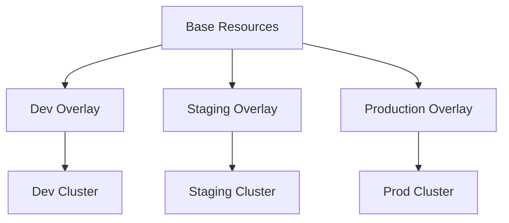

# How to Deploy with Kustomize in ArgoCD

Author: [nawazdhandala](https://www.github.com/nawazdhandala)

Tags: ArgoCD, Kustomize, Kubernetes, GitOps, Configuration Management, Overlays

Description: Learn how to use Kustomize with ArgoCD for template-free Kubernetes configuration management, including base and overlay patterns, strategic merge patches, and multi-environment deployments.

---

Kustomize lets you customize Kubernetes manifests without templates. No curly braces, no Helm values files, just pure YAML with patches. ArgoCD has native support for Kustomize, making it a powerful combination for GitOps workflows.

## Why Kustomize?

Kustomize uses a layered approach:



Benefits:
- No templating syntax to learn
- Standard YAML throughout
- Easy to review changes in PRs
- Built into kubectl since v1.14

## Repository Structure

A typical Kustomize structure for multiple environments:

```
myapp/
├── base/
│   ├── kustomization.yaml
│   ├── deployment.yaml
│   ├── service.yaml
│   └── configmap.yaml
└── overlays/
    ├── development/
    │   ├── kustomization.yaml
    │   └── replica-patch.yaml
    ├── staging/
    │   ├── kustomization.yaml
    │   ├── replica-patch.yaml
    │   └── ingress.yaml
    └── production/
        ├── kustomization.yaml
        ├── replica-patch.yaml
        ├── ingress.yaml
        └── hpa.yaml
```

## Creating a Base

The base contains your common resources:

```yaml
# base/kustomization.yaml
apiVersion: kustomize.config.k8s.io/v1beta1
kind: Kustomization

resources:
  - deployment.yaml
  - service.yaml
  - configmap.yaml
```

```yaml
# base/deployment.yaml
apiVersion: apps/v1
kind: Deployment
metadata:
  name: myapp
spec:
  replicas: 1
  selector:
    matchLabels:
      app: myapp
  template:
    metadata:
      labels:
        app: myapp
    spec:
      containers:
        - name: myapp
          image: myapp:latest
          ports:
            - containerPort: 8080
          env:
            - name: LOG_LEVEL
              value: info
          resources:
            requests:
              memory: 128Mi
              cpu: 100m
            limits:
              memory: 256Mi
              cpu: 200m
```

```yaml
# base/service.yaml
apiVersion: v1
kind: Service
metadata:
  name: myapp
spec:
  selector:
    app: myapp
  ports:
    - port: 80
      targetPort: 8080
```

```yaml
# base/configmap.yaml
apiVersion: v1
kind: ConfigMap
metadata:
  name: myapp-config
data:
  config.json: |
    {
      "feature_flags": {
        "new_ui": false
      }
    }
```

## Creating Overlays

Overlays customize the base for specific environments.

### Development Overlay

```yaml
# overlays/development/kustomization.yaml
apiVersion: kustomize.config.k8s.io/v1beta1
kind: Kustomization

namespace: development

resources:
  - ../../base

# Add common labels
commonLabels:
  environment: development

# Patch the deployment
patches:
  - path: replica-patch.yaml

# Override the image tag
images:
  - name: myapp
    newTag: dev-latest
```

```yaml
# overlays/development/replica-patch.yaml
apiVersion: apps/v1
kind: Deployment
metadata:
  name: myapp
spec:
  replicas: 1
```

### Production Overlay

```yaml
# overlays/production/kustomization.yaml
apiVersion: kustomize.config.k8s.io/v1beta1
kind: Kustomization

namespace: production

resources:
  - ../../base
  - ingress.yaml
  - hpa.yaml

commonLabels:
  environment: production

patches:
  - path: replica-patch.yaml
  - path: resources-patch.yaml

images:
  - name: myapp
    newTag: v1.2.3

# Add ConfigMap generator
configMapGenerator:
  - name: myapp-config
    behavior: merge
    literals:
      - LOG_LEVEL=warn
```

```yaml
# overlays/production/replica-patch.yaml
apiVersion: apps/v1
kind: Deployment
metadata:
  name: myapp
spec:
  replicas: 5
```

```yaml
# overlays/production/resources-patch.yaml
apiVersion: apps/v1
kind: Deployment
metadata:
  name: myapp
spec:
  template:
    spec:
      containers:
        - name: myapp
          resources:
            requests:
              memory: 512Mi
              cpu: 500m
            limits:
              memory: 1Gi
              cpu: 1000m
```

```yaml
# overlays/production/ingress.yaml
apiVersion: networking.k8s.io/v1
kind: Ingress
metadata:
  name: myapp
spec:
  ingressClassName: nginx
  rules:
    - host: myapp.example.com
      http:
        paths:
          - path: /
            pathType: Prefix
            backend:
              service:
                name: myapp
                port:
                  number: 80
```

```yaml
# overlays/production/hpa.yaml
apiVersion: autoscaling/v2
kind: HorizontalPodAutoscaler
metadata:
  name: myapp
spec:
  scaleTargetRef:
    apiVersion: apps/v1
    kind: Deployment
    name: myapp
  minReplicas: 5
  maxReplicas: 20
  metrics:
    - type: Resource
      resource:
        name: cpu
        target:
          type: Utilization
          averageUtilization: 70
```

## ArgoCD Application for Kustomize

Create an ArgoCD Application pointing to an overlay:

```yaml
# argocd/production-app.yaml
apiVersion: argoproj.io/v1alpha1
kind: Application
metadata:
  name: myapp-production
  namespace: argocd
spec:
  project: default
  source:
    repoURL: https://github.com/myorg/myapp.git
    targetRevision: HEAD
    path: overlays/production
  destination:
    server: https://kubernetes.default.svc
    namespace: production
  syncPolicy:
    automated:
      prune: true
      selfHeal: true
    syncOptions:
      - CreateNamespace=true
```

## Kustomize Options in ArgoCD

### Version Selection

ArgoCD bundles Kustomize, but you can specify a version:

```yaml
spec:
  source:
    path: overlays/production
    kustomize:
      version: v5.0.0
```

### Name and Namespace Override

```yaml
spec:
  source:
    path: overlays/production
    kustomize:
      namePrefix: prod-
      nameSuffix: -v1
      namespace: custom-namespace
```

### Common Labels and Annotations

```yaml
spec:
  source:
    path: overlays/production
    kustomize:
      commonLabels:
        managed-by: argocd
        team: platform
      commonAnnotations:
        deployment-time: "2026-01-25"
```

### Image Overrides

Override images without modifying the kustomization.yaml:

```yaml
spec:
  source:
    path: overlays/production
    kustomize:
      images:
        - myapp=myregistry.io/myapp:v2.0.0
        - sidecar=myregistry.io/sidecar:latest
```

## Strategic Merge Patches

Kustomize supports different patching strategies:

### Patch Specific Fields

```yaml
# patches/increase-memory.yaml
apiVersion: apps/v1
kind: Deployment
metadata:
  name: myapp
spec:
  template:
    spec:
      containers:
        - name: myapp
          resources:
            limits:
              memory: 2Gi
```

### JSON Patch

For more precise control:

```yaml
# kustomization.yaml
patches:
  - target:
      kind: Deployment
      name: myapp
    patch: |
      - op: replace
        path: /spec/replicas
        value: 10
      - op: add
        path: /spec/template/spec/containers/0/env/-
        value:
          name: NEW_VAR
          value: "new-value"
```

### Patch Multiple Resources

```yaml
# kustomization.yaml
patches:
  - target:
      kind: Deployment
    patch: |
      - op: add
        path: /metadata/annotations/last-applied
        value: "2026-01-25"
```

## Components

Reusable configuration pieces:

```yaml
# components/monitoring/kustomization.yaml
apiVersion: kustomize.config.k8s.io/v1alpha1
kind: Component

patches:
  - target:
      kind: Deployment
    patch: |
      - op: add
        path: /spec/template/metadata/annotations/prometheus.io~1scrape
        value: "true"
      - op: add
        path: /spec/template/metadata/annotations/prometheus.io~1port
        value: "8080"
```

Use in overlays:

```yaml
# overlays/production/kustomization.yaml
apiVersion: kustomize.config.k8s.io/v1beta1
kind: Kustomization

resources:
  - ../../base

components:
  - ../../components/monitoring
```

## ConfigMap and Secret Generators

Generate ConfigMaps from files or literals:

```yaml
# kustomization.yaml
configMapGenerator:
  - name: app-config
    files:
      - config.json
    literals:
      - LOG_LEVEL=info
      - DEBUG=false

secretGenerator:
  - name: app-secrets
    files:
      - secrets/api-key.txt
    type: Opaque
```

ArgoCD tracks these generated resources correctly.

## Multi-Environment ApplicationSet

Deploy to all environments with one ApplicationSet:

```yaml
apiVersion: argoproj.io/v1alpha1
kind: ApplicationSet
metadata:
  name: myapp
  namespace: argocd
spec:
  generators:
    - list:
        elements:
          - env: development
            cluster: https://kubernetes.default.svc
          - env: staging
            cluster: https://staging.example.com
          - env: production
            cluster: https://prod.example.com
  template:
    metadata:
      name: 'myapp-{{env}}'
    spec:
      project: default
      source:
        repoURL: https://github.com/myorg/myapp.git
        targetRevision: HEAD
        path: 'overlays/{{env}}'
      destination:
        server: '{{cluster}}'
        namespace: '{{env}}'
      syncPolicy:
        automated:
          prune: true
```

## Testing Kustomize Locally

Always test your kustomizations before pushing:

```bash
# Preview the output
kubectl kustomize overlays/production

# Apply locally (dry-run)
kubectl apply -k overlays/production --dry-run=client

# Validate against cluster
kubectl apply -k overlays/production --dry-run=server
```

## Debugging Kustomize in ArgoCD

### Check Rendered Manifests

```bash
# See what ArgoCD will apply
argocd app manifests myapp-production

# Compare with live state
argocd app diff myapp-production
```

### Common Issues

**Resource not found:**
- Verify paths in kustomization.yaml are correct
- Check if base resources exist

**Patch not applied:**
- Ensure resource name matches exactly
- Verify patch syntax is correct

**Namespace conflicts:**
- Set namespace in kustomization.yaml
- Or use ArgoCD destination namespace

```bash
# Check ArgoCD logs
kubectl logs -n argocd deployment/argocd-repo-server
```

## Best Practices

### Keep Base Simple

Base should work standalone for development:

```bash
# Should deploy without errors
kubectl apply -k base/
```

### Use Consistent Naming

Follow a naming convention for overlays:

```
overlays/
├── development/
├── staging/
├── production/
└── feature-x/  # For feature branches
```

### Version Control Images in Overlays

Never use `latest` in production overlays:

```yaml
images:
  - name: myapp
    newTag: v1.2.3  # Specific version
```

### Validate in CI

Add kustomize validation to your CI pipeline:

```yaml
# .github/workflows/validate.yml
- name: Validate Kustomize
  run: |
    for dir in overlays/*/; do
      echo "Validating $dir"
      kubectl kustomize "$dir" > /dev/null
    done
```

---

Kustomize with ArgoCD gives you powerful configuration management without templating complexity. Start with a simple base and gradually add overlays for each environment. The pure YAML approach makes changes easy to review and understand, and ArgoCD handles the rest.
