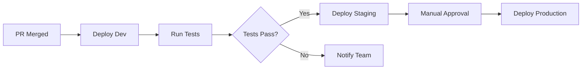

# How to Deploy to Multiple Environments with GitHub Actions

Author: [nawazdhandala](https://www.github.com/nawazdhandala)

Tags: GitHub Actions, Deployment, Environments, CI/CD, DevOps, Staging, Production

Description: Learn how to configure GitHub Actions for multi-environment deployments with proper approval gates, environment-specific secrets, and promotion workflows from development through production.

---

Most applications need multiple environments: development for experimentation, staging for testing, and production for real users. GitHub Actions environments feature gives you a structured way to manage deployments across these stages with proper controls and visibility.

## Environment Architecture

A typical multi-environment setup looks like this:



## Configuring GitHub Environments

First, set up environments in your repository settings (Settings > Environments). Each environment can have:

- Required reviewers
- Wait timers
- Deployment branch restrictions
- Environment-specific secrets

```yaml
# .github/workflows/deploy.yml
name: Deploy

on:
  push:
    branches: [main]
  workflow_dispatch:
    inputs:
      environment:
        description: 'Target environment'
        required: true
        type: choice
        options:
          - development
          - staging
          - production

jobs:
  deploy-dev:
    runs-on: ubuntu-latest
    environment:
      name: development
      url: https://dev.example.com
    steps:
      - uses: actions/checkout@v4

      - name: Deploy to development
        run: |
          echo "Deploying to development environment"
          ./deploy.sh --env development
        env:
          API_KEY: ${{ secrets.API_KEY }}  # Environment-specific secret
          DATABASE_URL: ${{ secrets.DATABASE_URL }}
```

## Sequential Environment Promotion

Deploy through environments in sequence, with each stage depending on the previous:

```yaml
jobs:
  build:
    runs-on: ubuntu-latest
    outputs:
      image-tag: ${{ steps.build.outputs.tag }}
    steps:
      - uses: actions/checkout@v4

      - name: Build application
        id: build
        run: |
          TAG="${GITHUB_SHA::8}"
          docker build -t myapp:$TAG .
          echo "tag=$TAG" >> $GITHUB_OUTPUT

      - name: Push to registry
        run: |
          docker push myapp:${{ steps.build.outputs.tag }}

  deploy-development:
    needs: build
    runs-on: ubuntu-latest
    environment:
      name: development
      url: https://dev.example.com
    steps:
      - uses: actions/checkout@v4

      - name: Deploy to development
        run: |
          kubectl set image deployment/myapp \
            myapp=myapp:${{ needs.build.outputs.image-tag }} \
            --namespace development
        env:
          KUBECONFIG_DATA: ${{ secrets.KUBECONFIG }}

      - name: Run smoke tests
        run: |
          curl -f https://dev.example.com/health || exit 1

  deploy-staging:
    needs: [build, deploy-development]
    runs-on: ubuntu-latest
    environment:
      name: staging
      url: https://staging.example.com
    steps:
      - uses: actions/checkout@v4

      - name: Deploy to staging
        run: |
          kubectl set image deployment/myapp \
            myapp=myapp:${{ needs.build.outputs.image-tag }} \
            --namespace staging
        env:
          KUBECONFIG_DATA: ${{ secrets.KUBECONFIG }}

      - name: Run integration tests
        run: npm run test:integration

  deploy-production:
    needs: [build, deploy-staging]
    runs-on: ubuntu-latest
    environment:
      name: production
      url: https://example.com
    steps:
      - uses: actions/checkout@v4

      - name: Deploy to production
        run: |
          kubectl set image deployment/myapp \
            myapp=myapp:${{ needs.build.outputs.image-tag }} \
            --namespace production
        env:
          KUBECONFIG_DATA: ${{ secrets.KUBECONFIG }}
```

## Environment-Specific Configuration

Use environment secrets and variables for configuration that differs between environments:

```yaml
jobs:
  deploy:
    runs-on: ubuntu-latest
    strategy:
      matrix:
        environment: [development, staging, production]
      max-parallel: 1  # Deploy sequentially
    environment:
      name: ${{ matrix.environment }}
    steps:
      - uses: actions/checkout@v4

      - name: Configure environment
        run: |
          # Secrets are automatically scoped to the environment
          echo "Deploying to ${{ matrix.environment }}"
          echo "Using database: ${{ secrets.DATABASE_URL }}"
          echo "API endpoint: ${{ vars.API_ENDPOINT }}"

      - name: Deploy
        run: |
          ./deploy.sh \
            --env ${{ matrix.environment }} \
            --replicas ${{ vars.REPLICA_COUNT }} \
            --region ${{ vars.AWS_REGION }}
        env:
          AWS_ACCESS_KEY_ID: ${{ secrets.AWS_ACCESS_KEY_ID }}
          AWS_SECRET_ACCESS_KEY: ${{ secrets.AWS_SECRET_ACCESS_KEY }}
```

## Manual Approval Gates

Production deployments often require manual approval. Configure this in the environment settings or use a workflow step:

```yaml
  deploy-production:
    needs: deploy-staging
    runs-on: ubuntu-latest
    environment:
      name: production  # Requires approval if configured in settings
    steps:
      # Alternative: In-workflow approval
      - name: Request approval
        uses: trstringer/manual-approval@v1
        with:
          secret: ${{ github.TOKEN }}
          approvers: devops-team,lead-engineers
          minimum-approvals: 2
          issue-title: "Deploy ${{ github.sha }} to production"

      - name: Deploy after approval
        run: ./deploy.sh --env production
```

## Rollback Strategy

Include rollback capabilities in your deployment workflow:

```yaml
  deploy-with-rollback:
    runs-on: ubuntu-latest
    environment: production
    steps:
      - uses: actions/checkout@v4

      # Store current version before deployment
      - name: Capture current version
        id: current
        run: |
          CURRENT=$(kubectl get deployment myapp -o jsonpath='{.spec.template.spec.containers[0].image}')
          echo "image=$CURRENT" >> $GITHUB_OUTPUT

      - name: Deploy new version
        id: deploy
        run: |
          kubectl set image deployment/myapp myapp=myapp:${{ github.sha }}
          kubectl rollout status deployment/myapp --timeout=5m
        continue-on-error: true

      # Automatic rollback on failure
      - name: Rollback on failure
        if: steps.deploy.outcome == 'failure'
        run: |
          echo "Deployment failed, rolling back to ${{ steps.current.outputs.image }}"
          kubectl set image deployment/myapp myapp=${{ steps.current.outputs.image }}
          kubectl rollout status deployment/myapp
          exit 1  # Fail the workflow after rollback
```

## Feature Branch Preview Environments

Create temporary environments for feature branches:

```yaml
name: Preview Environment

on:
  pull_request:
    types: [opened, synchronize, reopened]

jobs:
  deploy-preview:
    runs-on: ubuntu-latest
    environment:
      name: preview-${{ github.event.number }}
      url: https://pr-${{ github.event.number }}.preview.example.com
    steps:
      - uses: actions/checkout@v4

      - name: Create preview namespace
        run: |
          kubectl create namespace preview-${{ github.event.number }} --dry-run=client -o yaml | kubectl apply -f -

      - name: Deploy preview
        run: |
          helm upgrade --install \
            preview-${{ github.event.number }} ./chart \
            --namespace preview-${{ github.event.number }} \
            --set image.tag=${{ github.sha }} \
            --set ingress.host=pr-${{ github.event.number }}.preview.example.com

      - name: Comment PR with preview URL
        uses: actions/github-script@v7
        with:
          script: |
            github.rest.issues.createComment({
              issue_number: context.issue.number,
              owner: context.repo.owner,
              repo: context.repo.repo,
              body: `Preview deployed: https://pr-${{ github.event.number }}.preview.example.com`
            })

  cleanup-preview:
    if: github.event.action == 'closed'
    runs-on: ubuntu-latest
    steps:
      - name: Delete preview environment
        run: |
          kubectl delete namespace preview-${{ github.event.number }} --ignore-not-found
```

## Parallel vs Sequential Deployment

Choose the right strategy based on your needs:

```yaml
# Parallel deployment to multiple regions
jobs:
  deploy-regions:
    strategy:
      matrix:
        region: [us-east-1, eu-west-1, ap-southeast-1]
      fail-fast: false  # Continue other regions if one fails
    runs-on: ubuntu-latest
    environment:
      name: production-${{ matrix.region }}
    steps:
      - name: Deploy to ${{ matrix.region }}
        run: |
          aws eks update-kubeconfig --region ${{ matrix.region }} --name production
          kubectl apply -f manifests/
        env:
          AWS_ACCESS_KEY_ID: ${{ secrets.AWS_ACCESS_KEY_ID }}
          AWS_SECRET_ACCESS_KEY: ${{ secrets.AWS_SECRET_ACCESS_KEY }}
```

## Deployment Status Notifications

Keep your team informed about deployment progress:

```yaml
  notify-deployment:
    needs: [deploy-production]
    runs-on: ubuntu-latest
    if: always()
    steps:
      - name: Notify Slack on success
        if: needs.deploy-production.result == 'success'
        run: |
          curl -X POST ${{ secrets.SLACK_WEBHOOK }} \
            -H 'Content-Type: application/json' \
            -d '{
              "text": "Deployed ${{ github.sha }} to production",
              "attachments": [{
                "color": "good",
                "fields": [{
                  "title": "Environment",
                  "value": "production",
                  "short": true
                }]
              }]
            }'

      - name: Notify Slack on failure
        if: needs.deploy-production.result == 'failure'
        run: |
          curl -X POST ${{ secrets.SLACK_WEBHOOK }} \
            -H 'Content-Type: application/json' \
            -d '{
              "text": "Production deployment failed!",
              "attachments": [{
                "color": "danger",
                "fields": [{
                  "title": "Commit",
                  "value": "${{ github.sha }}",
                  "short": true
                }]
              }]
            }'
```

## Best Practices

1. **Use environment protection rules** - Require approvals for production, restrict which branches can deploy.

2. **Keep environments isolated** - Each environment should have its own secrets, databases, and infrastructure.

3. **Test in staging first** - Never skip staging. It should mirror production as closely as possible.

4. **Implement health checks** - Verify deployments succeeded with health checks and smoke tests.

5. **Automate rollbacks** - Have automatic rollback triggers based on health check failures.

6. **Track deployments** - Use GitHub's deployment API and environment URLs for visibility.

Multi-environment deployments give you confidence that code works before it reaches users. The extra steps are worth the reduced risk.
