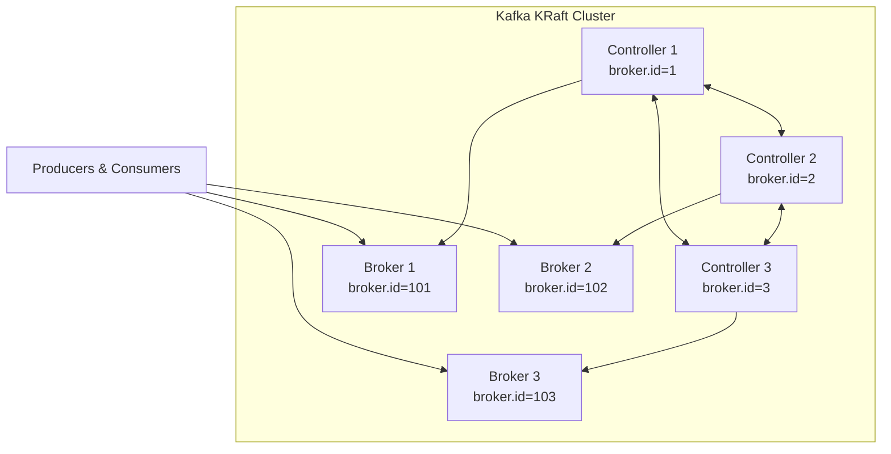

# How to Deploy a Production Kafka Cluster with KRaft

Author: [nawazdhandala](https://www.github.com/nawazdhandala)

Tags: Kafka, KRaft, Distributed Systems, DevOps, Cluster Management

Description: A practical guide to deploying Apache Kafka in production using KRaft mode, eliminating ZooKeeper dependency while maintaining high availability and fault tolerance.

---

Apache Kafka 3.3+ introduced KRaft (Kafka Raft) as the production-ready replacement for ZooKeeper. This simplifies operations significantly by consolidating metadata management into Kafka itself. In this guide, we will walk through deploying a production-grade Kafka cluster using KRaft mode.

## Why KRaft Over ZooKeeper?

ZooKeeper served Kafka well for years, but it introduced operational complexity. You had to maintain two distributed systems instead of one. KRaft brings several advantages:

- **Simpler architecture**: One system to monitor, backup, and scale
- **Faster controller failover**: Metadata is replicated via Raft consensus
- **Better scalability**: Supports millions of partitions per cluster
- **Reduced resource footprint**: No separate ZooKeeper nodes required

## Cluster Architecture Overview

For production, you need at least three nodes to maintain quorum. Here is a typical setup:



Controllers handle cluster metadata, while brokers handle message storage and client requests. In smaller deployments, nodes can run both roles.

## Step 1: Generate the Cluster UUID

Every KRaft cluster needs a unique identifier. Generate it once and use it across all nodes.

```bash
# Generate a unique cluster ID (run once, save the output)
KAFKA_CLUSTER_ID=$(kafka-storage.sh random-uuid)
echo $KAFKA_CLUSTER_ID
# Example output: MkU3OEVBNTcwNTJENDM2Qk
```

Store this ID securely. You will need it when formatting storage on each node.

## Step 2: Configure Controller Nodes

Create the configuration file for controller nodes. Controllers maintain cluster metadata and handle partition leadership elections.

```properties
# /opt/kafka/config/kraft/controller.properties

# Unique identifier for this node
node.id=1

# This node acts as a controller only
process.roles=controller

# Quorum voters: all controllers in the cluster
# Format: node.id@host:port
controller.quorum.voters=1@controller1:9093,2@controller2:9093,3@controller3:9093

# Controller listener configuration
listeners=CONTROLLER://:9093
controller.listener.names=CONTROLLER

# Inter-controller security (use SSL in production)
listener.security.protocol.map=CONTROLLER:PLAINTEXT

# Metadata log directory (separate from broker logs)
log.dirs=/var/kafka-metadata

# Replication settings for metadata
metadata.log.segment.bytes=1073741824
metadata.log.segment.ms=604800000

# Controller performance tuning
controller.quorum.election.timeout.ms=1000
controller.quorum.fetch.timeout.ms=2000
```

## Step 3: Configure Broker Nodes

Brokers handle all client traffic and store messages. Configure them to connect to the controller quorum.

```properties
# /opt/kafka/config/kraft/broker.properties

# Unique broker identifier (must not overlap with controller IDs)
node.id=101

# This node acts as a broker only
process.roles=broker

# Controller quorum for metadata
controller.quorum.voters=1@controller1:9093,2@controller2:9093,3@controller3:9093

# Listener configuration for client connections
listeners=PLAINTEXT://:9092,SSL://:9093
advertised.listeners=PLAINTEXT://broker1.example.com:9092,SSL://broker1.example.com:9093
listener.security.protocol.map=PLAINTEXT:PLAINTEXT,SSL:SSL,CONTROLLER:PLAINTEXT
inter.broker.listener.name=PLAINTEXT

# Controller listener for metadata operations
controller.listener.names=CONTROLLER

# Data directories (use multiple disks for performance)
log.dirs=/var/kafka-data/disk1,/var/kafka-data/disk2

# Replication for fault tolerance
default.replication.factor=3
min.insync.replicas=2

# Log retention
log.retention.hours=168
log.retention.bytes=1073741824000
log.segment.bytes=1073741824

# Network and I/O threads
num.network.threads=8
num.io.threads=16
socket.send.buffer.bytes=102400
socket.receive.buffer.bytes=102400
socket.request.max.bytes=104857600

# Enable unclean leader election only if data loss is acceptable
unclean.leader.election.enable=false
```

## Step 4: Format Storage Directories

Before starting Kafka, format the storage directories with the cluster ID on each node.

```bash
# On each controller node
kafka-storage.sh format \
    --config /opt/kafka/config/kraft/controller.properties \
    --cluster-id MkU3OEVBNTcwNTJENDM2Qk \
    --ignore-formatted

# On each broker node
kafka-storage.sh format \
    --config /opt/kafka/config/kraft/broker.properties \
    --cluster-id MkU3OEVBNTcwNTJENDM2Qk \
    --ignore-formatted
```

The `--ignore-formatted` flag is safe for automation; it skips already-formatted directories.

## Step 5: Create Systemd Service Files

For production deployments, use systemd to manage Kafka processes with proper resource limits and restart policies.

```ini
# /etc/systemd/system/kafka-controller.service

[Unit]
Description=Apache Kafka Controller (KRaft)
After=network.target

[Service]
Type=simple
User=kafka
Group=kafka

# JVM heap settings (adjust based on available memory)
Environment="KAFKA_HEAP_OPTS=-Xms4g -Xmx4g"
Environment="KAFKA_JVM_PERFORMANCE_OPTS=-XX:+UseG1GC -XX:MaxGCPauseMillis=20 -XX:InitiatingHeapOccupancyPercent=35"

ExecStart=/opt/kafka/bin/kafka-server-start.sh /opt/kafka/config/kraft/controller.properties
ExecStop=/opt/kafka/bin/kafka-server-stop.sh

# Restart on failure with backoff
Restart=on-failure
RestartSec=10

# Resource limits
LimitNOFILE=128000
LimitNPROC=64000

[Install]
WantedBy=multi-user.target
```

Create a similar file for brokers, adjusting heap sizes based on workload. Brokers typically need more memory than controllers.

## Step 6: Start the Cluster

Start controllers first, then brokers. The order matters because brokers need to connect to the controller quorum.

```bash
# Start controllers (on each controller node)
sudo systemctl start kafka-controller
sudo systemctl enable kafka-controller

# Wait for controller quorum to form (check logs)
journalctl -u kafka-controller -f

# Start brokers (on each broker node)
sudo systemctl start kafka-broker
sudo systemctl enable kafka-broker
```

## Step 7: Verify Cluster Health

Use the Kafka admin tools to verify your cluster is operational.

```bash
# Check cluster metadata
kafka-metadata.sh --snapshot /var/kafka-metadata/__cluster_metadata-0/00000000000000000000.log --command "cat"

# List brokers in the cluster
kafka-broker-api-versions.sh --bootstrap-server broker1:9092

# Describe cluster
kafka-metadata.sh --bootstrap-server broker1:9092 --command "describe cluster"

# Create a test topic with replication
kafka-topics.sh --bootstrap-server broker1:9092 \
    --create \
    --topic test-topic \
    --partitions 6 \
    --replication-factor 3

# Verify topic creation
kafka-topics.sh --bootstrap-server broker1:9092 \
    --describe \
    --topic test-topic
```

## Production Checklist

Before going live, verify these items:

1. **Network segmentation**: Controllers should only accept connections from brokers and admin tools
2. **Disk monitoring**: Alert when log directories exceed 80% capacity
3. **JVM tuning**: Set heap sizes based on workload testing
4. **TLS encryption**: Enable SSL for all inter-broker and client connections
5. **Authentication**: Configure SASL for client authentication
6. **Backup strategy**: Regularly backup `__cluster_metadata` topic
7. **Monitoring**: Export JMX metrics to Prometheus or your observability platform

## Handling Controller Failures

KRaft uses Raft consensus, so the cluster tolerates `(n-1)/2` controller failures. With three controllers, one can fail without impacting availability. To replace a failed controller:

```bash
# Remove the failed controller from voters (from any healthy controller)
kafka-metadata.sh --bootstrap-server broker1:9092 \
    --command "remove-controller --controller-id 2"

# Format storage on the new node
kafka-storage.sh format \
    --config /opt/kafka/config/kraft/controller.properties \
    --cluster-id MkU3OEVBNTcwNTJENDM2Qk

# Add the new controller to voters
kafka-metadata.sh --bootstrap-server broker1:9092 \
    --command "add-controller --controller-id 4 --controller-endpoint controller4:9093"
```

---

KRaft mode represents a significant operational improvement for Kafka deployments. By eliminating ZooKeeper, you reduce complexity and gain faster failover times. Start with a three-node controller quorum for production, separate controller and broker roles for larger clusters, and always test failover scenarios before going live.
