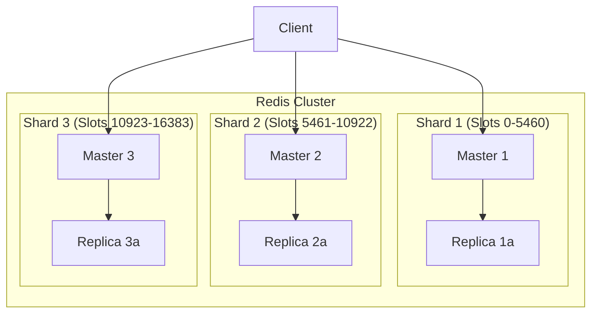

# How to Deploy a Redis Cluster with Auto Sharding and Failover

Author: [nawazdhandala](https://www.github.com/nawazdhandala)

Tags: Redis, Cluster, Sharding, Failover, High Availability, DevOps

Description: Learn how to deploy a production-ready Redis Cluster with automatic sharding across nodes and built-in failover for high availability. This guide covers cluster setup, configuration, and client integration.

---

Running a single Redis instance works fine for small applications, but production systems need horizontal scaling and fault tolerance. Redis Cluster provides both through automatic sharding (spreading data across multiple nodes) and failover (promoting replicas when masters fail). This guide walks you through setting up a Redis Cluster from scratch.

## Redis Cluster Architecture

Redis Cluster uses a shared-nothing architecture where data is automatically partitioned across multiple master nodes. Each master can have one or more replicas for redundancy.



Redis uses hash slots (16384 total) to determine which node holds each key. The key is hashed, and the hash determines which slot (and therefore which master) owns that data.

## Prerequisites

For a production Redis Cluster, you need at least 6 nodes: 3 masters and 3 replicas. This ensures that if one master fails, its replica can be promoted and the cluster remains operational with majority consensus.

Let's set up the infrastructure.

## Cluster Node Configuration

Each node needs a specific configuration file. Create this template for each node, changing the port number.

```bash
# redis-7001.conf
# Configuration for first cluster node

port 7001
cluster-enabled yes
cluster-config-file nodes-7001.conf
cluster-node-timeout 5000

# Persistence settings
appendonly yes
appendfilename "appendonly-7001.aof"
dir /var/lib/redis/7001

# Memory management
maxmemory 2gb
maxmemory-policy allkeys-lru

# Security
requirepass your-strong-password
masterauth your-strong-password

# Network
bind 0.0.0.0
protected-mode no

# Logging
logfile /var/log/redis/redis-7001.log
loglevel notice
```

Create similar files for ports 7002, 7003, 7004, 7005, and 7006.

## Docker Compose Setup

For easier deployment, here's a Docker Compose configuration that sets up a 6-node cluster.

```yaml
# docker-compose.yml
# Redis Cluster with 3 masters and 3 replicas
version: '3.8'

services:
  redis-node-1:
    image: redis:7.2-alpine
    container_name: redis-node-1
    command: redis-server /usr/local/etc/redis/redis.conf
    ports:
      - "7001:7001"
      - "17001:17001"
    volumes:
      - ./config/redis-7001.conf:/usr/local/etc/redis/redis.conf
      - redis-data-1:/data
    networks:
      redis-cluster:
        ipv4_address: 172.28.0.11

  redis-node-2:
    image: redis:7.2-alpine
    container_name: redis-node-2
    command: redis-server /usr/local/etc/redis/redis.conf
    ports:
      - "7002:7002"
      - "17002:17002"
    volumes:
      - ./config/redis-7002.conf:/usr/local/etc/redis/redis.conf
      - redis-data-2:/data
    networks:
      redis-cluster:
        ipv4_address: 172.28.0.12

  redis-node-3:
    image: redis:7.2-alpine
    container_name: redis-node-3
    command: redis-server /usr/local/etc/redis/redis.conf
    ports:
      - "7003:7003"
      - "17003:17003"
    volumes:
      - ./config/redis-7003.conf:/usr/local/etc/redis/redis.conf
      - redis-data-3:/data
    networks:
      redis-cluster:
        ipv4_address: 172.28.0.13

  redis-node-4:
    image: redis:7.2-alpine
    container_name: redis-node-4
    command: redis-server /usr/local/etc/redis/redis.conf
    ports:
      - "7004:7004"
      - "17004:17004"
    volumes:
      - ./config/redis-7004.conf:/usr/local/etc/redis/redis.conf
      - redis-data-4:/data
    networks:
      redis-cluster:
        ipv4_address: 172.28.0.14

  redis-node-5:
    image: redis:7.2-alpine
    container_name: redis-node-5
    command: redis-server /usr/local/etc/redis/redis.conf
    ports:
      - "7005:7005"
      - "17005:17005"
    volumes:
      - ./config/redis-7005.conf:/usr/local/etc/redis/redis.conf
      - redis-data-5:/data
    networks:
      redis-cluster:
        ipv4_address: 172.28.0.15

  redis-node-6:
    image: redis:7.2-alpine
    container_name: redis-node-6
    command: redis-server /usr/local/etc/redis/redis.conf
    ports:
      - "7006:7006"
      - "17006:17006"
    volumes:
      - ./config/redis-7006.conf:/usr/local/etc/redis/redis.conf
      - redis-data-6:/data
    networks:
      redis-cluster:
        ipv4_address: 172.28.0.16

networks:
  redis-cluster:
    driver: bridge
    ipam:
      config:
        - subnet: 172.28.0.0/16

volumes:
  redis-data-1:
  redis-data-2:
  redis-data-3:
  redis-data-4:
  redis-data-5:
  redis-data-6:
```

## Creating the Cluster

After starting the containers, you need to create the cluster. This command tells Redis which nodes are masters and which are replicas.

```bash
#!/bin/bash
# create-cluster.sh
# Initialize Redis Cluster with 3 masters and 3 replicas

# Wait for all nodes to be ready
sleep 5

# Create the cluster
# --cluster-replicas 1 means each master gets one replica
docker exec -it redis-node-1 redis-cli \
  -a your-strong-password \
  --cluster create \
  172.28.0.11:7001 \
  172.28.0.12:7002 \
  172.28.0.13:7003 \
  172.28.0.14:7004 \
  172.28.0.15:7005 \
  172.28.0.16:7006 \
  --cluster-replicas 1

echo "Cluster created successfully"
```

## Verifying Cluster Status

Check that the cluster is healthy and all nodes are communicating.

```bash
# Check cluster info
docker exec -it redis-node-1 redis-cli -a your-strong-password -p 7001 cluster info

# Check cluster nodes and their roles
docker exec -it redis-node-1 redis-cli -a your-strong-password -p 7001 cluster nodes

# Check slot distribution
docker exec -it redis-node-1 redis-cli -a your-strong-password -p 7001 cluster slots
```

Example output from `cluster nodes`:

```
a1b2c3d4... 172.28.0.11:7001@17001 myself,master - 0 0 1 connected 0-5460
e5f6g7h8... 172.28.0.12:7002@17002 master - 0 1234567890 2 connected 5461-10922
i9j0k1l2... 172.28.0.13:7003@17003 master - 0 1234567891 3 connected 10923-16383
m3n4o5p6... 172.28.0.14:7004@17004 slave a1b2c3d4... 0 1234567892 1 connected
q7r8s9t0... 172.28.0.15:7005@17005 slave e5f6g7h8... 0 1234567893 2 connected
u1v2w3x4... 172.28.0.16:7006@17006 slave i9j0k1l2... 0 1234567894 3 connected
```

## Connecting from Node.js

Use the ioredis library with cluster mode enabled. It automatically handles MOVED and ASK redirections.

```javascript
// cluster-client.js
// Redis Cluster client with automatic failover handling
const Redis = require('ioredis');

const cluster = new Redis.Cluster([
  { host: '172.28.0.11', port: 7001 },
  { host: '172.28.0.12', port: 7002 },
  { host: '172.28.0.13', port: 7003 },
], {
  redisOptions: {
    password: 'your-strong-password',
  },
  // Retry strategy for failed commands
  clusterRetryStrategy: (times) => {
    if (times > 3) {
      console.error('Cluster retry limit reached');
      return null; // Stop retrying
    }
    return Math.min(times * 100, 3000);
  },
  // Enable read from replicas for read scaling
  scaleReads: 'slave',
  // Maximum number of redirections to follow
  maxRedirections: 16,
});

cluster.on('connect', () => console.log('Connected to Redis Cluster'));
cluster.on('error', (err) => console.error('Cluster error:', err));

// Node addition/removal events
cluster.on('+node', (node) => {
  console.log('Node added:', node.options.host, node.options.port);
});

cluster.on('-node', (node) => {
  console.log('Node removed:', node.options.host, node.options.port);
});

module.exports = cluster;
```

## Hash Tags for Multi-Key Operations

Redis Cluster cannot run commands that span multiple keys across different slots. Use hash tags to ensure related keys land on the same node.

```javascript
// hash-tags.js
// Using hash tags to colocate related keys on the same node
const cluster = require('./cluster-client');

// Without hash tag - these keys might be on different nodes
// MGET user:1001 user:1002 would fail if keys are on different nodes

// With hash tag - all keys with same tag go to same slot
// The {user} part determines the slot, rest of key can vary
async function getUserWithProfile(userId) {
  // Both keys will be on the same node because they share {user:1001}
  const userKey = `{user:${userId}}:info`;
  const profileKey = `{user:${userId}}:profile`;

  // This multi-key operation works because both keys are colocated
  const [userInfo, profile] = await cluster.mget(userKey, profileKey);

  return {
    info: JSON.parse(userInfo),
    profile: JSON.parse(profile),
  };
}

// Transaction example with hash tags
async function transferCredits(fromUserId, toUserId, amount) {
  // For transactions, we need a workaround since users are likely on different nodes
  // Option 1: Use Lua script (runs on single node, so limited)
  // Option 2: Use hash tag to force same slot (but couples unrelated users)
  // Option 3: Use two separate operations with application-level consistency

  // Here we use separate operations with logging for consistency
  const pipeline = cluster.pipeline();

  pipeline.decrby(`{credits}:${fromUserId}`, amount);
  pipeline.incrby(`{credits}:${toUserId}`, amount);

  // Note: This only works if both keys are on the same node (same hash tag prefix)
  // For different users, you need distributed transaction handling

  const results = await pipeline.exec();
  return results;
}

module.exports = { getUserWithProfile, transferCredits };
```

## Handling Failover

The cluster automatically handles master failures by promoting replicas. Here's how to monitor and handle failover events in your application.

```javascript
// failover-handler.js
// Monitor and respond to cluster failover events
const cluster = require('./cluster-client');

// Track cluster state for monitoring
let clusterState = {
  lastFailover: null,
  failoverCount: 0,
  currentMasters: new Set(),
};

// Listen for cluster events
cluster.on('node error', (err, address) => {
  console.error(`Node ${address} error:`, err.message);
});

cluster.on('ready', async () => {
  console.log('Cluster is ready');
  await updateClusterState();
});

// Periodically check cluster health
async function checkClusterHealth() {
  try {
    const nodes = cluster.nodes('master');

    for (const node of nodes) {
      const info = await node.info('replication');
      console.log(`Master ${node.options.host}:${node.options.port} - connected slaves: ${
        info.match(/connected_slaves:(\d+)/)?.[1] || 0
      }`);
    }

    // Check for slot coverage
    const clusterInfo = await cluster.cluster('info');
    const stateMatch = clusterInfo.match(/cluster_state:(\w+)/);

    if (stateMatch && stateMatch[1] !== 'ok') {
      console.error('Cluster state is not OK:', stateMatch[1]);
      // Trigger alert or recovery procedure
    }
  } catch (error) {
    console.error('Health check failed:', error);
  }
}

async function updateClusterState() {
  const nodes = cluster.nodes('master');
  const newMasters = new Set(nodes.map(n => `${n.options.host}:${n.options.port}`));

  // Detect master changes (potential failover)
  for (const master of clusterState.currentMasters) {
    if (!newMasters.has(master)) {
      console.log(`Master removed: ${master}`);
      clusterState.failoverCount++;
      clusterState.lastFailover = new Date();
    }
  }

  for (const master of newMasters) {
    if (!clusterState.currentMasters.has(master)) {
      console.log(`New master detected: ${master}`);
    }
  }

  clusterState.currentMasters = newMasters;
}

// Run health check every 10 seconds
setInterval(checkClusterHealth, 10000);

module.exports = { checkClusterHealth, clusterState };
```

## Adding Nodes to the Cluster

Scale your cluster by adding new nodes without downtime.

```bash
#!/bin/bash
# add-node.sh
# Add a new node to the existing cluster

NEW_NODE_IP="172.28.0.17"
NEW_NODE_PORT="7007"
EXISTING_NODE="172.28.0.11:7001"

# Add as a new master
redis-cli -a your-strong-password --cluster add-node \
  ${NEW_NODE_IP}:${NEW_NODE_PORT} \
  ${EXISTING_NODE}

# Rebalance slots to include the new master
redis-cli -a your-strong-password --cluster rebalance \
  ${EXISTING_NODE} \
  --cluster-use-empty-masters

# Or add as a replica of a specific master
# redis-cli -a your-strong-password --cluster add-node \
#   ${NEW_NODE_IP}:${NEW_NODE_PORT} \
#   ${EXISTING_NODE} \
#   --cluster-slave \
#   --cluster-master-id <master-node-id>
```

## Kubernetes Deployment

For Kubernetes environments, use a StatefulSet to maintain node identity.

```yaml
# redis-cluster.yaml
# Redis Cluster on Kubernetes with StatefulSet
apiVersion: v1
kind: ConfigMap
metadata:
  name: redis-cluster-config
data:
  redis.conf: |
    cluster-enabled yes
    cluster-config-file /data/nodes.conf
    cluster-node-timeout 5000
    appendonly yes
    maxmemory 1gb
    maxmemory-policy allkeys-lru
---
apiVersion: apps/v1
kind: StatefulSet
metadata:
  name: redis-cluster
spec:
  serviceName: redis-cluster
  replicas: 6
  selector:
    matchLabels:
      app: redis-cluster
  template:
    metadata:
      labels:
        app: redis-cluster
    spec:
      containers:
      - name: redis
        image: redis:7.2-alpine
        ports:
        - containerPort: 6379
          name: client
        - containerPort: 16379
          name: gossip
        command:
        - redis-server
        - /etc/redis/redis.conf
        - --cluster-announce-ip
        - $(POD_IP)
        env:
        - name: POD_IP
          valueFrom:
            fieldRef:
              fieldPath: status.podIP
        volumeMounts:
        - name: config
          mountPath: /etc/redis
        - name: data
          mountPath: /data
        resources:
          requests:
            memory: "1Gi"
            cpu: "500m"
          limits:
            memory: "2Gi"
            cpu: "1000m"
      volumes:
      - name: config
        configMap:
          name: redis-cluster-config
  volumeClaimTemplates:
  - metadata:
      name: data
    spec:
      accessModes: ["ReadWriteOnce"]
      resources:
        requests:
          storage: 10Gi
---
apiVersion: v1
kind: Service
metadata:
  name: redis-cluster
spec:
  clusterIP: None
  ports:
  - port: 6379
    targetPort: 6379
    name: client
  - port: 16379
    targetPort: 16379
    name: gossip
  selector:
    app: redis-cluster
```

## Monitoring Best Practices

| Metric | Warning Threshold | Critical Threshold |
|--------|-------------------|-------------------|
| cluster_state | - | not "ok" |
| connected_slaves per master | < 1 | 0 |
| cluster_slots_ok | < 16384 | < 16384 |
| used_memory_rss | > 80% of max | > 90% of max |
| instantaneous_ops_per_sec | varies | sudden drops |

Redis Cluster gives you horizontal scaling and high availability out of the box. The automatic sharding distributes load, while replica promotion during failures keeps your application running. Start with a 6-node cluster for production and scale by adding nodes as your data grows.
