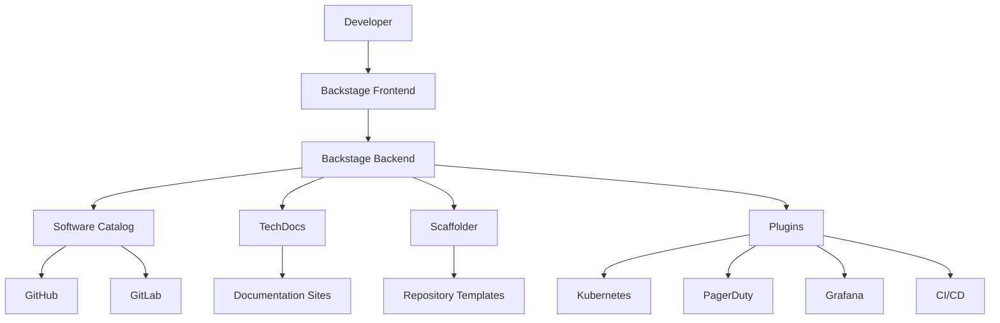

# How to Configure a Developer Portal with Backstage

Author: [nawazdhandala](https://www.github.com/nawazdhandala)

Tags: Backstage, Developer Portal, Platform Engineering, Developer Experience, Internal Tools

Description: Learn how to set up Spotify's Backstage as an internal developer portal to centralize service catalogs, documentation, and developer tooling in one searchable interface.

---

As organizations grow, developers spend increasing amounts of time finding information. Which team owns this service? Where are the runbooks? How do I provision a new database? Backstage, created by Spotify and now a CNCF project, solves this by providing a single portal where developers find everything they need. This guide walks through setting up Backstage for your organization.

## What is Backstage?

Backstage is an open platform for building developer portals. It provides:

- **Software Catalog**: Registry of all services, libraries, and resources
- **Tech Docs**: Documentation site generator integrated with the catalog
- **Software Templates**: Scaffolding for creating new services
- **Plugins**: Extensible architecture for integrating existing tools

Instead of switching between GitHub, Confluence, PagerDuty, and Kubernetes dashboards, developers access everything through one interface.

## Getting Started

Create a new Backstage application:

```bash
# Create a new Backstage app
npx @backstage/create-app@latest

# Follow the prompts
? Enter a name for the app [my-backstage]
? Select database for the backend [PostgreSQL]

# Start the development server
cd my-backstage
yarn dev
```

The app starts with a frontend on port 3000 and backend on port 7007.

## Project Structure

A Backstage application has this structure:

```
my-backstage/
├── app-config.yaml          # Main configuration
├── app-config.local.yaml    # Local overrides (gitignored)
├── catalog-info.yaml        # Backstage's own catalog entry
├── packages/
│   ├── app/                 # Frontend application
│   │   ├── src/
│   │   │   ├── App.tsx
│   │   │   └── components/
│   │   └── package.json
│   └── backend/             # Backend application
│       ├── src/
│       │   ├── index.ts
│       │   └── plugins/
│       └── package.json
├── plugins/                 # Custom plugins
└── examples/               # Example catalog entities
```

## Configuration

Configure Backstage in `app-config.yaml`:

```yaml
# app-config.yaml
app:
  title: Acme Developer Portal
  baseUrl: http://localhost:3000
  support:
    url: https://github.com/acme/backstage/issues
    items:
      - title: GitHub Issues
        icon: github
        links:
          - url: https://github.com/acme/backstage/issues
            title: GitHub Issues

organization:
  name: Acme Corp

backend:
  baseUrl: http://localhost:7007
  listen:
    port: 7007
  csp:
    connect-src: ["'self'", 'http:', 'https:']
  database:
    client: pg
    connection:
      host: ${POSTGRES_HOST}
      port: ${POSTGRES_PORT}
      user: ${POSTGRES_USER}
      password: ${POSTGRES_PASSWORD}

# Authentication configuration
auth:
  environment: development
  providers:
    github:
      development:
        clientId: ${GITHUB_CLIENT_ID}
        clientSecret: ${GITHUB_CLIENT_SECRET}

# Integration with source control
integrations:
  github:
    - host: github.com
      token: ${GITHUB_TOKEN}

# Software catalog configuration
catalog:
  import:
    entityFilename: catalog-info.yaml
    pullRequestBranchName: backstage-integration
  rules:
    - allow: [Component, System, API, Resource, Location, Domain, Group, User]
  locations:
    # Local example data
    - type: file
      target: ../../examples/entities.yaml
    # GitHub organization
    - type: github-org
      target: https://github.com/acme
    # Discover catalog files in repositories
    - type: github-discovery
      target: https://github.com/acme/*/blob/main/catalog-info.yaml
```

## Software Catalog

The catalog is the core of Backstage. Register services with `catalog-info.yaml` files:

```yaml
# catalog-info.yaml in your service repository
apiVersion: backstage.io/v1alpha1
kind: Component
metadata:
  name: payment-service
  description: Handles payment processing and billing
  annotations:
    # Link to GitHub repository
    github.com/project-slug: acme/payment-service
    # Link to CI/CD
    github.com/workflows: ci.yml
    # PagerDuty integration
    pagerduty.com/integration-key: ${PAGERDUTY_KEY}
    # Documentation
    backstage.io/techdocs-ref: dir:.
  tags:
    - python
    - payments
    - critical
  links:
    - url: https://payments.acme.com
      title: Production URL
    - url: https://grafana.acme.com/d/payments
      title: Dashboard
spec:
  type: service
  lifecycle: production
  owner: group:payments-team
  system: billing-system
  providesApis:
    - payment-api
  consumesApis:
    - user-api
    - notification-api
  dependsOn:
    - resource:payments-database
    - resource:redis-cache
```

Define relationships between components:

```yaml
# System definition
apiVersion: backstage.io/v1alpha1
kind: System
metadata:
  name: billing-system
  description: All services related to billing and payments
spec:
  owner: group:payments-team
  domain: finance

---
# API definition
apiVersion: backstage.io/v1alpha1
kind: API
metadata:
  name: payment-api
  description: API for processing payments
spec:
  type: openapi
  lifecycle: production
  owner: group:payments-team
  system: billing-system
  definition:
    $text: ./openapi.yaml

---
# Resource definition
apiVersion: backstage.io/v1alpha1
kind: Resource
metadata:
  name: payments-database
  description: PostgreSQL database for payment data
spec:
  type: database
  owner: group:platform-team
  system: billing-system
```

## TechDocs Integration

TechDocs generates documentation sites from Markdown in repositories:

```yaml
# In catalog-info.yaml, add TechDocs annotation
metadata:
  annotations:
    backstage.io/techdocs-ref: dir:.
```

Create documentation structure:

```
payment-service/
├── catalog-info.yaml
├── docs/
│   ├── index.md           # Main documentation page
│   ├── architecture.md
│   └── runbooks/
│       ├── deployment.md
│       └── incidents.md
├── mkdocs.yml             # MkDocs configuration
└── src/
```

Configure MkDocs:

```yaml
# mkdocs.yml
site_name: Payment Service
site_description: Documentation for the payment service

nav:
  - Home: index.md
  - Architecture: architecture.md
  - Runbooks:
    - Deployment: runbooks/deployment.md
    - Incidents: runbooks/incidents.md

plugins:
  - techdocs-core
```

Enable TechDocs in `app-config.yaml`:

```yaml
techdocs:
  builder: 'local'
  generator:
    runIn: 'docker'
  publisher:
    type: 'local'
```

## Software Templates

Templates scaffold new services with best practices built in:

```yaml
# templates/service-template/template.yaml
apiVersion: scaffolder.backstage.io/v1beta3
kind: Template
metadata:
  name: python-service
  title: Python Microservice
  description: Create a new Python microservice with FastAPI
  tags:
    - python
    - fastapi
    - recommended
spec:
  owner: group:platform-team
  type: service

  parameters:
    - title: Service Information
      required:
        - name
        - description
        - owner
      properties:
        name:
          title: Service Name
          type: string
          description: Unique name for the service
          pattern: '^[a-z0-9-]+$'
        description:
          title: Description
          type: string
          description: Brief description of the service
        owner:
          title: Owner
          type: string
          description: Team that owns this service
          ui:field: OwnerPicker
          ui:options:
            allowedKinds:
              - Group

    - title: Repository Settings
      required:
        - repoUrl
      properties:
        repoUrl:
          title: Repository Location
          type: string
          ui:field: RepoUrlPicker
          ui:options:
            allowedHosts:
              - github.com

    - title: Infrastructure
      properties:
        database:
          title: Database
          type: string
          enum:
            - none
            - postgresql
            - mongodb
          default: none
        hasQueue:
          title: Include message queue
          type: boolean
          default: false

  steps:
    - id: fetch
      name: Fetch Template
      action: fetch:template
      input:
        url: ./skeleton
        values:
          name: ${{ parameters.name }}
          description: ${{ parameters.description }}
          owner: ${{ parameters.owner }}
          database: ${{ parameters.database }}

    - id: publish
      name: Create Repository
      action: publish:github
      input:
        repoUrl: ${{ parameters.repoUrl }}
        description: ${{ parameters.description }}
        defaultBranch: main
        repoVisibility: internal

    - id: register
      name: Register in Catalog
      action: catalog:register
      input:
        repoContentsUrl: ${{ steps.publish.output.repoContentsUrl }}
        catalogInfoPath: /catalog-info.yaml

  output:
    links:
      - title: Repository
        url: ${{ steps.publish.output.remoteUrl }}
      - title: Open in Backstage
        icon: catalog
        entityRef: ${{ steps.register.output.entityRef }}
```

## Adding Plugins

Backstage has a rich plugin ecosystem. Add the Kubernetes plugin:

```bash
# Install the plugin packages
yarn --cwd packages/app add @backstage/plugin-kubernetes
yarn --cwd packages/backend add @backstage/plugin-kubernetes-backend
```

Configure in `app-config.yaml`:

```yaml
kubernetes:
  serviceLocatorMethod:
    type: 'multiTenant'
  clusterLocatorMethods:
    - type: 'config'
      clusters:
        - url: https://kubernetes.default.svc
          name: production
          authProvider: 'serviceAccount'
          skipTLSVerify: true
          serviceAccountToken: ${K8S_TOKEN}
```

Add to the frontend in `packages/app/src/App.tsx`:

```typescript
// packages/app/src/App.tsx
import { EntityKubernetesContent } from '@backstage/plugin-kubernetes';

// Add to entity page routes
const serviceEntityPage = (
  <EntityLayout>
    <EntityLayout.Route path="/" title="Overview">
      <EntityAboutCard />
    </EntityLayout.Route>
    <EntityLayout.Route path="/kubernetes" title="Kubernetes">
      <EntityKubernetesContent />
    </EntityLayout.Route>
  </EntityLayout>
);
```

## Architecture Overview

Here is how Backstage components interact:



## Deployment

Deploy Backstage to Kubernetes:

```yaml
# kubernetes/deployment.yaml
apiVersion: apps/v1
kind: Deployment
metadata:
  name: backstage
  namespace: backstage
spec:
  replicas: 2
  selector:
    matchLabels:
      app: backstage
  template:
    metadata:
      labels:
        app: backstage
    spec:
      containers:
        - name: backstage
          image: ghcr.io/acme/backstage:latest
          ports:
            - containerPort: 7007
          env:
            - name: POSTGRES_HOST
              valueFrom:
                secretKeyRef:
                  name: backstage-secrets
                  key: postgres-host
            - name: POSTGRES_USER
              valueFrom:
                secretKeyRef:
                  name: backstage-secrets
                  key: postgres-user
            - name: POSTGRES_PASSWORD
              valueFrom:
                secretKeyRef:
                  name: backstage-secrets
                  key: postgres-password
            - name: GITHUB_TOKEN
              valueFrom:
                secretKeyRef:
                  name: backstage-secrets
                  key: github-token
          resources:
            requests:
              memory: "512Mi"
              cpu: "250m"
            limits:
              memory: "1Gi"
              cpu: "500m"
```

## Best Practices

1. **Start with the catalog**: Get services registered before adding features. An incomplete catalog reduces adoption.

2. **Make registration easy**: Provide clear instructions and templates for catalog-info.yaml files.

3. **Enforce ownership**: Every component should have an owner. This enables routing questions and incidents.

4. **Integrate existing tools**: Backstage works best when it surfaces data from tools teams already use.

5. **Measure adoption**: Track which teams have registered services and how often developers use the portal.

Backstage transforms scattered tribal knowledge into an organized, searchable portal. Developers spend less time hunting for information and more time building features. As your organization grows, the portal becomes the single source of truth for everything software.
