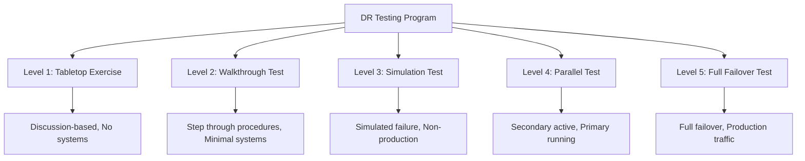

# How to Implement Disaster Recovery Testing

Author: [nawazdhandala](https://www.github.com/nawazdhandala)

Tags: Disaster Recovery, Testing, DevOps, Business Continuity, SRE

Description: A practical guide to implementing disaster recovery testing programs, including test types, planning frameworks, execution procedures, and continuous improvement strategies.

---

Disaster recovery plans are worthless until tested. A plan that exists only in documentation will fail when you need it most because assumptions break, procedures become outdated, and teams forget skills they do not practice. Disaster recovery testing validates that your systems, people, and processes can actually recover from failures.

This guide covers building a DR testing program from tabletop exercises through full failover tests.

## Why Test Disaster Recovery?

Testing reveals problems you cannot find any other way:

1. **Outdated procedures:** Documentation drifts from reality
2. **Missing dependencies:** Services need resources you forgot about
3. **Skill gaps:** Teams struggle with unfamiliar recovery procedures
4. **Configuration drift:** Secondary environments differ from primary
5. **Time estimates:** Recovery takes longer than planned

The organizations that recover fastest from disasters are the ones that practice regularly.

## DR Testing Levels



## Level 1: Tabletop Exercises

Tabletop exercises are discussion-based walkthroughs of disaster scenarios. No systems are affected.

### Planning a Tabletop Exercise

```markdown
# Tabletop Exercise Plan

## Scenario
A ransomware attack has encrypted all servers in the primary data center.
Detection occurred at 2 AM. The encryption began approximately 6 hours earlier.

## Participants
- Engineering Lead
- Database Administrator
- Security Team
- Operations Manager
- Customer Support Lead

## Discussion Questions
1. Who is the incident commander?
2. What is our communication plan for customers?
3. What backups are available and when were they taken?
4. What is the sequence of recovery steps?
5. How long will recovery take?
6. What dependencies exist between systems?
7. How do we verify data integrity after recovery?
8. What is our rollback plan if recovery fails?

## Success Criteria
- Team identifies correct recovery procedures
- Communication plan is clear
- Recovery time estimate is realistic
- Gaps in documentation are identified
```

### Running the Exercise

```bash
#!/bin/bash
# tabletop-exercise-script.sh

# Send calendar invite and pre-reading
echo "Scheduling tabletop exercise for $(date -d '+1 week' +%Y-%m-%d)"

cat > exercise_brief.md <<EOF
# DR Tabletop Exercise Brief

## Date: $(date -d '+1 week' +%Y-%m-%d)
## Duration: 2 hours
## Location: Conference Room A / Zoom

## Pre-Exercise Reading
- Current DR Plan: https://wiki.example.com/dr-plan
- System Architecture: https://wiki.example.com/architecture
- Contact List: https://wiki.example.com/contacts

## Scenario Preview
We will be discussing response to a ransomware incident affecting
our primary data center. Come prepared to discuss your team's
role in recovery.

## What to Bring
- Laptop with access to documentation
- Questions about current procedures
- Suggestions for improvements
EOF

# Track findings
mkdir -p /var/dr-exercises/$(date +%Y-%m-%d)
```

## Level 2: Walkthrough Tests

Walkthrough tests step through recovery procedures with minimal system interaction.

### Procedure Verification

```bash
#!/bin/bash
# walkthrough-test.sh

set -euo pipefail

LOG_FILE="/var/log/dr-walkthrough-$(date +%Y%m%d).log"

log() {
    echo "[$(date '+%Y-%m-%d %H:%M:%S')] $1" | tee -a "$LOG_FILE"
}

log "Starting DR walkthrough test"

# Step 1: Verify backup inventory
log "Step 1: Checking backup inventory"
aws s3 ls s3://company-backups/daily/ --recursive | tail -10
read -p "Confirm backups are present and recent? [y/n] " confirm
[ "$confirm" = "y" ] || exit 1

# Step 2: Verify DR credentials work
log "Step 2: Testing DR region credentials"
aws sts get-caller-identity --region us-west-2
read -p "Confirm DR region access works? [y/n] " confirm
[ "$confirm" = "y" ] || exit 1

# Step 3: Verify DR database replica status
log "Step 3: Checking database replica"
aws rds describe-db-instances \
    --db-instance-identifier production-dr \
    --region us-west-2 \
    --query 'DBInstances[0].DBInstanceStatus'
read -p "Confirm replica is available? [y/n] " confirm
[ "$confirm" = "y" ] || exit 1

# Step 4: Verify runbook accessibility
log "Step 4: Testing runbook access"
curl -s -o /dev/null -w "%{http_code}" https://wiki.example.com/dr-runbook
read -p "Confirm runbook is accessible? [y/n] " confirm
[ "$confirm" = "y" ] || exit 1

log "Walkthrough test completed successfully"
```

## Level 3: Simulation Tests

Simulation tests exercise recovery procedures against non-production systems.

### Database Recovery Simulation

```bash
#!/bin/bash
# simulate-db-recovery.sh

set -euo pipefail

TEST_INSTANCE="dr-test-$(date +%s)"
BACKUP_SNAPSHOT="production-snapshot-20260125"

echo "Starting database recovery simulation"

# Restore from backup to test instance
echo "Restoring from snapshot..."
aws rds restore-db-instance-from-db-snapshot \
    --db-instance-identifier "$TEST_INSTANCE" \
    --db-snapshot-identifier "$BACKUP_SNAPSHOT" \
    --db-instance-class db.t3.medium \
    --region us-west-2

# Wait for restore to complete
echo "Waiting for instance to become available..."
aws rds wait db-instance-available \
    --db-instance-identifier "$TEST_INSTANCE" \
    --region us-west-2

# Get endpoint
ENDPOINT=$(aws rds describe-db-instances \
    --db-instance-identifier "$TEST_INSTANCE" \
    --region us-west-2 \
    --query 'DBInstances[0].Endpoint.Address' \
    --output text)

echo "Test instance available at: $ENDPOINT"

# Run validation queries
echo "Running data validation..."
PGPASSWORD=$DB_PASSWORD psql -h "$ENDPOINT" -U dbadmin -d production -c "
SELECT
    (SELECT COUNT(*) FROM users) as user_count,
    (SELECT COUNT(*) FROM orders) as order_count,
    (SELECT MAX(created_at) FROM orders) as latest_order;
"

# Cleanup
read -p "Delete test instance? [y/n] " cleanup
if [ "$cleanup" = "y" ]; then
    aws rds delete-db-instance \
        --db-instance-identifier "$TEST_INSTANCE" \
        --skip-final-snapshot \
        --region us-west-2
fi

echo "Simulation complete"
```

### Application Recovery Simulation

```bash
#!/bin/bash
# simulate-app-recovery.sh

set -euo pipefail

TEST_NAMESPACE="dr-test-$(date +%s)"
BACKUP_NAME="production-backup-20260125"

echo "Starting application recovery simulation"

# Create test namespace
kubectl create namespace "$TEST_NAMESPACE"

# Restore from Velero backup
velero restore create "test-restore-$TEST_NAMESPACE" \
    --from-backup "$BACKUP_NAME" \
    --namespace-mappings production:$TEST_NAMESPACE \
    --wait

# Wait for pods to be ready
echo "Waiting for pods..."
kubectl -n "$TEST_NAMESPACE" wait --for=condition=ready pod -l app=webapp --timeout=300s

# Run health checks
WEBAPP_POD=$(kubectl -n "$TEST_NAMESPACE" get pod -l app=webapp -o jsonpath='{.items[0].metadata.name}')

echo "Running health checks..."
kubectl -n "$TEST_NAMESPACE" exec "$WEBAPP_POD" -- curl -s localhost:8080/health

# Run smoke tests
echo "Running smoke tests..."
kubectl -n "$TEST_NAMESPACE" exec "$WEBAPP_POD" -- /app/scripts/smoke-test.sh

# Measure recovery metrics
echo "Recovery simulation metrics:"
echo "- Time to first pod ready: $(kubectl -n $TEST_NAMESPACE get pod -l app=webapp -o jsonpath='{.items[0].status.conditions[?(@.type=="Ready")].lastTransitionTime}')"
echo "- Total pods restored: $(kubectl -n $TEST_NAMESPACE get pods --no-headers | wc -l)"

# Cleanup
read -p "Delete test namespace? [y/n] " cleanup
if [ "$cleanup" = "y" ]; then
    kubectl delete namespace "$TEST_NAMESPACE"
fi

echo "Simulation complete"
```

## Level 4: Parallel Tests

Parallel tests bring up the secondary environment while primary remains running.

```bash
#!/bin/bash
# parallel-dr-test.sh

set -euo pipefail

echo "Starting parallel DR test"
echo "Primary environment remains active"

# Step 1: Promote database replica (creates new standalone)
echo "Creating standalone from replica..."
aws rds promote-read-replica \
    --db-instance-identifier production-dr-test \
    --region us-west-2

# Step 2: Scale up DR Kubernetes cluster
echo "Scaling DR cluster..."
kubectl --context=dr-cluster scale deployment webapp --replicas=5

# Step 3: Configure DR environment
echo "Configuring DR environment..."
kubectl --context=dr-cluster set env deployment/webapp \
    DATABASE_HOST=production-dr-test.xxx.us-west-2.rds.amazonaws.com

# Step 4: Route test traffic to DR
echo "Routing test traffic..."
# Use weighted routing to send 10% of traffic to DR
aws route53 change-resource-record-sets \
    --hosted-zone-id Z123456 \
    --change-batch file://weighted-routing-test.json

# Step 5: Monitor and validate
echo "Monitoring DR environment for 30 minutes..."
for i in {1..30}; do
    echo "Minute $i: Checking DR health..."
    curl -s https://dr-test.example.com/health
    sleep 60
done

# Step 6: Revert
echo "Reverting to primary only..."
aws route53 change-resource-record-sets \
    --hosted-zone-id Z123456 \
    --change-batch file://primary-only-routing.json

kubectl --context=dr-cluster scale deployment webapp --replicas=0

echo "Parallel test complete"
```

## Level 5: Full Failover Test

Full failover tests switch production traffic to the DR environment.

### Pre-Failover Checklist

```bash
#!/bin/bash
# pre-failover-checklist.sh

echo "=== Pre-Failover Checklist ==="

# Verify backups are current
echo "Checking backup status..."
LATEST_BACKUP=$(aws s3 ls s3://company-backups/daily/ --recursive | tail -1)
echo "Latest backup: $LATEST_BACKUP"

# Verify DR environment is ready
echo "Checking DR environment..."
kubectl --context=dr-cluster get nodes
kubectl --context=dr-cluster get pods -A | grep -v Running

# Verify database replica lag
echo "Checking replica lag..."
aws cloudwatch get-metric-statistics \
    --namespace AWS/RDS \
    --metric-name ReplicaLag \
    --dimensions Name=DBInstanceIdentifier,Value=production-dr \
    --start-time $(date -u -d '10 minutes ago' +%Y-%m-%dT%H:%M:%SZ) \
    --end-time $(date -u +%Y-%m-%dT%H:%M:%SZ) \
    --period 60 \
    --statistics Average

# Verify communication channels
echo "Verify communication channels are ready:"
echo "- [ ] Status page ready to update"
echo "- [ ] Customer communication drafted"
echo "- [ ] On-call team notified"

# Verify rollback plan
echo "Verify rollback plan:"
echo "- [ ] Rollback procedures documented"
echo "- [ ] Rollback time estimate: _____ minutes"

read -p "All checks passed? Proceed with failover? [y/n] " proceed
[ "$proceed" = "y" ] || exit 1
```

### Failover Execution

```bash
#!/bin/bash
# execute-failover.sh

set -euo pipefail

START_TIME=$(date +%s)
LOG_FILE="/var/log/dr-failover-$(date +%Y%m%d-%H%M%S).log"

log() {
    echo "[$(date '+%Y-%m-%d %H:%M:%S')] $1" | tee -a "$LOG_FILE"
}

log "=== DISASTER RECOVERY FAILOVER STARTED ==="
log "Executed by: $(whoami)"
log "Reason: Scheduled DR test"

# Step 1: Update status page
log "Step 1: Updating status page"
curl -X POST https://api.statuspage.io/v1/pages/xxx/incidents \
    -H "Authorization: OAuth $STATUSPAGE_TOKEN" \
    -d '{
        "incident": {
            "name": "Scheduled DR Test - Brief Service Interruption",
            "status": "investigating",
            "body": "We are conducting a scheduled disaster recovery test."
        }
    }'

# Step 2: Stop writes to primary
log "Step 2: Enabling maintenance mode"
kubectl --context=primary-cluster set env deployment/webapp MAINTENANCE_MODE=true
sleep 30

# Step 3: Verify replication caught up
log "Step 3: Verifying replication"
# Wait for replica lag to reach 0
while true; do
    LAG=$(aws cloudwatch get-metric-statistics \
        --namespace AWS/RDS \
        --metric-name ReplicaLag \
        --dimensions Name=DBInstanceIdentifier,Value=production-dr \
        --start-time $(date -u -d '2 minutes ago' +%Y-%m-%dT%H:%M:%SZ) \
        --end-time $(date -u +%Y-%m-%dT%H:%M:%SZ) \
        --period 60 \
        --statistics Average \
        --query 'Datapoints[0].Average' \
        --output text)

    if [ "$LAG" = "0" ] || [ "$LAG" = "0.0" ]; then
        log "Replica lag is zero, proceeding"
        break
    fi
    log "Waiting for replica lag ($LAG seconds)..."
    sleep 10
done

# Step 4: Promote database replica
log "Step 4: Promoting database replica"
aws rds promote-read-replica \
    --db-instance-identifier production-dr \
    --region us-west-2

aws rds wait db-instance-available \
    --db-instance-identifier production-dr \
    --region us-west-2

# Step 5: Update DR application configuration
log "Step 5: Configuring DR application"
DR_DB_ENDPOINT=$(aws rds describe-db-instances \
    --db-instance-identifier production-dr \
    --region us-west-2 \
    --query 'DBInstances[0].Endpoint.Address' \
    --output text)

kubectl --context=dr-cluster set env deployment/webapp \
    DATABASE_HOST=$DR_DB_ENDPOINT \
    MAINTENANCE_MODE=false

# Step 6: Scale up DR
log "Step 6: Scaling DR cluster"
kubectl --context=dr-cluster scale deployment webapp --replicas=10

# Step 7: Update DNS
log "Step 7: Updating DNS"
aws route53 change-resource-record-sets \
    --hosted-zone-id Z123456 \
    --change-batch file://failover-dns.json

# Step 8: Verify
log "Step 8: Verifying failover"
sleep 60
curl -s https://app.example.com/health

# Calculate metrics
END_TIME=$(date +%s)
DURATION=$((END_TIME - START_TIME))
log "=== FAILOVER COMPLETE ==="
log "Total duration: $DURATION seconds"

# Update status page
curl -X PATCH https://api.statuspage.io/v1/pages/xxx/incidents/yyy \
    -H "Authorization: OAuth $STATUSPAGE_TOKEN" \
    -d '{
        "incident": {
            "status": "resolved",
            "body": "DR test complete. All services operating normally."
        }
    }'
```

## Post-Test Review

After every DR test, conduct a review:

```markdown
# DR Test Review Template

## Test Details
- Date: 2026-01-25
- Type: Full Failover Test
- Duration: 45 minutes
- Participants: Engineering team, Operations

## Metrics
- RTO Target: 60 minutes
- RTO Actual: 45 minutes
- RPO Target: 15 minutes
- RPO Actual: 0 minutes (replica was current)

## What Went Well
- Database promotion completed smoothly
- DNS propagation was faster than expected
- Team communication was clear

## Issues Found
1. DR cluster had outdated ConfigMap for feature flags
2. One service had hardcoded primary region endpoint
3. Monitoring dashboards not configured for DR region

## Action Items
| Issue | Owner | Due Date |
|-------|-------|----------|
| Sync ConfigMaps to DR | @engineer1 | 2026-02-01 |
| Fix hardcoded endpoints | @engineer2 | 2026-02-01 |
| Configure DR monitoring | @engineer3 | 2026-02-08 |

## Next Test
- Type: Tabletop Exercise (new scenario)
- Date: 2026-02-25
```

## Testing Schedule

| Test Type | Frequency | Duration | Disruption |
|-----------|-----------|----------|------------|
| Tabletop Exercise | Monthly | 2 hours | None |
| Walkthrough Test | Monthly | 4 hours | None |
| Simulation Test | Quarterly | 4-8 hours | None |
| Parallel Test | Bi-annually | 1 day | Minimal |
| Full Failover | Annually | 4-8 hours | Planned downtime |

## Best Practices

1. **Start small and build up.** Begin with tabletop exercises before attempting full failovers.

2. **Document everything.** Capture metrics, issues, and improvements from every test.

3. **Rotate participants.** Different team members should lead tests to spread knowledge.

4. **Test during business hours.** Night tests hide problems because nobody is using the system.

5. **Make tests realistic.** Inject real failures, not just clean switchovers.

6. **Fix issues before next test.** Action items from reviews should be completed promptly.

## Wrapping Up

Disaster recovery testing is the difference between plans that work and plans that fail when you need them. Start with tabletop exercises to validate your thinking, progress through simulations to validate your procedures, and conduct full failovers to validate your entire system. Each test builds confidence and reveals improvements. The goal is not passing the test but learning from it.
