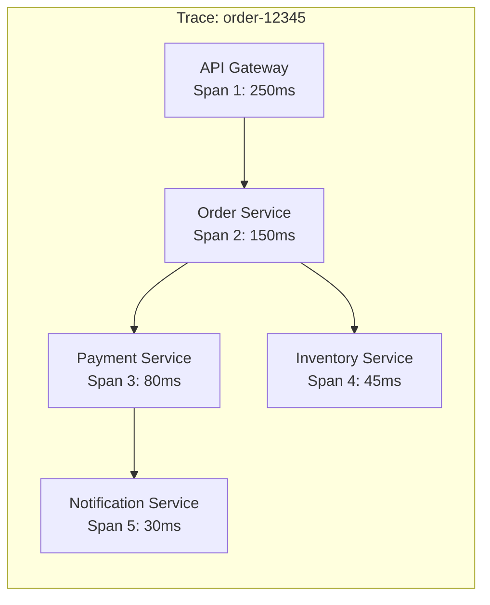

# How to Implement Distributed Tracing in .NET

Author: [nawazdhandala](https://www.github.com/nawazdhandala)

Tags: .NET, C#, OpenTelemetry, Distributed Tracing, Observability, Microservices, ASP.NET Core

Description: Learn how to implement distributed tracing in .NET applications using OpenTelemetry, with context propagation across HTTP, gRPC, and message queues for complete request visibility.

---

When a request flows through multiple services, finding where it failed or slowed down becomes nearly impossible without distributed tracing. OpenTelemetry provides a vendor-neutral way to instrument your .NET applications and trace requests across service boundaries.

## What is Distributed Tracing?

Distributed tracing connects the dots between services. A trace represents the entire journey of a request, while spans represent individual operations within that journey. Each span contains timing information, tags, and links to parent spans.



## Setting Up OpenTelemetry

Add the OpenTelemetry packages to your .NET project.

```bash
dotnet add package OpenTelemetry
dotnet add package OpenTelemetry.Extensions.Hosting
dotnet add package OpenTelemetry.Instrumentation.AspNetCore
dotnet add package OpenTelemetry.Instrumentation.Http
dotnet add package OpenTelemetry.Instrumentation.SqlClient
dotnet add package OpenTelemetry.Exporter.OpenTelemetryProtocol
```

## Basic Configuration

Configure OpenTelemetry in Program.cs to automatically instrument incoming and outgoing HTTP requests.

```csharp
// Program.cs
using OpenTelemetry.Resources;
using OpenTelemetry.Trace;

var builder = WebApplication.CreateBuilder(args);

// Define the service name and version for all traces
var serviceName = builder.Configuration["ServiceName"] ?? "order-service";
var serviceVersion = builder.Configuration["ServiceVersion"] ?? "1.0.0";

builder.Services.AddOpenTelemetry()
    .ConfigureResource(resource => resource
        .AddService(
            serviceName: serviceName,
            serviceVersion: serviceVersion)
        .AddAttributes(new Dictionary<string, object>
        {
            ["deployment.environment"] = builder.Environment.EnvironmentName,
            ["host.name"] = Environment.MachineName
        }))
    .WithTracing(tracing => tracing
        // Automatic instrumentation for ASP.NET Core
        .AddAspNetCoreInstrumentation(options =>
        {
            // Filter out health check endpoints
            options.Filter = context =>
                !context.Request.Path.StartsWithSegments("/health");

            // Enrich spans with additional data
            options.EnrichWithHttpRequest = (activity, request) =>
            {
                activity.SetTag("http.client_ip",
                    request.HttpContext.Connection.RemoteIpAddress?.ToString());
            };
        })
        // Automatic instrumentation for outgoing HTTP calls
        .AddHttpClientInstrumentation(options =>
        {
            options.FilterHttpRequestMessage = request =>
            {
                // Filter out internal health checks
                return request.RequestUri?.Host != "localhost";
            };
        })
        // SQL Server instrumentation
        .AddSqlClientInstrumentation(options =>
        {
            options.SetDbStatementForText = true;
            options.RecordException = true;
        })
        // Add custom activity sources
        .AddSource("OrderService")
        .AddSource("PaymentService")
        // Export to OTLP collector
        .AddOtlpExporter(options =>
        {
            options.Endpoint = new Uri(
                builder.Configuration["Otlp:Endpoint"] ?? "http://localhost:4317");
        }));

builder.Services.AddControllers();

var app = builder.Build();
app.MapControllers();
app.Run();
```

## Creating Custom Spans

While automatic instrumentation covers HTTP and database calls, you often need custom spans for business logic.

```csharp
// Services/OrderService.cs
using System.Diagnostics;

public class OrderService
{
    // Create a static ActivitySource for this service
    private static readonly ActivitySource ActivitySource =
        new("OrderService", "1.0.0");

    private readonly IPaymentService _paymentService;
    private readonly IInventoryService _inventoryService;
    private readonly ILogger<OrderService> _logger;

    public OrderService(
        IPaymentService paymentService,
        IInventoryService inventoryService,
        ILogger<OrderService> logger)
    {
        _paymentService = paymentService;
        _inventoryService = inventoryService;
        _logger = logger;
    }

    public async Task<OrderResult> ProcessOrderAsync(Order order)
    {
        // Start a new span for the order processing operation
        using var activity = ActivitySource.StartActivity(
            "ProcessOrder",
            ActivityKind.Internal);

        // Add tags for searchability
        activity?.SetTag("order.id", order.Id);
        activity?.SetTag("order.customer_id", order.CustomerId);
        activity?.SetTag("order.total", order.Total);
        activity?.SetTag("order.item_count", order.Items.Count);

        try
        {
            // Validate order in its own span
            await ValidateOrderAsync(order);

            // Reserve inventory
            var inventoryResult = await ReserveInventoryAsync(order);

            // Process payment
            var paymentResult = await ProcessPaymentAsync(order);

            // Add result to the span
            activity?.SetTag("order.status", "completed");
            activity?.SetStatus(ActivityStatusCode.Ok);

            return new OrderResult
            {
                OrderId = order.Id,
                Status = "Completed",
                PaymentId = paymentResult.TransactionId
            };
        }
        catch (Exception ex)
        {
            // Record the exception in the span
            activity?.SetStatus(ActivityStatusCode.Error, ex.Message);
            activity?.RecordException(ex);
            throw;
        }
    }

    private async Task ValidateOrderAsync(Order order)
    {
        using var activity = ActivitySource.StartActivity("ValidateOrder");

        // Validation logic here
        if (order.Items.Count == 0)
        {
            throw new ValidationException("Order must contain at least one item");
        }

        activity?.SetTag("validation.passed", true);
        await Task.CompletedTask;
    }

    private async Task<InventoryResult> ReserveInventoryAsync(Order order)
    {
        using var activity = ActivitySource.StartActivity(
            "ReserveInventory",
            ActivityKind.Client);

        activity?.SetTag("inventory.item_count", order.Items.Count);

        // Call inventory service - trace context propagates automatically
        var result = await _inventoryService.ReserveItemsAsync(order.Items);

        activity?.SetTag("inventory.reserved", result.Success);

        return result;
    }

    private async Task<PaymentResult> ProcessPaymentAsync(Order order)
    {
        using var activity = ActivitySource.StartActivity(
            "ProcessPayment",
            ActivityKind.Client);

        activity?.SetTag("payment.amount", order.Total);
        activity?.SetTag("payment.currency", order.Currency);

        var result = await _paymentService.ChargeAsync(
            order.CustomerId,
            order.Total,
            order.Currency);

        activity?.SetTag("payment.transaction_id", result.TransactionId);
        activity?.SetTag("payment.success", result.Success);

        return result;
    }
}
```

## Context Propagation Across HTTP

When calling other services via HTTP, the trace context needs to propagate. OpenTelemetry handles this automatically when you use HttpClient with instrumentation.

```csharp
// Services/PaymentServiceClient.cs
public class PaymentServiceClient : IPaymentService
{
    private readonly HttpClient _httpClient;
    private readonly ILogger<PaymentServiceClient> _logger;

    public PaymentServiceClient(
        HttpClient httpClient,
        ILogger<PaymentServiceClient> logger)
    {
        _httpClient = httpClient;
        _logger = logger;
    }

    public async Task<PaymentResult> ChargeAsync(
        string customerId,
        decimal amount,
        string currency)
    {
        // The HttpClient instrumentation automatically adds trace headers:
        // - traceparent: contains trace ID, span ID, and flags
        // - tracestate: vendor-specific trace information
        var request = new ChargeRequest
        {
            CustomerId = customerId,
            Amount = amount,
            Currency = currency
        };

        var response = await _httpClient.PostAsJsonAsync("/api/charge", request);
        response.EnsureSuccessStatusCode();

        return await response.Content.ReadFromJsonAsync<PaymentResult>()
            ?? throw new InvalidOperationException("Invalid response");
    }
}

// Register the typed client
// Program.cs
builder.Services.AddHttpClient<IPaymentService, PaymentServiceClient>(client =>
{
    client.BaseAddress = new Uri(
        builder.Configuration["Services:Payment"] ?? "http://payment-service");
});
```

## Context Propagation with Message Queues

Message queues require manual context propagation since there is no built-in support.

```csharp
// Messaging/RabbitMqPublisher.cs
using System.Diagnostics;
using System.Text;
using RabbitMQ.Client;

public class TracedMessagePublisher
{
    private static readonly ActivitySource ActivitySource =
        new("Messaging.RabbitMQ");

    private readonly IConnection _connection;

    public TracedMessagePublisher(IConnection connection)
    {
        _connection = connection;
    }

    public void Publish<T>(string exchange, string routingKey, T message)
    {
        using var activity = ActivitySource.StartActivity(
            $"publish {exchange}",
            ActivityKind.Producer);

        activity?.SetTag("messaging.system", "rabbitmq");
        activity?.SetTag("messaging.destination", exchange);
        activity?.SetTag("messaging.rabbitmq.routing_key", routingKey);

        using var channel = _connection.CreateModel();

        var properties = channel.CreateBasicProperties();
        properties.Headers = new Dictionary<string, object>();

        // Inject trace context into message headers
        if (activity != null)
        {
            properties.Headers["traceparent"] = activity.Id;
            if (activity.TraceStateString != null)
            {
                properties.Headers["tracestate"] = activity.TraceStateString;
            }
        }

        var body = Encoding.UTF8.GetBytes(
            JsonSerializer.Serialize(message));

        channel.BasicPublish(exchange, routingKey, properties, body);
    }
}
```

```csharp
// Messaging/RabbitMqConsumer.cs
public class TracedMessageConsumer
{
    private static readonly ActivitySource ActivitySource =
        new("Messaging.RabbitMQ");

    public void ProcessMessage(BasicDeliverEventArgs args)
    {
        // Extract trace context from message headers
        ActivityContext parentContext = default;

        if (args.BasicProperties.Headers?.TryGetValue(
            "traceparent", out var traceparentObj) == true)
        {
            var traceparent = Encoding.UTF8.GetString(
                (byte[])traceparentObj);

            if (ActivityContext.TryParse(traceparent, null, out var context))
            {
                parentContext = context;
            }
        }

        // Start a new span linked to the producer span
        using var activity = ActivitySource.StartActivity(
            $"process {args.Exchange}",
            ActivityKind.Consumer,
            parentContext);

        activity?.SetTag("messaging.system", "rabbitmq");
        activity?.SetTag("messaging.destination", args.Exchange);
        activity?.SetTag("messaging.rabbitmq.routing_key", args.RoutingKey);

        try
        {
            // Process the message
            var body = Encoding.UTF8.GetString(args.Body.ToArray());
            // Handle message...

            activity?.SetStatus(ActivityStatusCode.Ok);
        }
        catch (Exception ex)
        {
            activity?.SetStatus(ActivityStatusCode.Error, ex.Message);
            activity?.RecordException(ex);
            throw;
        }
    }
}
```

## Adding Span Events

Span events mark points in time within a span, useful for logging without creating new spans.

```csharp
// Services/OrderService.cs
public async Task<OrderResult> ProcessOrderAsync(Order order)
{
    using var activity = ActivitySource.StartActivity("ProcessOrder");

    // Add event when validation starts
    activity?.AddEvent(new ActivityEvent("validation.started"));

    await ValidateOrderAsync(order);

    activity?.AddEvent(new ActivityEvent("validation.completed",
        tags: new ActivityTagsCollection
        {
            { "items_validated", order.Items.Count }
        }));

    // Add event for payment initiation
    activity?.AddEvent(new ActivityEvent("payment.initiated",
        tags: new ActivityTagsCollection
        {
            { "amount", order.Total },
            { "currency", order.Currency }
        }));

    var paymentResult = await ProcessPaymentAsync(order);

    activity?.AddEvent(new ActivityEvent("payment.completed",
        tags: new ActivityTagsCollection
        {
            { "transaction_id", paymentResult.TransactionId }
        }));

    return new OrderResult { Status = "Completed" };
}
```

## Sampling Strategies

In high-volume systems, tracing every request is expensive. Configure sampling to reduce overhead while maintaining visibility.

```csharp
// Program.cs
builder.Services.AddOpenTelemetry()
    .WithTracing(tracing => tracing
        // Sample 10% of traces in production
        .SetSampler(new ParentBasedSampler(
            new TraceIdRatioBasedSampler(0.1)))

        // Or use a custom sampler
        .SetSampler(new CustomSampler())
        .AddAspNetCoreInstrumentation()
        .AddOtlpExporter());
```

```csharp
// Sampling/CustomSampler.cs
public class CustomSampler : Sampler
{
    public override SamplingResult ShouldSample(
        in SamplingParameters samplingParameters)
    {
        // Always sample errors
        if (samplingParameters.Tags?.Any(t =>
            t.Key == "error" && t.Value?.ToString() == "true") == true)
        {
            return new SamplingResult(SamplingDecision.RecordAndSample);
        }

        // Always sample specific endpoints
        var httpTarget = samplingParameters.Tags?
            .FirstOrDefault(t => t.Key == "http.target").Value?.ToString();

        if (httpTarget?.StartsWith("/api/orders") == true)
        {
            return new SamplingResult(SamplingDecision.RecordAndSample);
        }

        // Sample 5% of other traffic
        var traceIdHash = samplingParameters.TraceId.GetHashCode();
        var shouldSample = Math.Abs(traceIdHash % 100) < 5;

        return new SamplingResult(
            shouldSample ? SamplingDecision.RecordAndSample : SamplingDecision.Drop);
    }
}
```

## Baggage for Cross-Service Data

Baggage propagates key-value pairs across all services in a trace. Use it sparingly for data that needs to follow the request.

```csharp
// Controllers/OrderController.cs
[HttpPost]
public async Task<IActionResult> CreateOrder(CreateOrderRequest request)
{
    // Add baggage that propagates to all downstream services
    Baggage.SetBaggage("customer.tier", request.CustomerTier);
    Baggage.SetBaggage("order.priority", request.Priority.ToString());

    var result = await _orderService.ProcessOrderAsync(request.ToOrder());
    return Ok(result);
}

// In downstream service
public class InventoryService
{
    public async Task<InventoryResult> ReserveItemsAsync(List<OrderItem> items)
    {
        // Read baggage from upstream
        var customerTier = Baggage.GetBaggage("customer.tier");
        var priority = Baggage.GetBaggage("order.priority");

        // Premium customers get priority reservation
        if (customerTier == "premium")
        {
            return await PriorityReserveAsync(items);
        }

        return await StandardReserveAsync(items);
    }
}
```

## Trace Correlation with Logs

Link traces to logs for complete observability.

```csharp
// Program.cs
builder.Host.UseSerilog((context, configuration) =>
{
    configuration
        .Enrich.FromLogContext()
        .Enrich.WithProperty("ServiceName", serviceName)
        .WriteTo.Console(outputTemplate:
            "[{Timestamp:HH:mm:ss} {Level:u3}] {Message:lj} " +
            "{Properties:j}{NewLine}{Exception}");
});

// Middleware to add trace ID to log context
app.Use(async (context, next) =>
{
    var activity = Activity.Current;
    if (activity != null)
    {
        using (LogContext.PushProperty("TraceId", activity.TraceId.ToString()))
        using (LogContext.PushProperty("SpanId", activity.SpanId.ToString()))
        {
            await next();
        }
    }
    else
    {
        await next();
    }
});
```

## Summary

| Component | Purpose |
|-----------|---------|
| ActivitySource | Create custom spans for business logic |
| HttpClient Instrumentation | Auto-propagate context in HTTP calls |
| Message Headers | Manual propagation for async messaging |
| Sampling | Control trace volume and cost |
| Baggage | Share data across service boundaries |

Distributed tracing with OpenTelemetry gives you visibility into request flows across your microservices. Start with automatic instrumentation, add custom spans for business logic, and configure sampling to manage costs at scale.
