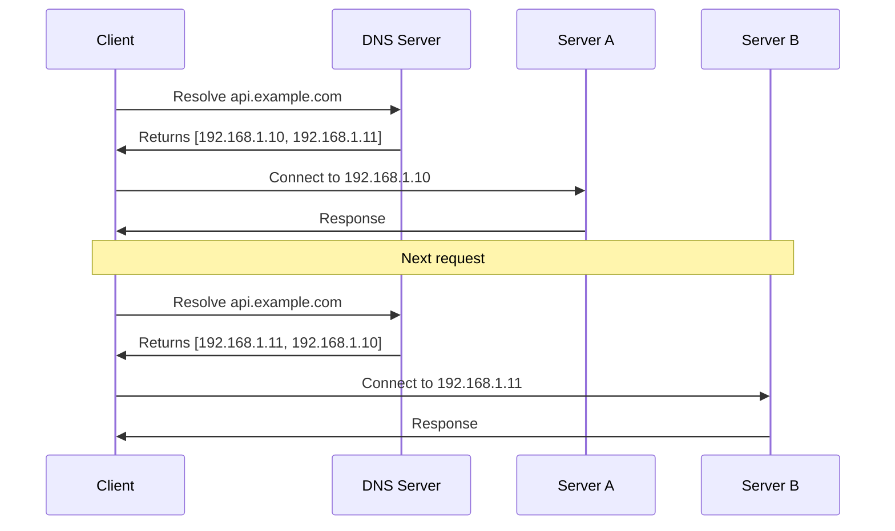

# How to Configure DNS-Based Load Balancing

Author: [nawazdhandala](https://www.github.com/nawazdhandala)

Tags: DNS, Load Balancing, Networking, High Availability, Infrastructure, Traffic Management, BIND

Description: Learn how to implement DNS-based load balancing to distribute traffic across multiple servers. This guide covers round-robin, weighted, and health-check-aware DNS configurations with practical examples.

---

DNS-based load balancing is one of the simplest and most widely deployed methods for distributing traffic across multiple servers. Unlike hardware load balancers or reverse proxies, DNS load balancing works at the resolution layer, directing clients to different IP addresses before any connection is made. This guide shows you how to implement it effectively.

## How DNS Load Balancing Works

When a client requests your domain, the DNS server returns one or more IP addresses. The client then connects to one of these addresses. By controlling which addresses are returned and in what order, you can distribute traffic across your infrastructure.



## Basic Round-Robin with BIND

The simplest form of DNS load balancing returns multiple A records in rotating order. Here is how to configure it with BIND:

```bash
# /etc/named.conf - Main BIND configuration
options {
    directory "/var/named";
    listen-on port 53 { any; };
    allow-query { any; };

    # Enable round-robin rotation of records
    rrset-order { order cyclic; };
};

zone "example.com" IN {
    type master;
    file "/var/named/example.com.zone";
};
```

Create the zone file with multiple A records:

```bash
# /var/named/example.com.zone
$TTL 60  ; Short TTL for faster failover
@   IN  SOA ns1.example.com. admin.example.com. (
        2026012501  ; Serial (YYYYMMDDNN format)
        3600        ; Refresh
        600         ; Retry
        86400       ; Expire
        60          ; Minimum TTL
)

@       IN  NS      ns1.example.com.
@       IN  NS      ns2.example.com.

ns1     IN  A       10.0.1.1
ns2     IN  A       10.0.1.2

; Load balanced web servers
; BIND will rotate these in responses
www     IN  A       192.168.1.10
www     IN  A       192.168.1.11
www     IN  A       192.168.1.12

; Load balanced API servers
api     IN  A       192.168.2.10
api     IN  A       192.168.2.11
```

Verify the rotation is working:

```bash
# Query multiple times and observe the order changing
for i in {1..5}; do
    dig @localhost www.example.com +short
    echo "---"
done
```

## Weighted DNS Load Balancing

When servers have different capacities, you want to send more traffic to powerful servers. Achieve this by adding more A records for higher-capacity servers:

```bash
# /var/named/example.com.zone - Weighted distribution
; High capacity server (weight 3) - appears 3 times
app     IN  A       192.168.1.100
app     IN  A       192.168.1.100
app     IN  A       192.168.1.100

; Medium capacity server (weight 2) - appears 2 times
app     IN  A       192.168.1.101
app     IN  A       192.168.1.101

; Low capacity server (weight 1) - appears 1 time
app     IN  A       192.168.1.102
```

This gives you approximately 50% of traffic to the high-capacity server, 33% to medium, and 17% to low.

## Health-Check-Aware DNS with PowerDNS

Static DNS configurations continue returning unhealthy servers. PowerDNS with Lua scripting adds health awareness:

```lua
-- /etc/pdns/healthcheck.lua
-- Lua script for PowerDNS to filter unhealthy backends

-- Backend servers and their health status
local backends = {
    {ip = "192.168.1.10", healthy = true},
    {ip = "192.168.1.11", healthy = true},
    {ip = "192.168.1.12", healthy = true}
}

-- Health check endpoint configuration
local health_check_port = 8080
local health_check_path = "/health"

-- Function to check backend health (called periodically)
function checkHealth(backend)
    local socket = require("socket")
    local tcp = socket.tcp()
    tcp:settimeout(2)

    local result = tcp:connect(backend.ip, health_check_port)
    tcp:close()

    return result == 1
end

-- Main preresolve function called for each query
function preresolve(dq)
    if dq.qname:equal(newDN("app.example.com.")) and dq.qtype == pdns.A then
        local healthy_backends = {}

        -- Collect only healthy backends
        for _, backend in ipairs(backends) do
            if backend.healthy then
                table.insert(healthy_backends, backend.ip)
            end
        end

        -- Return healthy backends or all if none healthy (fail open)
        if #healthy_backends > 0 then
            for _, ip in ipairs(healthy_backends) do
                dq:addAnswer(pdns.A, ip, 60)
            end
        else
            -- All unhealthy, return all and hope for the best
            for _, backend in ipairs(backends) do
                dq:addAnswer(pdns.A, backend.ip, 60)
            end
        end

        return true
    end

    return false
end
```

Configure PowerDNS to use the Lua script:

```bash
# /etc/pdns/pdns.conf
launch=
lua-dns-script=/etc/pdns/healthcheck.lua
local-address=0.0.0.0
local-port=53
```

## External Health Checker Script

Run health checks separately and update DNS records dynamically:

```python
#!/usr/bin/env python3
# dns_health_updater.py - Update DNS based on health checks

import requests
import subprocess
import time
from dataclasses import dataclass

@dataclass
class Backend:
    name: str
    ip: str
    health_url: str
    healthy: bool = True

# Define your backends
backends = [
    Backend("web1", "192.168.1.10", "http://192.168.1.10:8080/health"),
    Backend("web2", "192.168.1.11", "http://192.168.1.11:8080/health"),
    Backend("web3", "192.168.1.12", "http://192.168.1.12:8080/health"),
]

def check_health(backend: Backend) -> bool:
    """Check if backend is healthy via HTTP health endpoint"""
    try:
        response = requests.get(backend.health_url, timeout=5)
        return response.status_code == 200
    except requests.RequestException:
        return False

def update_dns_records(zone_file: str, record_name: str, healthy_backends: list):
    """Regenerate zone file with only healthy backends"""

    # Read the base zone file (without the dynamic records)
    with open(f"{zone_file}.base", "r") as f:
        base_content = f.read()

    # Add healthy backend records
    dynamic_records = []
    for backend in healthy_backends:
        dynamic_records.append(f"{record_name}     IN  A       {backend.ip}")

    # Write updated zone file
    with open(zone_file, "w") as f:
        f.write(base_content)
        f.write("\n; Dynamic health-checked records\n")
        f.write("\n".join(dynamic_records))
        f.write("\n")

    # Reload BIND to pick up changes
    subprocess.run(["rndc", "reload", "example.com"], check=True)
    print(f"DNS updated with {len(healthy_backends)} healthy backends")

def main():
    """Main health check loop"""
    check_interval = 10  # seconds

    while True:
        healthy_backends = []

        for backend in backends:
            is_healthy = check_health(backend)

            # Log state changes
            if is_healthy != backend.healthy:
                status = "UP" if is_healthy else "DOWN"
                print(f"Backend {backend.name} ({backend.ip}) is now {status}")

            backend.healthy = is_healthy
            if is_healthy:
                healthy_backends.append(backend)

        # Update DNS if we have at least one healthy backend
        if healthy_backends:
            update_dns_records(
                "/var/named/example.com.zone",
                "www",
                healthy_backends
            )
        else:
            print("WARNING: All backends unhealthy, keeping previous DNS state")

        time.sleep(check_interval)

if __name__ == "__main__":
    main()
```

## DNS Load Balancing with Route 53 (AWS)

AWS Route 53 provides built-in weighted and health-checked DNS:

```python
# route53_setup.py - Configure weighted DNS with health checks in Route 53
import boto3

route53 = boto3.client('route53')
hosted_zone_id = 'Z1234567890ABC'

def create_health_check(name: str, ip: str, port: int, path: str) -> str:
    """Create a Route 53 health check for a backend"""
    response = route53.create_health_check(
        CallerReference=f"{name}-{ip}-healthcheck",
        HealthCheckConfig={
            'IPAddress': ip,
            'Port': port,
            'Type': 'HTTP',
            'ResourcePath': path,
            'RequestInterval': 10,  # Check every 10 seconds
            'FailureThreshold': 3,  # Mark unhealthy after 3 failures
        }
    )

    health_check_id = response['HealthCheck']['Id']

    # Add a name tag for easier identification
    route53.change_tags_for_resource(
        ResourceType='healthcheck',
        ResourceId=health_check_id,
        AddTags=[{'Key': 'Name', 'Value': name}]
    )

    return health_check_id

def create_weighted_record(name: str, ip: str, weight: int,
                           set_id: str, health_check_id: str):
    """Create a weighted DNS record with health check"""
    route53.change_resource_record_sets(
        HostedZoneId=hosted_zone_id,
        ChangeBatch={
            'Changes': [{
                'Action': 'UPSERT',
                'ResourceRecordSet': {
                    'Name': f'{name}.example.com',
                    'Type': 'A',
                    'SetIdentifier': set_id,
                    'Weight': weight,
                    'TTL': 60,
                    'ResourceRecords': [{'Value': ip}],
                    'HealthCheckId': health_check_id,
                }
            }]
        }
    )

# Create health checks and weighted records
backends = [
    {'name': 'web1', 'ip': '54.1.2.3', 'weight': 70},
    {'name': 'web2', 'ip': '54.1.2.4', 'weight': 30},
]

for backend in backends:
    health_check_id = create_health_check(
        backend['name'],
        backend['ip'],
        80,
        '/health'
    )

    create_weighted_record(
        'api',
        backend['ip'],
        backend['weight'],
        backend['name'],
        health_check_id
    )

    print(f"Created weighted record for {backend['name']}")
```

## Client-Side Considerations

Clients cache DNS responses, which affects load distribution:

```python
# dns_client_test.py - Test DNS resolution behavior
import dns.resolver
import socket
import time

def test_dns_caching():
    """Demonstrate DNS caching effects on load balancing"""

    # Using dnspython for direct DNS queries (bypasses system cache)
    resolver = dns.resolver.Resolver()
    resolver.nameservers = ['8.8.8.8']

    print("Direct DNS queries (bypassing cache):")
    for i in range(5):
        answers = resolver.resolve('www.example.com', 'A')
        ips = [rdata.address for rdata in answers]
        print(f"  Query {i+1}: {ips}")
        time.sleep(1)

    print("\nSystem resolver (uses cache):")
    for i in range(5):
        # socket.gethostbyname uses system resolver with caching
        ip = socket.gethostbyname('www.example.com')
        print(f"  Query {i+1}: {ip}")
        time.sleep(1)

if __name__ == "__main__":
    test_dns_caching()
```

## TTL Strategy

TTL (Time To Live) directly impacts failover speed and DNS server load:

| TTL Value | Failover Speed | DNS Load | Use Case |
|-----------|---------------|----------|----------|
| 30-60 seconds | Fast | High | Active failover, dynamic environments |
| 300 seconds | Medium | Medium | Standard web applications |
| 3600+ seconds | Slow | Low | Stable infrastructure, cost reduction |

```bash
# Check current TTL values being served
dig www.example.com +noall +answer

# Example output shows TTL decreasing with cache age
# www.example.com.    45    IN    A    192.168.1.10
```

## Limitations and When to Use Something Else

DNS load balancing works well for many scenarios but has limitations:

**Good for:**
- Global traffic distribution
- Simple failover requirements
- Reducing single points of failure
- Cost-effective scaling

**Consider alternatives when:**
- You need session persistence (sticky sessions)
- Sub-second failover is required
- You need to route based on request content (URL, headers)
- Backend capacity differs significantly and needs precise control

## Monitoring DNS Load Balancing

Track the effectiveness of your DNS-based distribution:

```bash
# Monitor DNS query patterns with dnstop
sudo dnstop eth0

# Log DNS queries in BIND for analysis
# Add to named.conf:
logging {
    channel query_log {
        file "/var/log/named/queries.log" versions 3 size 5m;
        severity info;
        print-time yes;
    };
    category queries { query_log; };
};
```

## Conclusion

DNS load balancing provides a straightforward way to distribute traffic without adding infrastructure components in the request path. Start with simple round-robin for basic redundancy, add health checks for automatic failover, and consider weighted records when backend capacities differ. Remember that client-side caching means changes take time to propagate, so plan your TTLs according to your failover requirements.
