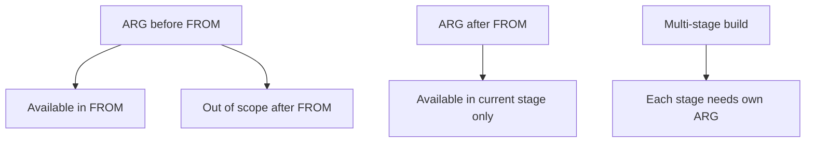

# How to Use Docker Build Arguments

Author: [nawazdhandala](https://www.github.com/nawazdhandala)

Tags: Docker, Dockerfile, Build Process, DevOps, CI/CD

Description: Learn how to use Docker build arguments (ARG) to customize image builds, pass secrets safely, implement multi-stage builds, and create flexible Dockerfiles that adapt to different environments.

---

Build arguments let you pass values into the Docker build process without hardcoding them in your Dockerfile. This creates flexible images that can be customized for different environments, versions, or configurations at build time.

## ARG Basics

The `ARG` instruction defines a variable that users can pass at build-time.

```dockerfile
# Dockerfile
FROM ubuntu:22.04

# Define a build argument with a default value
ARG APP_VERSION=1.0.0

# Use the argument in subsequent instructions
RUN echo "Building version $APP_VERSION"

# Arguments can be used in LABEL, ENV, RUN, COPY, etc.
LABEL version=$APP_VERSION
```

```bash
# Build with default value
docker build -t myapp .

# Build with custom value
docker build --build-arg APP_VERSION=2.0.0 -t myapp:2.0.0 .

# Multiple build arguments
docker build \
  --build-arg APP_VERSION=2.0.0 \
  --build-arg BUILD_ENV=production \
  -t myapp:2.0.0 .
```

## ARG vs ENV

ARG and ENV both define variables, but they serve different purposes.

| Feature | ARG | ENV |
|---------|-----|-----|
| Available at build time | Yes | Yes (if set before) |
| Available at run time | No | Yes |
| Can be passed via --build-arg | Yes | No |
| Persists in final image | No | Yes |

```dockerfile
FROM node:20-slim

# ARG only available during build
ARG NODE_ENV=production

# ENV persists into the running container
ENV NODE_ENV=$NODE_ENV

# This works at build time
RUN echo "Building for $NODE_ENV"

# At runtime, NODE_ENV is available because of ENV
CMD ["node", "server.js"]
```

## Practical Patterns

### Pattern 1: Configurable Base Image

Change the base image at build time for different platforms or versions.

```dockerfile
# Default to Node 20, but allow override
ARG NODE_VERSION=20

FROM node:${NODE_VERSION}-slim

WORKDIR /app
COPY package*.json ./
RUN npm ci
COPY . .
CMD ["node", "server.js"]
```

```bash
# Build with Node 18
docker build --build-arg NODE_VERSION=18 -t myapp:node18 .

# Build with Node 20
docker build --build-arg NODE_VERSION=20 -t myapp:node20 .
```

### Pattern 2: Version Injection

Inject version information from your CI/CD pipeline.

```dockerfile
FROM golang:1.21 AS builder

ARG VERSION=dev
ARG GIT_COMMIT=unknown
ARG BUILD_DATE=unknown

WORKDIR /app
COPY . .

# Inject version info at compile time
RUN go build -ldflags "-X main.version=${VERSION} -X main.gitCommit=${GIT_COMMIT} -X main.buildDate=${BUILD_DATE}" -o myapp

FROM gcr.io/distroless/base-debian12
COPY --from=builder /app/myapp /myapp
CMD ["/myapp"]
```

```bash
# In CI/CD pipeline
docker build \
  --build-arg VERSION=$(git describe --tags) \
  --build-arg GIT_COMMIT=$(git rev-parse HEAD) \
  --build-arg BUILD_DATE=$(date -u +"%Y-%m-%dT%H:%M:%SZ") \
  -t myapp:latest .
```

### Pattern 3: Environment-Specific Builds

Configure the build process based on target environment.

```dockerfile
FROM node:20-slim

ARG BUILD_ENV=development

WORKDIR /app
COPY package*.json ./

# Install dev dependencies only in development
RUN if [ "$BUILD_ENV" = "production" ]; then \
      npm ci --only=production; \
    else \
      npm ci; \
    fi

COPY . .

# Build frontend differently per environment
RUN if [ "$BUILD_ENV" = "production" ]; then \
      npm run build:prod; \
    else \
      npm run build:dev; \
    fi

CMD ["node", "server.js"]
```

### Pattern 4: Multi-Stage with Shared Arguments

Pass arguments across multiple build stages.

```dockerfile
# Define ARG before FROM to use in FROM instruction
ARG NODE_VERSION=20

# First stage: Build
FROM node:${NODE_VERSION}-slim AS builder

# ARG must be redeclared after FROM to use within the stage
ARG BUILD_ENV=production

WORKDIR /app
COPY package*.json ./
RUN npm ci
COPY . .
RUN npm run build

# Second stage: Runtime
FROM node:${NODE_VERSION}-slim

# Redeclare ARG if needed in this stage
ARG BUILD_ENV=production

WORKDIR /app
COPY --from=builder /app/dist ./dist
COPY --from=builder /app/package*.json ./

RUN npm ci --only=production

# Convert ARG to ENV for runtime access
ENV NODE_ENV=$BUILD_ENV

CMD ["node", "dist/server.js"]
```

## Build Arguments in Docker Compose

```yaml
# docker-compose.yml
version: '3.8'

services:
  api:
    build:
      context: .
      dockerfile: Dockerfile
      args:
        - NODE_VERSION=20
        - BUILD_ENV=development
        - VERSION=${VERSION:-dev}

  frontend:
    build:
      context: ./frontend
      args:
        API_URL: http://localhost:3000
        ENVIRONMENT: development
```

```bash
# Pass arguments from environment
VERSION=1.2.3 docker compose build

# Or use .env file
echo "VERSION=1.2.3" > .env
docker compose build
```

## Handling Secrets in Build Arguments

Build arguments are visible in the image history. Never use them for secrets.

```bash
# WRONG: Secret visible in image history
docker build --build-arg API_KEY=secret123 -t myapp .

# View exposed secrets
docker history myapp
# Shows: ARG API_KEY=secret123
```

### Safe Secret Handling with BuildKit

```dockerfile
# syntax=docker/dockerfile:1

FROM node:20-slim

WORKDIR /app
COPY package*.json ./

# Use secret mount - not stored in image layers
RUN --mount=type=secret,id=npm_token \
    NPM_TOKEN=$(cat /run/secrets/npm_token) \
    npm ci

COPY . .
CMD ["node", "server.js"]
```

```bash
# Pass secret at build time
DOCKER_BUILDKIT=1 docker build \
  --secret id=npm_token,src=$HOME/.npmrc \
  -t myapp .
```

## Predefined ARG Variables

Docker provides predefined ARG variables for proxy configuration.

```dockerfile
FROM ubuntu:22.04

# These are automatically available (no ARG declaration needed)
# HTTP_PROXY, HTTPS_PROXY, FTP_PROXY, NO_PROXY
# http_proxy, https_proxy, ftp_proxy, no_proxy

# They are used by tools like apt, curl, wget
RUN apt-get update && apt-get install -y curl
```

```bash
# Pass proxy settings at build time
docker build \
  --build-arg HTTP_PROXY=http://proxy.example.com:8080 \
  --build-arg HTTPS_PROXY=http://proxy.example.com:8080 \
  -t myapp .
```

## ARG Scope and Ordering

ARG placement matters. Arguments defined before FROM have special behavior.

```dockerfile
# Global ARG - only usable in FROM instruction
ARG BASE_IMAGE=node:20-slim

FROM ${BASE_IMAGE}

# This fails - ARG from before FROM is out of scope
# RUN echo $BASE_IMAGE

# Must redeclare to use within the stage
ARG BASE_IMAGE
RUN echo "Using base image: $BASE_IMAGE"
```



## Best Practices

### Provide Sensible Defaults

```dockerfile
# Good: Default values allow builds without arguments
ARG NODE_VERSION=20
ARG BUILD_ENV=production

# Build works without any --build-arg flags
```

### Document Your Arguments

```dockerfile
# Build arguments
# NODE_VERSION: Node.js version (default: 20)
# BUILD_ENV: Build environment - development|staging|production (default: production)
# VERSION: Application version for tagging (default: dev)

ARG NODE_VERSION=20
ARG BUILD_ENV=production
ARG VERSION=dev
```

### Validate Arguments

```dockerfile
ARG BUILD_ENV=production

# Validate the argument value
RUN if [ "$BUILD_ENV" != "development" ] && [ "$BUILD_ENV" != "production" ]; then \
      echo "ERROR: BUILD_ENV must be 'development' or 'production'"; \
      exit 1; \
    fi
```

### Minimize Layer Impact

```dockerfile
# Bad: Creates separate layers for each ARG-dependent instruction
ARG VERSION
RUN echo $VERSION > /version1.txt
RUN echo $VERSION > /version2.txt
RUN echo $VERSION > /version3.txt

# Good: Combine into single layer
ARG VERSION
RUN echo $VERSION > /version1.txt && \
    echo $VERSION > /version2.txt && \
    echo $VERSION > /version3.txt
```

---

Build arguments enable flexible, parameterized Docker builds. Use ARG for values that should differ between builds but remain constant at runtime. Use ENV when values need to persist into running containers. For secrets, use BuildKit secret mounts instead of build arguments to keep sensitive data out of image history. With proper use of ARG, a single Dockerfile can produce images tailored to development, staging, and production environments.
