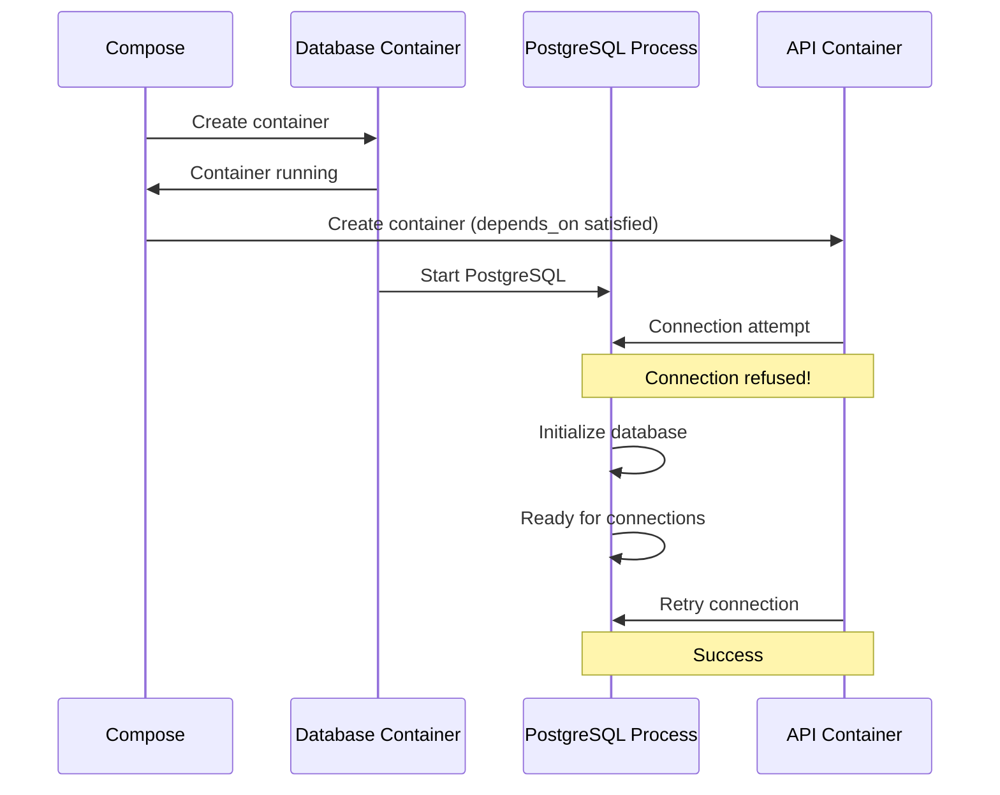

# How to Use Docker Compose Depends On

Author: [nawazdhandala](https://www.github.com/nawazdhandala)

Tags: Docker, Docker Compose, DevOps, Orchestration, Dependencies

Description: Master Docker Compose depends_on with startup ordering, health check conditions, and service dependency management for reliable container orchestration.

---

The `depends_on` directive in Docker Compose controls service startup order, but it is often misunderstood. Knowing when a dependency container has started is different from knowing when it is ready to accept connections. This guide covers proper dependency configuration for real-world scenarios.

## Basic Depends On Usage

At its simplest, `depends_on` ensures one service starts before another:

```yaml
version: '3.8'
services:
  api:
    image: myapp:latest
    depends_on:
      - database
      - redis

  database:
    image: postgres:15

  redis:
    image: redis:7-alpine
```

With this configuration:
1. `database` and `redis` start first (in parallel)
2. `api` starts after `database` and `redis` containers are running

But "running" does not mean "ready." PostgreSQL might still be initializing when the API tries to connect.

## The Startup vs Ready Problem



## Using Health Check Conditions

The solution is health check conditions. Compose waits for the dependency to be healthy, not just running:

```yaml
version: '3.8'
services:
  api:
    image: myapp:latest
    depends_on:
      database:
        condition: service_healthy
      redis:
        condition: service_healthy

  database:
    image: postgres:15
    environment:
      POSTGRES_PASSWORD: secret
    healthcheck:
      test: ["CMD-SHELL", "pg_isready -U postgres"]
      interval: 5s
      timeout: 5s
      retries: 5
      start_period: 10s

  redis:
    image: redis:7-alpine
    healthcheck:
      test: ["CMD", "redis-cli", "ping"]
      interval: 5s
      timeout: 3s
      retries: 3
```

Available conditions:
- `service_started` - Default, waits for container to start
- `service_healthy` - Waits for health check to pass
- `service_completed_successfully` - Waits for container to exit with code 0

## Waiting for Initialization Jobs

Use `service_completed_successfully` for one-time setup containers:

```yaml
version: '3.8'
services:
  api:
    image: myapp:latest
    depends_on:
      database:
        condition: service_healthy
      db-migrate:
        condition: service_completed_successfully

  database:
    image: postgres:15
    healthcheck:
      test: ["CMD-SHELL", "pg_isready -U postgres"]
      interval: 5s
      timeout: 5s
      retries: 5

  db-migrate:
    image: myapp:latest
    command: npm run migrate
    depends_on:
      database:
        condition: service_healthy
```

Startup order:
1. `database` starts and becomes healthy
2. `db-migrate` runs migrations
3. `db-migrate` exits successfully
4. `api` starts

## Health Checks for Common Services

### PostgreSQL

```yaml
database:
  image: postgres:15
  environment:
    POSTGRES_PASSWORD: ${DB_PASSWORD}
    POSTGRES_USER: ${DB_USER:-postgres}
    POSTGRES_DB: ${DB_NAME:-app}
  healthcheck:
    test: ["CMD-SHELL", "pg_isready -U ${DB_USER:-postgres} -d ${DB_NAME:-app}"]
    interval: 10s
    timeout: 5s
    retries: 5
    start_period: 30s
```

### MySQL

```yaml
database:
  image: mysql:8
  environment:
    MYSQL_ROOT_PASSWORD: ${DB_ROOT_PASSWORD}
    MYSQL_DATABASE: ${DB_NAME}
  healthcheck:
    test: ["CMD", "mysqladmin", "ping", "-h", "localhost", "-u", "root", "-p${DB_ROOT_PASSWORD}"]
    interval: 10s
    timeout: 5s
    retries: 5
    start_period: 30s
```

### MongoDB

```yaml
database:
  image: mongo:6
  healthcheck:
    test: ["CMD", "mongosh", "--eval", "db.adminCommand('ping')"]
    interval: 10s
    timeout: 5s
    retries: 5
    start_period: 20s
```

### Elasticsearch

```yaml
elasticsearch:
  image: elasticsearch:8.12.0
  environment:
    - discovery.type=single-node
    - xpack.security.enabled=false
  healthcheck:
    test: ["CMD-SHELL", "curl -s http://localhost:9200/_cluster/health | grep -vq '\"status\":\"red\"'"]
    interval: 20s
    timeout: 10s
    retries: 10
    start_period: 60s
```

### RabbitMQ

```yaml
rabbitmq:
  image: rabbitmq:3-management
  healthcheck:
    test: ["CMD", "rabbitmq-diagnostics", "-q", "ping"]
    interval: 30s
    timeout: 10s
    retries: 5
    start_period: 30s
```

### Kafka

```yaml
kafka:
  image: confluentinc/cp-kafka:7.5.0
  healthcheck:
    test: ["CMD-SHELL", "kafka-topics --bootstrap-server localhost:9092 --list"]
    interval: 30s
    timeout: 10s
    retries: 5
    start_period: 60s
```

## Complex Dependency Chains

For multi-tier dependencies, chain them properly:

```yaml
version: '3.8'
services:
  frontend:
    image: nginx:alpine
    depends_on:
      api:
        condition: service_healthy

  api:
    image: myapp-api:latest
    depends_on:
      database:
        condition: service_healthy
      redis:
        condition: service_healthy
      kafka:
        condition: service_healthy
    healthcheck:
      test: ["CMD", "curl", "-f", "http://localhost:8080/health"]
      interval: 10s
      timeout: 5s
      retries: 5
      start_period: 30s

  worker:
    image: myapp-worker:latest
    depends_on:
      api:
        condition: service_healthy  # Wait for API to ensure shared deps are ready
      kafka:
        condition: service_healthy

  database:
    image: postgres:15
    healthcheck:
      test: ["CMD-SHELL", "pg_isready"]
      interval: 5s
      timeout: 5s
      retries: 5

  redis:
    image: redis:7-alpine
    healthcheck:
      test: ["CMD", "redis-cli", "ping"]
      interval: 5s
      timeout: 3s
      retries: 3

  kafka:
    image: confluentinc/cp-kafka:7.5.0
    depends_on:
      zookeeper:
        condition: service_healthy
    healthcheck:
      test: ["CMD-SHELL", "kafka-topics --bootstrap-server localhost:9092 --list"]
      interval: 30s
      timeout: 10s
      retries: 5
      start_period: 60s

  zookeeper:
    image: confluentinc/cp-zookeeper:7.5.0
    healthcheck:
      test: ["CMD-SHELL", "echo ruok | nc localhost 2181 | grep imok"]
      interval: 10s
      timeout: 5s
      retries: 5
```

## Handling Restart Scenarios

`depends_on` only applies at initial startup. If a dependency restarts, dependent services do not automatically restart:

```yaml
version: '3.8'
services:
  api:
    image: myapp:latest
    depends_on:
      database:
        condition: service_healthy
    # Add restart policy for resilience
    restart: unless-stopped
    # Application should handle connection retries

  database:
    image: postgres:15
    restart: unless-stopped
    healthcheck:
      test: ["CMD-SHELL", "pg_isready"]
      interval: 5s
      timeout: 5s
      retries: 5
```

Your application should implement retry logic:

```javascript
// Application-level retry (Node.js example)
async function connectWithRetry(maxRetries = 5, delay = 2000) {
  for (let attempt = 1; attempt <= maxRetries; attempt++) {
    try {
      await database.connect();
      console.log('Database connected');
      return;
    } catch (error) {
      console.log(`Connection attempt ${attempt} failed, retrying in ${delay}ms`);
      await new Promise(resolve => setTimeout(resolve, delay));
      delay *= 2; // Exponential backoff
    }
  }
  throw new Error('Failed to connect to database after retries');
}
```

## Debugging Dependency Issues

```bash
# View service dependencies
docker compose config --services
docker compose config | grep -A 10 "depends_on"

# Check health status
docker compose ps
docker inspect --format '{{json .State.Health}}' myproject-database-1 | jq

# View health check logs
docker inspect --format '{{range .State.Health.Log}}{{.Output}}{{end}}' myproject-database-1

# Start with verbose output
docker compose up --attach-dependencies

# Start specific service and its dependencies only
docker compose up api
```

## Common Pitfalls

### 1. Missing Health Checks

```yaml
# BROKEN: No health check, condition ignored
services:
  api:
    depends_on:
      database:
        condition: service_healthy

  database:
    image: postgres:15
    # Missing healthcheck - service_healthy never triggers
```

### 2. Overly Strict Health Checks

```yaml
# PROBLEMATIC: Too many retries, slow startup
database:
  healthcheck:
    test: ["CMD", "complex-check-script.sh"]
    interval: 1s      # Too frequent
    retries: 100      # Too many retries
    start_period: 0s  # No grace period
```

### 3. Circular Dependencies

```yaml
# BROKEN: Circular dependency
services:
  service-a:
    depends_on:
      - service-b

  service-b:
    depends_on:
      - service-a

# Error: Circular dependency between service-a and service-b
```

## Using depends_on with Profiles

Manage optional dependencies with profiles:

```yaml
version: '3.8'
services:
  api:
    image: myapp:latest
    depends_on:
      database:
        condition: service_healthy
    profiles:
      - default
      - full

  database:
    image: postgres:15
    healthcheck:
      test: ["CMD-SHELL", "pg_isready"]
      interval: 5s
      timeout: 5s
      retries: 5
    profiles:
      - default
      - full

  # Optional debug tools
  pgadmin:
    image: dpage/pgadmin4
    depends_on:
      database:
        condition: service_healthy
    profiles:
      - debug
```

```bash
# Start without debug tools
docker compose up

# Start with debug tools
docker compose --profile debug up
```

---

The `depends_on` directive with health check conditions transforms Docker Compose from a simple startup tool into a reliable orchestrator. Always define health checks for stateful services, use `service_healthy` conditions, and implement retry logic in your applications for resilience when dependencies restart.
