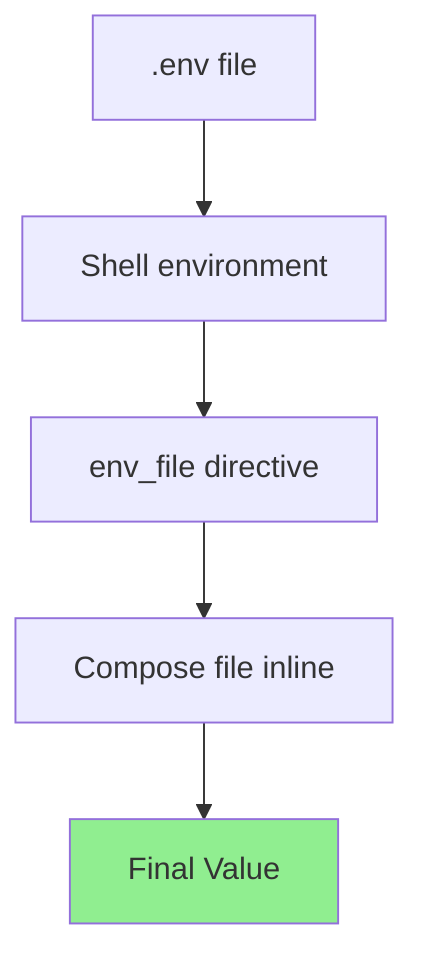

# How to Use Docker Compose Environment Files

Author: [nawazdhandala](https://www.github.com/nawazdhandala)

Tags: Docker, Docker Compose, Environment Variables, DevOps, Configuration

Description: Master Docker Compose environment files to manage configuration across development, staging, and production environments with proper secret handling and variable precedence.

---

Environment variables in Docker Compose can come from multiple sources: shell environment, `.env` files, `env_file` directives, and inline definitions. Understanding how these interact prevents configuration surprises and security issues.

## Environment Variable Precedence

Docker Compose reads environment variables in a specific order. Later sources override earlier ones:



1. Variables defined inline in `docker-compose.yml`
2. Variables from files specified in `env_file`
3. Variables passed from the shell environment
4. Variables from `.env` file in the project directory

```bash
# Shell variable takes precedence over .env file
export DATABASE_URL="postgres://prod:secret@db:5432/app"
docker compose up

# .env file value used if shell variable not set
unset DATABASE_URL
docker compose up
```

## The Default .env File

Docker Compose automatically reads a `.env` file in the same directory as your `docker-compose.yml`. This file sets default values for variable substitution in the Compose file itself.

```bash
# .env file
POSTGRES_VERSION=15
APP_PORT=3000
REDIS_PORT=6379
```

```yaml
# docker-compose.yml using .env variables
version: '3.8'
services:
  database:
    image: postgres:${POSTGRES_VERSION}
    ports:
      - "${APP_PORT}:5432"

  cache:
    image: redis:7-alpine
    ports:
      - "${REDIS_PORT}:6379"
```

Important distinction: `.env` file variables are used for substitution in the Compose file. They are not automatically passed to containers.

## Using env_file for Container Variables

The `env_file` directive loads variables into the container environment:

```yaml
# docker-compose.yml
version: '3.8'
services:
  api:
    image: myapp:latest
    env_file:
      - .env.common        # Shared across all services
      - .env.api           # API-specific variables
    environment:
      # Inline variables override env_file
      - LOG_LEVEL=debug
```

```bash
# .env.common
NODE_ENV=production
TZ=UTC

# .env.api
DATABASE_URL=postgres://user:pass@db:5432/app
REDIS_URL=redis://cache:6379
API_KEY=abc123
```

Multiple env files are processed in order, with later files overriding earlier ones:

```yaml
services:
  api:
    env_file:
      - .env.defaults      # Base configuration
      - .env.local         # Local overrides (gitignored)
```

## Environment-Specific Configurations

Structure your environment files for different deployment targets:

```
project/
  docker-compose.yml
  .env                    # Default values (committed)
  .env.local              # Local overrides (gitignored)
  .env.development        # Development settings
  .env.staging            # Staging settings
  .env.production         # Production settings (gitignored)
```

```yaml
# docker-compose.yml
version: '3.8'
services:
  api:
    image: myapp:${APP_VERSION:-latest}
    env_file:
      - .env.${ENVIRONMENT:-development}
    environment:
      - ENVIRONMENT=${ENVIRONMENT:-development}
```

```bash
# Deploy to staging
ENVIRONMENT=staging docker compose up -d

# Deploy to production
ENVIRONMENT=production docker compose up -d
```

## Using Default Values and Required Variables

Handle missing variables gracefully with default values:

```yaml
version: '3.8'
services:
  api:
    image: myapp:${APP_VERSION:-latest}
    environment:
      # Default value if not set
      - LOG_LEVEL=${LOG_LEVEL:-info}

      # Default to empty string
      - OPTIONAL_FLAG=${OPTIONAL_FLAG-}

      # Error if not set (requires Compose 2.x)
      - DATABASE_URL=${DATABASE_URL:?Database URL is required}
    ports:
      - "${PORT:-8080}:8080"
```

Default value syntax:
- `${VAR:-default}` - Use default if VAR is unset or empty
- `${VAR-default}` - Use default only if VAR is unset
- `${VAR:?error}` - Error with message if VAR is unset or empty

## Keeping Secrets Out of Environment Files

Environment files should not contain production secrets. Use Docker secrets or external secret management:

```yaml
# docker-compose.yml for production
version: '3.8'
services:
  api:
    image: myapp:latest
    env_file:
      - .env.production
    secrets:
      - db_password
      - api_key
    environment:
      # Reference secret file paths, not values
      - DATABASE_PASSWORD_FILE=/run/secrets/db_password
      - API_KEY_FILE=/run/secrets/api_key

secrets:
  db_password:
    external: true
  api_key:
    external: true
```

For local development, use a gitignored secrets file:

```bash
# .env.secrets (gitignored)
DATABASE_PASSWORD=localdevpassword
API_SECRET_KEY=devsecret123
```

```yaml
services:
  api:
    env_file:
      - .env.development
      - .env.secrets  # Gitignored file with actual secrets
```

## Debugging Environment Variables

When variables are not working as expected, debug them:

```bash
# Show resolved Compose configuration with all substitutions
docker compose config

# Show only environment variables for a service
docker compose config | grep -A 50 "api:" | grep -E "^\s+environment:|^\s+-"

# Show what variables a running container received
docker compose exec api env | sort

# Check specific variable
docker compose exec api sh -c 'echo $DATABASE_URL'
```

Create a debug service to verify variable loading:

```yaml
services:
  debug:
    image: alpine
    env_file:
      - .env.development
    command: env
    profiles:
      - debug
```

```bash
# Run debug service to see all environment variables
docker compose --profile debug run --rm debug
```

## Multi-File Compose Setup with Environments

For complex projects, split configuration across multiple files:

```yaml
# docker-compose.yml - Base configuration
version: '3.8'
services:
  api:
    image: myapp:${APP_VERSION:-latest}
    env_file:
      - .env.common

# docker-compose.override.yml - Local development (auto-loaded)
services:
  api:
    env_file:
      - .env.development
    volumes:
      - ./src:/app/src

# docker-compose.prod.yml - Production overrides
services:
  api:
    env_file:
      - .env.production
    deploy:
      replicas: 3
```

```bash
# Development (uses docker-compose.yml + docker-compose.override.yml)
docker compose up

# Production
docker compose -f docker-compose.yml -f docker-compose.prod.yml up -d

# Or use COMPOSE_FILE environment variable
export COMPOSE_FILE=docker-compose.yml:docker-compose.prod.yml
docker compose up -d
```

## Variable Interpolation in Values

Environment file values can reference other variables:

```bash
# .env
APP_NAME=myapp
APP_ENV=production
LOG_PREFIX=${APP_NAME}-${APP_ENV}

# Result: LOG_PREFIX=myapp-production
```

However, interpolation only works in `.env` files used by Compose, not in `env_file` files loaded into containers. For container environment files, variables are taken literally:

```bash
# .env.api (loaded via env_file)
# This will NOT interpolate - container receives literal string
LOG_PREFIX=${APP_NAME}-${APP_ENV}

# Use explicit values instead
LOG_PREFIX=myapp-production
```

## Secure Environment File Permissions

Protect environment files containing sensitive data:

```bash
# Set restrictive permissions on secret files
chmod 600 .env.production .env.secrets

# Verify permissions
ls -la .env*

# Add to .gitignore
echo ".env.production" >> .gitignore
echo ".env.secrets" >> .gitignore
echo ".env.local" >> .gitignore
```

## Complete Example Project Structure

Here is a full example showing environment file organization:

```
myproject/
  docker-compose.yml
  docker-compose.override.yml      # Local dev (auto-loaded)
  docker-compose.prod.yml          # Production overrides
  .env                             # Default substitutions (committed)
  .env.common                      # Common vars all environments
  .env.development                 # Dev-specific vars
  .env.staging                     # Staging-specific vars
  .env.production                  # Prod vars (gitignored)
  .env.local                       # Personal overrides (gitignored)
  .gitignore
```

```bash
# .gitignore
.env.production
.env.secrets
.env.local
*.pem
*.key
```

```yaml
# docker-compose.yml
version: '3.8'
services:
  api:
    build: .
    image: myapp:${APP_VERSION:-dev}
    env_file:
      - .env.common
      - .env.${ENVIRONMENT:-development}
    environment:
      - ENVIRONMENT=${ENVIRONMENT:-development}
    ports:
      - "${API_PORT:-3000}:3000"
```

---

Environment files separate configuration from code, making your Docker Compose setup portable across environments. Keep secrets out of committed files, use clear naming conventions, and document what variables each service requires. Your future self (and your team) will thank you when deploying to production at midnight.
