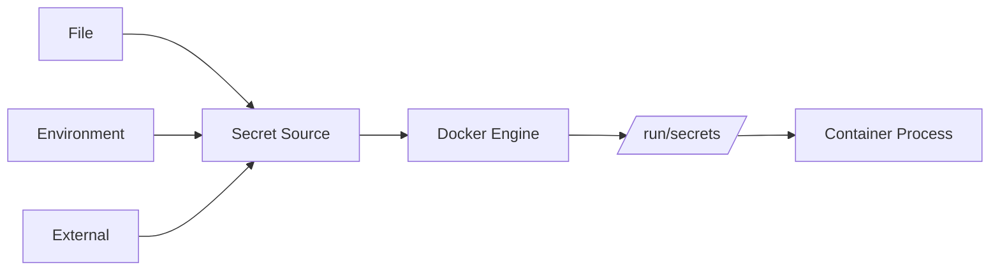

# How to Use Docker Compose Secrets

Author: [nawazdhandala](https://www.github.com/nawazdhandala)

Tags: Docker, Docker Compose, Security, Secrets Management, DevOps

Description: Securely manage sensitive data in Docker Compose using secrets for passwords, API keys, and certificates without exposing them in environment variables or image layers.

---

Environment variables are convenient but risky for secrets. They appear in process listings, logs, and container inspect output. Docker Compose secrets provide a more secure way to pass sensitive data to containers through in-memory filesystems.

## How Docker Secrets Work

Secrets are mounted as files inside containers at `/run/secrets/<secret_name>`. They are:
- Stored in memory (tmpfs), not on disk
- Only accessible to services that explicitly request them
- Not visible in `docker inspect` or container logs



## Basic Secret Usage

Define secrets from files:

```yaml
version: '3.8'

services:
  api:
    image: myapp:latest
    secrets:
      - db_password
      - api_key

secrets:
  db_password:
    file: ./secrets/db_password.txt
  api_key:
    file: ./secrets/api_key.txt
```

Create the secret files:

```bash
mkdir -p secrets
echo "supersecretpassword" > secrets/db_password.txt
echo "sk_live_abc123" > secrets/api_key.txt

# Restrict file permissions
chmod 600 secrets/*.txt
```

Inside the container, secrets appear as files:

```bash
docker compose exec api cat /run/secrets/db_password
# supersecretpassword

docker compose exec api ls -la /run/secrets/
# total 8
# -r--r--r-- 1 root root 20 Jan 25 10:00 db_password
# -r--r--r-- 1 root root 13 Jan 25 10:00 api_key
```

## Reading Secrets in Applications

Your application needs to read secrets from files instead of environment variables:

### Node.js

```javascript
// Read secret from file
const fs = require('fs');

function readSecret(name) {
  const secretPath = `/run/secrets/${name}`;
  try {
    return fs.readFileSync(secretPath, 'utf8').trim();
  } catch (error) {
    // Fallback to environment variable for development
    return process.env[name.toUpperCase()];
  }
}

const dbPassword = readSecret('db_password');
const apiKey = readSecret('api_key');
```

### Python

```python
import os
from pathlib import Path

def read_secret(name: str) -> str:
    """Read a Docker secret or fall back to environment variable."""
    secret_path = Path(f'/run/secrets/{name}')
    if secret_path.exists():
        return secret_path.read_text().strip()
    # Fallback for development
    return os.environ.get(name.upper(), '')

db_password = read_secret('db_password')
api_key = read_secret('api_key')
```

### Go

```go
package main

import (
    "os"
    "strings"
)

func readSecret(name string) string {
    data, err := os.ReadFile("/run/secrets/" + name)
    if err != nil {
        // Fallback to environment variable
        return os.Getenv(strings.ToUpper(name))
    }
    return strings.TrimSpace(string(data))
}
```

## Using _FILE Environment Variables

Many official Docker images support the `_FILE` suffix convention:

```yaml
version: '3.8'

services:
  database:
    image: postgres:15
    environment:
      POSTGRES_PASSWORD_FILE: /run/secrets/db_password
    secrets:
      - db_password

  mysql:
    image: mysql:8
    environment:
      MYSQL_ROOT_PASSWORD_FILE: /run/secrets/db_root_password
    secrets:
      - db_root_password

secrets:
  db_password:
    file: ./secrets/db_password.txt
  db_root_password:
    file: ./secrets/db_root_password.txt
```

## Secrets from Environment Variables

For CI/CD pipelines, create secrets from environment variables:

```yaml
version: '3.8'

services:
  api:
    image: myapp:latest
    secrets:
      - db_password

secrets:
  db_password:
    environment: DB_PASSWORD
```

```bash
# Set environment variable before running
export DB_PASSWORD="secret-from-ci"
docker compose up
```

## External Secrets (Swarm Mode)

In Docker Swarm, secrets can be managed externally:

```yaml
version: '3.8'

services:
  api:
    image: myapp:latest
    secrets:
      - source: production_db_password
        target: db_password
        uid: '1000'
        gid: '1000'
        mode: 0400

secrets:
  production_db_password:
    external: true
```

```bash
# Create the secret in Swarm
echo "supersecret" | docker secret create production_db_password -

# List secrets
docker secret ls
```

## Custom Secret Mount Options

Control how secrets appear in containers:

```yaml
version: '3.8'

services:
  api:
    image: myapp:latest
    secrets:
      - source: db_password
        target: database_password    # Custom filename
        uid: '1000'                  # Owner UID
        gid: '1000'                  # Owner GID
        mode: 0400                   # File permissions

secrets:
  db_password:
    file: ./secrets/db_password.txt
```

The secret appears at `/run/secrets/database_password` with the specified permissions.

## Secrets with Multiple Environments

Manage different secrets for different environments:

```yaml
# docker-compose.yml
version: '3.8'

services:
  api:
    image: myapp:latest
    secrets:
      - db_password
      - api_key

# docker-compose.override.yml (development)
secrets:
  db_password:
    file: ./secrets/dev/db_password.txt
  api_key:
    file: ./secrets/dev/api_key.txt

# docker-compose.prod.yml (production)
secrets:
  db_password:
    external: true
    name: prod_db_password
  api_key:
    external: true
    name: prod_api_key
```

```bash
# Development
docker compose up

# Production
docker compose -f docker-compose.yml -f docker-compose.prod.yml up
```

## Generating Secrets Securely

Create strong random secrets:

```bash
# Generate random password
openssl rand -base64 32 > secrets/db_password.txt

# Generate API key
openssl rand -hex 32 > secrets/api_key.txt

# Generate certificates
openssl req -x509 -nodes -days 365 \
  -newkey rsa:2048 \
  -keyout secrets/tls.key \
  -out secrets/tls.crt \
  -subj "/CN=myapp.local"
```

Using secrets for certificates:

```yaml
version: '3.8'

services:
  nginx:
    image: nginx:alpine
    secrets:
      - source: tls_cert
        target: /etc/nginx/ssl/tls.crt
        mode: 0444
      - source: tls_key
        target: /etc/nginx/ssl/tls.key
        mode: 0400
    volumes:
      - ./nginx.conf:/etc/nginx/nginx.conf:ro

secrets:
  tls_cert:
    file: ./secrets/tls.crt
  tls_key:
    file: ./secrets/tls.key
```

## Debugging Secrets

When secrets are not working:

```bash
# Check if secret is mounted
docker compose exec api ls -la /run/secrets/

# Read secret content
docker compose exec api cat /run/secrets/db_password

# Check secret ownership
docker compose exec api stat /run/secrets/db_password

# Verify service has secret access
docker compose config | grep -A 10 secrets:
```

Common issues:

```yaml
# WRONG: Secret name mismatch
services:
  api:
    secrets:
      - database_password  # Name does not match defined secret

secrets:
  db_password:
    file: ./secrets/db_password.txt

# FIXED: Names must match
services:
  api:
    secrets:
      - db_password

secrets:
  db_password:
    file: ./secrets/db_password.txt
```

## Secrets vs Environment Variables

When to use each:

| Use Secrets For | Use Environment For |
|-----------------|---------------------|
| Passwords | Configuration flags |
| API keys | Log levels |
| Certificates | Port numbers |
| Private keys | Feature toggles |
| Database credentials | Non-sensitive URLs |

## Complete Production Example

```yaml
version: '3.8'

services:
  api:
    image: myapp:latest
    secrets:
      - db_password
      - redis_password
      - jwt_secret
      - source: tls_cert
        target: /app/certs/server.crt
        mode: 0444
      - source: tls_key
        target: /app/certs/server.key
        mode: 0400
    environment:
      # Non-sensitive configuration
      - NODE_ENV=production
      - LOG_LEVEL=info
      - PORT=3000
      # Tell app where to find secrets
      - DB_PASSWORD_FILE=/run/secrets/db_password
      - REDIS_PASSWORD_FILE=/run/secrets/redis_password
      - JWT_SECRET_FILE=/run/secrets/jwt_secret
    healthcheck:
      test: ["CMD", "curl", "-f", "http://localhost:3000/health"]
      interval: 30s
      timeout: 10s
      retries: 3

  database:
    image: postgres:15
    environment:
      POSTGRES_PASSWORD_FILE: /run/secrets/db_password
    secrets:
      - db_password
    volumes:
      - db_data:/var/lib/postgresql/data

  redis:
    image: redis:7-alpine
    command: >
      sh -c "redis-server --requirepass $$(cat /run/secrets/redis_password)"
    secrets:
      - redis_password

secrets:
  db_password:
    file: ./secrets/db_password.txt
  redis_password:
    file: ./secrets/redis_password.txt
  jwt_secret:
    file: ./secrets/jwt_secret.txt
  tls_cert:
    file: ./secrets/tls.crt
  tls_key:
    file: ./secrets/tls.key

volumes:
  db_data:
```

## Security Checklist

1. **Never commit secrets to git**
   ```bash
   echo "secrets/" >> .gitignore
   ```

2. **Restrict file permissions**
   ```bash
   chmod 600 secrets/*.txt
   chmod 700 secrets/
   ```

3. **Use secret files, not environment variables for sensitive data**

4. **Rotate secrets regularly**
   ```bash
   # Generate new secret
   openssl rand -base64 32 > secrets/db_password.txt
   # Restart services
   docker compose up -d
   ```

5. **Audit secret access**
   ```bash
   # Check which services have access to which secrets
   docker compose config | grep -B 5 -A 5 secrets:
   ```

---

Docker Compose secrets keep sensitive data out of environment variables, image layers, and process listings. Read secrets from files in your application, use the `_FILE` convention where supported, and never commit secret files to version control. For production deployments with Docker Swarm, external secrets provide centralized management with encryption at rest.
