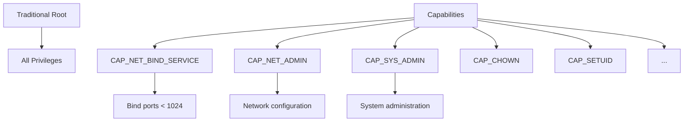

# How to Set Up Docker Container Capabilities

Author: [nawazdhandala](https://www.github.com/nawazdhandala)

Tags: Docker, Security, Linux, DevOps, Containers

Description: Configure Linux capabilities in Docker containers to grant specific privileges without running as root, implementing the principle of least privilege for container security.

---

Linux capabilities split the traditional root privilege into distinct units. Instead of giving a container full root access, you can grant only the specific capabilities it needs. This reduces the attack surface if a container is compromised while still allowing necessary operations like binding to privileged ports or manipulating network settings.

## Understanding Linux Capabilities

Traditionally, Linux processes were either privileged (UID 0) or unprivileged. Capabilities break root privileges into granular permissions:



Common capabilities:

| Capability | Purpose |
|------------|---------|
| CAP_NET_BIND_SERVICE | Bind to ports below 1024 |
| CAP_NET_ADMIN | Network configuration (iptables, routing) |
| CAP_NET_RAW | Use raw sockets (ping, packet capture) |
| CAP_SYS_ADMIN | System administration (mount, sysctl) |
| CAP_SYS_PTRACE | Trace processes (debugging) |
| CAP_CHOWN | Change file ownership |
| CAP_DAC_OVERRIDE | Bypass file permission checks |
| CAP_SETUID / CAP_SETGID | Change UID/GID |
| CAP_KILL | Send signals to any process |
| CAP_SYS_TIME | Set system clock |

## Docker Default Capabilities

Docker containers start with a limited set of capabilities by default:

```bash
# View default capabilities
docker run --rm alpine cat /proc/1/status | grep Cap

# Decode capability bitmask
docker run --rm alpine sh -c "apk add -q libcap && capsh --decode=$(cat /proc/1/status | grep CapEff | cut -f2)"
```

Default capabilities include:
- CHOWN, DAC_OVERRIDE, FSETID, FOWNER
- KILL, SETGID, SETUID, SETPCAP
- NET_BIND_SERVICE, NET_RAW
- SYS_CHROOT, MKNOD, AUDIT_WRITE
- SETFCAP

## Dropping Capabilities

Remove unnecessary capabilities to reduce attack surface:

```bash
# Drop all capabilities
docker run --cap-drop=ALL alpine id

# Drop specific capabilities
docker run --cap-drop=NET_RAW --cap-drop=CHOWN alpine ping localhost
# ping: permission denied (requires NET_RAW)
```

In Docker Compose:

```yaml
version: '3.8'
services:
  api:
    image: myapp:latest
    cap_drop:
      - ALL
```

## Adding Capabilities

Grant specific capabilities without running as privileged:

```bash
# Allow binding to port 80 without root
docker run --cap-drop=ALL --cap-add=NET_BIND_SERVICE -p 80:80 nginx:alpine

# Allow network administration
docker run --cap-drop=ALL --cap-add=NET_ADMIN alpine ip link set eth0 down
```

In Docker Compose:

```yaml
version: '3.8'
services:
  web:
    image: nginx:alpine
    cap_drop:
      - ALL
    cap_add:
      - NET_BIND_SERVICE
      - CHOWN
      - SETGID
      - SETUID
    ports:
      - "80:80"
```

## Common Capability Configurations

### Web Server (nginx, Apache)

```yaml
services:
  nginx:
    image: nginx:alpine
    cap_drop:
      - ALL
    cap_add:
      - NET_BIND_SERVICE  # Bind to port 80/443
      - CHOWN             # Change file ownership
      - SETGID            # Set group ID
      - SETUID            # Set user ID (worker processes)
    user: root  # Start as root, then drop to www-data
```

### Network Monitoring (tcpdump, Prometheus node exporter)

```yaml
services:
  tcpdump:
    image: nicolaka/netshoot
    cap_drop:
      - ALL
    cap_add:
      - NET_RAW           # Raw socket access
      - NET_ADMIN         # Network interface access
    network_mode: host    # Access host network
```

### VPN Client

```yaml
services:
  vpn:
    image: openvpn:latest
    cap_drop:
      - ALL
    cap_add:
      - NET_ADMIN         # Create tun/tap devices
      - MKNOD             # Create device nodes
    devices:
      - /dev/net/tun:/dev/net/tun
```

### Container Runtime / Docker-in-Docker

```yaml
services:
  dind:
    image: docker:dind
    privileged: false     # Avoid privileged mode
    cap_drop:
      - ALL
    cap_add:
      - SYS_ADMIN         # Mount filesystems
      - NET_ADMIN         # Network namespaces
      - SYS_PTRACE        # Process tracing
      - MKNOD             # Device nodes
```

Note: Docker-in-Docker often requires privileged mode in practice. Consider alternatives like Kaniko for builds.

### Debugging Container

```yaml
services:
  debug:
    image: nicolaka/netshoot
    cap_drop:
      - ALL
    cap_add:
      - NET_RAW           # ping, tcpdump
      - NET_ADMIN         # ip, iptables
      - SYS_PTRACE        # strace, debugging
    profiles:
      - debug
```

## Verifying Container Capabilities

Check what capabilities a running container has:

```bash
# Inside container
docker exec mycontainer cat /proc/1/status | grep Cap

# Decode the bitmask
docker exec mycontainer sh -c "grep CapEff /proc/1/status | cut -f2 | xargs -I{} capsh --decode={}"

# Or use getpcaps
docker exec mycontainer getpcaps 1
```

Test if a specific capability is available:

```bash
# Test NET_BIND_SERVICE
docker run --rm --cap-drop=ALL --cap-add=NET_BIND_SERVICE alpine \
  sh -c "apk add -q socat && socat TCP-LISTEN:80 -" &
# Should succeed

# Test without capability
docker run --rm --cap-drop=ALL alpine \
  sh -c "apk add -q socat && socat TCP-LISTEN:80 -"
# Should fail: permission denied
```

## Capabilities and User Namespaces

When user namespaces are enabled, capabilities are relative to that namespace:

```bash
# With user namespace remapping
docker run --rm --userns=host --cap-add=NET_ADMIN alpine ip link

# Capabilities in user namespace are limited
docker run --rm --cap-add=SYS_ADMIN alpine mount -t tmpfs none /mnt
# May fail depending on user namespace configuration
```

## Security Best Practices

### 1. Start with cap_drop ALL

```yaml
services:
  secure-app:
    image: myapp:latest
    cap_drop:
      - ALL
    cap_add:
      # Add only what is actually needed
      - NET_BIND_SERVICE
```

### 2. Audit Required Capabilities

Determine what capabilities your application actually needs:

```bash
# Run with all capabilities and trace system calls
docker run --rm --cap-add=ALL strace -f myapp 2>&1 | grep -i "permission denied\|operation not permitted"

# Use ausearch for capability denials (if audit is enabled)
ausearch -m avc -ts recent | grep capability
```

### 3. Document Capability Requirements

```dockerfile
# Dockerfile
LABEL capabilities.required="NET_BIND_SERVICE,CHOWN"
LABEL capabilities.optional="SYS_PTRACE"
LABEL capabilities.description="NET_BIND_SERVICE for port 80, CHOWN for log rotation"
```

### 4. Combine with Other Security Features

```yaml
version: '3.8'
services:
  secure-api:
    image: myapp:latest
    cap_drop:
      - ALL
    cap_add:
      - NET_BIND_SERVICE
    security_opt:
      - no-new-privileges:true
      - seccomp:default
    read_only: true
    tmpfs:
      - /tmp:mode=1777,size=100m
    user: "1000:1000"
```

## Privileged Mode vs Capabilities

Avoid `privileged: true` when possible:

```yaml
# BAD: Full host access
services:
  app:
    privileged: true  # Grants ALL capabilities plus device access

# BETTER: Specific capabilities
services:
  app:
    cap_drop:
      - ALL
    cap_add:
      - NET_ADMIN
      - SYS_ADMIN
```

When privileged mode seems necessary, analyze what capabilities are actually needed:

```bash
# Test with specific capabilities instead of privileged
docker run --rm \
  --cap-add=SYS_ADMIN \
  --cap-add=NET_ADMIN \
  --device=/dev/net/tun \
  myapp:latest
```

## Capability Reference Quick Guide

```yaml
# Networking
cap_add:
  - NET_BIND_SERVICE  # Bind ports < 1024
  - NET_ADMIN         # iptables, ip, network config
  - NET_RAW           # ping, tcpdump, raw sockets

# File operations
cap_add:
  - CHOWN             # chown files
  - DAC_OVERRIDE      # Bypass file permissions
  - FOWNER            # Bypass ownership checks

# Process management
cap_add:
  - KILL              # Send any signal
  - SETUID            # Change UID
  - SETGID            # Change GID
  - SYS_PTRACE        # Trace/debug processes

# System administration
cap_add:
  - SYS_ADMIN         # Mount, sysctl, many admin ops
  - SYS_TIME          # Set system clock
  - SYS_RESOURCE      # Override resource limits
```

## Debugging Capability Issues

When an application fails due to missing capabilities:

```bash
# Check error messages
docker logs mycontainer 2>&1 | grep -i "permission\|denied\|operation not permitted"

# Trace system calls
docker run --rm --cap-add=SYS_PTRACE myapp strace -f /entrypoint.sh 2>&1 | grep EPERM

# Test incrementally
for cap in NET_BIND_SERVICE NET_ADMIN NET_RAW SYS_ADMIN; do
  echo "Testing with $cap..."
  docker run --rm --cap-drop=ALL --cap-add=$cap myapp:test && echo "$cap: needed" || echo "$cap: not enough"
done
```

---

Linux capabilities let you grant containers specific privileges without full root access. Always start by dropping all capabilities, then add back only what your application needs. Document the required capabilities and combine them with other security measures like seccomp profiles and read-only filesystems. This defense-in-depth approach limits the damage if a container is compromised.
