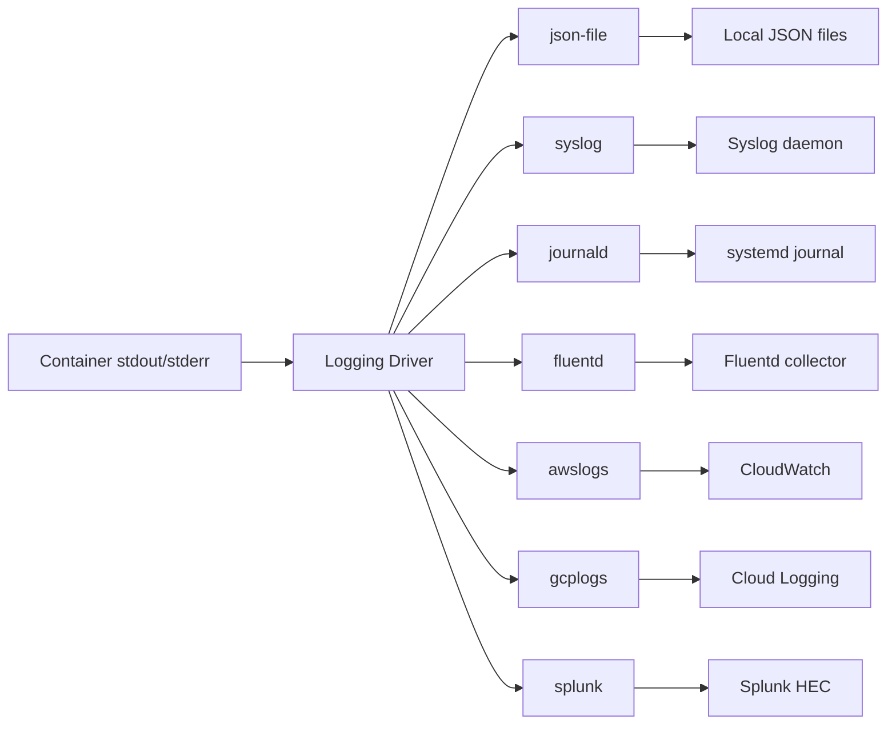

# How to Set Up Docker Container Logging Drivers

Author: [nawazdhandala](https://www.github.com/nawazdhandala)

Tags: Docker, Logging, DevOps, Observability, Monitoring

Description: Configure Docker logging drivers to route container logs to files, syslog, Fluentd, or cloud services with proper rotation and formatting.

---

By default, Docker captures container stdout and stderr and stores them as JSON files. This works for development but falls short in production where you need log rotation, centralized aggregation, and efficient storage. Docker logging drivers let you send logs wherever they need to go.

## Understanding Logging Drivers

Docker supports multiple logging drivers, each with different capabilities:



| Driver | Use Case | docker logs support |
|--------|----------|---------------------|
| json-file | Default, local development | Yes |
| local | Production local, better performance | Yes |
| syslog | Traditional Unix logging | No |
| journald | systemd-based systems | Yes (via journalctl) |
| fluentd | Centralized logging | No |
| awslogs | AWS CloudWatch | No |
| gcplogs | Google Cloud Logging | No |
| splunk | Splunk Enterprise | No |

## The Default json-file Driver

The default driver stores logs as JSON in `/var/lib/docker/containers/<id>/<id>-json.log`:

```bash
# View raw log file location
docker inspect mycontainer --format '{{.LogPath}}'

# Check log file size
ls -lh $(docker inspect mycontainer --format '{{.LogPath}}')
```

Configure log rotation to prevent disk exhaustion:

```bash
# Run container with log rotation
docker run -d \
  --log-driver=json-file \
  --log-opt max-size=10m \
  --log-opt max-file=5 \
  --log-opt compress=true \
  --name api \
  myapp:latest
```

Set defaults for all containers in Docker daemon configuration:

```json
// /etc/docker/daemon.json
{
  "log-driver": "json-file",
  "log-opts": {
    "max-size": "10m",
    "max-file": "5",
    "compress": "true",
    "labels": "service,environment",
    "env": "APP_VERSION,HOSTNAME"
  }
}
```

```bash
# Reload Docker to apply changes
sudo systemctl reload docker
```

## The Local Driver for Production

The `local` driver is optimized for performance and disk usage:

```bash
# Run with local driver
docker run -d \
  --log-driver=local \
  --log-opt max-size=50m \
  --log-opt max-file=10 \
  --name api \
  myapp:latest
```

Benefits over json-file:
- Compressed by default
- Better read performance
- Lower disk I/O

## Sending Logs to Syslog

Route container logs to your system's syslog daemon:

```bash
# Send to local syslog with custom tag
docker run -d \
  --log-driver=syslog \
  --log-opt syslog-address=udp://localhost:514 \
  --log-opt syslog-facility=daemon \
  --log-opt tag="{{.Name}}/{{.ID}}" \
  --log-opt syslog-format=rfc5424 \
  --name api \
  myapp:latest
```

For remote syslog servers:

```bash
# TCP syslog with TLS
docker run -d \
  --log-driver=syslog \
  --log-opt syslog-address=tcp+tls://syslog.example.com:6514 \
  --log-opt syslog-tls-ca-cert=/certs/ca.pem \
  --log-opt syslog-tls-cert=/certs/client.pem \
  --log-opt syslog-tls-key=/certs/client-key.pem \
  --name api \
  myapp:latest
```

## Using Fluentd for Log Aggregation

Fluentd is popular for collecting and forwarding logs:

```bash
# Start Fluentd container first
docker run -d \
  --name fluentd \
  -p 24224:24224 \
  -v /path/to/fluent.conf:/fluentd/etc/fluent.conf \
  fluent/fluentd:v1.16

# Run application with fluentd driver
docker run -d \
  --log-driver=fluentd \
  --log-opt fluentd-address=localhost:24224 \
  --log-opt tag="docker.{{.Name}}" \
  --log-opt fluentd-async=true \
  --log-opt fluentd-buffer-limit=8MB \
  --name api \
  myapp:latest
```

Fluentd configuration for forwarding to Elasticsearch:

```xml
# fluent.conf
<source>
  @type forward
  port 24224
  bind 0.0.0.0
</source>

<match docker.**>
  @type elasticsearch
  host elasticsearch
  port 9200
  index_name docker-logs
  type_name _doc
  logstash_format true
  logstash_prefix docker
  <buffer>
    flush_interval 5s
  </buffer>
</match>
```

## AWS CloudWatch Logs

For containers running on AWS:

```bash
# Requires AWS credentials configured
docker run -d \
  --log-driver=awslogs \
  --log-opt awslogs-region=us-east-1 \
  --log-opt awslogs-group=/ecs/myapp \
  --log-opt awslogs-stream=api-$(hostname) \
  --log-opt awslogs-create-group=true \
  --name api \
  myapp:latest
```

For ECS tasks, configure in task definition:

```json
{
  "logConfiguration": {
    "logDriver": "awslogs",
    "options": {
      "awslogs-group": "/ecs/myapp",
      "awslogs-region": "us-east-1",
      "awslogs-stream-prefix": "api"
    }
  }
}
```

## Google Cloud Logging

For containers on GCP:

```bash
# Requires Application Default Credentials
docker run -d \
  --log-driver=gcplogs \
  --log-opt gcp-project=my-project-id \
  --log-opt gcp-log-cmd=true \
  --log-opt labels=service,environment \
  --name api \
  myapp:latest
```

## Using journald with systemd

On systems using systemd, journald integration provides powerful querying:

```bash
# Run with journald driver
docker run -d \
  --log-driver=journald \
  --log-opt tag="{{.Name}}" \
  --log-opt labels=service \
  --name api \
  myapp:latest

# Query logs with journalctl
journalctl CONTAINER_NAME=api --since "1 hour ago"

# Follow logs in real-time
journalctl -f CONTAINER_NAME=api

# Export to JSON for analysis
journalctl CONTAINER_NAME=api -o json > logs.json
```

## Docker Compose Logging Configuration

Configure logging in docker-compose.yml:

```yaml
version: '3.8'
services:
  api:
    image: myapp:latest
    logging:
      driver: json-file
      options:
        max-size: "10m"
        max-file: "5"
        compress: "true"
        labels: "service,environment"

  worker:
    image: worker:latest
    logging:
      driver: fluentd
      options:
        fluentd-address: "localhost:24224"
        tag: "docker.worker"
        fluentd-async: "true"

  # Inherit default logging from daemon.json
  nginx:
    image: nginx:alpine
    # No logging config - uses daemon defaults
```

## Dual Logging: Local and Remote

Docker 20.10+ supports dual logging to keep local logs while forwarding:

```json
// /etc/docker/daemon.json
{
  "log-driver": "fluentd",
  "log-opts": {
    "fluentd-address": "localhost:24224",
    "tag": "docker.{{.Name}}"
  },
  "features": {
    "buildkit": true
  },
  "log-opts": {
    "mode": "non-blocking",
    "max-buffer-size": "4m"
  }
}
```

With dual logging enabled, `docker logs` works even with non-json drivers.

## Structured Logging Best Practices

Format your application logs for better parsing:

```javascript
// Application logging (Node.js example)
const log = {
  timestamp: new Date().toISOString(),
  level: 'info',
  service: 'api',
  message: 'Request processed',
  requestId: '123-456',
  duration: 45,
  statusCode: 200
};
console.log(JSON.stringify(log));
```

Configure Docker to parse JSON logs:

```bash
# Fluentd can parse JSON logs automatically
docker run -d \
  --log-driver=fluentd \
  --log-opt fluentd-address=localhost:24224 \
  --log-opt tag="docker.{{.Name}}" \
  --name api \
  myapp:latest
```

## Debugging Logging Issues

When logs are not appearing where expected:

```bash
# Check current logging driver
docker inspect mycontainer --format '{{.HostConfig.LogConfig.Type}}'

# Check logging options
docker inspect mycontainer --format '{{json .HostConfig.LogConfig.Config}}'

# Test log delivery
docker run --rm \
  --log-driver=fluentd \
  --log-opt fluentd-address=localhost:24224 \
  alpine echo "Test log message"

# Check Docker daemon logs for errors
sudo journalctl -u docker.service | grep -i log

# Verify Fluentd is receiving logs
docker logs fluentd 2>&1 | tail -20
```

## Performance Considerations

Non-blocking mode prevents log backpressure from affecting your application:

```bash
# Non-blocking mode drops logs if buffer is full
docker run -d \
  --log-opt mode=non-blocking \
  --log-opt max-buffer-size=4m \
  --name api \
  myapp:latest
```

For high-throughput applications:

```yaml
# docker-compose.yml
services:
  api:
    image: myapp:latest
    logging:
      driver: fluentd
      options:
        fluentd-address: "localhost:24224"
        fluentd-async: "true"
        fluentd-buffer-limit: "16MB"
        mode: "non-blocking"
        max-buffer-size: "8m"
```

---

Choosing the right logging driver depends on your infrastructure. For local development, stick with json-file and proper rotation. For production, use fluentd or cloud-native drivers to centralize logs. Always configure rotation and buffer limits to prevent disk exhaustion and application slowdowns when log destinations become unavailable.
