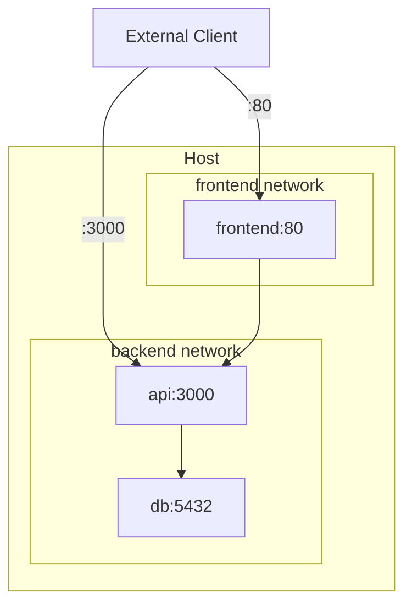
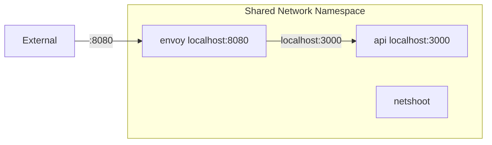

# How to Set Up Docker Container Networking Modes

Author: [nawazdhandala](https://www.github.com/nawazdhandala)

Tags: Docker, Networking, DevOps, Containers, Infrastructure

Description: Learn the different Docker network modes including bridge, host, none, and container networking. Understand when to use each mode and how to configure networks for development and production environments.

---

Docker provides several networking modes that control how containers communicate with each other and the outside world. Choosing the right mode affects performance, security, and ease of configuration.

## Network Mode Overview

```bash
# View available network drivers
docker network ls

# Default networks
# NETWORK ID     NAME      DRIVER    SCOPE
# abc123         bridge    bridge    local
# def456         host      host      local
# ghi789         none      null      local
```

| Mode | Use Case | Container-to-Container | External Access |
|------|----------|----------------------|-----------------|
| bridge | Default for standalone containers | Via network | Port publishing |
| host | Maximum network performance | Via localhost | Direct access |
| none | Complete network isolation | None | None |
| container | Share network with another container | Shared localhost | Via parent |
| overlay | Multi-host communication | Across hosts | Via ingress |

## Bridge Mode (Default)

Bridge mode creates an isolated network where containers can communicate using their names or IPs.

```bash
# Run container with default bridge network
docker run -d --name web nginx:alpine

# Containers on default bridge must use IP, not names
docker inspect web --format '{{.NetworkSettings.IPAddress}}'
# 172.17.0.2

# Create custom bridge network for name-based DNS
docker network create myapp-network

# Run containers on custom network
docker run -d --name api --network myapp-network myapp/api:latest
docker run -d --name db --network myapp-network postgres:15

# Containers on same custom network can reach each other by name
docker exec api ping db
# PING db (172.18.0.3): 56 data bytes
```

### Bridge Mode in Docker Compose

```yaml
# docker-compose.yml
version: '3.8'

services:
  api:
    image: myapp/api:latest
    ports:
      - "3000:3000"
    networks:
      - backend

  db:
    image: postgres:15
    networks:
      - backend

  frontend:
    image: myapp/frontend:latest
    ports:
      - "80:80"
    networks:
      - backend
      - frontend

networks:
  backend:
    driver: bridge
  frontend:
    driver: bridge
```



### Custom Bridge Network Options

```bash
# Create network with custom subnet
docker network create \
  --driver bridge \
  --subnet 10.0.0.0/24 \
  --gateway 10.0.0.1 \
  custom-net

# Create network with specific IP range for containers
docker network create \
  --driver bridge \
  --subnet 192.168.100.0/24 \
  --ip-range 192.168.100.128/25 \
  production-net

# Run container with static IP
docker run -d \
  --name api \
  --network custom-net \
  --ip 10.0.0.10 \
  myapp/api:latest
```

## Host Mode

Host mode removes network isolation. The container shares the host's network stack directly.

```bash
# Run container in host network mode
docker run -d --network host nginx:alpine

# nginx is directly available on host's port 80
# No port publishing needed or allowed
curl http://localhost:80
```

### When to Use Host Mode

```yaml
# docker-compose.yml
services:
  # High-performance networking service
  proxy:
    image: nginx:alpine
    network_mode: host
    volumes:
      - ./nginx.conf:/etc/nginx/nginx.conf:ro

  # Network monitoring tool
  monitoring:
    image: nicolaka/netshoot
    network_mode: host
    cap_add:
      - NET_ADMIN
```

**Advantages:**
- No NAT overhead, better performance
- Direct access to host network interfaces
- Simplifies port configuration

**Disadvantages:**
- No port mapping (container uses host ports directly)
- Port conflicts if multiple containers need same port
- Reduced security isolation
- Not available on Docker Desktop (macOS/Windows)

## None Mode

None mode provides complete network isolation. The container has no network interfaces except loopback.

```bash
# Run container with no networking
docker run -d --network none myapp:latest

# Check network interfaces (only loopback exists)
docker exec container-name ip addr
# 1: lo: <LOOPBACK,UP> inet 127.0.0.1/8
```

### Use Cases for None Mode

```yaml
# docker-compose.yml
services:
  # Batch processing job that doesn't need network
  data-processor:
    image: myapp/processor:latest
    network_mode: none
    volumes:
      - ./input:/data/input:ro
      - ./output:/data/output

  # Security-sensitive service
  crypto-service:
    image: myapp/crypto:latest
    network_mode: none
    volumes:
      - ./keys:/keys:ro
```

## Container Mode

Container mode shares the network namespace with another container. Both containers see the same network interfaces and share localhost.

```bash
# Start the primary container
docker run -d --name webapp nginx:alpine

# Start debug container sharing webapp's network
docker run -it --network container:webapp nicolaka/netshoot

# Inside netshoot, localhost:80 reaches nginx
curl localhost:80
```

### Sidecar Pattern with Container Mode

```yaml
# docker-compose.yml
services:
  # Main application
  api:
    image: myapp/api:latest
    ports:
      - "3000:3000"

  # Sidecar sharing api's network namespace
  api-proxy:
    image: envoyproxy/envoy:latest
    network_mode: "service:api"
    # Envoy can now proxy to localhost:3000

  # Debugging sidecar
  api-debug:
    image: nicolaka/netshoot
    network_mode: "service:api"
    profiles:
      - debug
    command: sleep infinity
```



## Overlay Networks (Swarm/Multi-Host)

Overlay networks span multiple Docker hosts, enabling container communication across machines.

```bash
# Initialize swarm mode
docker swarm init

# Create overlay network
docker network create \
  --driver overlay \
  --attachable \
  production-overlay

# Deploy service to overlay network
docker service create \
  --name api \
  --network production-overlay \
  --replicas 3 \
  myapp/api:latest
```

```yaml
# stack.yml for Docker Swarm
version: '3.8'

services:
  api:
    image: myapp/api:latest
    deploy:
      replicas: 3
    networks:
      - production

  db:
    image: postgres:15
    deploy:
      placement:
        constraints:
          - node.labels.db == true
    networks:
      - production

networks:
  production:
    driver: overlay
    attachable: true
```

## Network Troubleshooting

### Inspect Network Configuration

```bash
# View network details
docker network inspect bridge

# See which containers are on a network
docker network inspect myapp-network --format '{{range .Containers}}{{.Name}} {{end}}'

# Check container's network settings
docker inspect mycontainer --format '{{json .NetworkSettings.Networks}}' | jq

# List container's published ports
docker port mycontainer
```

### Test Connectivity

```bash
# Ping another container by name
docker exec api ping db

# Check DNS resolution
docker exec api nslookup db

# Test TCP connection
docker exec api nc -zv db 5432

# Trace network path
docker exec api traceroute db
```

### Debug with Network Tools

```bash
# Run netshoot container on your network
docker run --rm -it --network myapp-network nicolaka/netshoot

# Available tools: curl, ping, dig, nslookup, tcpdump, netstat, ss, iperf, etc.
```

## Choosing the Right Mode

```yaml
# docker-compose.yml - Multiple network modes example
version: '3.8'

services:
  # Public-facing load balancer: host mode for performance
  # (Only on Linux, use bridge with ports on macOS/Windows)
  lb:
    image: nginx:alpine
    network_mode: host  # Direct host network access

  # Application services: custom bridge for isolation
  api:
    image: myapp/api:latest
    networks:
      - internal

  db:
    image: postgres:15
    networks:
      - internal

  # Batch job: no network needed
  backup:
    image: myapp/backup:latest
    network_mode: none
    volumes:
      - pgdata:/data:ro
      - ./backups:/backups

networks:
  internal:
    driver: bridge
    internal: true  # No external access

volumes:
  pgdata:
```

---

Bridge mode suits most use cases, providing isolation with easy container-to-container communication via DNS. Host mode maximizes network performance but sacrifices isolation. None mode creates complete network isolation for security-sensitive or offline workloads. Container mode enables sidecar patterns where multiple containers share a network stack. Choose based on your security requirements, performance needs, and architecture patterns.
