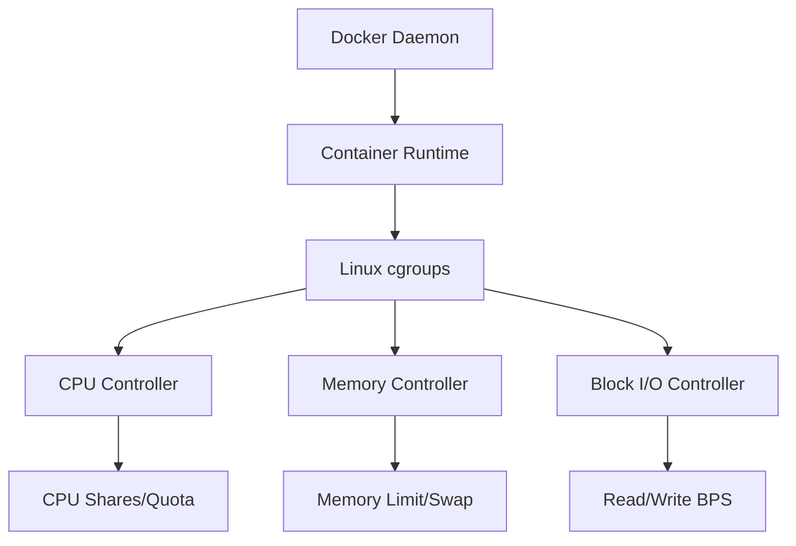

# How to Set Up Docker Container Resource Constraints

Author: [nawazdhandala](https://www.github.com/nawazdhandala)

Tags: Docker, DevOps, Resource Management, Performance, Containers

Description: Learn how to configure CPU, memory, and I/O limits for Docker containers to prevent resource contention and ensure stable production workloads.

---

Running containers without resource limits is like giving every tenant in an apartment building unlimited access to electricity. One misbehaving application can bring down your entire host. Resource constraints keep containers from hogging CPU, memory, or disk I/O, making your infrastructure predictable and stable.

## Understanding Container Resource Limits

Docker uses Linux cgroups (control groups) to enforce resource constraints. When you set limits, Docker translates them into cgroup configurations that the kernel enforces. This happens transparently, but understanding the mechanism helps you debug issues when limits kick in.



## Setting Memory Limits

Memory limits are the most critical constraint. Without them, a memory leak can trigger the OOM killer and crash random processes on your host.

```bash
# Run container with 512MB memory limit
# The container will be killed if it exceeds this limit
docker run -d --name api-server \
  --memory=512m \
  --memory-swap=512m \
  nginx:alpine

# Verify the memory limit was applied
docker inspect api-server --format '{{.HostConfig.Memory}}'
```

The `--memory-swap` flag controls total memory plus swap. Setting it equal to `--memory` disables swap for the container, which is recommended for production workloads.

```yaml
# docker-compose.yml with memory constraints
version: '3.8'
services:
  api:
    image: myapp:latest
    deploy:
      resources:
        limits:
          # Hard limit - container killed if exceeded
          memory: 512M
        reservations:
          # Soft limit - guaranteed minimum
          memory: 256M
```

## Configuring CPU Constraints

Docker offers several ways to limit CPU usage. The right choice depends on whether you want proportional sharing or hard limits.

### CPU Shares (Relative Weight)

CPU shares work on a proportional basis. A container with 1024 shares gets twice the CPU time as one with 512 shares, but only when CPU is contested.

```bash
# Container with higher CPU priority (default is 1024)
docker run -d --name critical-service \
  --cpu-shares=2048 \
  myapp:latest

# Container with lower CPU priority
docker run -d --name background-worker \
  --cpu-shares=512 \
  worker:latest
```

### CPU Quota (Hard Limits)

For strict CPU limits, use quota and period. The container gets `quota/period` worth of CPU time every period.

```bash
# Limit container to 50% of one CPU core
# quota=50000 microseconds out of period=100000
docker run -d --name rate-limited \
  --cpu-quota=50000 \
  --cpu-period=100000 \
  myapp:latest

# Simpler syntax: limit to 1.5 CPU cores
docker run -d --name compute-heavy \
  --cpus=1.5 \
  myapp:latest
```

### Pinning to Specific CPUs

For NUMA-aware applications or when you need isolation, pin containers to specific CPU cores.

```bash
# Run on CPU cores 0 and 1 only
docker run -d --name pinned-app \
  --cpuset-cpus="0,1" \
  myapp:latest

# Run on cores 0-3 with memory from NUMA node 0
docker run -d --name numa-aware \
  --cpuset-cpus="0-3" \
  --cpuset-mems="0" \
  myapp:latest
```

## Managing Block I/O

I/O limits prevent containers from saturating disk bandwidth. This is especially important when multiple containers share the same storage backend.

```bash
# Limit read bandwidth to 10MB/s from device
docker run -d --name io-limited \
  --device-read-bps=/dev/sda:10mb \
  --device-write-bps=/dev/sda:10mb \
  myapp:latest

# Limit I/O operations per second
docker run -d --name iops-limited \
  --device-read-iops=/dev/sda:1000 \
  --device-write-iops=/dev/sda:1000 \
  myapp:latest
```

For relative I/O priority, use weight:

```bash
# Higher weight means higher I/O priority (default 500, range 10-1000)
docker run -d --name high-io-priority \
  --blkio-weight=800 \
  myapp:latest
```

## Docker Compose Resource Configuration

Here is a complete example showing all resource constraints in Docker Compose:

```yaml
version: '3.8'
services:
  web:
    image: nginx:alpine
    deploy:
      resources:
        limits:
          cpus: '0.5'      # Half a CPU core
          memory: 256M     # 256 megabytes
        reservations:
          cpus: '0.25'     # Guaranteed minimum
          memory: 128M
    # For Compose V2 without Swarm mode
    mem_limit: 256m
    mem_reservation: 128m
    cpus: 0.5

  database:
    image: postgres:15
    deploy:
      resources:
        limits:
          cpus: '2'
          memory: 1G
        reservations:
          cpus: '1'
          memory: 512M
    # Pin to specific CPUs for better cache locality
    cpuset: "2,3"
```

## Monitoring Resource Usage

Setting limits is only half the battle. You need to monitor actual usage to tune your constraints.

```bash
# Real-time resource usage for all containers
docker stats

# Format output for specific metrics
docker stats --format "table {{.Name}}\t{{.CPUPerc}}\t{{.MemUsage}}\t{{.MemPerc}}"

# One-shot stats (no streaming)
docker stats --no-stream
```

For programmatic access, query the cgroup files directly:

```bash
# Check current memory usage inside container
docker exec api-server cat /sys/fs/cgroup/memory/memory.usage_in_bytes

# Check memory limit
docker exec api-server cat /sys/fs/cgroup/memory/memory.limit_in_bytes

# Check CPU throttling statistics
docker exec api-server cat /sys/fs/cgroup/cpu/cpu.stat
```

## Handling OOM Kills

When a container exceeds its memory limit, Docker kills it. You can control this behavior:

```bash
# Disable OOM killer (container hangs instead of dying)
# Use with caution - can cause system instability
docker run -d --oom-kill-disable \
  --memory=512m \
  myapp:latest

# Adjust OOM score (-1000 to 1000, lower = less likely to be killed)
docker run -d --oom-score-adj=-500 \
  --memory=512m \
  critical-service:latest
```

To detect OOM kills:

```bash
# Check if container was OOM killed
docker inspect api-server --format '{{.State.OOMKilled}}'

# View kernel OOM messages
dmesg | grep -i "out of memory"

# Docker events for OOM
docker events --filter 'event=oom'
```

## Best Practices for Production

1. **Always set memory limits** - Memory leaks happen. Without limits, they crash your host.

2. **Start conservative, then adjust** - Monitor actual usage for a week before loosening limits.

3. **Match reservations to typical usage** - Reservations guarantee resources during contention.

4. **Avoid disabling OOM killer** - A killed container restarts; a hung container blocks forever.

5. **Use CPU shares for mixed workloads** - They provide fair sharing without hard caps.

6. **Set swap equal to memory** - Disabling swap prevents unpredictable latency spikes.

```yaml
# Production-ready service configuration
version: '3.8'
services:
  api:
    image: myapp:latest
    deploy:
      resources:
        limits:
          cpus: '2'
          memory: 1G
        reservations:
          cpus: '0.5'
          memory: 256M
      restart_policy:
        condition: on-failure
        max_attempts: 3
    healthcheck:
      test: ["CMD", "curl", "-f", "http://localhost:8080/health"]
      interval: 30s
      timeout: 10s
      retries: 3
```

## Debugging Resource Issues

When containers behave unexpectedly, check if they are hitting limits:

```bash
# Check for CPU throttling
docker exec mycontainer cat /sys/fs/cgroup/cpu/cpu.stat
# Look for nr_throttled and throttled_time

# Check memory pressure
docker exec mycontainer cat /sys/fs/cgroup/memory/memory.stat
# Look for pgfault and pgmajfault counts

# View resource events
docker events --since 1h --filter 'type=container'
```

---

Resource constraints transform Docker from a convenient packaging tool into a production-ready platform. Set limits based on observed usage, monitor continuously, and adjust as your workload evolves. The few minutes spent configuring constraints will save hours of debugging resource contention at 3 AM.
