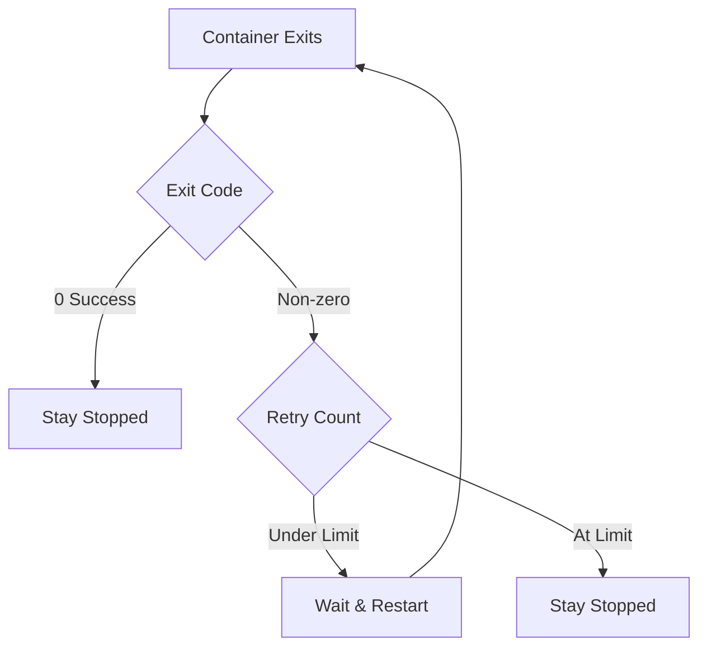

# How to Set Up Docker Container Restart Policies

Author: [nawazdhandala](https://www.github.com/nawazdhandala)

Tags: Docker, Container Management, DevOps, High Availability, Production

Description: Configure Docker restart policies to automatically recover crashed containers, understand the differences between policy options, and implement production-ready recovery strategies.

---

Restart policies tell Docker what to do when a container stops. The right policy keeps your services available without manual intervention, while the wrong policy can cause restart loops or prevent intentional shutdowns.

## Available Restart Policies

Docker provides four restart policy options:

| Policy | Behavior |
|--------|----------|
| `no` | Never restart (default) |
| `always` | Always restart, including after daemon restart |
| `unless-stopped` | Restart unless manually stopped |
| `on-failure[:max-retries]` | Restart only if exit code is non-zero |

```bash
# Apply restart policy when running a container
docker run -d --restart=always nginx:alpine

# Apply restart policy with retry limit
docker run -d --restart=on-failure:5 myapp:latest

# Update policy on existing container
docker update --restart=unless-stopped mycontainer
```

## Understanding Each Policy

### no (Default)

Containers stop and stay stopped. Use this for one-off tasks or when an external orchestrator handles restarts.

```bash
# Run a backup job that should not restart
docker run --rm --restart=no backup-image /backup.sh

# Default behavior for interactive containers
docker run -it ubuntu:22.04 /bin/bash
```

### always

Containers restart regardless of exit code, including when the Docker daemon restarts. This is the most aggressive policy.

```bash
# Database that should always run
docker run -d \
  --name postgres \
  --restart=always \
  -e POSTGRES_PASSWORD=secret \
  postgres:15

# After system reboot, container starts automatically
# After crash, container restarts immediately
```

The catch: `always` restarts even after `docker stop`. When the daemon restarts (system reboot, Docker update), stopped containers come back up.

### unless-stopped

Similar to `always`, but respects manual stops. If you run `docker stop`, the container stays stopped even after daemon restart.

```bash
# Web server that should auto-recover but respect manual stops
docker run -d \
  --name webserver \
  --restart=unless-stopped \
  nginx:alpine

# Manual stop - stays stopped after reboot
docker stop webserver

# Start again - will auto-restart after future reboots
docker start webserver
```

This is typically the best choice for production services.

### on-failure

Restarts only when the container exits with a non-zero exit code. Successful completions (exit code 0) stay stopped.

```bash
# Worker that should retry on failure but not loop on success
docker run -d \
  --name worker \
  --restart=on-failure:3 \
  myapp:latest worker-process

# Exit code 0: stays stopped
# Exit code 1: restarts up to 3 times
# After 3 failures: stays stopped
```



## Docker Compose Configuration

```yaml
# docker-compose.yml
version: '3.8'

services:
  # Critical service - always running
  database:
    image: postgres:15
    restart: always
    volumes:
      - pgdata:/var/lib/postgresql/data

  # Application - recovers from crashes but respects manual stops
  api:
    image: myapp/api:latest
    restart: unless-stopped
    depends_on:
      - database
    environment:
      - DATABASE_URL=postgres://database:5432/app

  # Background worker - retry limited times on failure
  worker:
    image: myapp/worker:latest
    restart: "on-failure:5"
    depends_on:
      - database

  # One-time setup task - should not restart
  migrate:
    image: myapp/api:latest
    restart: "no"
    command: npm run migrate
    depends_on:
      - database

volumes:
  pgdata:
```

## Restart Delays and Backoff

Docker implements an exponential backoff for restarts to prevent rapid restart loops.

```bash
# Restart delays double each time, starting at 100ms
# 100ms -> 200ms -> 400ms -> 800ms -> ... up to 1 minute max

# Check restart count and timing
docker inspect mycontainer --format '{{.RestartCount}}'
docker inspect mycontainer --format '{{.State.StartedAt}}'

# View restart history in events
docker events --filter container=mycontainer --since 1h
```

The backoff resets after the container runs successfully for 10 seconds.

## Combining with Health Checks

Health checks influence restart behavior by marking containers as unhealthy, though they do not directly trigger restarts.

```dockerfile
FROM node:20-slim
WORKDIR /app
COPY . .

# Health check every 30 seconds
HEALTHCHECK --interval=30s --timeout=10s --start-period=5s --retries=3 \
  CMD curl -f http://localhost:3000/health || exit 1

CMD ["node", "server.js"]
```

```yaml
# docker-compose.yml with health check
services:
  api:
    build: .
    restart: unless-stopped
    healthcheck:
      test: ["CMD", "curl", "-f", "http://localhost:3000/health"]
      interval: 30s
      timeout: 10s
      retries: 3
      start_period: 40s
```

For automatic restarts based on health status, use Docker Swarm or implement external monitoring.

## Production Considerations

### Avoid Restart Loops

If your container has a startup bug, restart policies can cause infinite loops that consume resources.

```bash
# Bad: This will restart forever with a broken config
docker run -d --restart=always myapp:broken

# Better: Limit retries during debugging
docker run -d --restart=on-failure:3 myapp:testing

# Check for restart loops
docker inspect mycontainer --format '{{.RestartCount}}'
# High count indicates a problem
```

### Handle Dependent Services

Restart policies do not wait for dependencies. A restarted container may fail if its database is still starting.

```yaml
services:
  api:
    restart: unless-stopped
    depends_on:
      database:
        condition: service_healthy
    # Add retry logic in your application for robustness
    environment:
      - DB_RETRY_ATTEMPTS=10
      - DB_RETRY_DELAY=3000
```

### Resource Cleanup on Restart

Containers may leave stale resources (lock files, PID files) that prevent clean restarts.

```bash
#!/bin/bash
# docker-entrypoint.sh

# Clean up stale PID files from previous runs
rm -f /var/run/myapp.pid

# Clean up any lock files
rm -f /tmp/myapp.lock

# Start the application
exec "$@"
```

### Logging and Monitoring

Configure logging to capture restart events and diagnose issues.

```yaml
services:
  api:
    restart: unless-stopped
    logging:
      driver: json-file
      options:
        max-size: "10m"
        max-file: "3"
        # Logs persist across restarts
```

```bash
# Monitor restart events
docker events --filter event=restart --filter container=api

# Alert on frequent restarts (integrate with monitoring)
docker inspect api --format '{{.RestartCount}}' | \
  xargs -I{} test {} -gt 5 && echo "ALERT: High restart count"
```

## Updating Restart Policies

Change policies on running containers without recreating them.

```bash
# Update single container
docker update --restart=unless-stopped mycontainer

# Update all running containers
docker update --restart=unless-stopped $(docker ps -q)

# Verify the change
docker inspect mycontainer --format '{{.HostConfig.RestartPolicy.Name}}'
```

For Docker Compose, updating the compose file and running `docker compose up -d` recreates containers with new policies.

## Summary

| Use Case | Recommended Policy |
|----------|-------------------|
| Production web servers | `unless-stopped` |
| Databases | `always` or `unless-stopped` |
| Background workers | `on-failure:5` |
| Batch jobs | `no` or `on-failure:1` |
| Development | `no` |
| CI/CD tasks | `no` |

---

Choose `unless-stopped` for most production services since it balances automatic recovery with respect for manual intervention. Use `on-failure` with a retry limit for workers that should not loop indefinitely. Reserve `always` for truly critical services where you want containers running even after explicit stops. And remember that restart policies are a safety net, not a substitute for fixing underlying issues that cause crashes.
