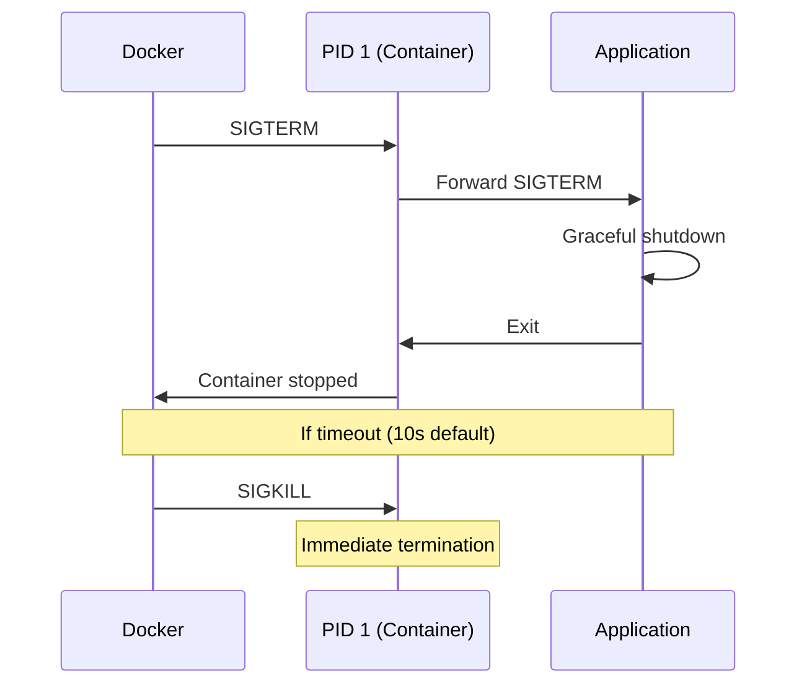

# How to Set Up Docker Container Signal Handling

Author: [nawazdhandala](https://www.github.com/nawazdhandala)

Tags: Docker, DevOps, Linux, Signals, Graceful Shutdown

Description: Configure proper signal handling in Docker containers to enable graceful shutdowns, handle SIGTERM correctly, and avoid zombie processes with init systems.

---

When Docker stops a container, it sends SIGTERM to PID 1 and waits 10 seconds before forcefully killing with SIGKILL. If your application does not handle signals properly, you lose in-flight requests, corrupt data, and leave connections hanging. This guide covers setting up proper signal handling for different application types.

## Understanding Container Signals

Docker signal flow:



The problem is that PID 1 in a container has special behavior - it does not receive default signal handlers. Your application must explicitly handle signals.

## The PID 1 Problem

Shell form CMD creates a shell as PID 1:

```dockerfile
# Shell form - shell is PID 1
CMD node server.js
# Process tree:
# PID 1: /bin/sh -c "node server.js"
# PID 7: node server.js

# SIGTERM goes to shell, not to node!
```

Exec form makes your app PID 1:

```dockerfile
# Exec form - node is PID 1
CMD ["node", "server.js"]
# Process tree:
# PID 1: node server.js

# SIGTERM goes directly to node
```

Always use exec form for CMD and ENTRYPOINT:

```dockerfile
# WRONG: Shell form
ENTRYPOINT node server.js

# CORRECT: Exec form
ENTRYPOINT ["node", "server.js"]

# CORRECT: With arguments
CMD ["node", "server.js", "--port", "3000"]
```

## Node.js Signal Handling

```javascript
// server.js
const http = require('http');

const server = http.createServer((req, res) => {
  res.writeHead(200);
  res.end('Hello World\n');
});

// Track connections for graceful shutdown
const connections = new Set();

server.on('connection', (conn) => {
  connections.add(conn);
  conn.on('close', () => connections.delete(conn));
});

// Graceful shutdown handler
function shutdown(signal) {
  console.log(`Received ${signal}, shutting down gracefully...`);

  // Stop accepting new connections
  server.close(() => {
    console.log('HTTP server closed');
    process.exit(0);
  });

  // Close existing connections after current requests complete
  for (const conn of connections) {
    conn.end();
  }

  // Force close after timeout
  setTimeout(() => {
    console.log('Forcing shutdown after timeout');
    for (const conn of connections) {
      conn.destroy();
    }
    process.exit(1);
  }, 10000);
}

// Handle signals
process.on('SIGTERM', () => shutdown('SIGTERM'));
process.on('SIGINT', () => shutdown('SIGINT'));

server.listen(3000, () => {
  console.log('Server listening on port 3000');
});
```

## Python Signal Handling

```python
# server.py
import signal
import sys
import time
from http.server import HTTPServer, BaseHTTPRequestHandler
import threading

class Handler(BaseHTTPRequestHandler):
    def do_GET(self):
        self.send_response(200)
        self.end_headers()
        self.wfile.write(b'Hello World\n')

class GracefulServer:
    def __init__(self, port=8000):
        self.server = HTTPServer(('', port), Handler)
        self.running = True

    def start(self):
        print(f'Server listening on port {self.server.server_port}')
        while self.running:
            self.server.handle_request()

    def shutdown(self, signum, frame):
        signal_name = signal.Signals(signum).name
        print(f'Received {signal_name}, shutting down...')
        self.running = False
        # Allow current request to complete
        self.server.server_close()
        print('Server stopped')
        sys.exit(0)

if __name__ == '__main__':
    server = GracefulServer(8000)

    # Register signal handlers
    signal.signal(signal.SIGTERM, server.shutdown)
    signal.signal(signal.SIGINT, server.shutdown)

    server.start()
```

## Go Signal Handling

```go
// main.go
package main

import (
    "context"
    "log"
    "net/http"
    "os"
    "os/signal"
    "syscall"
    "time"
)

func main() {
    server := &http.Server{
        Addr: ":8080",
        Handler: http.HandlerFunc(func(w http.ResponseWriter, r *http.Request) {
            w.Write([]byte("Hello World\n"))
        }),
    }

    // Channel to listen for shutdown signals
    shutdown := make(chan os.Signal, 1)
    signal.Notify(shutdown, syscall.SIGTERM, syscall.SIGINT)

    // Start server in goroutine
    go func() {
        log.Println("Server listening on :8080")
        if err := server.ListenAndServe(); err != http.ErrServerClosed {
            log.Fatalf("Server error: %v", err)
        }
    }()

    // Wait for shutdown signal
    sig := <-shutdown
    log.Printf("Received %s, shutting down...", sig)

    // Create context with timeout for graceful shutdown
    ctx, cancel := context.WithTimeout(context.Background(), 10*time.Second)
    defer cancel()

    // Attempt graceful shutdown
    if err := server.Shutdown(ctx); err != nil {
        log.Printf("Graceful shutdown failed: %v", err)
        server.Close()
    }

    log.Println("Server stopped")
}
```

## Shell Script Signal Handling

For entrypoint scripts that start applications:

```bash
#!/bin/sh
# entrypoint.sh

# Function to handle signals
cleanup() {
    echo "Caught signal, cleaning up..."

    # Forward signal to child process
    if [ -n "$PID" ]; then
        kill -TERM "$PID" 2>/dev/null
        wait "$PID"
    fi

    echo "Cleanup complete"
    exit 0
}

# Trap SIGTERM and SIGINT
trap cleanup TERM INT

# Start application in background
echo "Starting application..."
node server.js &
PID=$!

# Wait for application to exit
wait "$PID"
EXIT_CODE=$?

echo "Application exited with code $EXIT_CODE"
exit $EXIT_CODE
```

```dockerfile
COPY entrypoint.sh /entrypoint.sh
RUN chmod +x /entrypoint.sh
ENTRYPOINT ["/entrypoint.sh"]
```

## Using tini as Init System

Tini handles signal forwarding and zombie process reaping:

```dockerfile
FROM node:18-alpine

# Install tini
RUN apk add --no-cache tini

WORKDIR /app
COPY . .

# Use tini as init system
ENTRYPOINT ["/sbin/tini", "--"]
CMD ["node", "server.js"]
```

Or use Docker's built-in init:

```bash
# Run with --init flag
docker run --init myapp:latest
```

In Docker Compose:

```yaml
version: '3.8'
services:
  api:
    image: myapp:latest
    init: true  # Enable tini init system
```

## Handling Stop Timeout

Configure the grace period for graceful shutdown:

```bash
# Increase stop timeout to 30 seconds
docker stop --time=30 mycontainer

# Or in docker-compose.yml
```

```yaml
version: '3.8'
services:
  api:
    image: myapp:latest
    stop_grace_period: 30s
```

Set a custom stop signal:

```dockerfile
# Use SIGQUIT instead of SIGTERM
STOPSIGNAL SIGQUIT
```

```yaml
services:
  api:
    image: myapp:latest
    stop_signal: SIGQUIT
```

## Testing Signal Handling

Verify your application handles signals correctly:

```bash
# Start container
docker run -d --name test myapp:latest

# Send SIGTERM
docker stop test

# Watch logs during shutdown
docker logs -f test

# Check if container stopped gracefully (exit code 0)
docker inspect test --format '{{.State.ExitCode}}'
```

Simulate slow shutdown:

```bash
# Add handler that takes time
docker exec test sh -c "kill -TERM 1"

# Watch with timeout
timeout 15 docker logs -f test
```

## Kubernetes Considerations

In Kubernetes, proper signal handling is even more critical:

```yaml
apiVersion: v1
kind: Pod
spec:
  terminationGracePeriodSeconds: 30
  containers:
    - name: api
      image: myapp:latest
      lifecycle:
        preStop:
          exec:
            command: ["/bin/sh", "-c", "sleep 5"]  # Allow load balancer to update
```

Your application should:
1. Handle SIGTERM immediately
2. Stop accepting new connections
3. Complete in-flight requests
4. Close database connections cleanly
5. Exit with code 0

## Debugging Signal Issues

Check if signals reach your process:

```bash
# Find container PID on host
docker inspect --format '{{.State.Pid}}' mycontainer

# Trace signals sent to container
sudo strace -e signal -p $(docker inspect --format '{{.State.Pid}}' mycontainer)

# In another terminal
docker stop mycontainer
```

Check process tree inside container:

```bash
docker exec mycontainer ps auxf
# Look for your application at PID 1
```

Verify signal handlers:

```bash
# Check what happens on SIGTERM
docker exec mycontainer sh -c "cat /proc/1/status | grep SigCgt"
# Shows bitmask of caught signals
```

## Complete Dockerfile Example

```dockerfile
FROM node:18-alpine

# Install tini for proper init
RUN apk add --no-cache tini

# Create non-root user
RUN addgroup -g 1001 -S appgroup && \
    adduser -u 1001 -S appuser -G appgroup

WORKDIR /app

# Install dependencies
COPY --chown=appuser:appgroup package*.json ./
RUN npm ci --only=production

# Copy application
COPY --chown=appuser:appgroup . .

# Switch to non-root user
USER appuser

# Use tini as init, node as application
ENTRYPOINT ["/sbin/tini", "--"]
CMD ["node", "server.js"]

# Set stop signal
STOPSIGNAL SIGTERM

# Set reasonable stop timeout
LABEL docker.stop-timeout="30"
```

---

Proper signal handling ensures your containers shut down gracefully, completing in-flight work and releasing resources cleanly. Use exec form for CMD/ENTRYPOINT, implement signal handlers in your application, and consider using tini for proper init behavior. Test your signal handling before deploying to production - a 10-second timeout passes quickly when you have hundreds of active connections.
