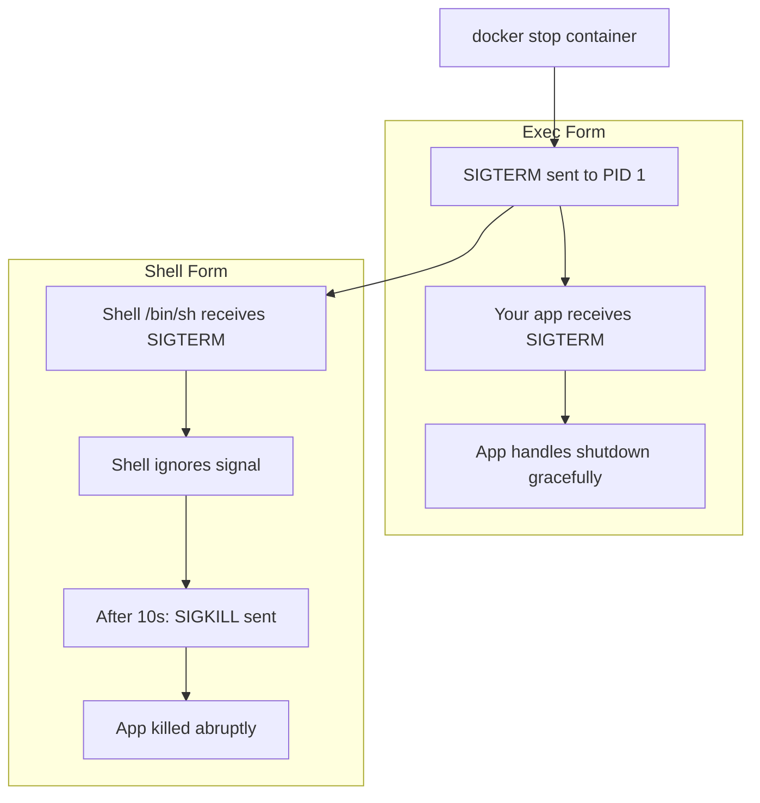

# How to Use Docker Entrypoint vs CMD

Author: [nawazdhandala](https://www.github.com/nawazdhandala)

Tags: Docker, Dockerfile, DevOps, Containers, Best Practices

Description: Understand the difference between ENTRYPOINT and CMD in Dockerfiles, when to use each, and how they combine to create flexible container configurations for development and production.

---

ENTRYPOINT and CMD both define what runs when a container starts, but they serve different purposes and behave differently when overridden. Understanding their interaction helps you build images that work correctly in varied deployment scenarios.

## The Basic Difference

**CMD** provides default arguments that can be easily overridden at runtime.

**ENTRYPOINT** defines the main executable and is harder to override.

When both are present, CMD provides default arguments to ENTRYPOINT.

```dockerfile
# CMD alone - easily overridden
FROM ubuntu:22.04
CMD ["echo", "Hello World"]

# Running without arguments uses CMD
# docker run myimage
# Output: Hello World

# Running with arguments replaces CMD entirely
# docker run myimage echo "Goodbye"
# Output: Goodbye
```

```dockerfile
# ENTRYPOINT alone - defines the executable
FROM ubuntu:22.04
ENTRYPOINT ["echo"]

# Running without arguments executes entrypoint with no args
# docker run myimage
# Output: (empty line)

# Running with arguments passes them to entrypoint
# docker run myimage "Hello World"
# Output: Hello World
```

## Combining ENTRYPOINT and CMD

The most powerful pattern uses both together. ENTRYPOINT defines the command, CMD provides default arguments.

```dockerfile
FROM python:3.11-slim

# Install your application
COPY app.py /app/app.py
WORKDIR /app

# ENTRYPOINT: the executable that always runs
ENTRYPOINT ["python", "app.py"]

# CMD: default arguments passed to entrypoint
CMD ["--port", "8080"]
```

```bash
# Default behavior: runs python app.py --port 8080
docker run myapp

# Override just the arguments: runs python app.py --port 3000 --debug
docker run myapp --port 3000 --debug

# Override entrypoint entirely (bypasses python app.py)
docker run --entrypoint /bin/bash myapp -c "ls -la"
```

## Shell Form vs Exec Form

Both ENTRYPOINT and CMD support two syntaxes with different behaviors.

### Exec Form (Recommended)

```dockerfile
# Exec form: JSON array syntax
ENTRYPOINT ["python", "app.py"]
CMD ["--port", "8080"]

# Process runs as PID 1
# Signals (SIGTERM, SIGINT) delivered correctly
# No shell processing of variables
```

### Shell Form

```dockerfile
# Shell form: plain string syntax
ENTRYPOINT python app.py
CMD --port 8080

# Actually runs: /bin/sh -c "python app.py"
# Shell is PID 1, not your application
# Signals not forwarded to application by default
# Shell expansion works: $ENV_VAR
```

The shell form causes problems with graceful shutdown because the shell process receives SIGTERM, not your application.



## Practical Patterns

### Pattern 1: Wrapper Script as Entrypoint

Use a script to run initialization before your main command.

```bash
#!/bin/bash
# docker-entrypoint.sh

# Wait for database to be ready
echo "Waiting for database..."
while ! nc -z $DB_HOST $DB_PORT; do
  sleep 1
done
echo "Database is ready"

# Run migrations if requested
if [ "$RUN_MIGRATIONS" = "true" ]; then
  python manage.py migrate
fi

# Execute the main command (passed as arguments to this script)
exec "$@"
```

```dockerfile
FROM python:3.11-slim

COPY docker-entrypoint.sh /usr/local/bin/
RUN chmod +x /usr/local/bin/docker-entrypoint.sh

COPY . /app
WORKDIR /app

# Entrypoint runs the wrapper script
ENTRYPOINT ["docker-entrypoint.sh"]

# CMD provides the default command to run after initialization
CMD ["python", "manage.py", "runserver", "0.0.0.0:8000"]
```

The `exec "$@"` is critical. It replaces the shell with your application, making your app PID 1 for proper signal handling.

### Pattern 2: Container as Command Wrapper

Make your image act like a CLI tool.

```dockerfile
FROM alpine:3.19

RUN apk add --no-cache curl jq

# The container IS the curl command
ENTRYPOINT ["curl"]

# Default arguments for health checks
CMD ["-s", "-o", "/dev/null", "-w", "%{http_code}", "http://localhost/health"]
```

```bash
# Use default CMD: check localhost health
docker run --rm --network host mycurl

# Override CMD: fetch a different URL
docker run --rm mycurl -s https://api.example.com/status

# Pass headers
docker run --rm mycurl -H "Authorization: Bearer token" https://api.example.com/data
```

### Pattern 3: Development vs Production Mode

Use CMD to switch between modes while keeping the same entrypoint.

```dockerfile
FROM node:20-slim

WORKDIR /app
COPY package*.json ./
RUN npm ci --only=production

COPY . .

ENTRYPOINT ["node"]

# Default to production server
CMD ["dist/server.js"]
```

```yaml
# docker-compose.yml
services:
  # Production
  api:
    image: myapp:latest
    # Uses default CMD: node dist/server.js

  # Development with override
  api-dev:
    image: myapp:latest
    command: ["--watch", "src/server.ts"]
    volumes:
      - ./src:/app/src
```

### Pattern 4: Configurable Application

Accept configuration through arguments.

```dockerfile
FROM nginx:alpine

COPY nginx.conf /etc/nginx/nginx.conf
COPY docker-entrypoint.sh /docker-entrypoint.sh
RUN chmod +x /docker-entrypoint.sh

ENTRYPOINT ["/docker-entrypoint.sh"]
CMD ["nginx", "-g", "daemon off;"]
```

```bash
#!/bin/sh
# docker-entrypoint.sh

# Template configuration from environment variables
envsubst '$BACKEND_HOST $BACKEND_PORT' < /etc/nginx/nginx.conf.template > /etc/nginx/nginx.conf

# Run the command passed as arguments
exec "$@"
```

## Overriding at Runtime

Docker run and docker compose provide different ways to override these settings.

```bash
# Override CMD only
docker run myimage new-command arg1 arg2

# Override ENTRYPOINT only (CMD still applies as arguments)
docker run --entrypoint /bin/sh myimage

# Override both
docker run --entrypoint /bin/sh myimage -c "echo hello"
```

```yaml
# docker-compose.yml
services:
  app:
    image: myimage
    # Override CMD
    command: ["--debug", "--port", "3000"]

  debug:
    image: myimage
    # Override ENTRYPOINT
    entrypoint: ["/bin/sh", "-c"]
    command: ["sleep infinity"]
```

## Debugging Entry Issues

When your container exits immediately or behaves unexpectedly, inspect how ENTRYPOINT and CMD resolve.

```bash
# See the final entrypoint and command configuration
docker inspect mycontainer --format '{{.Config.Entrypoint}} {{.Config.Cmd}}'

# Test by running shell instead of normal startup
docker run -it --entrypoint /bin/sh myimage

# Check what PID 1 is actually running
docker exec mycontainer ps aux
```

## Summary Table

| Scenario | ENTRYPOINT | CMD | Result |
|----------|------------|-----|--------|
| General purpose image | Not set | Application command | Easy to override completely |
| Application container | Application binary | Default arguments | Arguments overridable |
| CLI tool wrapper | CLI command | Default flags | Flags overridable |
| Initialization required | Wrapper script | Application command | Script runs first, then app |

---

Use ENTRYPOINT when your container represents a specific application that should always run. Use CMD when you want maximum flexibility in what command runs. Combine both when you have a primary executable that accepts configurable arguments. Always use exec form for proper signal handling, and remember that `exec "$@"` in wrapper scripts keeps your application as PID 1.
